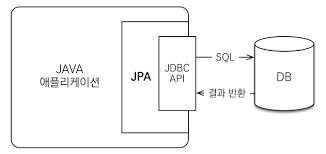

왜 Jpa를 쓰는가
--
Jpa가 쓰이는 이유는 객체지향적인 Application과 그렇지 않은 database의 패러다임 불일치에서 나온다. 
그중에 핵심 jpa의 핵심 difference를 보면
1. 객체 그래프 탐색에서의 차이
   - ```memberGroup.getMember("memberA").getAdditionalInfo().getUsername();```
   - ```select MG.*, M.* from member M join memberGroup MG on M.member_id = MG.member_group_id```
   - java는 범위 상관없이 member를 받아오고 그 이후로도 쭉쭉 조회 할수 있지만, sql의 경우 첫 쿼리를 날리는 순간에 어디까지 탐색(조회) 할 것인지 알아야한다.
   - 
2. 두 데이터간 비교
   - java의 경우 다른 instance로 다르다 하지만 db 관점으로 보면 둘은 같아야 해...
  ```java
  class MemberRepository {
      public Member getMember(Long memberId){
          String sql = "select * from member where member_id = ?";
      }
  }

  public class Main {
    public static void main(String[] args) {
        Member member1 = memberRepository.getMember(memberId);
        Member member2 = memberRepository.getMember(memberId);

        member1 == member2;   // java의 경우 false하지만 db 관점으로 보면 둘은 같아야 하는데!!
    }
  }
  ```
### Jpa에서는 어떻게 해결 하는가?
1. Lazy Loading으로 한번에 data를 조회하는 것이 아니라 적절한 시점에 알아서 조회해준다.
2. persistence context에서 data를 관리하게 하여 이 문제를 해결한다. 

### Jpa는 어디에서 동작 하는가

