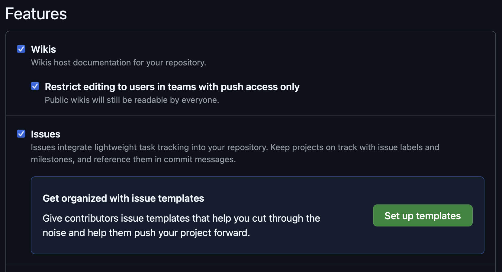
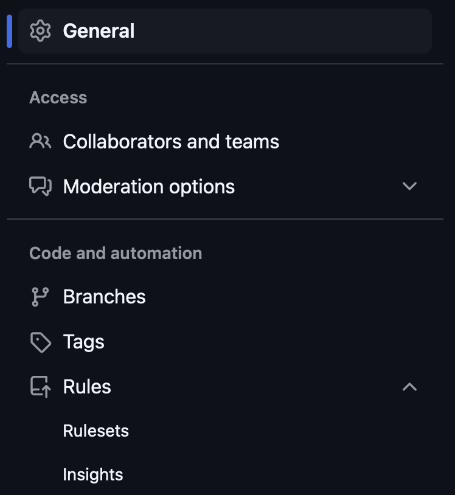

PR template 설정하기
--
- ```pull_request_template.md``` 파일로 설정 한다. 가능한 저장위치는 다음과 같다.
  - repo의 root에 저장하기
  - docs directory안에 저장하기
  - .github directory에 저장하기
<details>
<summary><strong>Pr template 예시</strong></summary>

<pre><code>
### ✏️ 작업 개요


### ⛳ 작업 분류
- [ ] 작업1
- [ ] 작업2
- [ ] 작업3

### 🔨 작업 상세 내용
1.

### 💡 생각해볼 문제
- 냉무
</code></pre>
</details>

Issue Template 설정하기
--
- 해당 repo의 setting으로 들어가서 설정하는게 제일 간편
- General에서 Features 섹션에 

- 원하는 type의 template를 확인하고 설정하면 된다!

Merge 조건 등 제한 사항 관리하기
--
- 이것 또한 setting에서 관리
- ruleset 페이지가 따로 존재

- tag ruleset, branch ruleset이 존재하며, Bypass list등 많은 부가 기능이 있다. 

### Reference
- Pr template
  - [Github 공식문서](https://docs.github.com/en/communities/using-templates-to-encourage-useful-issues-and-pull-requests/creating-a-pull-request-template-for-your-repository)
- Issue template
  - [Github 공식문서](https://docs.github.com/en/communities/using-templates-to-encourage-useful-issues-and-pull-requests/configuring-issue-templates-for-your-repository#configuring-the-template-chooser)
