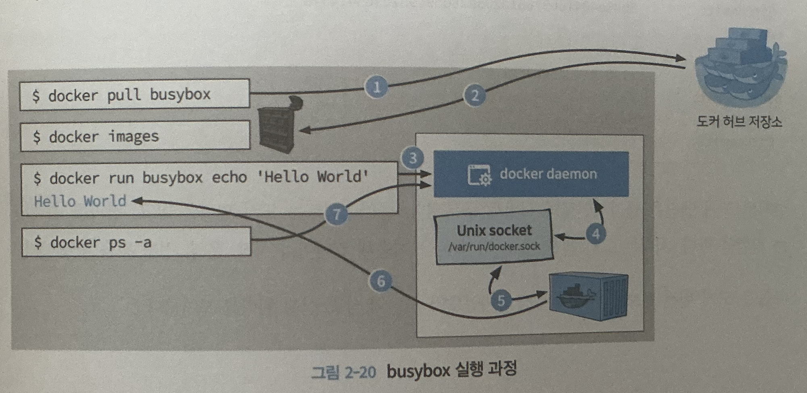

VM vs Docker
--

- 여기서 말하는 Docker은 Docker Engine
- 기존에는 리눅스 특화인 LXC를 사용하였지만 후에 모든 OS에 대응 하기위해 runC(formerly known as libcontainer) 사용
  - runC runs in the same OS as its host allowing sharing a lot of the host OS resource
  - but still, for os except linux docker engine requires VM to host a linux kernel to run the container engine 
- Layered file system (AuFS)
  - Consists of RO and write part and it's served merged together 
  - this leads to merit that common part such as os can be shared through containers
  > 
  > 1000의 Ubuntu Container를 띄어도 1개의 Ubuntu (RO) 10000개의 Thin RW layer만 있으면 O.K.
  >  
  > Debian base and python are shared!

Docker daemon
--

- The Docker daemon (`dockerd`) listens for Docker API requests and manages Docker objects such as images, containers, 
networks, and volumes. A daemon can also communicate with other daemons to manage Docker services.
- /var/run/docker.sock (unix socket): Docker daemon이 기본적으로 수신(listen)하고 
있는 Unix socket이고 컨테이너 내부에서 Docker daemon과 통신하는 데에 사용
- docker daemon socker을 마운트 하는 건 컨테이너에게 큰 권한을 제공함으로 신뢰 할수 있는 컨테이너에서만 주의해서 사용하자!

### Reference
- [Docker vs VM](https://stackoverflow.com/questions/16047306/how-is-docker-different-from-a-virtual-machine)
- [layered Architecture](https://docs.docker.com/engine/storage/drivers/)
- [Layered Image](https://docs.docker.com/get-started/docker-concepts/building-images/understanding-image-layers/)
- 도커, 컨테이너 빌드 업

### 더 알아보기
- [1](http://cloudrain21.com/examination-of-docker-containersize-ufs)
- [2](https://gngsn.tistory.com/128)
- [3](https://studytrails.com/2018/12/04/docker-architecture-engine-containerd-runc/)
