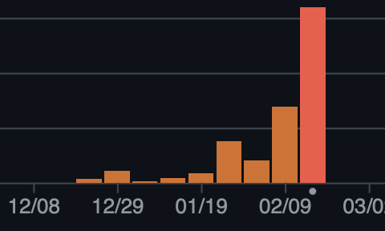
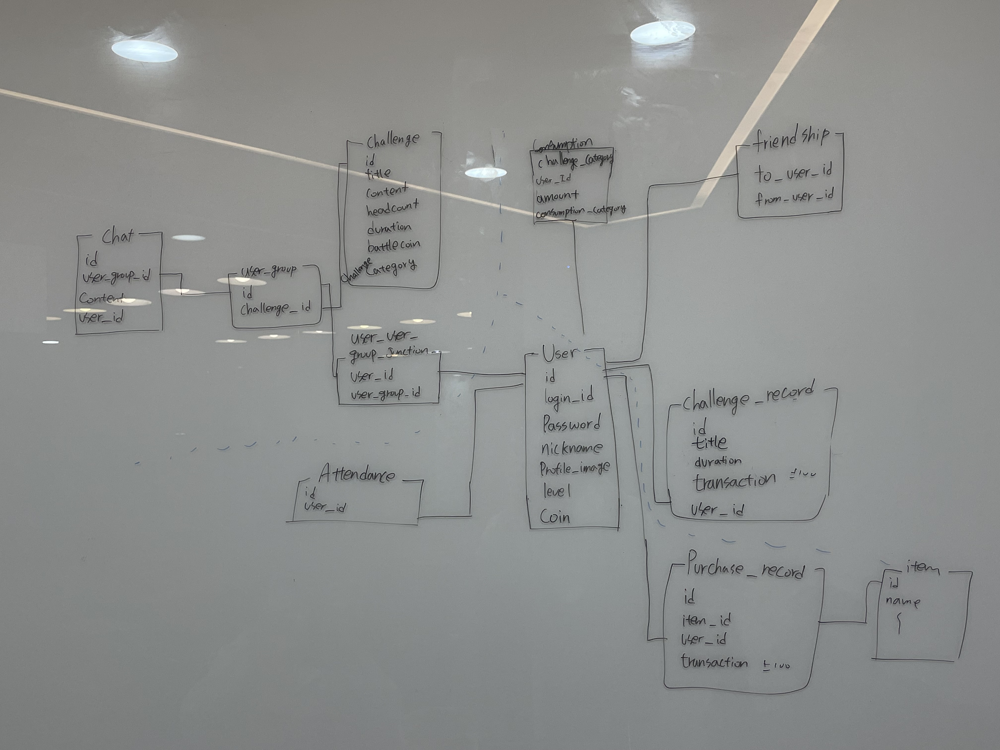

---
## 개요

처음 백엔드 리드로써 프로젝트에 참여하게 되었다. 첫 리드로써 아주 poorly done 했다 생각하는데, 이번 기회를 통해 느낀 점들을 기록해보려 한다.

> - **프로젝트 기간:** 2024-12-18 ~ 2025-02-25
> - **참여 경로:** 동아리 프로젝트
> - **내 역할:** 인프라 관리 및 간단한 API 개발

---

## 팀 관리

특히 팀 및 일정 관리에 미숙했던 점이 크게 느껴졌다. (2주 몰빵)

- **회의 부족:**  
  12월 30일에 데이터베이스를 간단히 설계하고 시작은 좋았지만, 대면이든 비대면이든 회의가 부족해서 일정이 늘어졌다. due date에만 회의를 진행하고 일정을 잡으니, 대부분의 팀원이 due date 즈음에 작업을 시작하여 마감일 후 몇 일이나 지난 후야야 작업을 마무리하는 상황이 발생했다.

- **PR 관리:**  
  PR은 쌓이고, merge를 위해서는 1개 이상의 리뷰가 필요한 제약 조건을 걸어 두었지만, 결국 막판에 믿음으로 approve를 받는 상황이 일상이 되었다.

- **리팩토링 부족:**  
  리팩토링을 위한 일정을 따로 잡지 않은 것도 큰 패착이었다. 마감에 쫓겨 우선 필요한 기능만 구현하다 보니, side effect를 고려하지 않고 DB 테이블을 수정하는 등 데이터 구조가 난잡해졌으며, 코드 역시 중복된 부분과 util로 분리하면 좋을 부분들이 산재해 있었다.

- **협업 도구 미흡:**  
  API 개발 시 도메인이 겹치는 경우가 많았는데, 팀원들이 어느 부분을 건들이고 있는지, 언제 끝날지 알 수 없어서 매우 답답했다. 이슈 템플릿과 브랜치에 이슈를 연결해서 작업하기로 했으나 제대로 지켜지지 않았다.  
  결과적으로 merge 시 충돌을 처리해야 했고, 다른 팀원의 작업 진행 상황을 매번 확인하는 번거로움이 있었다.  

### 다음엔 이렇게 하자
- **frequent한 회의**로 긴장을 유지하고 **팀원들의 진행 상황**을 파악하자!
- PR을 쌓이게 하지마! 거의 바로바로 처리하게 규칙을 만들던지 해야겠다.
- 리팩토링을 위한 일정을 따로 짜자, 어떻게든 코드는 더러워진다.
- pr주기를 정해 dev 브랜치가 최신을 유지하도록 노력하자, issue만들고 branch 연결하는 거 잊지 않고

---

## 개발

### 테스트

한게 없어서 말할게 없다. assertJ dependency까지는 해놨는데 하나도 안썼다. 완전 주먹 구구, 나중에 data annotation 써서 실제 repo에 제대로 들어가는 지 확인하고 관련해서 알아보자...

### 인프라

- **EC2 배포:**  
  매번 하던 그맛, 보안 그룹, 파라미터, vpc설정...   생각해보니 보안그룹 설정 좀 제대로 하자... 맨날 필요없는 ip도 포트 다 열어주고... **제대로 좀 하자**

- **CI/CD 구축:**  
  GitHub Actions를 사용하여 CI/CD를 구축하였고, 전 프로젝트에 선배가 짠 코드를 참고하여 구현했다. jenkins에 비해 learning curve가 완만해 선택하였는데 진짜 편했다. yaml파일 하나면 뚝딱이다. self hosted runner등과 같이 부가 기능도 많이 제공 하는 듯 하다.  

- **Docker:**  
  Dockerfile과 Compose 파일은 “도커, 컨테이너 빌드업”이라는 책을 참고하여 구현하였는데 buildX나 cloud infra에 대해 알수 있었다. 효율적으로 dockerfile을 작성하는 방법을 더 배워보면 좋을 것 같다. 

- **이외**  
  Nginx, Loki, Promtail, grafana 등은 문서를 보며 간단히 로그만 확인할 수 있도록 구성했다.
  어찌저찌 돌아가게 구현은 하였지만 제반지식이 부족함을 뼈 저리게 느꼈다. configure할 거는 왜이리 많은지 원.  
  
   
  log나 metric 시각화 하는거 재미있었다. 내 코드가 돌고있음을 느끼게 해주는게 묘한 쾌감을 준달까
    단순 로그만 띄우는 거라면 내가 crontab, sftp로 로그 파일을 가져와서 화면에 뿌리는게 더 구현하는게 더 빨랐을것 같은 기분...
### 결론
하면 할수록 배워야 하는게 너무 많아져서 뭘 먼저 건드릴지 모르겠다. 네트워크, 리눅스, k8s 등등 너무 많어...
컨테이너 인프라 환경 구축을 취한 쿠버네티스/도커 이 책이 클라우드 인프라, ci/cd, 프로메테우스등 고루 다루는 것 같아 이 책을 공부해볼 생각이다. 

[BE-Github](https://github.com/KUIT-MoaMoa/MoaMoa-Backend)  
[Nginx&Monitoring-Github](https://github.com/KUIT-MoaMoa/MoaMoa-Monitoring)
