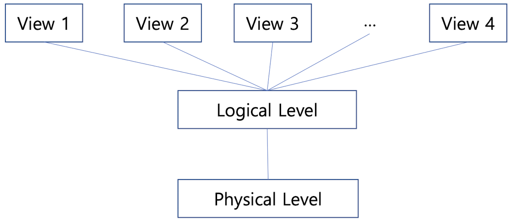

Why use Database System
==

What is DBMS?
--
- Database(collection of data) Management system
- A collection of interrelated data and a set of programs to access those data 

Drawback of file systems
--
- **Data redundancy**: 
  - e.g. Student A address data is used in data B and C
- **Data Inconsistency**: e.g. If student A's data has been modified, All data that contains student A, also have to be changed
- **Difficulty in accessing data**: 
  - e.g. In DBMS we use unified query called sql, whereas needing separate program for file system
- **Data isolation**: 
  - e.g. .txt file and .png file is scattered in file system, caused by different file format
- **Integrity problems**: 
  - e.g. Students age should not be below zero
- **Atomicity problems**: 
  - e.g. think about @Transactional annotation in SpringDataJPA
- **Concurrent-access anomalies**
  - e.g. a data is accessed concurrently
- **Security problems**

Data Models
==
Definitions
--
Collection of conceptual tools for **Data**, **Data relationships**, **Data semantics**, **Consistency constraints**
- Provides a way to describe the design og a database at yhe physical, logical, and view levels.
> **e.g.** 
> - Relation Model
> - Entity-Relationship Model
> - Object Based Data Model
> - Semistructed Data Model (e.g. XML)

Why use models?
--
Useful when examining or managing parts of the real world
> **e.g.**
> - Airplane simulator
> - Nuclear power plant simulator

As can see on examples using a model is often much cheaper and safer

Types of data models
--
- **Relation Model (Entity-Relationship data model)**
- Object-based data models
- Semi-structured data model(XML)

View of Data
==

A major purpose of a database system is to provide users with an abstract view of the data.
Database system hides certain details of how the data is stored and maintained

Data Abstraction
--
- Database systems must retrieve data efficiently, making database system developers to use complex data structures.
- Since many users are not computer trained it's important to show abstract view

### Physical level(Lowest level of abstraction)

- How data is actually stored, describes complex low-level data structure in detail
- e.g. Index structures (B+-tree, Hash table,...), Slotted page

### Logical Level

```sql
Type instructor = record 
                  ID: char(5);
                  name: char(20);
                  dept_name: char(20);
                  salary: numeric(8, 2);
                  end;
```
- **What** data are stored in the database, and what relationships exist among those data.
  - e.g. Database administrators, who must decide what information to keep in the database, use the logical level of abstraction.
  - usually programmers work at this level of abstraction.
> **Physical Data Independence**
> - The user of the logical level does not need to be aware of Insane complexity of physical level structures
> - Ability to modify the physical schema without changing the logical schema
> - In general, the interfaces between the various levels and components should be well-defined so that
    changes in some parts do not seriously influence others.

### View Level(Highest abstraction level, a.k.a subschemas) 

- Describes **only part** of the entire database.
- Exists to simplify their interation with the system.
- The system may provide many views for the same database.
- Hide details of logical level and provide a security mechanism
  - e.g. student support team cannot see the instructor's salary.

Schemas and Instances
--

### Schema
- The overall design of the database
- Analogous to the type of variable
- **Logical Schema**: the overall logical structure(design) of the database
  - Programmers construct applications by using the logical schema
  - The physical schema is hidden beneath the logical schema, and can usually be changed easily without affecting application programs(**physical data independence**)
- **Physical Schema**: the overall physical structure(design) of the database

### Instance

- the **actual content** of the database at a **particular time**
- Analogous to the value of a variable
