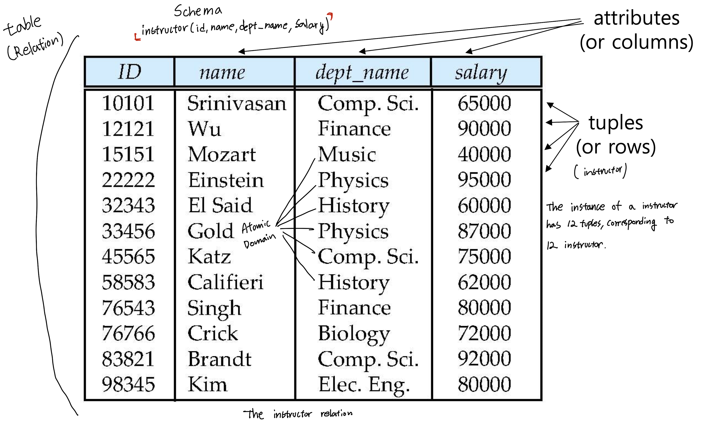

Structure of Relational Databases
==

Relation Schema and Instance
--

- Schema: R = (A1, A2, ..., An)
- A1, A2, ..., An are attributes
- Order of tuples is irrelevant

Domain
--
For each attribute of a relation, there is a set of permitted values
- Attribute values(domain) are (normally) required to be **atomic**
> **Atomic**
> - A domain is **atomic** if elements of the domain are considered to be indivisible units

> **e.g. where domain for phone number isn't atomic**
> 
> | EmployeeID | Name       | Phone Numbers            |
> |------------|------------|--------------------------|
> | 1          | John Doe   | 555-1234, 555-5678       |
> | 2          | Jane Smith | 555-8765, 555-4321       |

### Null
Special value that signifies that the values is unknown or does not exist

Key
--
### Super Key
**Set of one or more attributes** that, taken collectively, allow us to identify uniquely a tuple in the relation

### Candidate key
**Minimal** super key**s**

### Primary Key
**Candidate key** that is chosen by the database designer as the principal means of **identifying tuples within a relation**

### Foreign Key
- Constraint: Value in one relation must appear in another relation
> **e.g.**
>
> | EmployeeID (PK) | SSN (Candidate Key) | Email (Candidate Key)       | Name       | DepartmentID (FK) |
> |-----------------|---------------------|-----------------------------|------------|-------------------|
> | 1               | 123-45-6789         | john.doe@example.com        | John Doe   | 10                |
> | 2               | 987-65-4321         | jane.smith@example.com      | Jane Smith | 20                |
>
> | DepartmentID (PK) | DepartmentName  |
> |-------------------|-----------------|
> | 10                | Sales           |
> | 20                | Engineering     |
> 
> - Super Key: In the Employees table, any combination of attributes that uniquely identifies a row (e.g., {EmployeeID}, {SSN, Email}, etc.) is a super key.
> - Candidate Key: Minimal super keys that cannot be reduced further. Here, EmployeeID, SSN, and Email are potential candidate keys.
> - Primary Key: Out of the candidate keys, EmployeeID is chosen as the primary key.
> - Foreign Key: The DepartmentID in the Employees table must match a DepartmentID in the Departments table, ensuring referential integrity.
