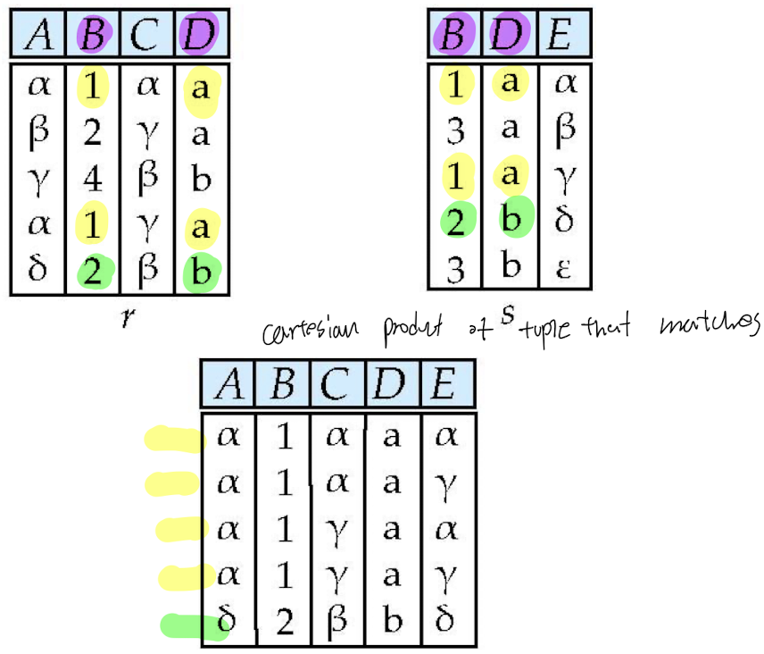
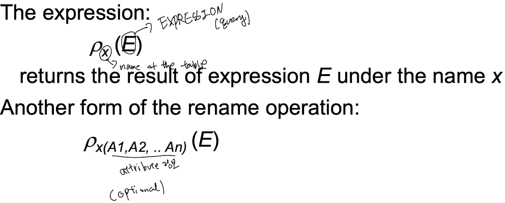

## Relation Algebra

**Employees**

| EmpID | Name    | Age | DeptID |
|-------|---------|-----|--------|
| 1     | Alice   | 30  | D1     |
| 2     | Bob     | 25  | D2     |
| 3     | Charlie | 35  | D1     |

**Departments**

| DeptID | DeptName | Location      |
|--------|----------|---------------|
| D1     | HR       | New York      |
| D2     | IT       | San Francisco |

---

## Relational Algebra Operations

### 1. Selection (σ) (Duplicated Data should be removed)
_Select tuples that satisfy a condition._

**Example:** Select employees older than 30.  
**Expression:**  σAge > 30(Employees)  
**Result:**

| EmpID | Name    | Age | DeptID |
|-------|---------|-----|--------|
| 3     | Charlie | 35  | D1     |

---

### 2. Projection (π) (Duplicated Data should be removed)
_Extract specific columns (attributes) from a relation._

**Example:** Project only the Name and Age attributes.  
**Expression:**  πName, Age(Employees)  
**Result:**

| Name    | Age |
|---------|-----|
| Alice   | 30  |
| Bob     | 25  |
| Charlie | 35  |

---

### 3. Union (∪)
_Combine tuples from two union-compatible relations._

First, form two subsets of **Employees**:

- **R1:** Employees in department D1  
- R1 = σDeptID = 'D1'(Employees)
- **R1 Result:**

| EmpID | Name    | Age | DeptID |
|-------|---------|-----|--------|
| 1     | Alice   | 30  | D1     |
| 3     | Charlie | 35  | D1     |

- **R2:** Employees younger than 30  
- R2 = σAge < 30(Employees)
- **R2 Result:**

| EmpID | Name | Age | DeptID |
|-------|------|-----|--------|
| 2     | Bob  | 25  | D2     |

**Union Expression:** R1 ∪ R2
**Result:**

| EmpID | Name    | Age | DeptID |
|-------|---------|-----|--------|
| 1     | Alice   | 30  | D1     |
| 3     | Charlie | 35  | D1     |
| 2     | Bob     | 25  | D2     |

---

### 4. Set Difference (−)
_Return tuples in one relation that are not in the other._

**Example:** Employees in D1 that are **not** younger than 30 (using the same subsets).  
**Expression:** R1 − R2  
**Result:**

| EmpID | Name    | Age | DeptID |
|-------|---------|-----|--------|
| 1     | Alice   | 30  | D1     |
| 3     | Charlie | 35  | D1     |
  
-----
### 5. Set Intersection (∩)
_Return tuples common to both relations._

**Example:** With our chosen subsets, there is no common tuple since no employee is both in D1 and younger than 30.  
**Expression:**  R1 ∩ R2  
**Result:**  
*Empty relation*  
(If overlapping conditions were chosen, common tuples would be returned.)

---

### 6. Cartesian Product (×)
_Combine every tuple of one relation with every tuple of another._

**Expression:**  Employees × Departments  
**Result:**  
This produces 3 × 2 = 6 tuples. For example, one of the tuples is:  
---

### 7. Natural Join (⨝)
_Combine tuples from two relations based on common attribute(s)._

**Expression:** Employees ⨝ Departments  
**Result:**  
The join is done on the common attribute **DeptID**. The result is:

| EmpID | Name    | Age | DeptID | DeptName | Location      |
|-------|---------|-----|--------|----------|---------------|
| 1     | Alice   | 30  | D1     | HR       | New York      |
| 3     | Charlie | 35  | D1     | HR       | New York      |
| 2     | Bob     | 25  | D2     | IT       | San Francisco |

---

### 8. Rename (ρ)
_Change the name of a relation or its attributes._

**Example:** Rename **Employees** to **Emp** and change attribute **DeptID** to **Department**.  
**Expression:**  ρEmp(EID, Name, Age, Department)(Employees)  
**Result:**  
The resulting relation **Emp** has attributes renamed as specified:

| EID | Name    | Age | Department |
|-----|---------|-----|------------|
| 1   | Alice   | 30  | D1         |
| 2   | Bob     | 25  | D2         |
| 3   | Charlie | 35  | D1         |

---
