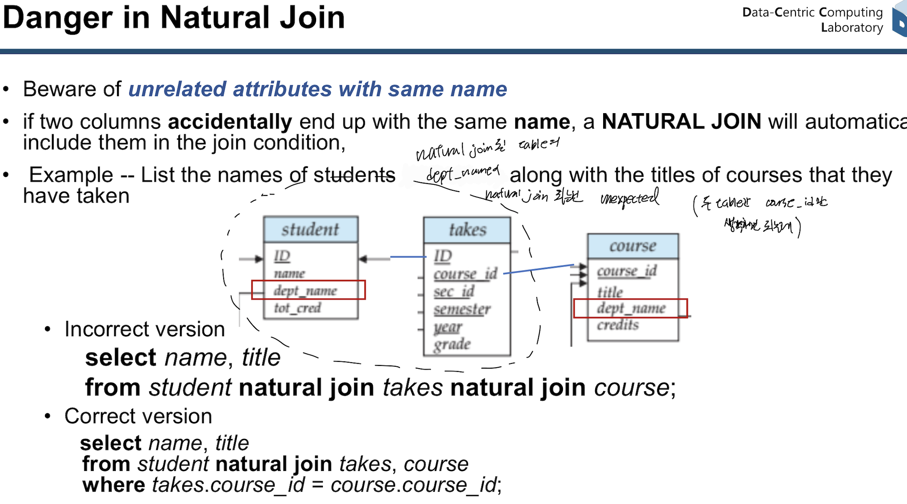
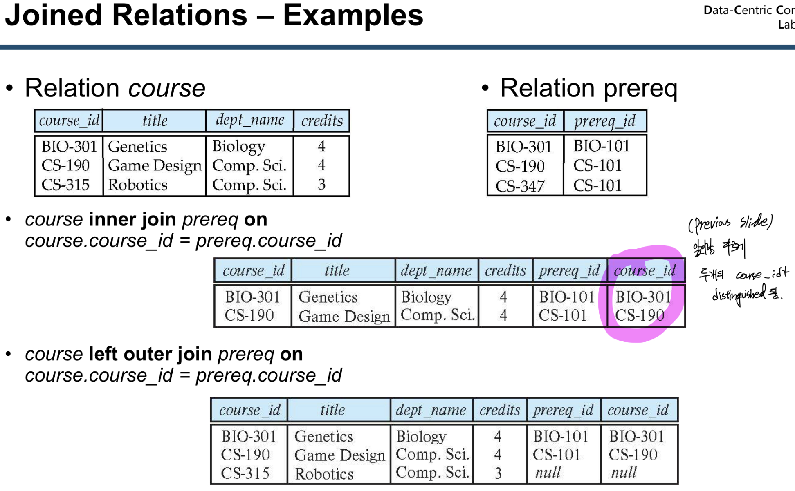
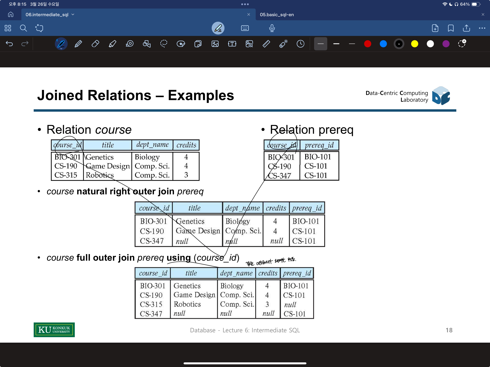

아리까리요
==

- SQL은 중복된 data가 result에 포함된다. (Relation algebra와 다른점), 제거할꺼면 distinct 쓰자
- 중복도 모두 보여주는 select all이 default
- From ',' 있으면 cartesian product

- String Patterns are case sensitive

- Order by: can sort on multiple attributes
  - e.g. ``` order by dept_name, name ``` 
- **having은** grouping, aggregation 되고 적용되는 반면
- **Where은** grouping, aggregation 되기 전에 적용 된다. 
- update 할때 순서 유의해
  - e.g. 
    ``` 
    update instructor
    set salary = salary * 1.03
    where salary > 100000;
    ------------------------------
    update instructor
    set salary = salary * 1.05
    where salary <= 100000;
    ```
- Multiple Natural join: 왼쪽부터 오른쪽 순서로 natural join 됨
``` sql
  select A1, A2, ..., An
  from r1 natural join r2 natural join jn
  where P;
```
- Mutiple natural join할때 같은 attribute name을 가지는 경우 자동으로 natural join 해버림 이를 주의
  - e.g. 
- Join on vs just join
  - 
  - 
