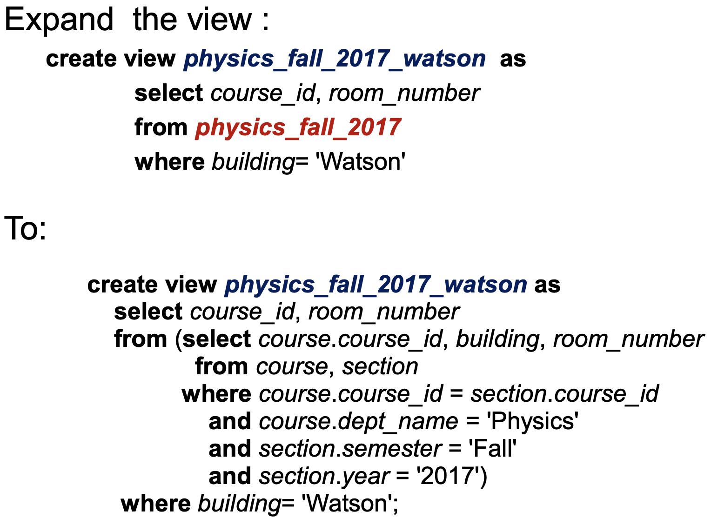
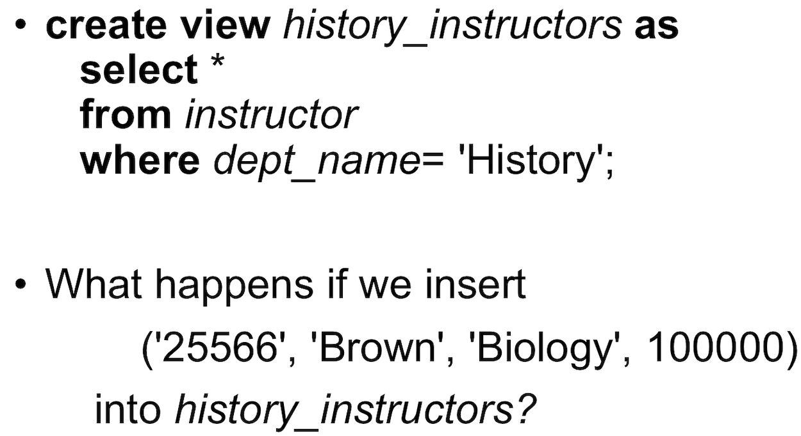

View
==
Definition
--
- **with**: query가 끝나면 사라짐
- **view**: 한번 만들면 계속 쓸수 있다. + 권한 이슈 (we can use view as a table)
``` 
V1 <-- V3 <--- V2
v1 directly depend v3
v1 depends on v3 and v2
if v1 depends on it self its called recursive
```
- 따로 table 만들기, view 만들기
  - 따로 table 만들기
    - 계속 관리하기 힘들어(consistency)
    - data를 물리적으로 저장하고 있어야함
  - View 만들기
    - query를 따로 저장하는 느낌
    - view를 불러오면 query가 실행됨

View Expansion
--

- View에서 View를 참조 할때 참조된 view를 가져다 쓰는게 아닌 query로 변환해서 nested view를 실행하는 것
- Database will recursively replace the view references until only base tables remain
  - Self참조가 있지 않는 이상 무조건 끝나게(성공적 실행) 되여 있다. 
- 왜쓰니: To ensures the query is executed correctly and efficiently.

Materialized Views
--
- view but result(data) will be stored physically
- 하지만 얘도 source가 바뀐다고 materialized view도 업데이트 되지 않아(Inconsistency issue)
- table 왕창크고 변화가 잘 이루어지지 않는 곳에서 쓸때만 Good

View에 인서트를 하면 안 좋은 이유
--
- 잘 인서트 한다 쳐 -> 원래 table간 inconsistency는 어쩌고?
- view에 실제 table에는 존재하는 attrbute가 없다면? -> null로 넣어?, reject 해?
- view를 만드는데 cartesian product와 같이 짬뽕이 생기는 경우 -> insert하기 위한 source table을 어떻게 정의 하지?
- 문법적론 ok인데 논리적으로 not ok인 경우
  - e.g. 

Transaction
==
Definition
--
Transaction Consists of a sequence of query and/or update statements and is a "unit" of work
- The transaction must end with one of the following statements
  - Commit work: 모든게 성공적으로 반영됨
  - Rollback work: transaction이 실행되기전 상태로 돌아감

Atomic transaction
- Either fully executed or rolled back as if it never occurred일 때 atomic transation이라 한다.
Concurrent transation 간 Isolation을 보장해줘야해
