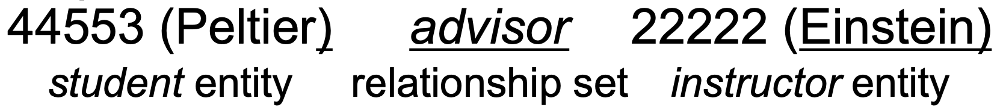

ER Diagram
==

Entity
--
An object that exists and is **distinguishable from other objects**. (can be mapped with single tuple)

Entity Set
--
Set of entities of the **same type** that share the same properties. (can be mapped to table)

Relationship
--
association among several entities, 말 그대로 entity와 entity간 관계

Relationship
--
Mathematical relation among n >= 2 entities, each taken from entity sets

ER-Diagram
--

ER-Diagram can have attributes
- By allowing relationships to have attributes, the model captures more of the real-world details. This leads to a richer representation of the scenario and can improve query capabilities later.

Attribute
--

- Single: 쪼갤수 없는
- Composite: 쪼갤수 있는
- Single valued: e.g. user_id
- Multi valued: 값을 여러개 가질수 있다. e.g. 전화번호 같은 경우 user가 여러개의 전화번호 가질수 있다. 
- Derived: 다른 attribute를 토대로 얻을수 있는 값 e.g 생년월일로 '나이' attribute를 만들수 있다.  

Key
--

Key in RELATIONSHIP SET
--
The combination of primary keys of the participating entity sets forms a **super key**(Not Candidate Key) of a relationship set
- Combination of PK가 Relationship Set의 Candidate key를 보장 x (Candidate는 SuperKey의 최소 단위)

Entity Set Overview
--

- Derived attribute은 바로 위의 attribute로 계산 해야해

Role & Expression
--

- 뭐로 연결되여 있는지 구분하려고 label
- 같은 entity set내에서도 relation을 가질수 있다. 

Cardinality Constraint
--

- 화살표 머리 없는 선은 'many'를 의미
- 화살표 머리 있는 선은 'one'을 의미
- 선 위의 n.m 숫자는 n은 최소, m은 최대의 entity연결 의미
- 이렇게 화살표들로 표현하는데 entity가 3개 이상이면 표를 해석하는데 어려움이 있다. 쓰지마

Participation & Weak Entity Set
--

### Participation
Entity Set의 entity들이 relation에 참여하는 정도
- **Total Participation**: Entity set의 모든 entity들이 최소한 1개의 Relationship에 참여
  - 화살표 선을 2줄로 해서 표현
- **Partial Participation**: total과 반대
  - 화살표 선을 1줄로 해서 표현

### Weak Entity Set
자신의 attribute들로 PK를 생성할수 없는 Entity set
- **Identifying entity set(Strong entity set)**: Weak entity set을 구별하기 위해 의존하는 entity set
- 구별하기 위한 relation을 **Identifying relationship**이라 한다
  - **double diamond**로 표시
- **Discriminator(Partial Key)**: set of attributes that distinguishes an entity of a weak entity set.
  - **Attribute를 점선으로 밑줄 그어서** 표시
- Weak entity set의 PK는 **identifying entity set의 PK** + **weak entity set의 discriminator(partial key)**
- 쓰는 이유: 만약 section에 course_id attribute를 추가하면 되겠지만, 두 entity set간 duplicated course_id가 생기고, 
굳이 entity set을 나눌 필요 x => sucks
