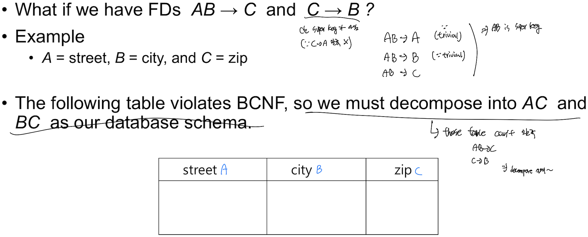

Decomposition
==
Table을 쪼개 duplicated data를 없애자! 기준은?

Good Decomposition
--

inst_dept table
- dept_name → building, budget을 결정한다. (Functional Dependency)
- dept_name은 candidate key가 아니야! (unique하지 않아 → repetition is a sign of redundancy and an anomaly in the design)
- 위와 같이 2개의 table reconstruction(Natural Join)하면 original table이 나오니 이건 잘한 decomposition

Bad Decomposition (Lossy Decomposition)
--

- Decompose한 table로 reconstruction(Natural Join)하면 original table로 돌아가지 못해

First Normal Form
--
A relational schema R is in first normal form if the domains of all attributes are atomic
- Non atomic values result in redundant data
- We assume all relations are in first normal form

Functional Dependency
==
Relation의 attribute A가 B에 의해 결정 되면 둘은 functional dependency관계

- Functional Dependency: key 개념의 일반화이다. 

Trivial
--
Where the right-hand side set of attributes is **already contained in the left-hand side**.

Closure
--
Functional dependencies들로 부터 추론 할수 있는 Functional dependency들
- e.g.
  - functional dependency로 A → B, B → C이면, A → C 추론 할수 있다. (Closure)
- Closure of F는 **F+**로 표현
- F+ is a superset of F

Armstrong's Axioms
--

이 규칙은 다음과 같은 조건을 만족해야 한다. 
- Sound: They only produce dependencies that truly hold.(functional dependency가 말이 되야한다.) 
- Complete: They produce all dependencies that hold (you won’t miss any).

Properties
--
Armstrong's Axioms를 바탕으로 properties를 추론 할수 있다.

Normalization(TEMP)
==
- Normalization is the overall process—it’s about designing your database schema so that you minimize redundancy and anomalies.
- Eliminate Redundancy: Avoid storing the same piece of data in multiple places.
- Prevent Update Anomalies: Ensure that when you update data in one place, you don’t have to update it in many places.
- Improve Data Integrity: Make sure that the data is stored logically so that it’s more consistent and easier to maintain.

BCNF
==
let, Functional Dependency F가 존재하는 relation R(SINGLE TABLE!!)이 있다 가정
- 모든 F+가 아래 조건중 둘중 **하나만** 만족해도 BCNF라고 한다.

- 아래의 instr_dept table은 BCNF을 만족하지 않는다 

- functional dependency `dept_name → building, budget`을 보자
  - dept_name이 **superkey**가 아니다
  - => **NOT A BCNF**

Decomposing a Schema into BCNF
--
BCNF violate하는 functional dependency를 가지고 와
- Relation R을 다음과 같이 분해

- e.g.

- 위 relation(table)의 경우 functional dependency `dept_name → building, budget`이 있지만 dept_name이 superkey라서(superkey 조건을 만족해서) BCNF form.
- 아래도 ID가 superkey라 O.K. 입니다. 
- Decompose 한 table에도 violation 있으면 계속 decomposing 해야해

Disadvantage
--
너무 Strict해, 너무 잘게 나누게 해
### Unenforceable FD
- e.g. 

- Not always possible to achieve **both BCNF and dependency preservation**

3NF
==
- BCNF is not dependency preserving
- Efficient checking for FD violation on updates is important!
- => Weaker normal form: 3NF(Third Normal Form)
  - Allows some redundancy, preserve FD

Condition of 3NF
--
Same with BCNF except 3rd condition

- BCNF이면 3NF이다.
- Redundancy와 null value가 생길수 있는데 어쩔수 없다 ㅜㅠ
- 3rd conditino is a minimal relaxation of BCNF to ensure dependency preservation
> 
> - 다음과 같이 나뉘는데 아래 그림과 같이 beta와 나머지간 dependency도 보장해줘야 해
> 
> - 따라서 b - a에 candidate key와 관련된게 있다면 살려줘야해(decompose하면 안된다.)

Good Design & Normalization
==
- Less storage space
- Quicker updates
- Less data inconsistency
- Clearer data relationships
- Easier to add data
- Flexible structure

Good Design
--
- BCNF
- Lossless join
- Dependency preservation

**하지만 BCNF와 Dependency preservation은 완벽히 공존할수 없어** 
**이런 functional dependency들은 sql을 쓰더라고 간편히 테스트 할수 없어**

BCNF vs 3NF
--
BCNF 대비 3NF의 장점
- Losslessness는 보장됨(BCNF도 보장된다)은 물론, dependency preservation도 보장

3NF의 단점
- Meaningful relation을 표현하기 위해 null이 사용되기도 한다.
- Information의 repetition이 발생 할수도 있다. 

Denormalization for Performance
--
### Approach 1
Normaliztion하지 말고 큰 테이블 한덩이로 사용하자
- 빠른 조회
- Update하는데 좀더 걸림
- 코딩도 더 해야 하고 이에 따른 에러

### Approach 2
Materialized view 사용(update가 자주 일어나지 않는 data일때면 더 좋겠지)
- 1번 approach랑 장단점은 같으나, 우리가 코드 짤 필요없고 dbms가 다 해줘
