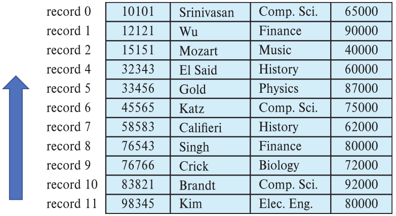
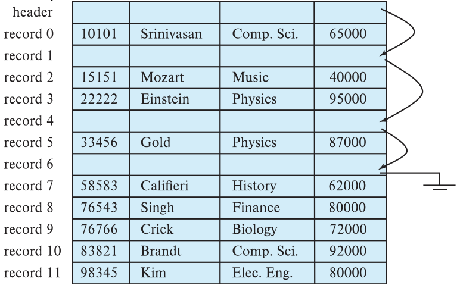
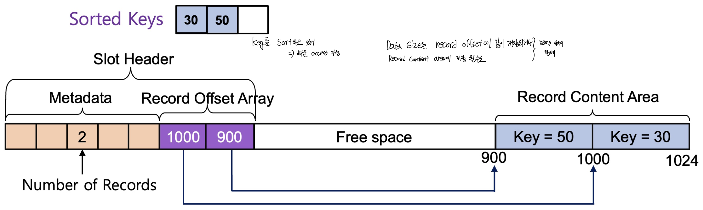
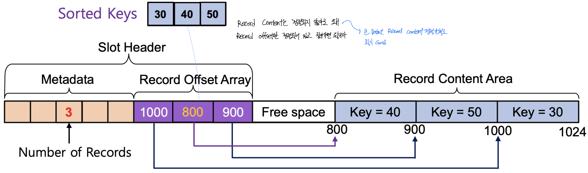
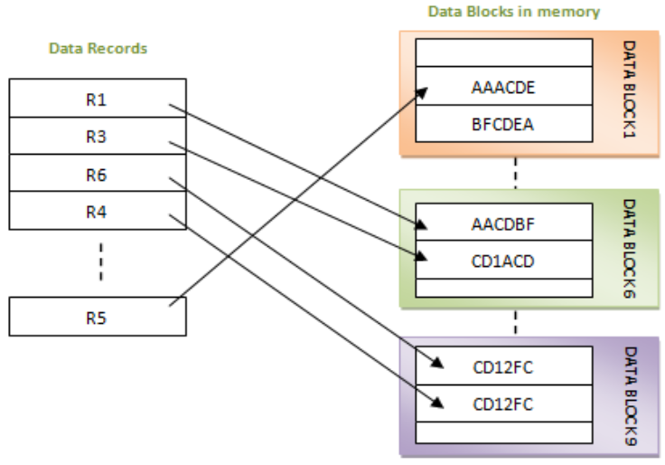
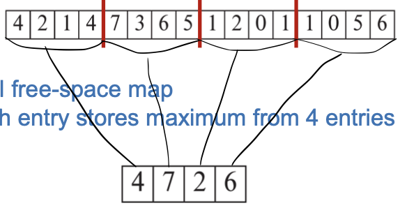
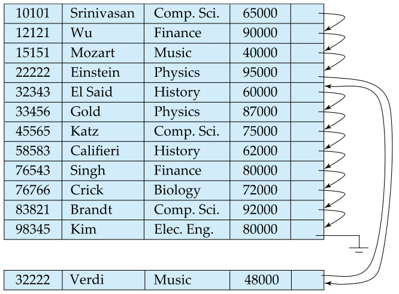
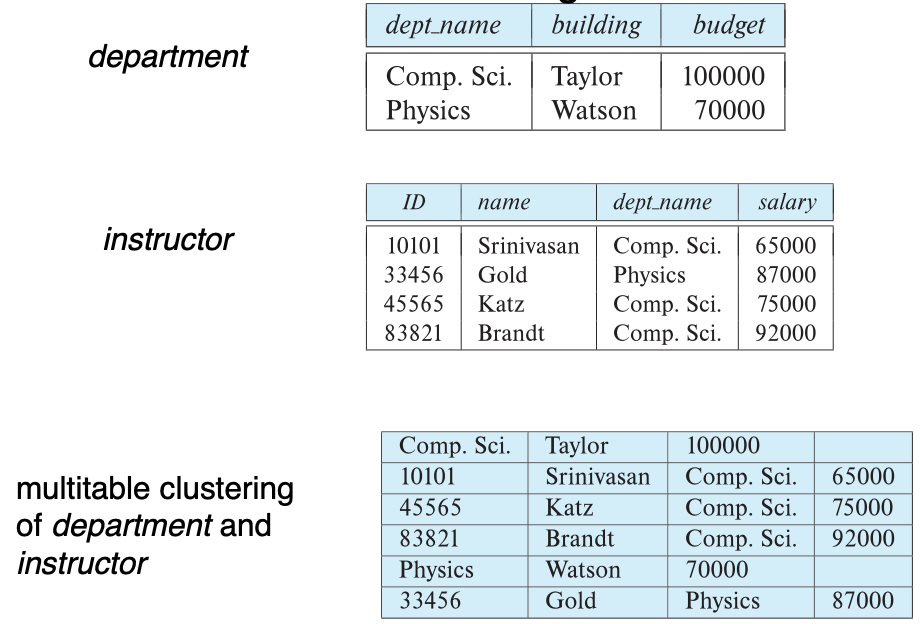
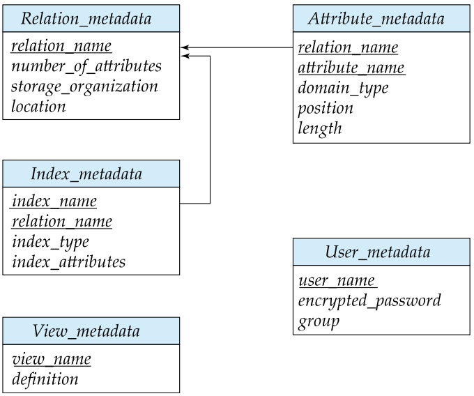

File Organization
==
**File**: A **collection of disk pages** organized together on disk.
Internal structure of a single disk page (or block)

Fixed Length Records
--

- 가장 기본 접근
  - 진짜 순서대로 데이터를 저장하고 있어
  - record가 삭제되면 아래에 있던 데이터들을 위로 땡겨줘

- Another approach
  - Free list에 빈칸을 저장하고 있어
  - 데이터가 추가될때 free list에서 빈칸 주소를 가져와 거기에 데이터 추가

Variable Length Records: Slotted Page Structure
--
Slotted Page Structure

Storing Large Object
--
- blob/clob
- Store as files in file system: file system에서 file의 위치가 옮겨지면 pointer가 이상한데 가리킴
- Store as files managed by database: db가 너무 커져
- Break into pieces and store in multiple tuples in separate relation: 각 separate file이 의미 있지 않은 이상 쓸데 없다. 

Organization of Record in Files
==
- 한 파일에 속하는 블록들이 반드시 물리적으로 인접해 있지는 않음

higher-level strategy for how pages (each with its own internal structure like a slotted page) are organized within a file.

Heap
--

- 레코드가 특정 순서나 구조없이 공간만 있으면 파일에 임의로 저장
- 레코드는 저장되면 이동하는 경우는 거의 없으니까 o.k.
- record를 빠르게 접근하기 힘들다.

- 빈공간을 관리하기 위해 Free space map을 이용
- 각 칸은 faction of block that is free를 뜻한다. 
- 그림은 3bit per block, indicating, 4/8, 2/8, 1/8,... free space

- 좀더 효율적이게 관리하기 위해 second level free space map을 쓰기도 한다. 
  - 특정 entry들 중 가장 큰값을 표시한다. (사진참고)

Sequential
--

- Linked list 이용해서 **search-key 순서**대로 저장하기 저장하기
- 순차적인 데이터 접근이 일어나는 application에 유용함
- 레코드들의 물리적 순서가 그 레코드들의 논리적 순서와 같게 저장함. -> IO를 줄일 수 있음
- Insert, Delete가 일어날때마다 재정비가 필요함

Multitable Clustering File Organization
--

- 그냥 한 파일에 다 저장하자
- store related records on the same block to **minimize IO**
- Join연산에 효율적이게 사용될수 있다. 연관관계가 있는 data들이 모여있으니까

Column-Oriented Storage
--
- 각 attribute들을 따로 저장함
- 데이터 분석 할때 좋다

Data Dictionary
--
- Meta Data를 위한 storage
- system, dbms을 유지하기 위해 저장하는 정보
- 유저가 어찌 저찌하는 data가 아니다. 

relational representation of system metadata

