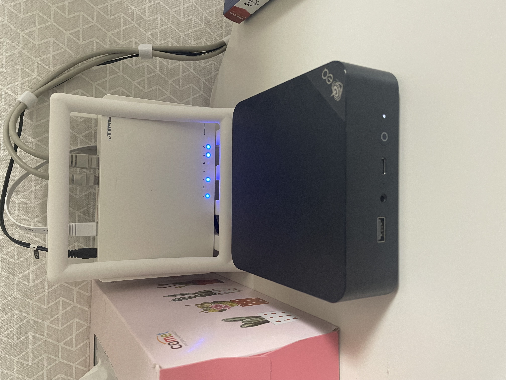

# Intro

인프라에 막연히 관심 있는 사람으로 k8s, openstack등을 막연히 구축 해보고 싶다는 생각이 들어 얼떨껼에 beelink eq14를 구매했다.
16GB ram, 512GB SSD와 함께... 

# TODO
- Rocky Linux 설치
  - 리눅스 마스터도 rocky linux를 기준으로 하고 RHEL의 맛을 보고 싶어서
- DDNS, Port forwarding 등 네트워크 설정
- Open ssh 띄우기
- fish shell 설정
- 따로 공유기 사서 80포트 열어버리기
- Reverse Proxy로 external port 노출 최소화
- docker network 설정
- 내 deployment server 만들기
- 등등등 하고 싶은게 많아용~
