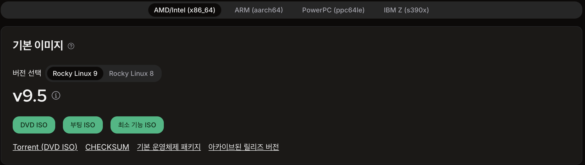
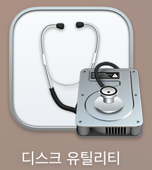
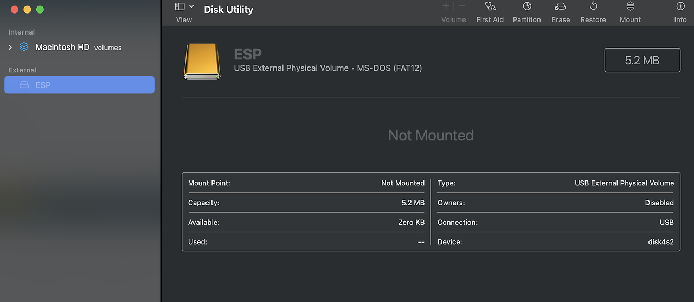
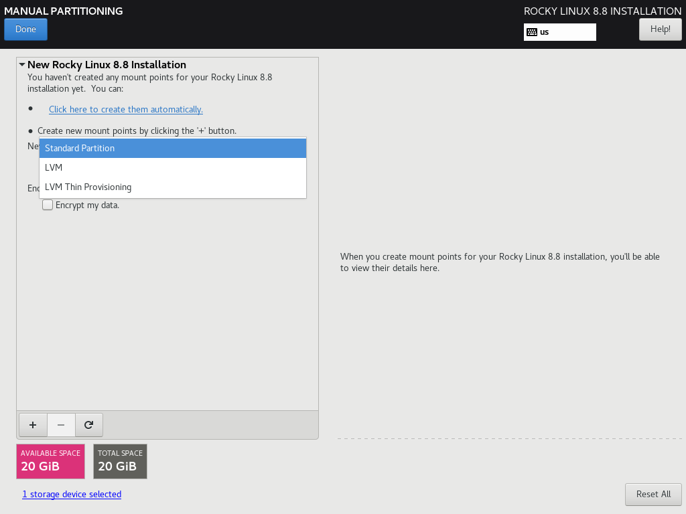
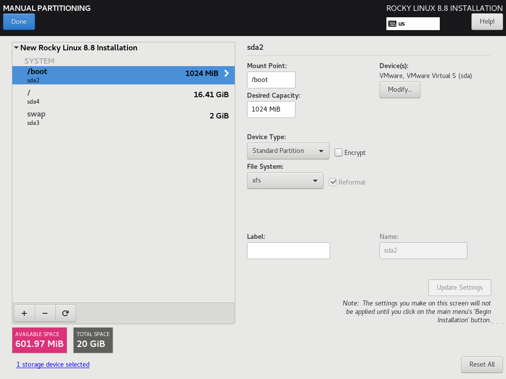
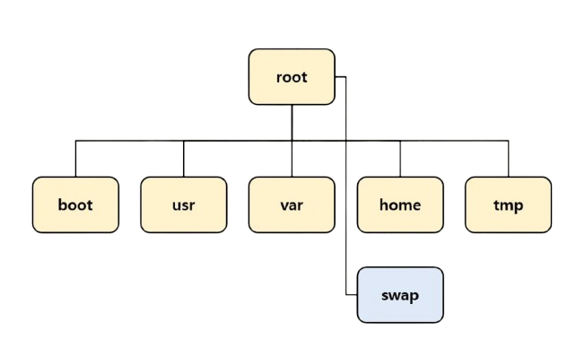
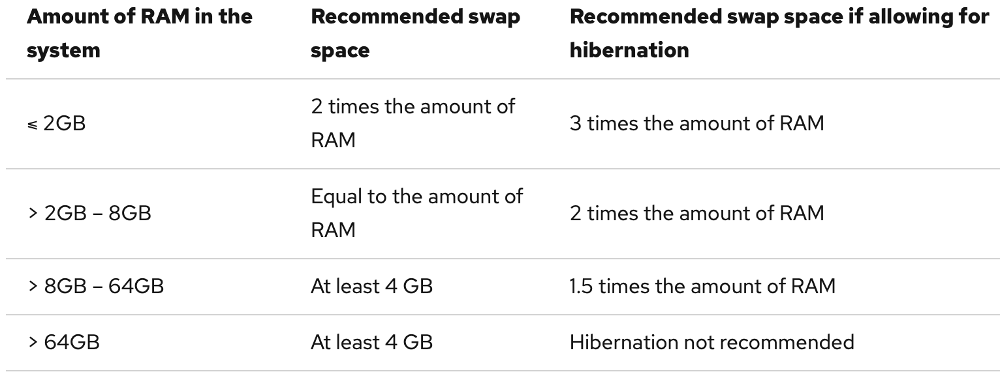

# 부팅 USB 만들기
Rocky Linux 9.5v 리눅스를 깔아보자!

## Rocky Linux 9.5v iso 다운로드
https://rockylinux.org/ko-KR/download 에 들어가면 다양한 ISO 파일들이 존재 한다

세 버젼의 차이는 다음과 같다.

| ISO 종류        | 용량(약)  | 구성                                                              | 주요 용도                                                                |
|----------------|----------|-----------------------------------------------------------------|----------------------------------------------------------------------|
| **DVD ISO**    | 8–9 GB   | – OS 설치에 필요한 거의 모든 패키지 포함 – 데스크톱·서버·개발툴 등 뭘 좋아할지 몰라서 다 준비했어 | – 인터넷 연결 없이 설치 – 오프라인 환경 – 다양한 옵션 선택 설치 가능                   |
| **Boot ISO**   | ~1.2 GB  | – 커널과 설치 프로그램(Anaconda)만 포함 – 나머지 패키지는 네트워크로 다운로드           | – 네트워크 설치(HTTP/FTP/NFS) – 최신 패키지로 설치 – 미러 사이트에서 직접 설치        |
| **Minimal ISO**| ~1.0 GB  | – 최소 부팅 가능한 시스템 구성 – 셸(shell), rpm·dnf 같은 기본 툴만 포함          | – 최소 설치(헤드리스 서버 등) – 초경량 컨테이너·가상머신 베이스 – 설치 후 필요한 패키지만 추가 설치 |

Boot ISO로 하면 DVD ISO에서 보다 커스터 마이징 할수 있지만 처음이라서 DVD ISO를 다운 받았다.  
이제 OS 설치를 위한 Booting USB를 만들어 보자

## Balena Etcher
iso 파일을 굽기 전에 usb를 FAT32로 초기화 해 주자

디스크 유틸리티로 할수 있다!
> FAT-32이 여야하는 이유
> 펌웨어(BIOS/UEFI)가 FAT32 파티션만 부팅 파티션으로 인식하는 경우가 존재(하위 호환성 유지를 위해)
> 한 파일이 4GB를 못 넘는 특성상 Windows의 경우 NTFS 포멧을 사용하여야 한다.

윈도우에 Rufus가 있다면 Mac에는 Balena Etcher가 있다!

사용법은 매우 간단하다
1. 다운 받은 iso 파일을 선택
2. booting usb로 쓸 저장장치를 선택하고 Flash!

usb 2.0 기준 20-30분 정도 걸렸던것 같다.  
이러면 booting usb는 준비 끝!

> **부팅 usb를 초기화 해야 하는 경우**
> 
> USB Partition 구조를 이해 못해서 생기는 오류인 MBR option을 사용하여 포맷시켜야 한다.
> `diskutil eraseDisk FAT32 USB MBR /dev/disk4`
> MBR: http://terms.tta.or.kr/mobile/dictionaryView.do?subject=master%20boot%20record

# Rocky Linux를 컴퓨터에 설치하기

## Bios에 들어가 설치하자

1. 컴퓨터의 전원을 키고 del키를 연타
2. 바이오스 화면으로 넘어가는데 영어를 잘 읽고 install rocky linux 9.5 (아마?) 선택
3. 컴퓨터 화면이 시키는 대로 작성하고 설정하기!

## Partition 설정하기
솔직히 다른거는 화면에 있는대로만 하면 되는데 partition은 그냥 당황스러웠다...
(사진 출저: https://velog.io/@calintzcs/설치-Rocky-Linux-8.x-Minimal-설치LegacyUEFI)

쿨하게 Standard Partition 하고 넘기자

> **Standard Partition 과 LVM(Logical Volume Manager)의 차이**  
> 간단히 요약하면  
> **Standard 파티션**: 간단하고 설정이 쉬운 친구고  
> **LVM**: 유연하고 확장 가능하며, 대규모 시스템이나 복잡한 디스크 관리가 필요한 환경에 적합하지만 설정이 너무 어려운 친구다.  
> https://www.redhat.com/en/blog/lvm-vs-partitioning

### 우선 Partition이 뭐냐
- 물리적인 공간을 별도의 데이터 영역으로 logically 분할 하는 것
- 각 partition에 다른 file system을 사용할수도 있고 다양한 이점이 있다.
- MBR, GPT 방식이 있는데 궁금하면 찾아보자

### Partition이 왜 필요하냐
- **데이터 격리 및 보호**: 한 partition이 과도하게 커져도 다른 partition에 영향을 덜 준다. 
- **안정성**: 메모리 부족 시 swap partition만 집중 사용하므로 다른 파티션 I/O와 충돌(contention)을 줄인다.
- **성능 최적화**: 자주 쓰는 로그(/var/log)와 사용자 작업(/home)을 다른 디스크나 디스크의 다른 영역에 두면 I/O 병목 분산.
– **파티션마다 서로 다른 파일시스템 사용**: e.g. 대용량 로그 저장용 /var는 XFS, 작은 빈번한 I/O용 /tmp는 ext4 같은 조합 가능.

> **부연 설명 1**  
> Partition 마다 I/O 스케줄러 입장에서 별도 큐 가 생기기 때문에 
> e.g. A partition에서 1억개의 I/O 요청 후 B partition에서 1개의 I/O요청  
> -> B partition의 요청이 A partition의 1억 요청을 기다리지 않을수 있다. (별도의 queue로 priority 조절 가능)  
> 응답성 & fairness UP

> **부연 설명 2**  
> e.g. A partition에서 1개의 I/O 요청 후 B partition에서 1개의 I/O요청이 100번 반복되는 상황 
> **No partition**: A 영역 이동, B 영역 이동 이짓만 100번 반복 ㅜㅡㅜ  
> **Yes partition**: 별도의 queue에서 관리 됨으로 A 10개 처리후 B 10개 처리와 같이 I/O 충돌을 훨씬 줄일수 있다.

### 각 Partition의 역할

 
- **/boot**: 부팅 로더(GRUB), 커널 이미지(vmlinuz), initramfs 등 부팅에 필요한 파일 저장
  - 권장 크기: 250 MB

- **/**: /boot을 제외한 모든 시스템 디렉터리의 최상위(root)
  - 권장 크기: 3GB - 5GB (5GB면 충분하다 함) 

- **/usr (선택)**: User Shared Resource, 대부분의 사용자 애플리케이션과 라이브러리 저장
  - 별도 분리 시 부팅·iSCSI 환경에서 복잡도 증가 가능하므로, 특별한 이유 없으면 /에 포함 권장
  - 권장 크기: 4GB (개발용이면 8GB 추천)

- **/var (선택)**: 로그, 메일, 데이터베이스, 패키지 캐시(/var/cache/yum) 등 가변 데이터 저장
  - 권장 크기: 3GB 이상

- **/tmp (선택)**: 각종 임시 파일 저장
  - 권장 크기: 최소 50MB

- **/home (선택)**: 사용자 계정별 데이터 저장
  - 권장 크기: 최소 100MB

- **/swap**: swap memory 할당 부분
  - 

| 파티션            | 파일 시스템                  | 권장 파일 시스템          |
|------------------|-----------------------------|--------------------------|
| `/`              | ext2, ext3, ext4, xfs       | xfs                      |
| `/boot`          | ext2, ext3, ext4, xfs       | xfs                      |
| `/boot/efi`      | EFI System Partition        | EFI System Partition     |
| `swap`           | swap                        | swap                     |
| 기타 일반 파티션 | ext2, ext3, ext4, xfs       | xfs                      |

출저: https://docs.redhat.com/en/documentation/red_hat_enterprise_linux/6/html/installation_guide/s2-diskpartrecommend-x86#idm140491990747664

# 이거 말곤 컴퓨터가 시키는 대로 하면 OK입니다! 
