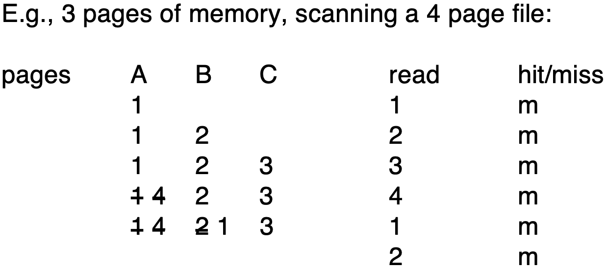

Storage Access
-
맨날 Disk에 접근하기에는 오래 걸리니 main memory( = buffer)에 copy of disk block store 하자

Buffer Manager
--
Subsystem responsible for allocating buffer space in main memory 
작동방식은 OS가 Buffer을 Manage하는 방법과 같다.

> 백문불여일견  
> - Write에서는 Read와 달리 return 값이 없다.
> - 볼수 있듯이 Write가 Disk의 data modification을 보장하지 않는다. 

### Replacement Strategy

**Two Purpose**
1. Prevent Eviction -> **Pinned Block**
2. Prevent Concurrent Access -> **Shared Lock & Exclusive Lock**

#### Pined Block
Block that is not allowed for Eviction. Each block has its own **pin count**
- **Pin**: Done before reading / writing data from a block, cnt++
- **Unpin**: Done when read / write is complete, cnt--
- **pin count == 0** 일 때만 Eviction 가능

#### Shared Lock & Exclusive Lock
- **Shared Lock**: Reader들이 사용하는 lock, **2 이상** 값도 가질수 있다. (Read는 여러명 씩 가능)
- **Exclusive Lock**: Wirter이 쓰는 lock, **최대가 1**이다. (Write는 무조건 1명씩 진행되어야 한다.)
  - Shared lock annot be concurrently with exclusive lock

### Buffer Replacement Policies
Buffer manager can use statistics: probability that a request will reference a particular table  
File system may reorder writes leading corruption of data structures on disk 
CAREFUL Ordering of writes can avoid many such problems

#### LRU is BAD in Database
1:N 관계에서 Join을 실행한다 가정하자  
N쪽의 tuple들마늘 따로 생각해보면 다음과 같이 실행됨을 알수 있다.  
Buffer Manager에서 연속적으로 MISS -> SUCKS

Queries access disks in well-defined patterns (e.g. sequential scans)

#### Toss Immediate
Evicts a block as soon as that block is processed
- buffer를 단순 scratch pad 쓰듯이 쓴다. 
- Sequential scan에 좋다.

#### MRU (Most recently used)
제곧내

##### 예시 출저
[MIT-OpenCourse](https://ocw.mit.edu/courses/6-830-database-systems-fall-2010/cbab1dd746579df2cf20fe5027fbf95a_MIT6_830F10_lec07b.pdf)

Indexing
-
Data를 더 빨리 찾으려고 만든 **별도의 파일**(Index file) 
Index file consisst of records(called index entries) (below)

- **Search Key**: A set of attributes used to look up records
- **Pointer**:  A reference to that row’s physical location (page + slot)

> 여기서 말하는 Indexing과 Slotted Page Structure 비교
> - **Slotted Page**
>   - Layer: Within a single disk page (e.g. an 8 KB block)
>   - Role: define how variable-length records (or index entries) are laid out on that page
>   - Usage: every table file and every index file typically uses slotted pages under the hood
> - **B+ Tree(Indexing)**
>   - Layer: Across many pages, as a file-level structure
>   - Role: implement an ordered index strategy: they organize (search-key → pointer) pairs into a height-balanced tree so you can do logarithmic‐time lookups, range scans, etc.
>   - Usage: each node of the B⁺-tree is itself stored in a slotted page, but the magic of the index is in how those pages link together (via parent/child pointers) to support fast searches.

- Two basic kinds of indices
  - Ordered Indices: Keys are stored in sorted order(보통 tree 구조)
  - Hash: Indices: Search keys are distributed uniformly across **buckets** using a **hash function**

- **Index Evaluation Metrics**
  - Access types supported efficiently
    - Point query: Hash works better
    - Range query: Ordered Indices work better
  - Access, Insertion, Deletion time
  - Space overhead (Index structure가 차지하는 공간)

Ordered Indices
--

- **Clustered index(primary index)**
  - Order of key in index == sequential order of file
  - 즉, index의 순서대로 파일이 disk에 위치해 있다. 
  - 새로운 값이 들어와도 dynamic하게 order를 유지 시킴
- **Secondary index(nonclustered index)**
  - file 순서랑 index의 순서랑 따로 논다.
- **Indexed-sequential file(ISAM)**
  - 깊게 다루지 않아서 일단 GPT 하나 남김니당.
  - 

### Dense Index files
Index record appears for every search-key value in the file.
- Index file의 search-key들로 table 전체를 커버 할수 있으면 된다. 

### Sparse Index files

- Index file의 search-key들로 table 전체를 커버 불가. 
- Applicable when records are sequentially ordered on search-key

### Secondary Indices
- index로 간략히 찾고, 실제 값은 bucket에서 찾아
- Hash table의 bucket 개념이랑 비슷
- Secondary indices have to be dense (b/c 아니라면 bucket에서 pointing할께 없잖아)

### Multilevel Index
- Index가 memory에 다 들어가지 않을 경우
- => index file을 위한 index file을 위한 index file을 위한 index file을 위한 ... 
- Indices at all level must be updated on insertion or deletion from the file

