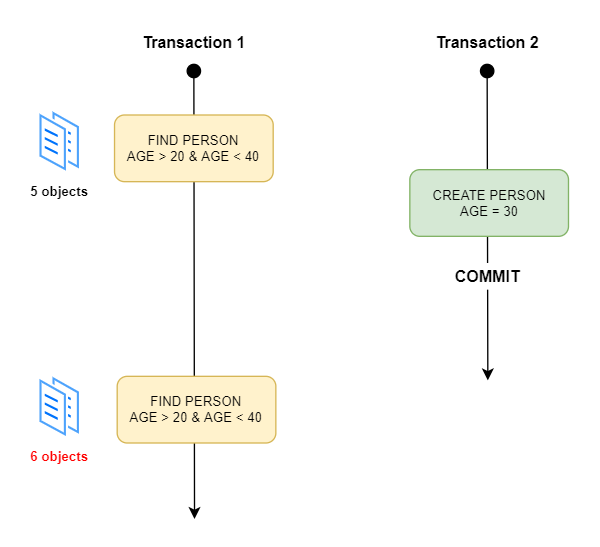
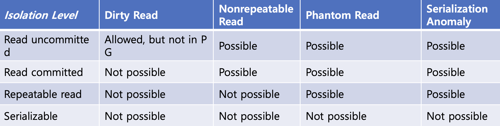
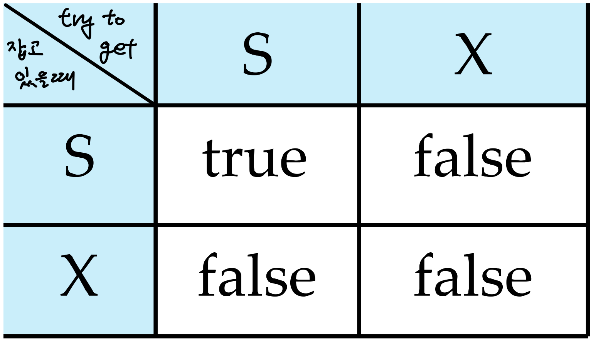
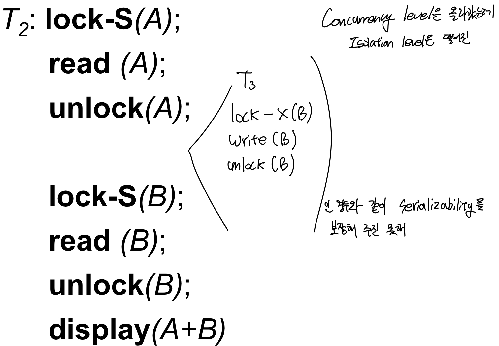
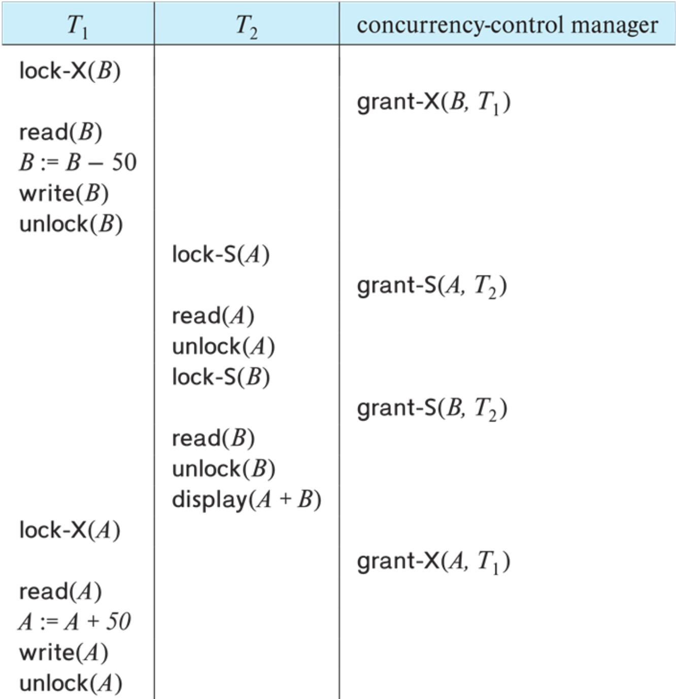
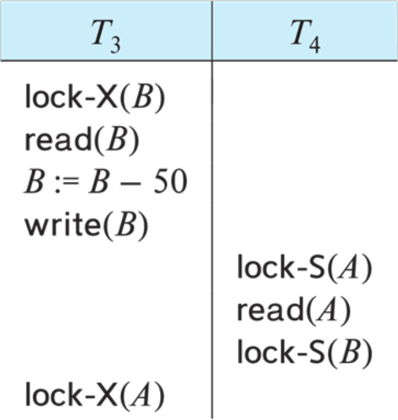
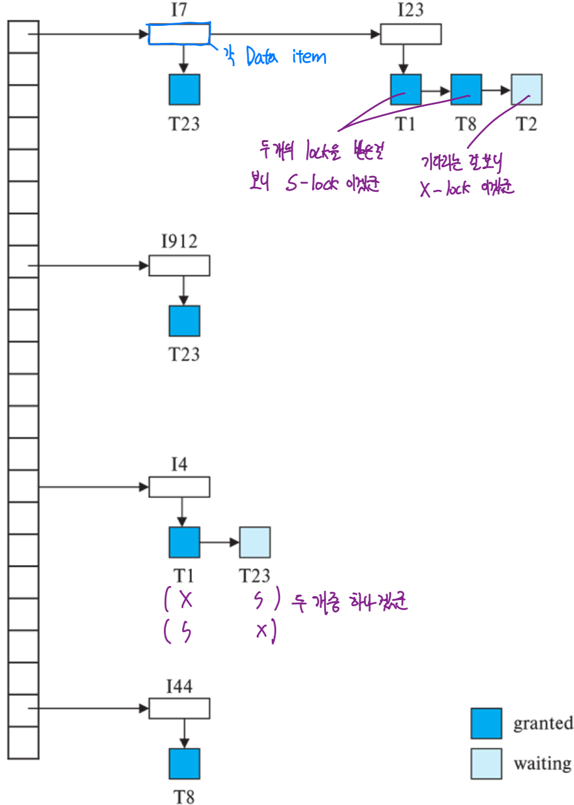
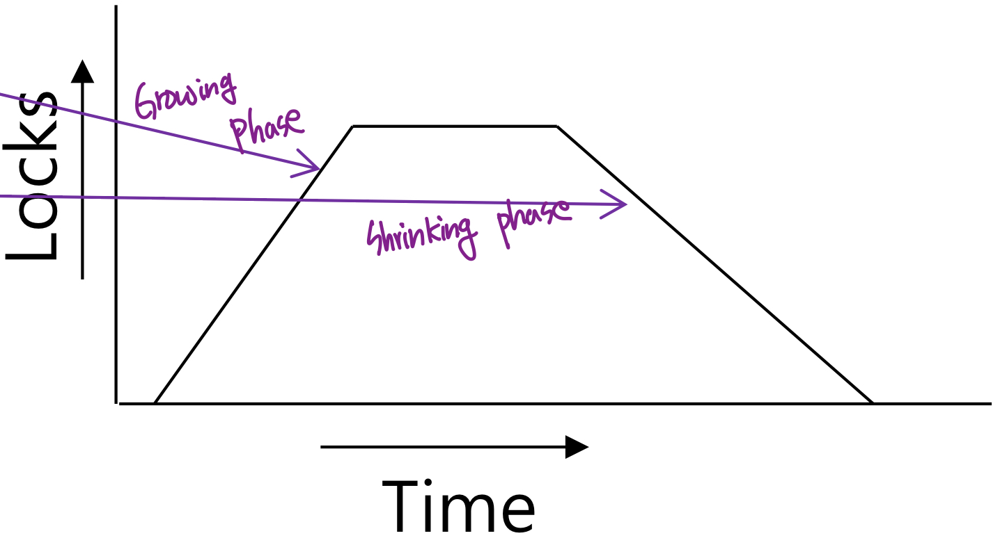
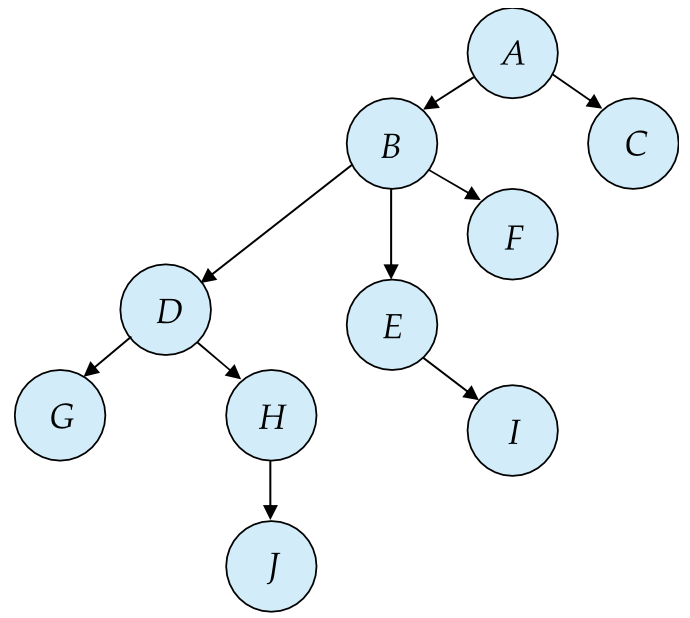

> Transaction을 먼저 보고 오세요 ㅎㅎ ^___^;;;

Concurrency Control
==

> 좋은 DBMS의 조건
> 1. Conflict serailizable 그리고 view serailizable
> 2. Recoverable
> 3. Cascadeless

Trade off between the amount of concurrency they allow and the amount of overhead that they incur

Phenomena Caused By Concurrent Transaction
--

### Dirty Read
Transaction read data written by a concurrent **uncommitted transaction**. (Not recoverable이게 됨)

### Nonrepeatable Read
Transaction을 두번 실행하는데, data has been **modified** by another transaction.

### Phantom Read
Transaction을 두번 실행하는데, result set has new records due to another recently-committed transaction.

### Serialization Anomaly
Result of successfully committing a group of transaction 했는데, 말이 안되는 값이 나와 (Inconsistent 해)

Transaction Isolation
==

SQL-92의 Transaction Isolation Level

Implementation Of Isolation Levels
--

### Locking
데이터를 못 쓰게 잠궈 버려
- Lock on whole database(concurrency no good, isolation good) VS lock on items(concurrency good, isolation no good)
- **How long** to hold lock
- Shared VS exclusive locks

#### Lock Based Protocol

> - **Exclusive(X) mode**: Data 읽기, 쓰기 모두 지원, 한번에 하나의 transaction만 lock을 잡을 수 있다.   
> - **Shared(S) mode**: Data 읽기만 지원, 여러 transaction이 동시 접근 가 

- X-lock은 아무도 특정 resource에 대해 lock을 hold하지 않았을 때만 가능
- 특정 resource에 X-lock이 걸려 있으면 다른 X-lock, S-lock이 lock을 걸수 없어

예시

얘도 역시 serializable 하지 않는다. 동일 A에 대해 write연산이 하나 이상 있기 때문에

#### Deadlock & Starvation

T4는 T3가 끝나기를 기다리고 있고 T3는 T4가 끝나기를 기다리고 있어
  서로가 서로를 기다리고 있어 무한 block되는 **deadlock**

**Deadlock**: **Same transaction** is repeatedly rolled back due to deadlocks

#### Lock Manager가 Lock을 관리하는 법

In memory data structure **Lock Table**로 관리한다. 

### Timestamps
시간 정보를 자기도 연산들의 실행 순서를 매길게
- **When** Transaction timestamp assigned (e.g. when a transaction begins)
- Data items store two timestamps
  - Read timestamp
  - Write timestamp
- Used to detect **out of order** accesses

### Multiple Version of each data item
Allow transactions to read from a **"snapshot"** of the database

Two Phase Locking Protocol
--

- A Protocol that **insures conflict-serializable schedules**
- Assures serializability
- Conflict serializable schdule에 대한 필요조건은 아니야
- Transaction이 final lock을 acquire 시점에 의해 serializability가 결정됨을 보여준다. 
- Recoverability 보장 (Strict 2PL)
- **Deadlock free를 보장하는 건 아니야**

- **Phase 1**
  - Transaction may obtain locks
  - Transaction may not release locks
  - can **convert** S-lock to X-lock
- **Phase 2**
  - Transaction may release locks
  - Transaction may not obtain locks
  - can convert a X-lock to S-lock (당연, 나 제외 이 lock을 쓰지 않아)

두가지 버젼 존재
- **Strict two-phase locking**: Exclusive lock들에 대해서만 hold한다. 
- **Rigorous two-phase locking**: 모든 lock에 대해 hold 해
  - Transaction can be **serialiezed** in the order in which they commit
  - **Ensures recoverability** and **avoids cascading roll-backs.

Graph Based Protocol
--

Graph based protocols alternative to two phase locking
- Transaction에서 data를 접근하는 순서를 정한다. 
- D = {di, d2, ..., dh}
- D는 directed acyclic graph가 될거야 (a.k.a. database graph)

### Tree Based Protocols

Tree protocol is simple kind of graph protocol
- **Only exclusive locks** are allowed.
- E의 lock을 잡기위해서는 A, B, E lock을 잡고 있어야해
- 같은 transaction이 특정 data의 lock을 풀고 바로 다시 같은 lock을 잡는건 불가능 해
- Data item may be unlocked at any time
- Schedules not possible under two phase locking are possible under the tree protocol, and **vice versa** (진짜 Vice versa도 성립!!)

#### 장점
- Ensures conflict serializability
- Ensures **no deadlock** (roll back free)
- Shorter waiting time, increase in concurrency (b/c 언제든지 lock을 풀수 있으니까)

#### 단점
- Protocol does not guarantee recoverability (b/c commit dependency 고려 x)
- No guarantee cascade freedom (b/c commit dependency 고려 x)
- Transaction이 사용하지 않는 data까지 lock을 걸어 (b/c parent에 대해 lock이 있어야만 자식도 lock을 걸을수 있으니까)
  - Increase locking overhead, waiting time
  - Potential decrease in concurrency
