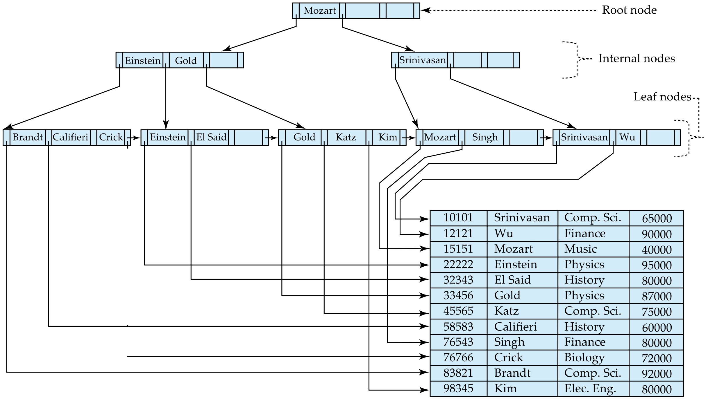
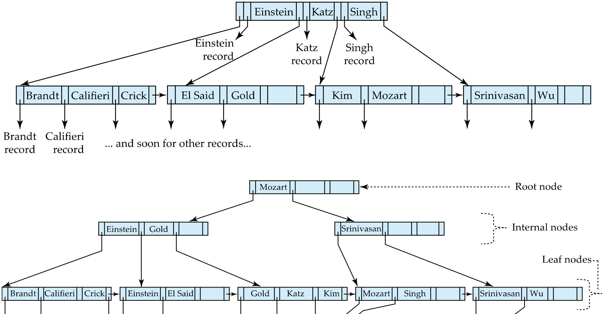

B+ Tree
=
자료구조 & 알고리즘을 잘 들었다 가정하고 기본은 skip-

B+의 장점 수치화
--

### 가정
- Node의 사이즈는 Block size와 같아, 4KB라 가정하자
- Entry의 크기는 40Byte라 가정 -> 1 노드는 100개의 entry를 가진다. -> n = 50
- entry의 절반 정도가 찬다고 가정
- search key가 1,000,000 존재 가정

### 결과
- Tree height는 log50(1,000,000) + 1 = 5
- 따라서 특정 노드를 찾기 위해서 4개의 node만 거치면 OK 입니다. 
- => 완전 효율적

Search Key가 Non-unique key일때
==

- non-unique니까 composite 해서 unique하게 만들어
  - (ai, Ap)
    - ai: search key
    - Ap : attribute that makes tuple a composite key

- Search for ai can be implemented by a range search on composite key, with range  첫 번째 값이 v 이면서 두 번째 값이 가능한 가장 작은 것 ~ 첫 번째 값이 v 이면서 두 번째 값이 가능한 가장 큰 것
- 물론 I/O instruction은 더 생길꺼야
  - Index가 clustering인 경우: sequential accesss라 조금만 더 IO
  - Indexr가 non-clustering인 경우: random access라 IO 많이 더

삽입 순서에 따른 Occupancy 차이
--

### Random Order
1. 대부분의 노드가 가득 차기 직전에 분할(split)을 경험 
2. 분할 시 한쪽 노드에 ⌊m/2⌋, 다른쪽에 ⌈m/2⌉ 개의 키가 남아
3. 전체적으로 노드들이 절반(m/2)과 전체(m) 사이 어딘가에 분포
4. i.e. **66%**

### Sorted Order
1. 항상 가장 오른쪽(또는 왼쪽) 리프만 계속 채워짐
2. 노드가 가득 차면 즉시 그 노드 하나만 분할 → 양쪽에 정확히 절반씩 키가 남음
3. 분할된 두 노드 모두 대략 m/2개의 키를 유지
4. i.e. **50%**

B+ Tree File Organization
==

File을 관리하기 위해 B+ Tree를 사용하는 경우
- Leaf 노드가 pointer을 holding하고 있는 것이 아니라 실제 data record를 hold하고 있다. 
- Helps keep data records clustered even when there are insertions/deletions/updates

Leaf node가 실제 데이터(ptr보다 많은 용량)를 가지고 있다보니 공간을 더 효율적으로 써야해
--

- Split과 Merge할때 sibling nodes를 더 많이 참여시키자
- 나, 왼쪽 노드, 오른쪽 노드를 동시에 고려하고, 세 entry(data)를 모아 균등하게 재분배
- i.e. 2n/3 정도는 차 있을꺼야

Secondary Indices가 존재하는 B+ Tree
--

- 만약 split이 발생한다면 모든 secondary index의 record address가 다 바뀌어야 한다. 
- Secondary indices에 (key, address(ptr))가 아니라 **key**만 저장해두자
- Secondary index를 통해서 대응하는 search key를 찾은 다음에 본 B+ tree에서 검색
- => split이 발생해서든, record가 저장되어 있는 주소가 바뀌어도 상관 x

Prefix Compression
--

- Variable length key, length 길면 비교연산하는데도 오래거려
- 이정표역할만 하는건데 prefix만 기록해 놓아라 (full key를 internal node에 넣는건 굳이...)

Bulking Loading & Bottom up build
--

Leaf level이 메모리에 올릴수 없다 가정하자 
-> Bulk loading(random)이 있는 경우 완전 비효율적 (internal node cache될 확룰: random) 

### Sort and Insert

- 정렬하고 넣으니 같은 Block에 들어갈 확률 높겠지
- => Internal node들이 이미 memory에 있겠지 -> Disk I/O없으니 빨라
- 아 근데 sorted하게 넣으먄 50퍼 밖에 안 차잖아 ㅠ__ㅜ

### Bottom up B+ tree construction (Importante)

- Sort 먼저
- Leaf노드 전부를 먼저 만들고
- 이를 토대로 바로 위의 internal node 만들기
- 또 이를 토대로 internal node(eventually root) 만들어
- 공간도 적게 쓰고, Height도 낮어서 read에는 완전 굿
- **단점**: Insert 연산이 여러개 들어온다면 Split이 와다다~ 와다다~

B Tree
==

- Internal(also root) node들도 record의 주소를 가질수 있어
- Height 낮아지고 좋아
- **단점** Leaf node에 sibling ptr있어도 위의 internal node들에도 record를 가리키는 pointer가 있으니 scan 불가능
