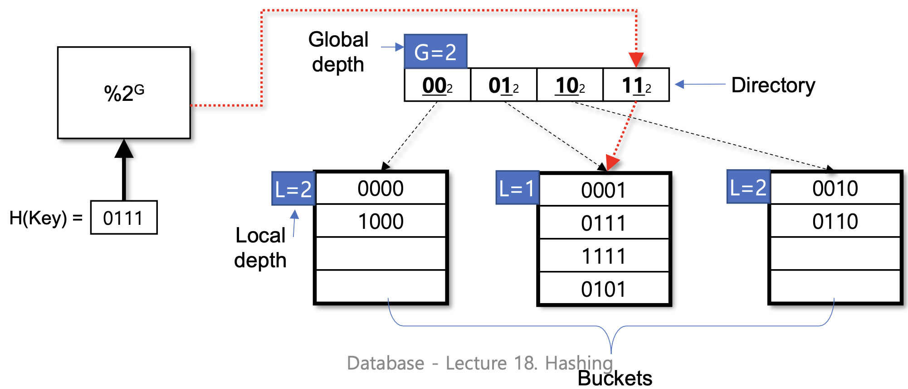
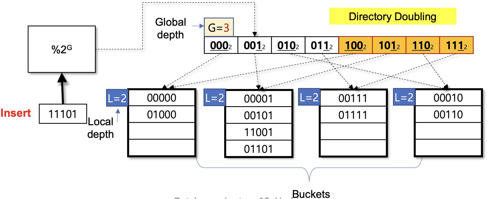
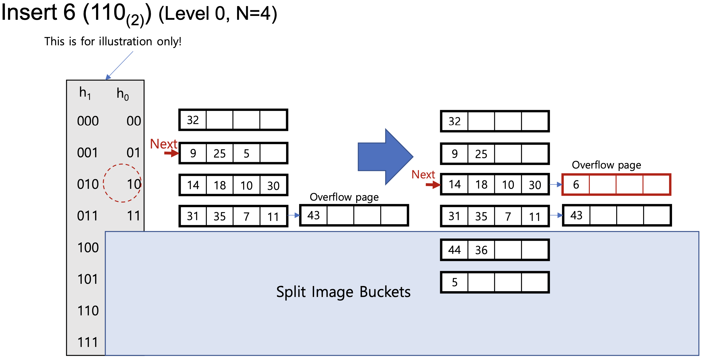
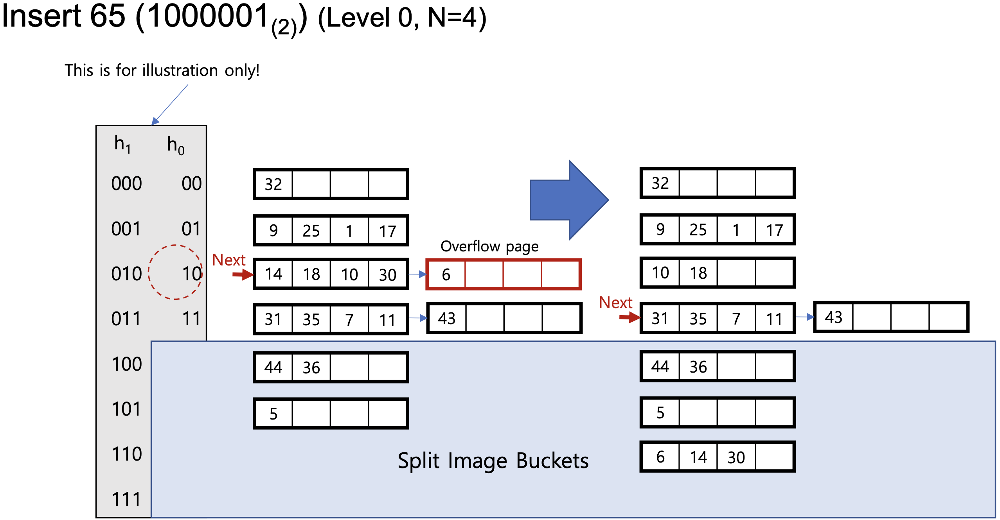
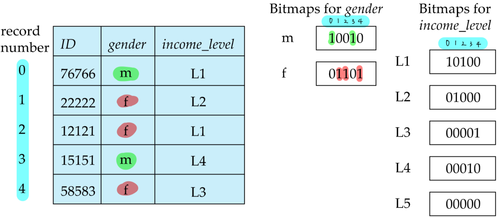

Hashing
=

Hash index에서는 bucket에 records들의 pointer를 저장  
Hash File Organization에서는 bucket이 records itself를 저장하고 있다.

Static Hashing
-

- Bucket의 갯수가 Fixed 되어있어
- Buckets are sequentially allocated
- never de-allocated

### Overflow

- **Overflow chaining (Closed Hashing)**: Bucket에 linked list로 추가해
- **Linear probing (Open Hashing)**: 그냥 다음 bucket에 써, 찾을때 못 찾으면 다음 bucket 넘어가서 찾는 방식으로 해결

#### 단점

Database의 사이즈가 커졋다 작아졌다 하는데 어떻게 대응할래? 
- Sol: Rehashing: 그냥 너무 커지거나 작아져서 overhead가 커지면 그냥 다시 만들어 ㅋㅋ;;

=> Dynamic hashing 하자

Dynamic Hashing
--
- Indirection level을 두자
- Directory의 갯수를 doubling하자
- Hash function이 변한다는 아이디어에 기반함

### Extendible Hashing

- Hash key의 Postfix나 Prefix를 바탕으로 indirection level(directory) 같은게 만들어진다.
- 여러 directory entries들이 single bucket을 가리킬수 있다
- Global depth = 2 -> H(key)에서 prefix or suffix 2개를 바탕으로 indirect 해줘야지  
- G > L 이고 collision이 나면 bucket을 split (01, 11 둘다 같은 bucket 가리키던걸 01, 11 각각 가리키는 bucket으로 split 시키자)
- G == L 이면 Directory를 doubling
- 아래 사진 틀렸는데 여튼 저런 느낌이다. 이걸 언제 새로 그리냐

#### 장점
- 파일이 커져도 hash performance가 줄어들지 않아
- Split되어야 하는 bucket이 split되니까, minimal space overhead

#### 단점
- Indirection level이 추가로 필요해
- Bucket address table이 너무 커질수도 있어 (consecutive한 memory space를 할당 받는 것도 힘들어)

### Linear Hashing
- Directory를 쓰지 않어 
- Bucket에 overflow가 발생하면 **Next Pointer**가 가리키고 있는 bucket이 split 된다. 
- Use family of hash functions

> - Next 전에 있는 bucket들 -> 이미 split이 된 bucket, see buckets on blue colored side
> - Next 혹은 뒤에 있는 애들 -> bucket split 될 애들
> - 해당 bucket이 split 될때 overflow 있으면 redistribution 된다
> - 내가 보려는 해쉬 값의 bucket이 Next 앞에 위치하면, 다음 level bucket(Split image buckets) 확인해야 해
> - vice versa

Ordered Indexing(B+tree) Hashing 비교
=

고려사항
--

1. 주기적으로 재구성에 필요한 비용
   - Split, Merge
2. Frequency of insertions and deletions
3. Average time 고려할래 Worst case 고려할래

결론
--
> Point query는 Hash가 더 뛰어나, 근데 Hash는 Range 쿼리에 너무 취약해

Bitmap Index
=

Why Introduced
--

- Multiple key에서 효율적으로 querying 하려고
- Intersection, Union의 경우를 bit operation AND, OR로 처리 가능 => 매우 빠르다
- record를 한 비트로 표시해 버리니 space overhead도 거의 없어

조건 & 예시
--

- 구분할수 있는 몇개 안되는 domain을 가지고 있는 attribute에 적용가능
