Transaction
==
A **unit of program** execution that accesses and possibly updates various data items

> - Bank transation example
> 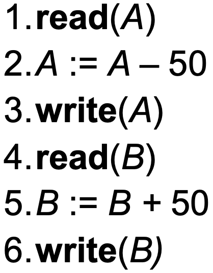
> 2, 5는 Local buffer을 통해 일어난다. 사고나도 DB(Disk)에 반영 안돼있다. 

2 main issues to deal with
1. Failure of various kinds (e.g. hardware failure, system crash)
2. Concurrent execution of multiple transaction 

ACID
--

### Atomicity Requirement

- Step 3 - step 6 사이에서 fail이 난다면, A의 balance가 -50이 될거야 **!!Inconsistency!!**
- 이런 **inconsistency** in database should not happen
- 부분 적으로 실행된 transaction은 db에 반영되면 안된다. 
- **ALL OR NOTHING**

### Consistency Requirement

- **Explicit Integrity Constraints**: Primary key, foreign key들이 유지 되어야 한다. 
- **Implicit(암묵적인) integrity constraints**: e.g. sum of balances of all accounts, minus sum of loan amounts must equal value of cash-in-hand
- 우리 예시에서 보자면 transaction 전, 후의  balance total은 같아야해

### Isolation Requirement
- 여러 개의 Transation이 동시 실행 될때 transation들이 서로에게 영향을 주면 안된다.

### Durability Requirement
- Transaction이 성공적이 였다면, 수행한 결과는 DB에 반영 되어야 하고 storage에 저장되어 must persis even if there are software or hardware failures.

Transaction State
--

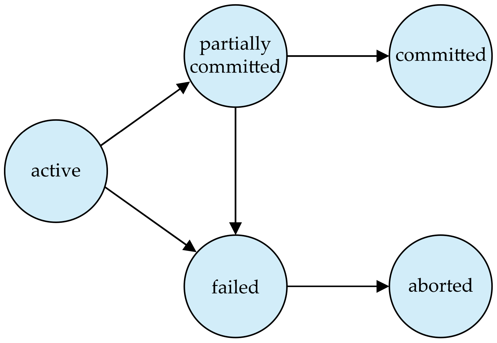

Common Sense로 넘어 갈수 있는건 넘어가겠다.
- **Partially committed**: transaction이 실행할 모든 명령문을 성공적으로 마쳤지만, 아직 완전히 커밋되어 최종 결과가 디스크에 반영되기 전의 상태
- **Aborted**: State after the transaction has been **rolled back** and the database restored to its state prior to the start of the tranation.
  - Two options after it has been aborted
    1. Restart the transaction
    2. Kill the transaction
- **Committed**: State after successful completion

Schedules
==
Specify the order in which instructions of concurrent transations are executed  
Transaction들 끼리의 내부 연산들이 어떻게(in which order) 실행되는지에 대한 것
- transation이 성공적으로 끝나면 commit이 될거야
- fail하면 abort instruction이 진행되겠지

Serializability
--

### Serializable
A schedule is **serializable** if it is **equivalent to a serial schedule**: 결과가 동일하면 돼

#### Serial schedule

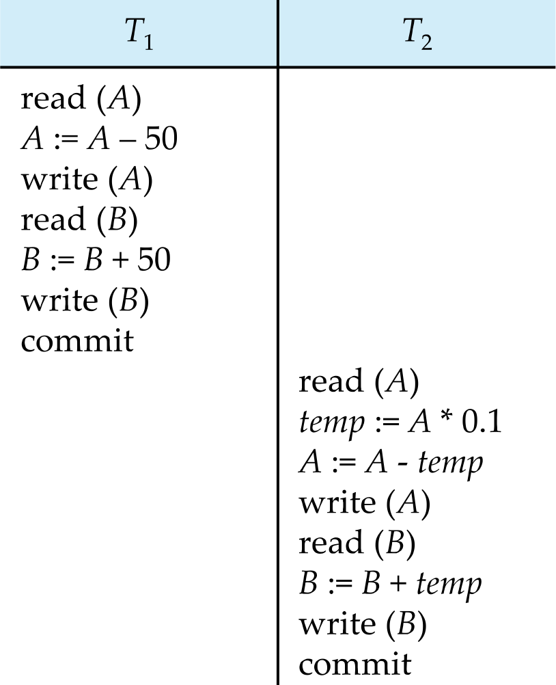

- T1 -> T2 순서대로 실행된다. 

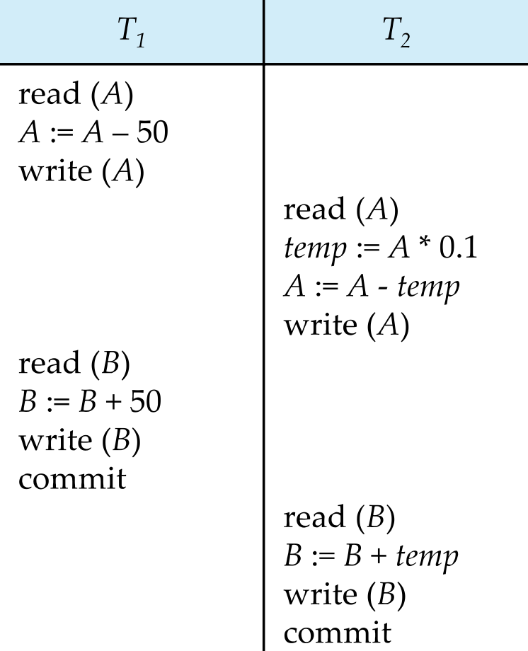

- T1, T2 내부의 연산들의 순서가 바뀌었지만 앞의 serial하게 실행된거랑 같다.
- => **Serializable Schedule**

### Conflict Serializability

If a schedule S can be transformed into a schedule S' by a series of swaps of non-conflicting
instructions, we say that S and S' are **conflict equivalent**.

- **Conflict Serializable**: conflict equivalent to a **serial schedule**
- 위 Serial schedule에 나온 예시도 보면 **conflict serializability**야

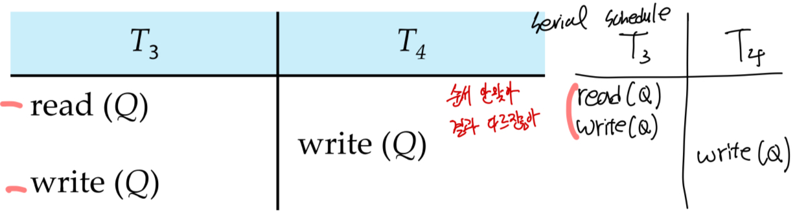

conflict serializable하지 않은 예시

#### Conflict

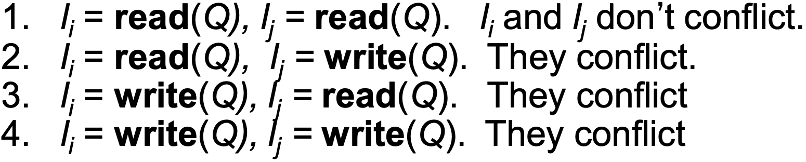

- Conflict forces an order between them

### View Serializability

> **조건**
> 1. S에서 Ti가 Q의 초기값을 읽으면 S'도 Ti가 Q의 초기값을 읽어야 한다. 
> 2. S에서 Tj에 의해 생성된 값 Q를 Ti에서 읽으면 S'에서도 Ti가 같은 Tj의 연산에 의해 만들어 Q값을 읽어야 한다. 
> 3. S의 Q에 대한 마지막 연산 write(Q)가 실행 되였다면, S'에서도 Q에 대한 마지막 연산은 S와 같은 write(Q)이여야 한다. 

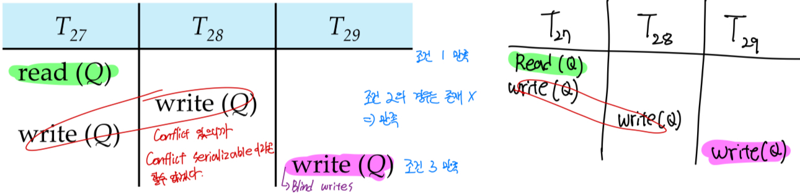
view serializable 한 경우

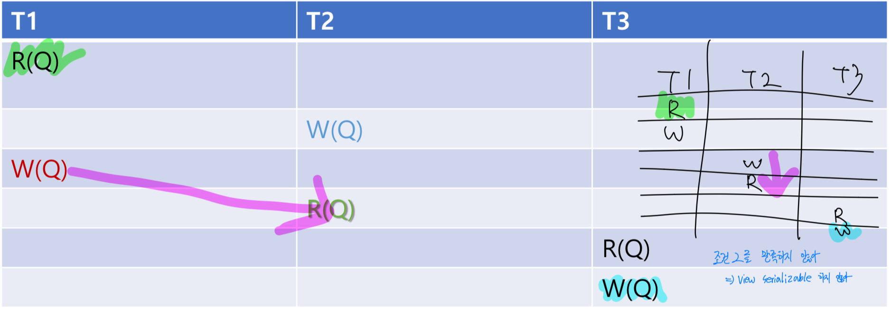
view serializable 하지 않은 경우

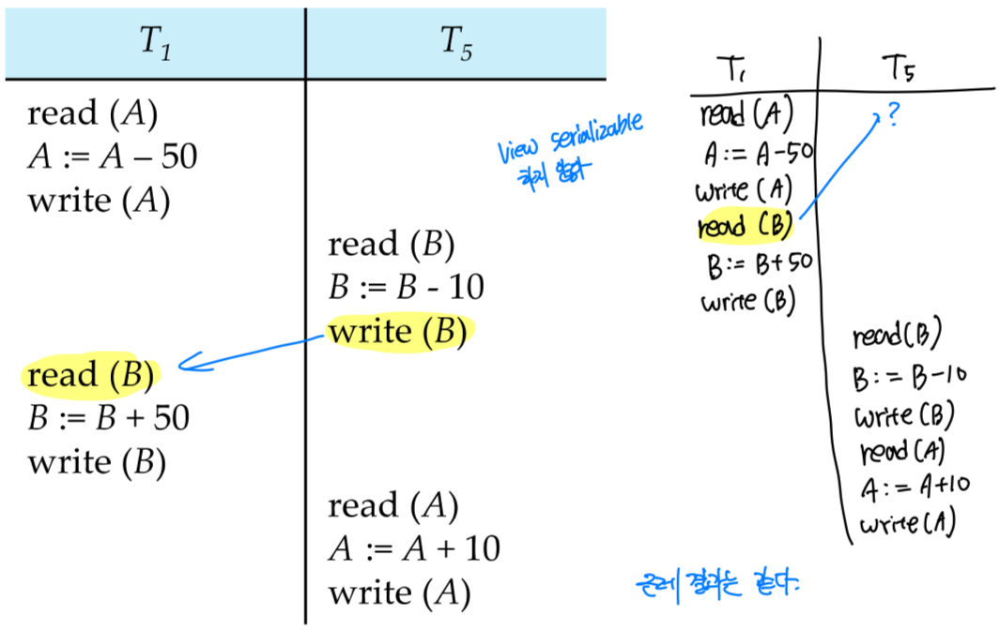
view serializable, conflict serializable 아니지만, 결과는 똑같아, 사칙연산과 같은 경우 결과가 같음을 따지려면 내부를 고려 해봐야 해

#### Blind Writes
전에 쓰기 연산을 했지만, 마지막 최종 연산에 의해 덮여쓰여지기 (보이지 않기) 때문에 무시되는 write
- View serializable인데 conflict serializable 하지 않은 schedule이라면 반드시 blind write를 가지고 있다. 

### Testing For Serializablity

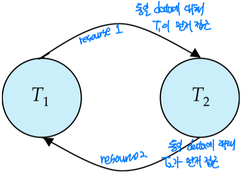
Serializability를 test하기 위해서 precedence를 사용할수 있다. 
- Ti로 부터 Tj 화살표를 그엇다면
- => Ti가 먼저 동일 resource에 대해 먼저 접근하였다. 

#### Test Conflict Serializability
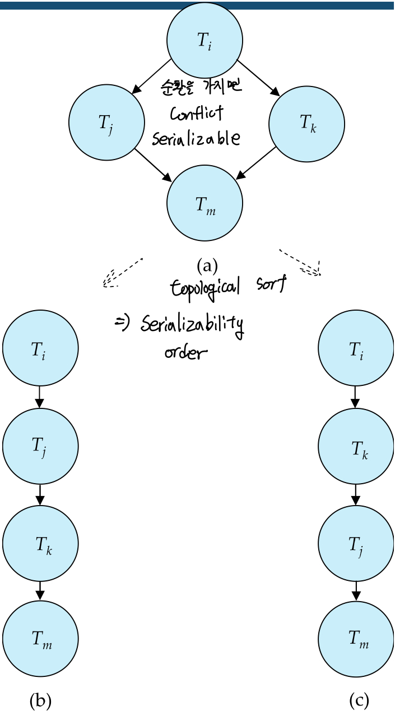
순환을 가지지 않는 다면, 이는 conflict serializable하다. 
- topological sort해서 나올수 있는 결과는 serializability order이다. 
 
#### Test View Serializability

NP-Complete 입니다. 너가 직접 따져보세용 ㅠ__ㅠ
 

요약
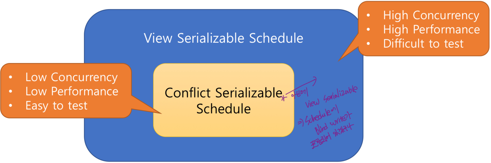

Recoverable & Cascading rollback
==

Recoveralbe Schedule
--
읽기-쓰기 의존 관계(read-from dependency)가 있는 두 트랜잭션 Ti -> Tj에 대해,
먼저 쓰기 주체 Ti가 커밋된 뒤에만 읽기 주체 Tj가 커밋될 수 있도록 보장하는 스케줄

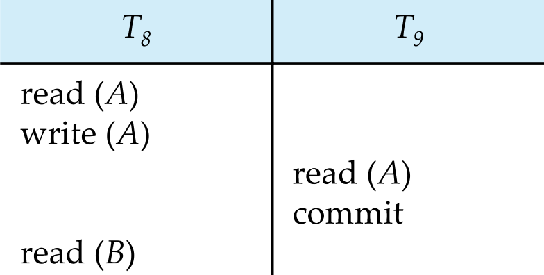
T9 commit 이후에 crash or abort가 발생해도 T9에서 commit을 해버랴서 rollback을 할수 없어

Cascading Rollback
--

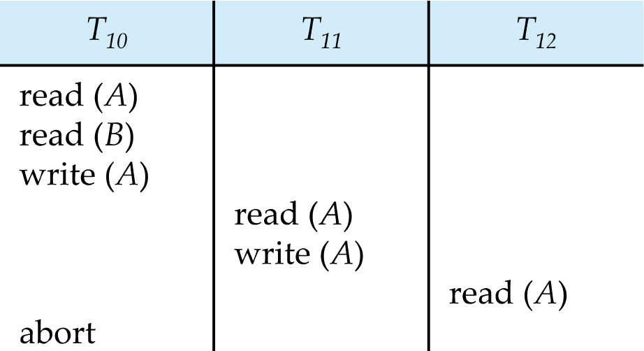
T10가 rollback된다면 T11, T12에서도 T10에서 write(A) data를 사용하기 때문에  
T10, T11, T12 모두 rollback 되어야 한다. 
- 이렇게 많은 overhead가 발생하는 cascading schedule쓰지 마라탕

### Cascadeless Schedule
- Read commited data only!
- Every Cascadeless schedule is also recoverable
