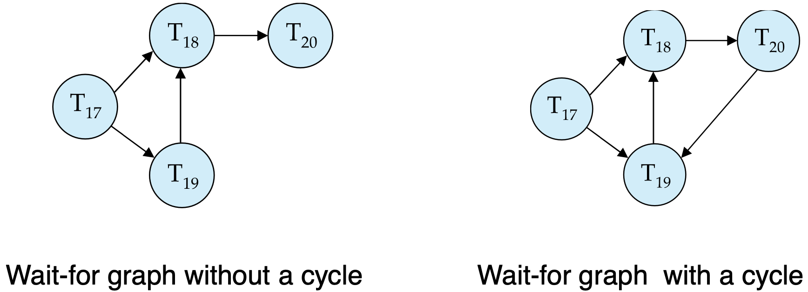
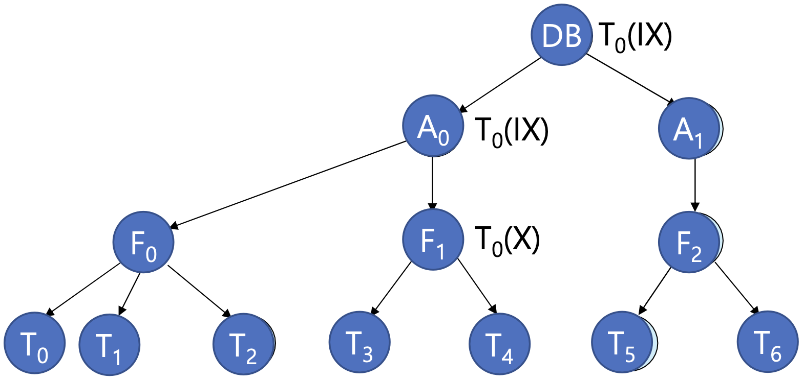
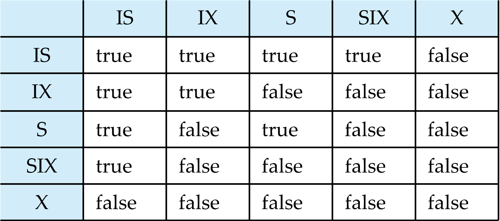
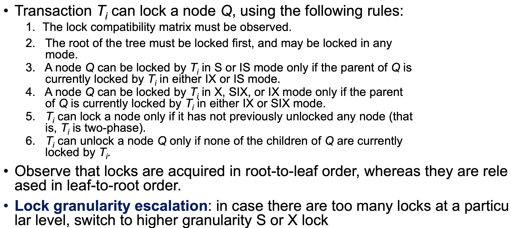
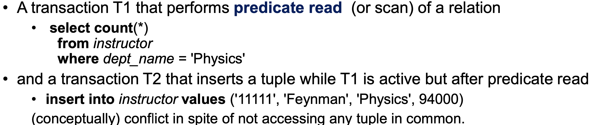
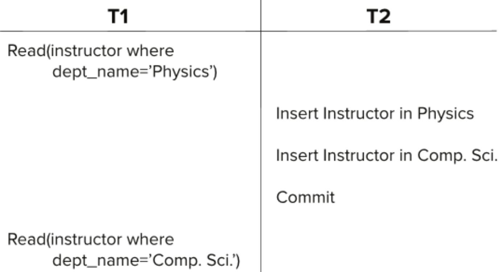
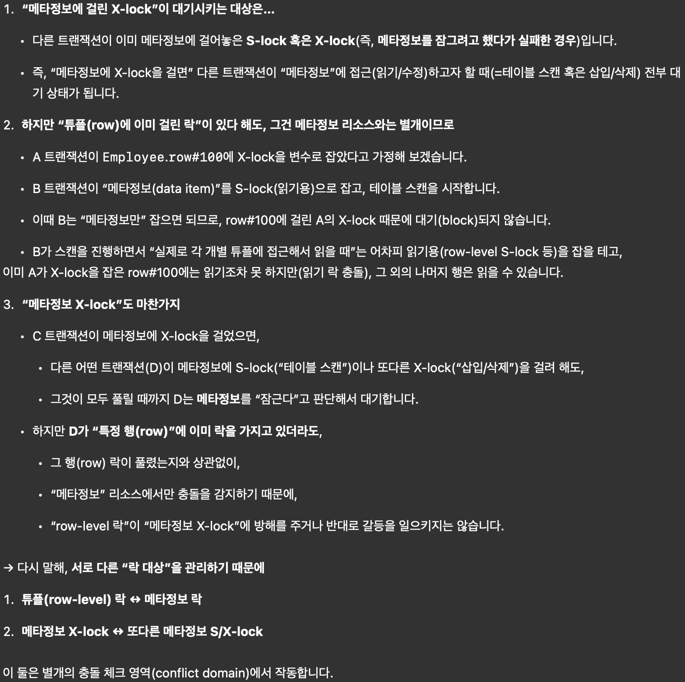
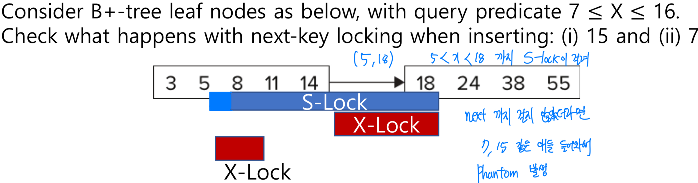

Handle Deadlock
==

4 Condition Of Deadlock
--

4개 중 하나라도 만족하지 않으면 이론적으로 deadlock은 생기지 않는다. 
1. Mutual Exclusion
2. Hold and Wait
3. No Preemption
4. Circular Wait

Deadlock Prevention
--
- **Predeclaration**: Lock all its data item before it begins execution
- **Graph-Based-Protocol**: Impose **partial ordering** of all data items
- **Wait die scheme**(non-preemptive, 늙은 애(먼저 시작된 transaction)를 기준으로 생각해): Older transaction이 데이터를 놔줄때까지 기다려
  - Younger transactions never wait for older ones; they are rolled back instead
  - A transaction may die several times before acquiring lock
- **Wound and wait**(preemptive): Older transaction이 younger transaction을 rollback(wound)시켜
  - Younger transaction이 older transaction을 기다려
  - Fewer rollbacks than wait-die scheme.
- **Time based scheme**: 정해진 시간 만큼만 waits for a lock, 시간을 넘어가면 rollback시켜
  - 근데 optimizing한 time interval을 찾기 힘들어
  - Starvation이 일어나기 쉬운 환경

wait-die, wound-wait 둘다 restarted with its **original timestamp**

Deadlock Detection
--

### Wait for graph

- Ti -> Tj: Ti가 Tj가 lock을 풀때까지 기다리고 있어
- **cycle => Deadlock**

Deadlock Recovery
--
Some transaction(a.k.a. **victim**) will have to **roll back**

- **Starvation can happen**: 같은 transaction이 계속해서 victim으로 선택되는 경우
  - One Solution: Oldest transaction은 **victim으로 선택되지 않게**

Multiple Granularity
--

- **Fine granularity**(lower in tree): high concurrency, high locking overhead
- **Coarse granularity**(higher in tree): low locking overhead, low concurrency

The levels, starting from the coarsest(top) level are
- database
- area
- file
- record

### Intention Lock Modes

#### Why Introduced
- Database를 변형하고 싶을때마다, 내가 원하는 애한테 끝까지 가서 check해 줘야해
  - 적용되는 자신뿐만 아니라 선조 노드에 **Intention Lock**이라는 걸 줘서 intention을 파악하게 만들자

- **Intention-shared**(IS): 내 밑에 있는 애들 중 shared lock이 걸려 있는 친구들이 있어
- **Intention-exclusive**(IX): 내 밑에 있는 애들 중, shared lock or exclusive lock이 걸려 있는 친구들이 있어
- **Shared and intention-exclusive**(SIX): 이 lock을 가지고 있는 애는 shared lock이 걸려있고 밑에 애들중에 intention-exclusive(IX)가 설린 친구들이 있어

> TL;DR
> - Ti can lock a node only if it has not previously unlocked any node (that
  is, Ti is two-phase).
> - Intention lock이 걸리지 않은 노드의 자식 노드에 non-intention lock을 거는 걸 혀용하지 않아
> - 만약 특정 level이 lock이 많이 걸린다면, X, S-lock (higher granularity)로 바꾸는 걸 고려해봐

Insert/Delete Operations & Predicate Reads(or Scan) & Phantom
==

- Tuple이 삭제되기 전에 exclusive lock이 걸려 있어야 해
- Transaction automatically given an X-lock on the tuple
- **Reads/writes conflict with deletes**
- Inserted tuple is **not accessible** by other transactions until the transaction that inserts the tuple **commits**

Phantom
--

- 튜플 단위 잠금만 걸면 “현재 실제로 존재하는 튜플”에 대한 잠금만 잡힘
- **미래에 삽입될 가능성이 있는 틈새(갭, gap)**는 잠금 X

serializable schedule에서는 impossible

### Handling Phantom

Fine granularity때문에 생기는 문제야 
#### Solution 1
1. table 전체에 대응하는 data item 하나를 만든다. (acquire lock for the meta data)
2. data item(table 전체)에 S-lock을 걸어
3. Insert/Delete 연산 하는 transaction은 data item(table 전체)에 X-lock을 걸게  (tuple 단위 락”과 “table 전체 meta data(data item) 락”은 서로 충돌하지 않는다(독립적이다))
- Very low concurrency for insertions/deletions

#### Index Locking Protocol (To Prevent Phantoms)

- 전제 조건: Every relation must have **at least one index**
- 데이터에 접근할 때는 반드시 인덱스를 거쳐야 한다. 
- Full table scan 방식으로는 제대로 동작하지 않는다. 
- 데이터를 읽는 transaction은 해당 data가 포함된(포함될 수 있는) 인덱스의 리프 노드에 S-lock 잠금
- Query에 대해서 **현재 그 범위에 데이터가 없더라도** 해당 인덱스 범위(리프 노드)에 잠금 -> **No phantom**
- Update or Delete
  - 해당 인덱스 리프 노드에 X-lock 설정
- 2 phase locking protocol의 규칙을 따라야 한다. 

#### Next-Key Locking (To Prevent Phantoms)

Index locking protocol에서는 해당 index를 가지고 있는 leaf 전체에 대해서 lock을 걸었는데  
just lock values that **satisfy index lookup**

- Lock **next key value** in index (사진에 이유)
- Lock mode
  - S-lock for lookups
  - X-lock for insert/delete/update

