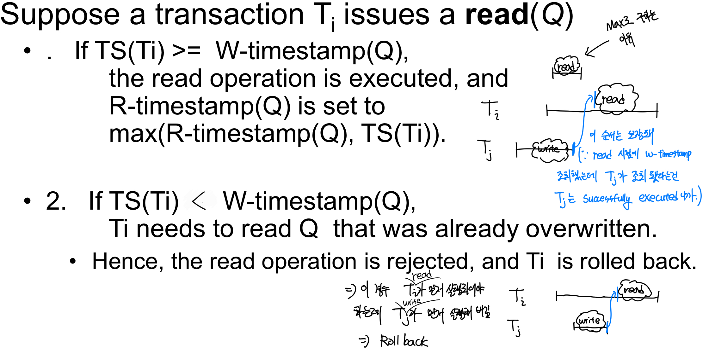
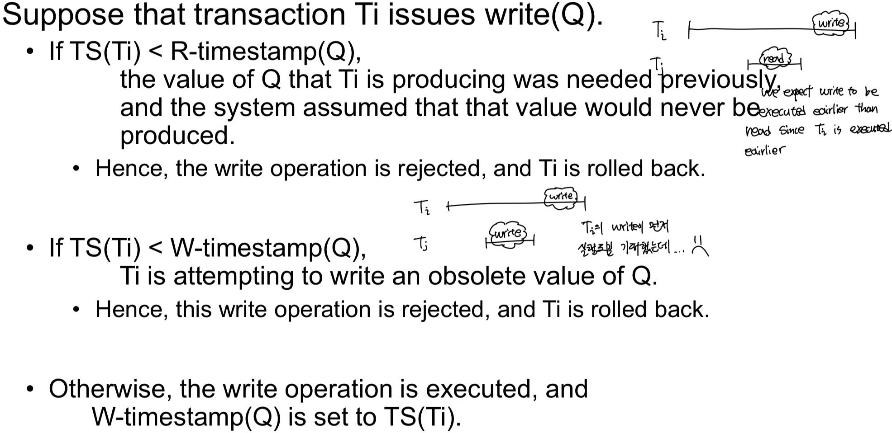
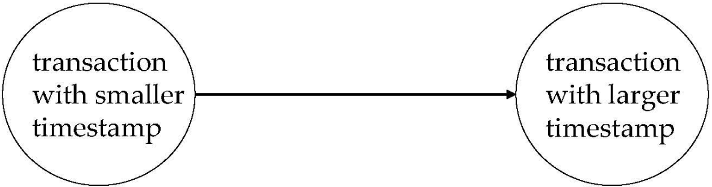
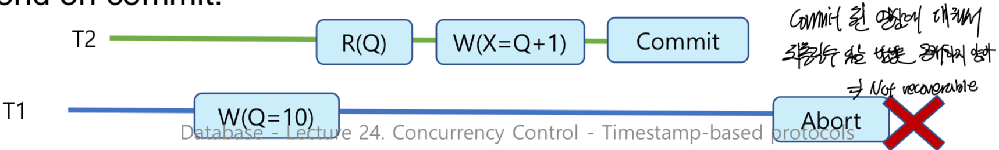

Timestamp Based Protocols
==

- Real time in not unique => No good for timestamp (그냥 특정시간부터 ++하는 counter 써)
- Newer transaction have timestamps greater than earlier ones
- **Timestamp order == Serializability order**

Timestamp Ordering Protocol
--

> Transaction에서 물리적으로 read/write이 실행될때 W-timestamp, R-timestamp를 확인 and update, 조건 따져보는 거임 

- Maintains 2 timestamp value for each data Q
  - **W-timestamp(Q)**: Q에 대한 write 연산 transaction 시간 기록 된것 중 가장 큰거
  - **R-timestamp(Q)**: Q에 대한 read 연산 transaction 시간 기록 된것 중 가장 큰거

- 다음 두 규칙을 지켜
  - Conflicting 연산의 경우 timestamp 순서대로 이루어져야 한다. 
  - Out of order로 operation(transaction 내에서 read, write 순서)이 실행 되면 causes rollback

Ti가 read(Q) 연산을 하는 경우
--

R-timestamp는 고려할 필요없어 b/c read연산한다고 다른 read연산의 결과가 바뀔 일은 없어

> Tj의 transaction이 끝났다는 것 까진 보장 안해줌, 해당의 transaction 내의 read or write연산이 끝났다는 것 까지만 보장

### TS(Ti) >= W-timestamp(Q)

R-timestamp(Q) = max(R-timestamp(Q), TS(Ti))

### TS(Ti) < W-timestamp(Q)

Transaction 순서대로 실행되지 않을수도 있는 경우야(T_i의 경우 실제 transation에서 read가 일어나는 시점까지 detail하게 고려하지 않아, 이미 논리적 모순 존재) => Roll back 

Ti가 write(Q) 연산을 하는 경우
--

> Tj의 transaction이 끝났다는 것 까진 보장 안해줌, 해당의 transaction 내의 read or write연산이 끝났다는 것 까지만 보장

 ppt에 예시는 니가 함 풀어봐

Correctness of Timestamp-Ordering Protocol
--

- Guarantees serializability (b/c graph가 사진과 같이 timestamp가 작은거에서 큰걸로 가니까 -> no cycles)
- Ensure no deadlock (b/c no transaction ever waits)
- Cascade free, recoverability를 보장하지는 않는다.

> **Commit dependency 없어서**
> 1. 커밋 되지 않은 데이터를 읽기 때문에 **Not Cascade‐Free**
> 2. 다른 transaction의 미커밋 쓰기를 읽고도 먼저 commit할 수 있어서 Recoverable하지 않을 수도 있다.

### Recoverability Ability And Cascade Freedom

#### Sol 1. 모든 Write를 Transaction 마지막에 몰아서 수행

- **TSO의 문제**: 트랜잭션 A가 아직 uncommitted data를 transaction B가 읽어 가는 순간, 나중에 A가 abort되면 B도 연쇄적으로 롤백해야 하는 Cascading Rollback 발생
- 모든 쓰기는 최종 커밋 시점까지 미루기 -> 아직 디스크(혹은 버퍼)에 쓰기는 단 한 번도 반영된 적 X -> B는 “사라진 A의 값을 읽어간” 상황 자체가 **원천적으로 불가능**

#### Sol 2. Commit 될 때까지 기다린 후 read

- 제한적인 lock만 추가”하여, 아직 커밋되지 않은 쓰기가 있는 데이터에 대해, 해당 쓰기가 커밋될 때까지 읽기를 멈추고 wait 하자
- B는 A의 **쓰기가 commit된 후** 에만 읽기를 수행 -> cascade free
- 다만 wait하기 때문에 **deadlock 존제** 가능성이 있다. 

#### Sol 3. Commit Dependency도 적용시키자

- 그래... 되면 좋지 근데 너무 복잡해 -> Overhead 너무 커

Thomas' Write Rule
--

Blind Write에 대해서는 rollback 시키지 않을게
- Higher concurrency
- Allow **view-serializable** schedules are **not conflict-serializable** 
