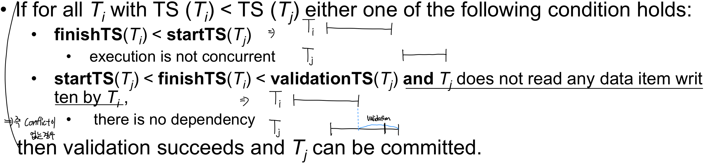
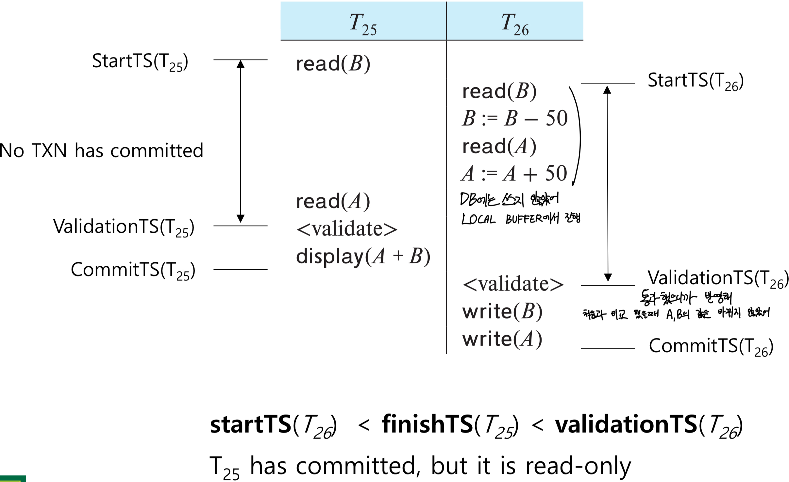
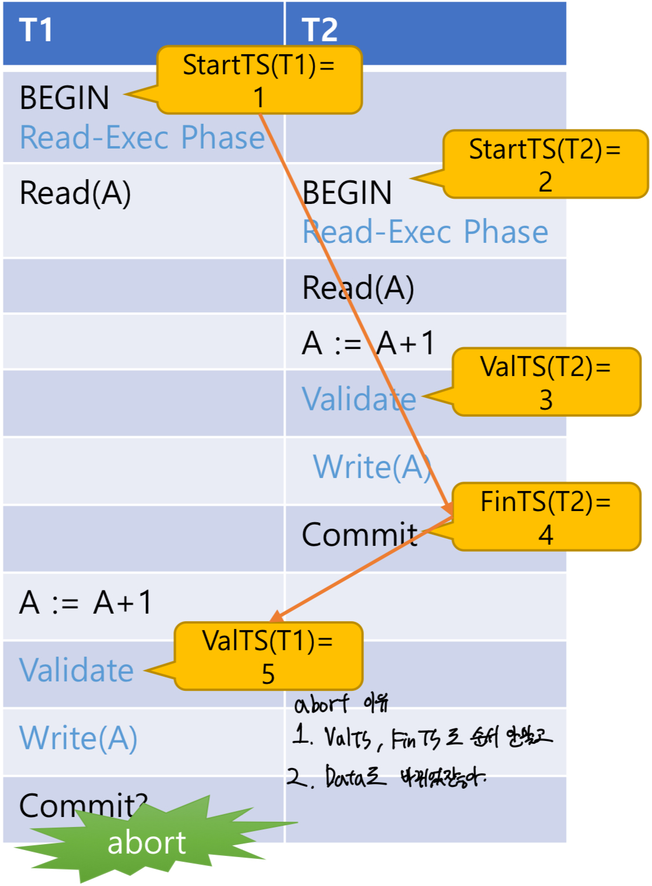

Validation-Based Protocol
==

Optimistic Concurrency Control (OCC)
--

희망찬 protocol, 일단 다 되겠지 생각하고 진행시켜, 우리는 **validate이랑 write연산이 Atomic하게 일어난가 가정할게~**

- Idea: Can we use **commit time as serialization order**?
- 다음과 같이 진행하자
  - Postpone writes to **end of transaction**
  - Keep track of data items read/written by transaction
  - Validation performed at commit time, detect any out of serialization order reads/writes
- Read에선 작동확률 good, Write에서는 validation fail 확률 up

- Execution of transactoin Ti is done in three phases.
  - **Read and execution phase**: Transaction Ti가 연산들을 자신의 **Local Memory (Not visible to other)** 
  - **Validation phase**: Transaction Ti performs a **validation test** to 확인해, local memory에서 한 연산을 database에 저장해도 될까?, Serializability가 보장이 되나?
  - **Write phase**: Database에 적용하기 아니면 roll back, 이제서야 남들에게도 visible

- Three timestamps
  - **StartTS**: Ti가 **execution을 시작한** 시간
  - **ValidationTS**: Ti가 **validation phase로 진입한** 시간
  - **FinishTS**: Ti가 **write phase를 끝낸** 시간

> 유효성 검증(validation) 시점을 트랜잭션의 **논리적 순서(TS)**로 삼는다. -> **Ensures Serializability** 

### Validation Test

이 외의 경우는 validation fail and Tj is aborted

e.g.1 

e.g.2

