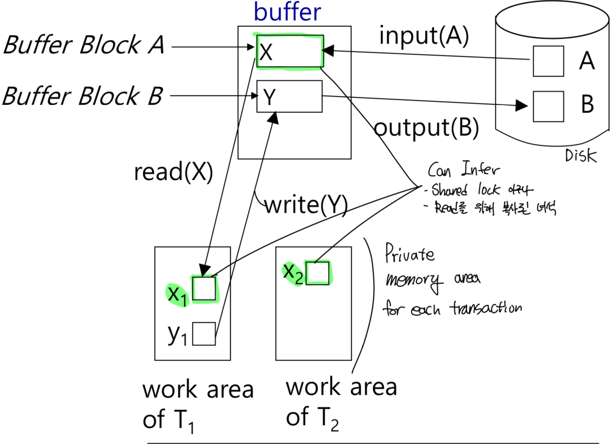
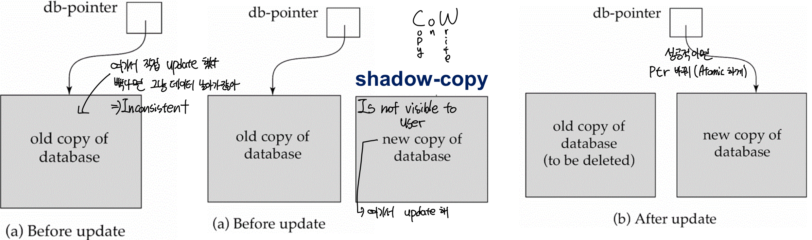
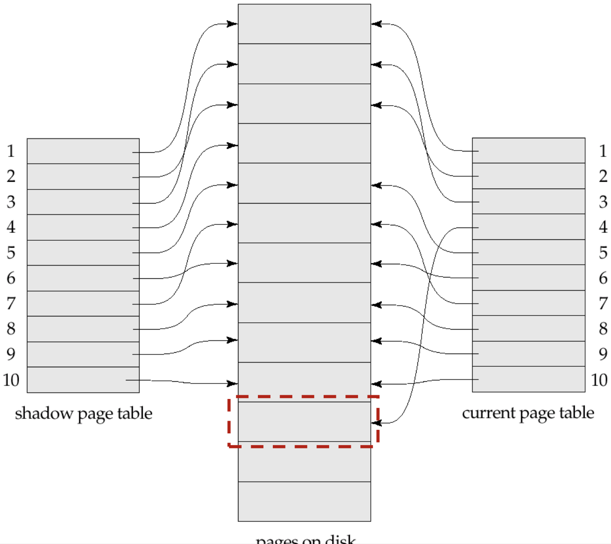
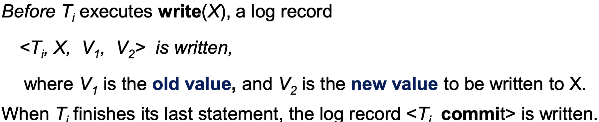
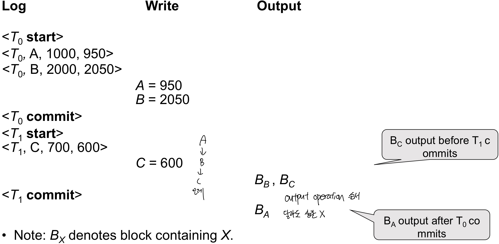
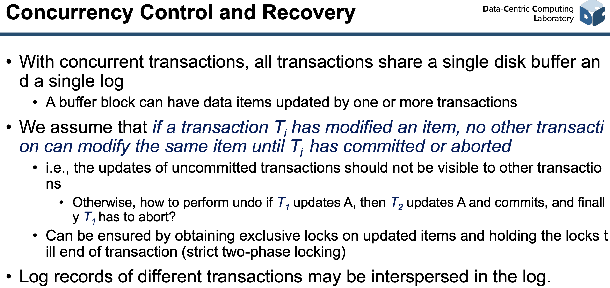
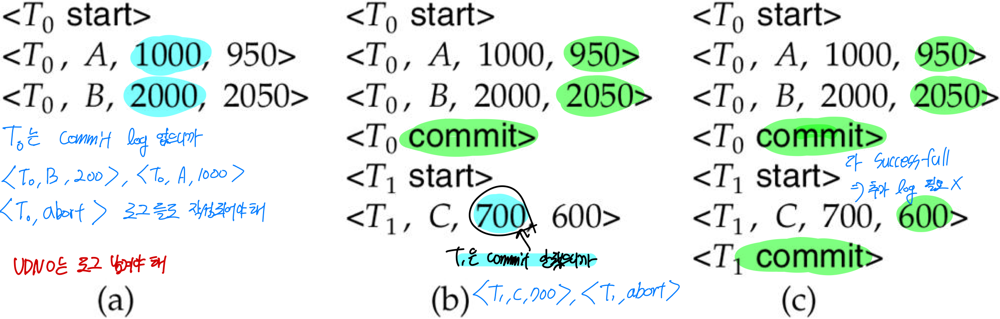
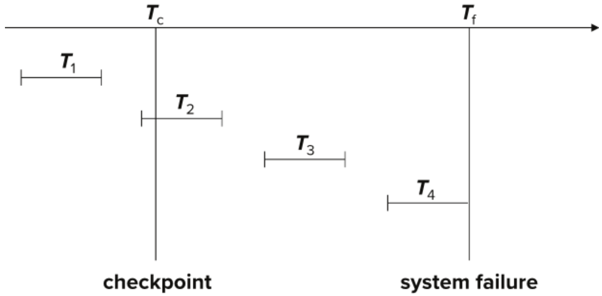

Recovery
==

Failure Classification
--

- **Transaction Failure** (Database한테는 문젠데, System 입장에선 큰 문제 x)
  - Logical errors: **Transaction cannot complete** due to some **internal** error condition 
  - System errors: Database가 must **terminate an active transaction** due to an error condition (e.g. deadlock)
- **System crash** ( We will focus on this): power failure or other hardware(얘는 distributed system 아닌 이상 우리가 손 쓸수 있는 방법 x) or software failure causes the **system to crash**
  - **Fail-stop assumption**: non-volatile storage contents are assumed **not to be corrupted** by system crash
    - Database systems have numerous integrity checks to prevent corruption of disk data
- **Disk failure**: 그냥 disk가 고장남... 어카누...
  - Disk drives use checksums to detect failures

Recovery Algorithm
--

Recovery algorithm는 두가지 파트로 나뉘어
1. Recovery에 필요한 정보 수집 -> Leads to additional overheads in transaction
2. 실제 정보들을 가지고 recovery하는 파트

> System Crash시 생길수 있는 시나리오
> - 모든 modification이 생기기 전에 failure occur
> - Non-atomic modifications result in inconsistent DB
> - DB상에는 commit이 발생했다 하는데 사실 DB는 update 된것이 아닌 경우 (그냥 그 transaction 통으로 날아감)

Data Access (요번 파트에서 쓸 용어 정리)
--

For simplicity, 각 Data가 single block에 들어간다 가정하

- **Physical Block**: Disk에 있는 block
- **Buffer Block**: Main memory에 (temporarily)올라와 있는 block
---
Disk와 main memory(buffer) 사이 연산 (Private work area랑 별개로 생각해)
- **input(B)**: transfers blocks **physical disk --to-> main memory**
- **output(B)**: **memory buffer --to-> physical disk)** 두 연산 모두 memory 기준이네
---
System buffer block과 private work area사이의 연산
- **read(X)**: assigns the value of data item X to the local variable xi
- **write(X)**: assigns the value of data local variable xi to data item {X} in the buffer block
> write(X) 한다고 disk에 바로 적용되는 게 아니야!!
> - 그 buffer block에 대한 **ouput** operation이 행해져야 disk에 기록된다. 
> (요번 단원에서 하는 가정)

Recovery Method (and Atomicity)
==

Failure가 나더라도 Atomicity를 보장하게 해줘야 해

Shadow Copy
--

**데이터 베이스 전체를 복사**하고 복사본에가 update를 시도하자! 돌아갈 곳은 있어야지!!

Shadow Paging
--

> 근데 database 전체 copy는 overhead가 너무 크다!  
> **Page table**만 복사하자

- 원본 page table을 복사한 Shadow Table을 Back up으로 써
- Page 원본을 update 하지않고 page의 복사본을 만들고 그곳에서 update를 진행시켜
- 메인메모리상의 수정된 모든 페이지를 디스크에 flush
- Current Page Table 전체를 디스크에 기록
  - => Page를 쓰다가 뻑나도 back up O.K 입니다. (찡긋)
  - => Page table을 수정하다가 뻑나도 back up O.K 입니다. (찡긋)
- 원본 복사하고 Shadow page table에 ptr 위치시켜
  - 성공: update된 page table을 가리키게 해
  - 실패: 그냥 놔둬

Page 4에 대한 예제
---
**장점** 
- Log 안 남겨도 되서 no overhead for that
- Recovery가 쉽다.
**단점**
- Page table 전체를 복사 -> expensive (what if it has million pages)
- Commit overhead
  - Need to flush every updated page, and page table
- Data gets fragmented (새로운 page에다가 복사해서 쓰기 하니까)
- temp data들 만드니까 gc 해야해
- Low concurrency

Log Based Recovery
--

- Log: Sequence of log **records**
  - kept on stable(비휘발성) storage
  - logs **cannot be overwritten**
- 아래와 같은 표기법으로 표기할게
  - <Ti **start**> log record

Log를 사용할때 2가지 approach 방법이 있어
- **Immediate database modification**
- Deferred database modification

### Transaction Commit

Transaction의 log가 stable storage에 저장되기만 하면 commit 된거라 친다. 
- All previous log records of the transaction must have been output already
- 실제 data가 disk에 기록 되는 시점은 상관없어 (log로 recover하면 되는데 ㅋ)

### Immediate Modification, Differed Modification

- 로그 기반 복구 + 즉시 갱신(immediate-modification)
- 트랜잭션이 쓰기를 하면
  1. 먼저 로그를 비휘발성 스토리지에 기록(WAL)
  2. 즉시 데이터페이지를 업데이트
- 장애 복구 시 undo/redo 로그로 일관성을 복원
- 반드시 로그가 필요
---
- 섀도우 페이징(Shadow Paging) 같은 지연 갱신(deferred-modification)
- 트랜잭션 동안에는 메모리에서만 복사본을 고치고,
- 커밋 시에만 페이지 전체를 한꺼번에 덮어쓰듯 반영
- 복구 시에는 섀도우 페이지 테이블만 읽어 들이면 끝
- 로그가 전혀 필요 없거나 매우 제한적으로만 사용
- but has an overhead of storing local copy

어쩌라고...ㅋㅋㅋ 일단 skip~

### Undo and Redo Operation
**undo(Ti)** 
- Transaction i를 수행하기 전으로 값들을 restore 해줘
- Each time a data item is restored to its old value V a special log record <Ti, X, V> is written out
- When undo of a transaction is complete, a log record <Ti> is written out.

**redo(Ti)**
- Ti가 수정한 new values들로 수정해
- sets the value of all data items updated by Ti to the new values, going forward from the first log record for Ti
- redo의 경우는 undo와 다르게 따로 logging 하지 않아 

### Recovering From Failure

Fail하고 recovering하는 상황일때
- Ti가 **undone** 돼야 하는 경우
  - Contains <Ti start>
  - and **NO** <Ti commit> or <Ti abort> (저거 2개는 가지면 안된다고) (**Commit 되기전**에 failure잖아 이 상태면)

- Ti가 **redone** 돼야 하는 경우 
  - Contains <Ti start>
  - and <Ti commit> or <Ti abort> (**Commit 된후**에 failure 잖아 이 상태면)

예시

왜 이미 abort되어 되돌렸던 트랜잭션도 다시 redo해 (a.k.a Repeating History)?
- 시간 낭비처럼 보일수도 있는데
- 단순하고 오류 가능성이 낮어!

### Checkpoints

Log 한 무더기 인데 이걸 전부 다 다시할수 없잖아... Checkpoint를 만들자  
> Checkpoint 만들기
> 1. 일단 지금 가지고 있는 모든 data들 다 stable storage로 옮기자
> 2. <**checkpoint** L> log를 stable storage에 찍어
> 3. Checkpointing 할때는 어떤 update도 진행되면 안돼

- Recovery 할때 가장 최근 checkpoint 뒤에 있는건 무시해도 돼
- Some earlier part of the log may be needed for undo operations
  - Checkpoint 쓴다고 해도 log들 삭제하지 마!
> 트랜잭션 T3 가 체크포인트 전에 시작되어, 
> 체크포인트 이후에 abort 되었거나 커밋 못 한 채 장애가 났다면, 
> T3 가 덮어쓴 필드들의 원래 값을 담은 로그 레코드는 체크포인트 바로 다음에 있지 않고, 
> “T3 start” 이전, 즉 체크포인트 이전 로그 어딘가에 분산되어 있을 수 있다.

예시

- T1은 checkpoint전에 commit 되었다 -> **무시해**
- T2, T3는 system failure 전에 commit 성공 -> **redo**
- T4은 commit 되지 못하고 system failure 발생 -> **undone**
