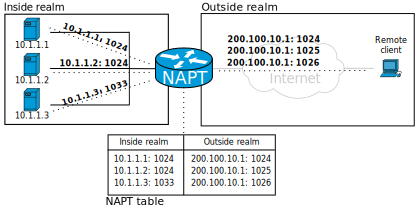
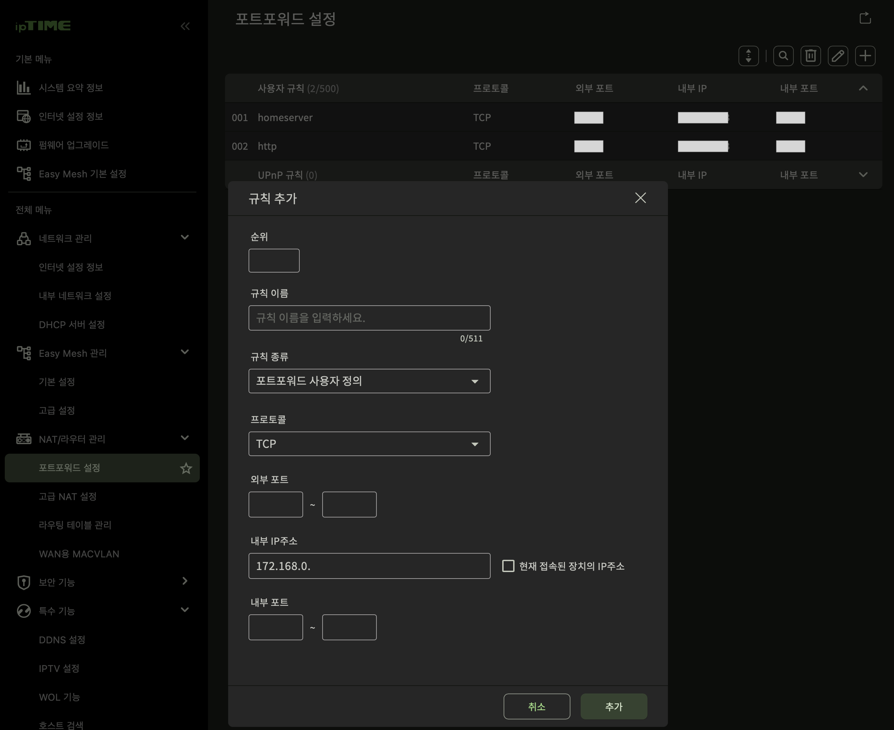
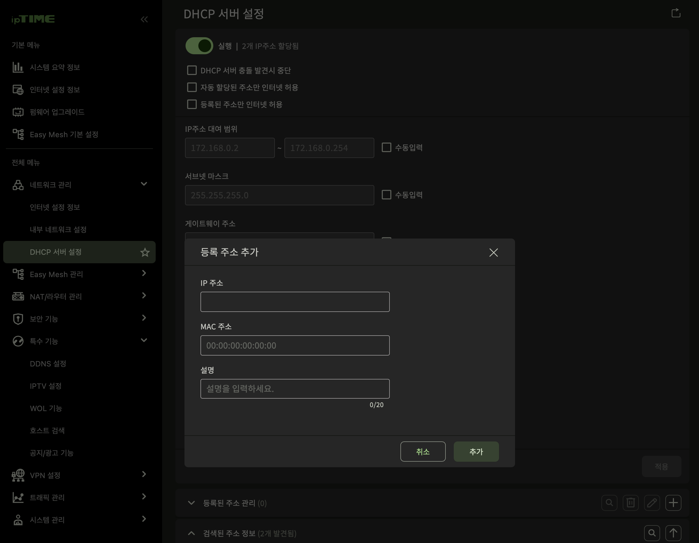
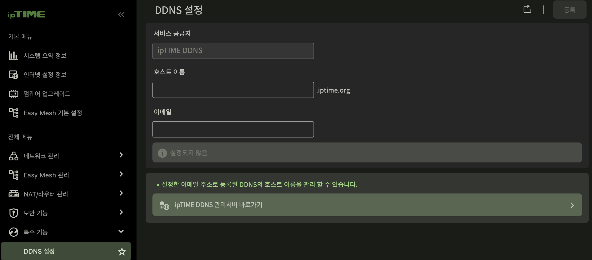
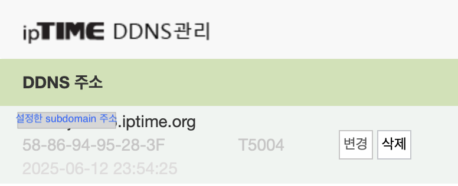
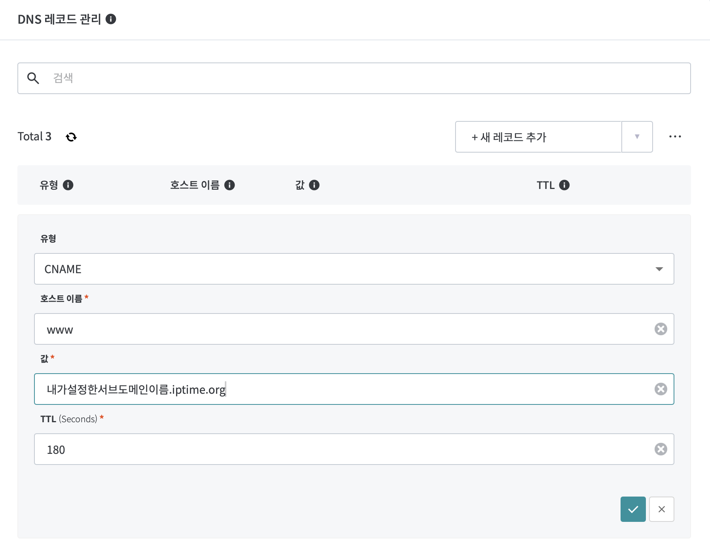

'Home'이라 생기는 문제
==
1. 내 서버는 공유기가 뿌려주는 private ip를 할당 받아 어떻게 내부로 접속하지-> **포트 포워딩**으로 해결
2. 공유기가 내 서버로 할당해주는 ip의 주소가 바뀐다면? -> **DHCP 고정 할당**로 해결
3. ISP(e.g. SKT, KT, LG)가 우리 집으로 할당해주는 public ip의 주소가 바뀐다면? -> **DDNS**로 해결

포트 포워딩
--

public IP로 들어온 packet을 보고 그에 맞는 private ip로 포워딩 해주겠다는 것이다. 

image from wikpedia

NAT의 개념과 거의 비슷한데, **NAPT**라고 NAT이 단순 ip만 변환해 주었다면 NAPT는 **port**까지 변화해준다.  
이로써 public IP로 들어온 요청을 내가 원하는 서버로 넘겨 받을수 있게 된다.
 
포트포워딩은 다음 화면에서 설정한다. 

DHCP 고정 할당
--

172.168.1.1에서 서버가 돌아간다, 포트 포워딩을 했다고 가정하자  
이 상황에서 내 router(공유기)가 다른 ip 주소(private)를 내 서버에 할당하면 내가 의도한 홈 서버가 아닌 다른 이상한 기기로 포워딩 할것이다. 
이를 방지하기 위해 **DHCP 고정 할당**을 설정 하자
- **DHCP**: 컴퓨터 네트워크를 들었다면 알겠지만, 라우터가 기기에게 ip를 할당해주는 protocol이다.
- **DHCP 고정 할당**: router에 MAC주소 정보를 저장해놔서 특정 MAC주소를 가진 기기에는 특정한 ip를 부여하게 하는 것이다.

iptime 공유기의 관리자 화면인데 다음과 같이 MAC주소와 할당할 ip주소를 저장하면 그 기기에는 같은 ip만 할당한다.  
이로써 내부 ip가 바뀌는 경우를 방지 할수 있다. 

DDNS (Dynamic DNS)
--

DNS의 A record에 내 public ip를 등록해 놓았는데 내 public ip가 바뀌는 경우 문제가 생길 것이다. 이를 해결하기 위해 DDNS service를 이용하자  
DDNS를 설정하면 1) ddns제공업체의 subdomain을 주는 경우도 있고 2) ddns 제공업체의 nameserver을 주는 경우가 있는데 iptime ddns 서비스의 경우 1) 이다.
2)의 경우 도메인을 산 사이트에서 네임서버 설정을 이것으로 변경하여 도메인 관리 권한 전체를 DDNS 업체에 위임하면 성공적으로 DDNS 서비스를 제공 받을수 있다. 

### DDNS Client

집에 있는 공유기나 PC에 설치된 DDNS 클라이언트가 주기적으로 자신의 공인 IP 주소를 확인한다. 나의 경우 iptime 공유기 이다. 
IP주소에 변경이 감지되면 DDNS Server에 요청을 보낸다. 

### DDNS Server

서버에서도 특정 url에 대해 기존이 아닌 바뀐(새로운) ip로 요청을 보내도록 record를 수정한다. 

### Iptime에서 subdomin으로 DDNS 설정하기

그림과 같이 아주 간단하게 DDNS를 설정할수 있다. 
호스트 이름이 우리가 사용할 서브 도메인의 주소가 된다.

성공적으로 등록이 되면 다음과 같은 화면을 볼수 있을것이다!  
이를 DNS에 CNAME record로 등록시켜, 내가 산 도메인 주소로 들어오면 위 주소로 들어오게 만들자!!

> DNS A Record는 고정 ip를 설정하는 애라 value 값으로 url이 들어올수 없어!  
> CNAME으로 등록해야 한다.  
> CNAME으로 설정하려는 바로 그 호스트 이름의 A 레코드는 꼭 지워줘!! (호스트 이름이 중복될수 없다.)

다음과 같이 CNAME을 설정하고 (+ 호스트 이름에 @) 등록하면 all set!  
**같은 호스트 이름으로 되어있는 다른 Record들이 존재한다면 꼭 삭제하자!!**
