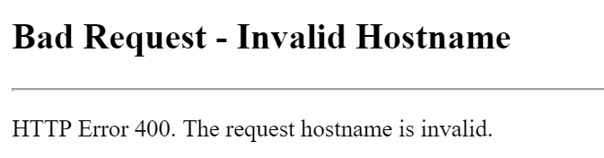

IP Crash
==

Situation
--

기존 ISP router를 무선으로 연결한 상태에서 새로 산 iptime router에 유선으로 연결 하였다. (ISP router은 80에 대한 port forwarding을 허용하지 않아...)  
무선 연결을 한후, iptime 관리자 page에 들어가려 하니 다음과 같이 400 error가 발생하였다;;;;

Why?
--

