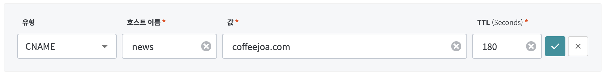
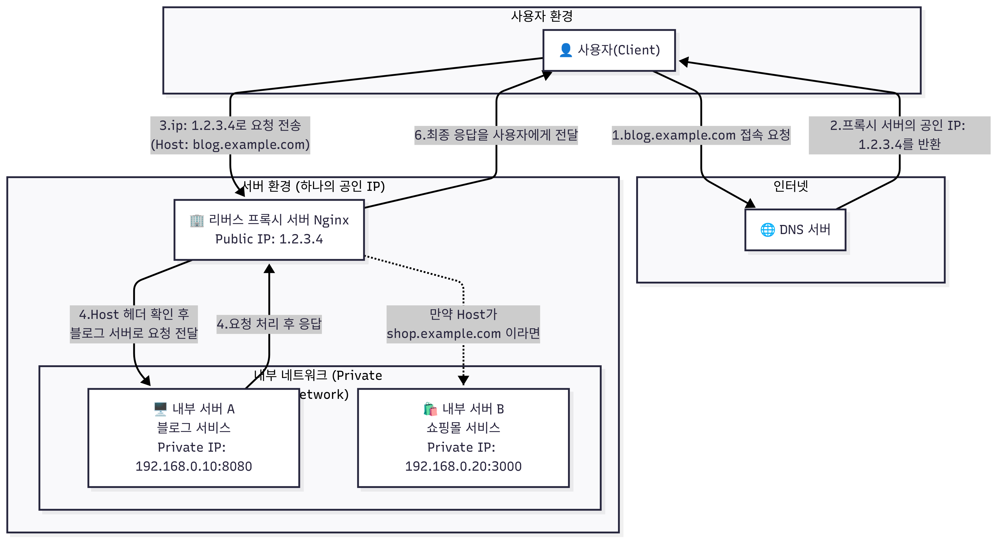

Reverse Proxy
==


pic from cloudflare

Client의 요청을 대신 받아 내부 서버롤 전달해주는 서버

왜 Reverse proxy를 사용할까?
--

1. **Load Balancing** 문서를 참고하세용<br>
https://docs.nginx.com/nginx/admin-guide/load-balancer/http-load-balancer/

2. **SSL/TLS 암호화 처리**를 Reverse Proxy에서 책임지게 할수 있어 -> 서버 부담 줄어듬

3. **내부 IP, Port 숨김** -> 보안 up

4. **포트포워딩 최소화** -> 열어야 하는 포트의 갯수를 최소한으로 할수 있어 -> 보안 up(e.g. port scanning)

5. sub-domain이랑 같이 활용 -> **하나의 public ip로 여러개의 서비스, 어플리케이션을 효율적으로 관리** 가능 <br>
e.g. service1.coffeejoa.com, service2.coffeejoa.com

6. 그 외에도 캐싱, 무중단 배포(e.g. blue-green deployment, rolling, canary)를 위해 사용된다. 

Nginx 설정
--

```yaml
# 서버 블록 1
server {
    listen 80;
    server_name blog.example.com;

    location / {
        # 프록시로 전달할 내부 서버 주소
        proxy_pass http://192.168.0.10:8080;

        # 클라이언트의 실제 IP와 호스트 정보를 백엔드 서버로 전달하기 위한 헤더 설정
        proxy_set_header Host $host;
        proxy_set_header X-Real-IP $remote_addr;
        proxy_set_header X-Forwarded-For $proxy_add_x_forwarded_for;
        proxy_set_header X-Forwarded-Proto $scheme;
    }
}

# 서버 블록 2
server {
    listen 80;
    server_name shop.example.com;

    # 모든 location block에 대해 공통으로 적용된다. 
    proxy_set_header Host $host;
    proxy_set_header X-Real-IP $remote_addr;
    proxy_set_header X-Forwarded-For $proxy_add_x_forwarded_for;
    proxy_set_header X-Forwarded-Proto $scheme;
  
    # Location block을 여러개 둬서 path에 따라 다르게 처리 할수도 있다.  
    location / {
        proxy_pass http://192.168.0.20:3000;
    }
    location /news/ {
        proxy_pass http://192.168.39.208:31957;
    }
}
```

### server block

특정 도메인이나 IP주소로 들어오는 요청을 어떻게 처리할지 정의하는 **설정의 기본 단위**

- **listen**: 어떤 port번호에서 들오는 요청을 받을지 지정
- **server_name**: listen으로 지정된 포트의 요청에 대해서, 어떤 **도메인 이름**에 해당 하는 요청을 처리할까? 지정
- **location**: 요청된 경로에 대해 구체적인 처리방법 정의

DNS - CNAME 설정
--



다음과 같이 설정하면 news.coffeejoa.com으로 오는 요청을 coffeejoa.com으로 보내라는 의미 입니다!
<br> 그러면 nginx에서 news.coffeejoa.com을 보고 올바른 곳으로 넘겨 주겠지~

Flow
--


