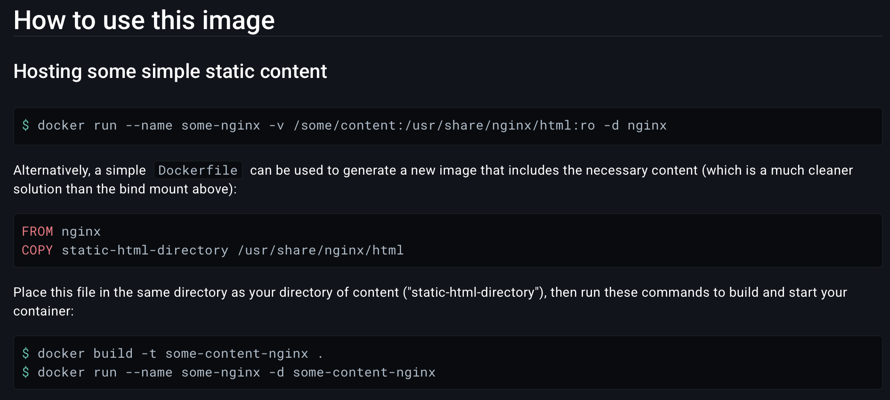
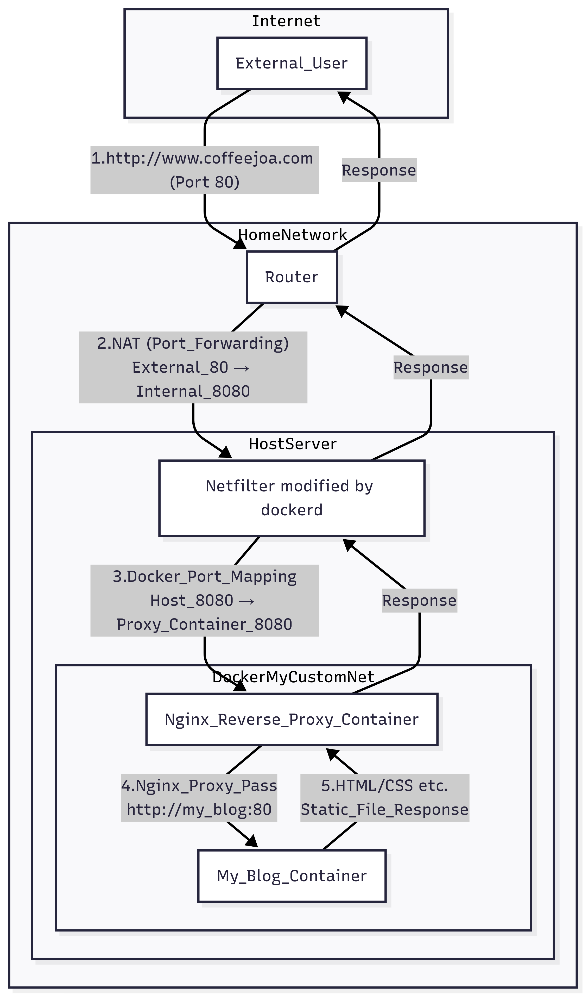

Github Action 설정
==

기존(기본) 파일
``` yaml
name: "Build and Deploy"
on:
  push:
    branches:
      - main
      - master
    paths-ignore:
      - .gitignore
      - README.md
      - LICENSE

  # Allows you to run this workflow manually from the Actions tab
  workflow_dispatch:

permissions:
  contents: read
  pages: write
  id-token: write

# Allow one concurrent deployment
concurrency:
  group: "pages"
  cancel-in-progress: true

jobs:
  build:
    runs-on: ubuntu-latest

    steps:
      - name: Checkout
        uses: actions/checkout@v4
        with:
          fetch-depth: 0
          # submodules: true
          # If using the 'assets' git submodule from Chirpy Starter, uncomment above
          # (See: https://github.com/cotes2020/chirpy-starter/tree/main/assets)

      - name: Setup Pages
        id: pages
        uses: actions/configure-pages@v4

      - name: Setup Ruby
        uses: ruby/setup-ruby@v1
        with:
          ruby-version: 3.3
          bundler-cache: true

      - name: Build site
        run: bundle exec jekyll b -d "_site${{ steps.pages.outputs.base_path }}"
        env:
          JEKYLL_ENV: "production"

      - name: Test site
        run: |
          bundle exec htmlproofer _site \
            \-\-disable-external \
            \-\-ignore-urls "/^http:\/\/127.0.0.1/,/^http:\/\/0.0.0.0/,/^http:\/\/localhost/"

      - name: Upload site artifact
        uses: actions/upload-pages-artifact@v3
        with:
          path: "_site${{ steps.pages.outputs.base_path }}"

  deploy:
    environment:
      name: github-pages
      url: ${{ steps.deployment.outputs.page_url }}
    runs-on: ubuntu-latest
    needs: build
    steps:
      - name: Deploy to GitHub Pages
        id: deployment
        uses: actions/deploy-pages@v4
```

기존 deploy를 내 서버로 deploy하게 다음과 같이 수정하자
``` yaml
      - name: Log in to Docker Hub
        uses: docker/login-action@v2
        with:
          username: ${{ secrets.DOCKER_USERNAME }}
          password: ${{ secrets.DOCKER_PASSWORD }}
      
      - name: Build & Push
        uses: docker/build-push-action@v4
        with:
          context: .
          file: docker/Dockerfile
          platforms: linux/amd64
          push: true
          tags: ${{ secrets.DOCKER_REPO }}
          build-args: |
            HOST_FILES=_site${{ steps.pages.outputs.base_path }}/

      - name: Deploy to server
        uses: appleboy/ssh-action@master
        id: deploy
        with:
          host: ${{ secrets.HOST }}
          username: tony
          port: 1203  # ssh 포트번호 (따로 안 건들였다면 22)
          key: ${{ secrets.KEY }}
          envs: GITHUB_SHA
          script: |
            sudo docker login -u ${{ secrets.DOCKER_USERNAME }} -p ${{ secrets.DOCKER_PASSWORD }}
            # 기존 컨테이너와 이미지를 정리
            docker stop my_blog
            docker rm my_blog
            docker rmi ${{ secrets.DOCKER_REPO }}
            # 새로운 이미지 풀 및 실행
            docker pull ${{ secrets.DOCKER_REPO }}
            docker run --name my_blog --network docker_my-custom-net -d ${{ secrets.DOCKER_REPO }}
```
- **my_blog**를 container 이름으로 하였다. 
- Dockerfile을 만들어 container로 배포하게하자! (docker hub 활용)
- Container로 reverse proxy가 올라가 있으니 network 설정을 꼭 건들여주자! (파일의 마지막 라인)

``` Dockerfile
FROM nginx

ARG HOST_FILES
COPY ${HOST_FILES} /usr/share/nginx/html
```
- Project를 빌드하면 static site가 생성된다. 
- static content가 위치해야하는 경로에 build된 파일을 복사하자. 


https://hub.docker.com/_/nginx

⭐ Port 설정
--

나는 reverse proxy를 쓰니까 reverse proxy에서 해당 서버로 요청을 연결해줘야 한다. <br>
우선 reverse proxy의 docker-compose 파일을 보자 
> **주의**
> - 저는 router port forwarding으로 `외부 80 -> 내부 8080`으로 설정해 놓았습니다.
> - 이 container는 8080이 열려있고 host OS에 8080 요청이 들어오면 해당 container의 8080으로 port forwarding 됩니다. 

``` yaml
⫸  cat docker-compose.yml
---
networks:
  my-custom-net:
    driver: bridge

services:
  nginx:
    container_name: nginx-reverse- proxy
    image: nginx:latest
    volumes:
      - ./conf/nginx.conf:/etc/nginx/nginx.conf
        # - ./data/certbot/conf:/etc/letsencrypt  이 2개는 추후에 https를 연결할때 마운트할 예정
        # - ./data/certbot/www:/var/www/certbot
    ports:
      - "8080:8080"
    networks:
      - my-custom-net
    command: "/bin/sh -c 'while :; do sleep 6h & wait $${!};  # 얘도 인증서 갱신 자동화 때문에 필요한 명령
      \ nginx -s reload; done & nginx -g \"daemon off;\"'"
```

- my-custom-net이라는 bridge network에서 작동하고 있다. 
- -> workflow 파일을 보니 network option으로 해당 network에 연결하게 해놨으니 문제 없다!

이제 nginx.conf 파일을 수정해 coffeejoa.com으로 요청이 들어오면 my_blog 컨테이너로 안내하게 하자!

``` yaml
⫸  cat conf/nginx.conf
events {
    worker_connections  1024;
}

http {
        server {
                listen 8080;
                server_name www.coffeejoa.com;

                proxy_set_header Host $host;
                proxy_set_header X-Real-IP $remote_addr;
                proxy_set_header X-Forwarded-For $proxy_add_x_forwarded_for;

                location / {  # www.coffeejoa.com:8080 뒤에는 아무거나 와도 다 넘기라는 의미
                        proxy_pass http://my_blog:80;
                }
        }
}
```
- 이 server block은 www.coffeejoa.com:8080 으로 요청이 들어오면 http://my_blog:80 으로 넘기라는 의미다.
- reverse proxy는 docker_my-sutom-net라는 custom bridge network에 연결되어 있으니 컨테이너 이름으로 통신 가능! (automatic DNS resolution)
  - 해당 네트워크에서 http://my_blog:80로 넘긴다는 뜻이다!
  - docker network 관련은 뒤에서 부연 설명~
- 따로 설정파일을 만들어서 적용하지 않은 경우 nginx는 static web hosting에 80포트를 사용한다. 

전체 흐름
--



> **Docker의 DNAT**
> 1. `ports: - "8080:8080"` 설정을 포함하여 컨테이너 생성을 요청하면, 도커 엔진은 iptables 유틸리티를 호출하여 리눅스 커널의 Netfilter 서브시스템에 특정 규칙을 등록
>    - 규칙 등록 작업은 컨테이너가 시작되는 시점에 단 한 번 일어난다. 규칙이 설정된 후, 도커 엔진은 실시간으로 네트워크 패킷을 감시하거나 직접 처리 x. 자신의 임무(규칙 설정)를 커널에 위임
> 2. Netfilter는 리눅스 커널 내부에 내장된 패킷 처리 프레임워크. 네트워크 인터페이스에 들어오고 나가는 모든 패킷은 이 프레임워크를 거친다.
> 3. 외부에서 호스트의 8080 포트로 TCP 패킷이 도착하면, 패킷은 하드웨어(NIC)를 거쳐 커널의 네트워크 스택으로 들어온다
> 4. 패킷은 Netfilter의 PREROUTING 체인을 통과하면서, 이전에 도커 엔진이 등록해 둔 DNAT(Destination Network Address Translation) 규칙에 따라 패킷의 목적지가 수정된다. 
> 
> 참고: https://docs.docker.com/engine/network/packet-filtering-firewalls/
> <br> netfilter에 대해 더 알고 싶으면: https://www.netfilter.org/documentation/HOWTO/NAT-HOWTO.html

Docker Network
==

컨테이너들이 서로, 그리고 외부 세계와 통신할 수 있도록 만들어주는 가상 네트워크 <br>
컨테이너는 격리된 환경에서 실행되기 때문에, 명시적으로 네트워크를 설정하지 않으면 다른 컨테이너나 호스트와 통신할 수 없다.

Bridge
--

가장 일반적인 네트워크 유형, 컨테이너를 생성할 때 네트워크를 별도로 지정하지 않으면 기본적으로 `bridge`라는 docker 설치시 자동으로 생성되는 브리지 네트워크에 연결된다. 
- 같은 bridge 네트워크에 속한 컨테이너들은 서로의 IP 주소를 통해 통신할수있다. (사용자가 새로만든 bridge network의 경우 automatic DNS resolution이 되어 컨테이너 이름으로 통신 가능!)

> User-defined bridge와 default bridge의 차이점
> - 컨테이너들은 서로의 컨테이너 이름으로 직접 통신 가능!
> - 사용자 정의 브리지 네트워크는 더 나은 격리 환경을 제공!
> - 컨테이너는 실행 중에 사용자 정의 네트워크에 연결하거나 분리 가능!
> - 각각의 사용자 정의 네트워크는 configurable 브리지를 생성!
> 
> 결론: **user-defined bridge** 쓰자 

Host
--

컨테이너가 별도의 네트워크 공간을 갖지 않고 호스트의 네트워크 스택을 공유.
- 포트 포워딩 과정 없이 바로 호스트의 포트를 사용할 수 있어 네트워크 성능이 bridge 방식보다 good~
- 컨테이너의 네트워크가 호스트에 직접 노출되므로 보안상으로는 격리 수준이 낮다

None
--

이름 그대로 어떠한 네트워크에도 연결되지 않은 상태를 만든다. 
- none 네트워크로 실행된 컨테이너는 외부 네트워크는 물론 다른 컨테이너와도 통신할 수 없다
- 오직 localhost (루프백 인터페이스)만 사용 가능

> **네트워크 Bridge vs Switch** <br>
> Bridge
> - 스위치와 같이 2계층에서 작동하며 MAC 주소를 사용해 데이터를 전달
> - 서로 다른 두 개의 LAN 세그먼트를 연결하여 하나의 더 큰 네트워크처럼 작동하게 합다.
> - 한쪽 네트워크의 내부 통신이 다른 쪽으로 불필요하게 넘어가지 않도록 막아준다.
> 
> Switch
> - 스위치는 같은 네트워크에 연결된 여러 장치들을 서로 연결하고 통신을 중개하는 장비 
> - **L2**에서 작동하며, 각 장치의 고유한 MAC 주소를 식별하여 정확한 목적지로만 데이터를 전송
> 
> 위치는 여러 개의 포트를 가진, 더 빠르고 지능적인 브리지라고 할 수 있다. 
> 오늘날에는 스위치가 브리지의 기능을 완전히 대체하여 대부분의 환경에서 사용되므로 브리지는 거의 사용되지 않는다.

참고: 
- https://docs.docker.com/engine/network/drivers/
- https://docs.docker.com/engine/network/drivers/bridge/
- https://docs.docker.com/engine/network/drivers/host/
- https://docs.docker.com/engine/network/drivers/none/
