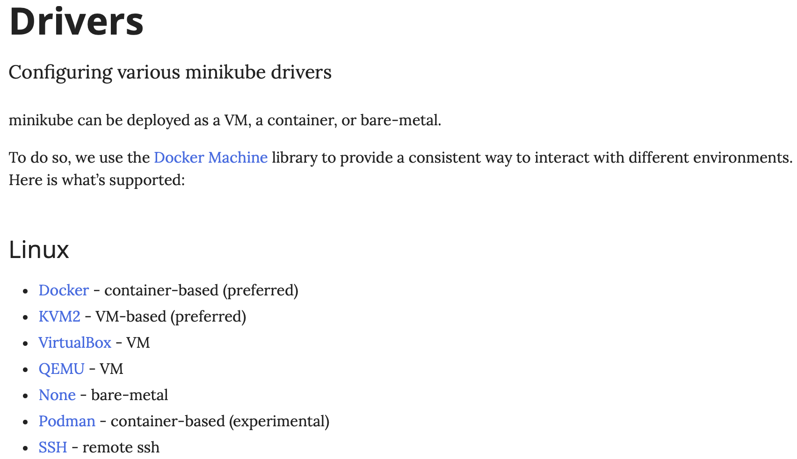
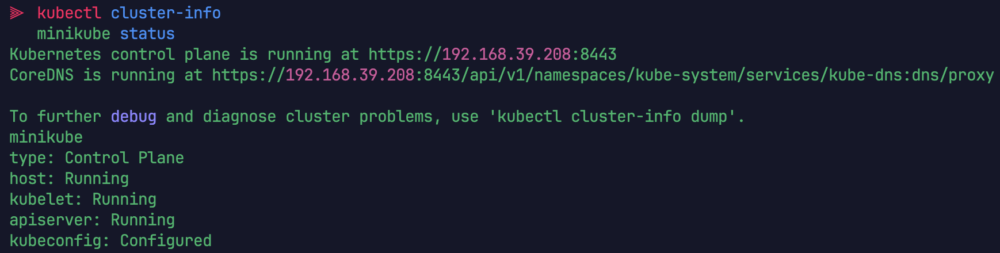

Minikube로 간단히 k8s 찍먹해보기~
==

minikube는 로컬 환경에서 간단히 k8s를 구축해주는 도구이다. <br>
간단히 단일 node로 이루어진 쿠버네티스 환셩을 만들어준다.
----
k8s cluster 생성을 위해 VM, container와 같은 기반환경이 필요한데, 나는 공식 문서에서 recommand한 KVM을 이용해보려 한다. 


https://minikube.sigs.k8s.io/docs/drivers/

Minikube가 이러한 기반 환경을 제어하고 통신하기 위해 사용하는 것이 바로 **driver**라고한다.

KVM, QEMU, libvirt, minikube
--

### 필요 Package 다운로드

```sudo dnf install qemu-kvm libvirt-daemon-kvm libvirt-client virt-install bridge-utils```

- **qemu-kvm**: qemu를 다운 받자! 근데 KVM의 가속 기능을 최대한으로 활용하도록 최적화된
- **libvirt-daemon-kvm**: libvirt를 다운 받자! KVM/QEMU 드라이버를 포함한. libvirt는 다양한 hypervisor들을 작동시키기 위한 통합 api
- **libvirt-client**: libvirt daemon과 상호작용하기 우한 클라이언트 라이브러리 및 도구를 다운 받자 (virsh 명령어)
- **virt-install**: 가상 머신을 쉽게 생성하고 설치할 수 있도록 도와주는 명령줄 유틸리티, libvirt와 함께 작동/
- **bridge-utils**: 리눅스에서 네트워크 브리지를 생성하고 관리하는 데 필요한 도구들을 제공. 가상 네트워크와 물리적 네트워크를 연결하는 다리 역할을 설정하는 데 사용됩니다

``` shell
# libvirt 데몬 시작 및 활성화
sudo systemctl enable --now libvirtd

# 현재 사용자를 libvirt 그룹에 추가, Optional
sudo usermod -aG libvirt $(whoami)

# 그룹 변경 사항을 적용하기 위해 로그아웃 후 다시 로그인 or
newgrp libvirt # 명령 사용
```

### kubectl 다운로드 하기

Red-Hat-based distribution 기준 native package management으로 설치하였다. 나머지 방법과 운영 체제는 공식문서에 친절히 설명되어 있다.
<br>add the k8s `yum` repository
```shell
# This overwrites any existing configuration in /etc/yum.repos.d/kubernetes.repo
cat <<EOF | sudo tee /etc/yum.repos.d/kubernetes.repo
[kubernetes]
name=Kubernetes
baseurl=https://pkgs.k8s.io/core:/stable:/v1.33/rpm/
enabled=1
gpgcheck=1
gpgkey=https://pkgs.k8s.io/core:/stable:/v1.33/rpm/repodata/repomd.xml.key
EOF

sudo yum install -y kubectl
```

https://kubernetes.io/docs/tasks/tools/install-kubectl-linux/


### minikube 다운로드 및 설치

공식문서에 아주 잘 설명되어 있다. 

```shell
# Download
curl -LO https://github.com/kubernetes/minikube/releases/latest/download/minikube-linux-amd64
sudo install minikube-linux-amd64 /usr/local/bin/minikube && rm minikube-linux-amd64
```
https://minikube.sigs.k8s.io/docs/start/?arch=%2Flinux%2Fx86-64%2Fstable%2Fbinary+download

driver 설정을 kvm2로 해서 실행해주자

```shell
minikube start --driver=kvm2

# Cluster 상태 확인
kubectl cluster-info
minikube status
```


다음과 같이 뜨면 성공

Troubleshooting 가상 네트워크 카드 설정
--

> ERROR <br>
> Network not found: no network with matching name 'default'

가상머신(KVM)이 Host OS랑 통신 해야하는데 이 통신을 위한 가상 네트워크 카드(vNIC)가 가상의 네트워크 스위치에 연결되어야 한다. <br>

`minikube start --driver=kvm2`가 실행되면 libvirt가 KVM을 사용해 vm을 하나 만드려 하는데, 이때 vm을 'default' 이름의 virtual network switch랑 연결하려 한다. 
- default라는 virtual network switch가 없어서 생기는 문제
- 다음 명령어를 이용해서 Host OS에 virtual network switch를 생성하자

```shell
# 다음 명령어로 네트워크가 존재하는지 확인해보자
virsh net-list --all

# 사용자 세션의 네트워크 정의를 제거합니다.
virsh net-undefine default

# 새로는 network switch를 만들 xml 파일 생성
cat <<EOF > default-net.xml
<network>
  <name>default</name>
  <forward mode="nat"/>
  <bridge name="virbr0" stp="on" delay="0"/>
  <ip address="192.168.122.1" netmask="255.255.255.0">
    <dhcp>
      <range start="192.168.122.2" end="192.168.122.254"/>
    </dhcp>
  </ip>
</network>
EOF

# Network 시작
sudo virsh net-start default

# 시스템 부팅시 자동 시작 (Optional)
sudo virsh net-autostart default

# default 네트워크가 active인지 확인 해보자
sudo virsh net-list --all
```
> virsh 명령어로 해서 vm에 network switch 만든다 생각할수 있는데, Host os에서 만드는 거임. <br>
> 다음과 같은 이유로 host os의 명령어로 만들지 않고 libvirt 먕령어를 사용해서 만들었다. 
> - 추상화와 편의성
> - 자동화와 생명주기 관리: DHCP 서버역할, NAT 규칙 관리, net-autostart 와 같은 기능 제공 
> - 표준과의 통합: minikube와 같은 대부분의 프로그램들은 kvm과 직접 소통하지 않고 libvirt api를 사용해

Network 흐름도
--

외부 네트워크 —> Router —> Host OS —> NginX(Docker) —> HostOS —> VM —> kubernetes
(NAT) (dockerd가 만든 포트포워딩)  (k8s는 docker network에 존재하지 않으니까 다시 host OS로 올려 (docker gateway))
(hostOS에서 KVM으로 가는 포트포워딩이 필요해)   (vm os로 들어온 요청에 대해서 쿠버네티스가 쓰고 있는 곳으로 옮겨줘야해)
그림 붙여 넣자
