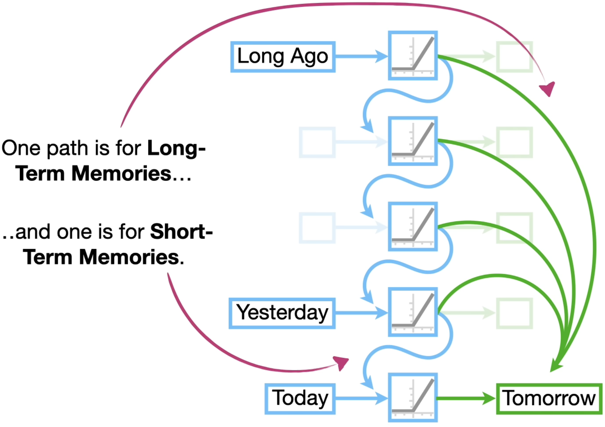

RNN
==

Terminology
--

- **Cell**: Repeating module inside a RNN. Cell은 오직 한 단계(time step)만 처리
- **Hidden State**: **Memory** of network

RNN layer 구성

Stacked RNN

Structure
--

은닉층 노드들을 연결시켜서, 과거 정보와 현재 정보를 모두 반영하겠다. 

BPTT
--

BackPropagation Through Time: 모든 단계마다 처음부터 끝까지 역전파 하겠다. 
- 오차가 멀리 전파될때 계산량이 많아지고 전파되는 양이 점차 적어지는 기울기 소멸 문제 발생
- 이를 해결하기 위해 오차를 몇 단계까지망 전파시키는 truncated BPTT 사용 혹은 LSTM, GRU 사용

Hidden Layer
--

은닉층은 일반적으로 하이퍼 볼릭 탄젠트 활성화 함수를 사용한다. (b/c zero centered -> balanced update)

Output Layer
--

DNN과 같은 계산 방식, uses softmax

LSTM
==

Idea
--

Instead of using same feedback loop connection for long-term and short-term memory, use **seperate path**
- **Cell state**: long-term memory
- **Hidden state**: short-term memory

Gates
--

LSTM consists of three gates 

1. Forget Gate
2. Input Gate
3. Output Gate

### Forget Gate

- 역할: 직전 정보(Ct-1)를 얼마나 기억할지 결정. will be point-wise multiplied with the previous cell state
- Input
  - ht-1: previous hidden state
  - xt: current input
- Output
  - vector(ft) of values between 0 and 1 which will be point-wise multiplied with the previous cell state

사진에는 bias가 생략되어 있음

### Input Gate

- 역할: 현재 정보를 어느 정도로 기억할까 (Ct에 어느 정도로 반영할까)
- Input
  - ht-1: previous hidden state
  - xt: current input
- Output
  - it from sigmoid: Candidate Cell state의 반영 비율 계산
  - Ct from tanh: Candidate cell state

Cell state update는 다음과 같이 이루어진다.

### Output Gate

- 역할: Decides **hidden state**. Determines what information form the cell state will be passed on to the next hidden state.
- Input
  - ht-1: previous hidden state
  - xt: current input
  - Ct: calculated from previous gates
- Output
  - ot
  - ht

기존 RNN과 차이
--

vanish, exploding gradient의 발생 확률이 적어

### RNN

RNN은 각 hidden state를 타고 전파 돼. 따라서 각 hk가 Loss에 얼마나 영향을 줬는지 알아야 한다. (gradient를 구해야해)
 

우선 간단히 ∂L / ∂ht-1를 어떻게 구해야 할까. chain rule에 의하여 다음과 같다. (back propagation이 어떻게 계산 되는지 생각해봐)

이제 이것들을 토대로 time step t에서 time step k로 backprogate 되는 error을 계산하면 다음과 같다. 

파이를 보면 Whh가 step만큼 곱해진다는 것을 볼수 있다. => Vanishing, Exploding Gradient
 
ht-1 -> ht로 갈때, 매번 전 정보를 참조, multiplication 하는게 문제
