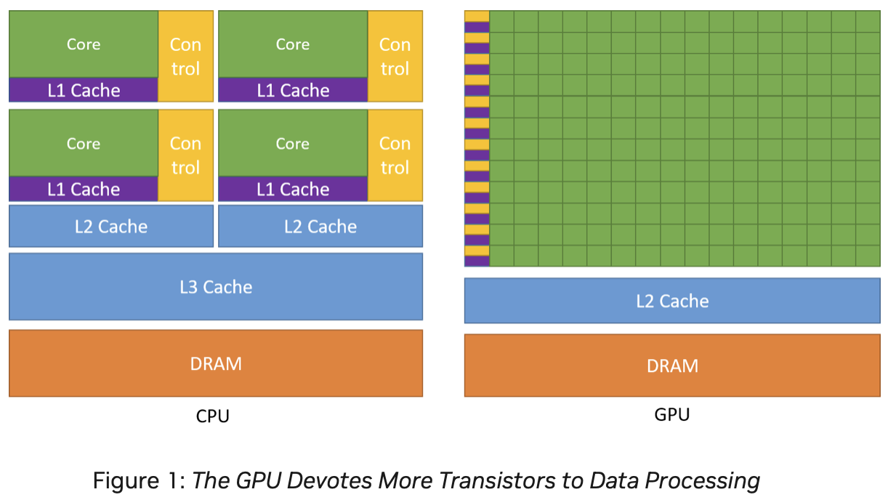
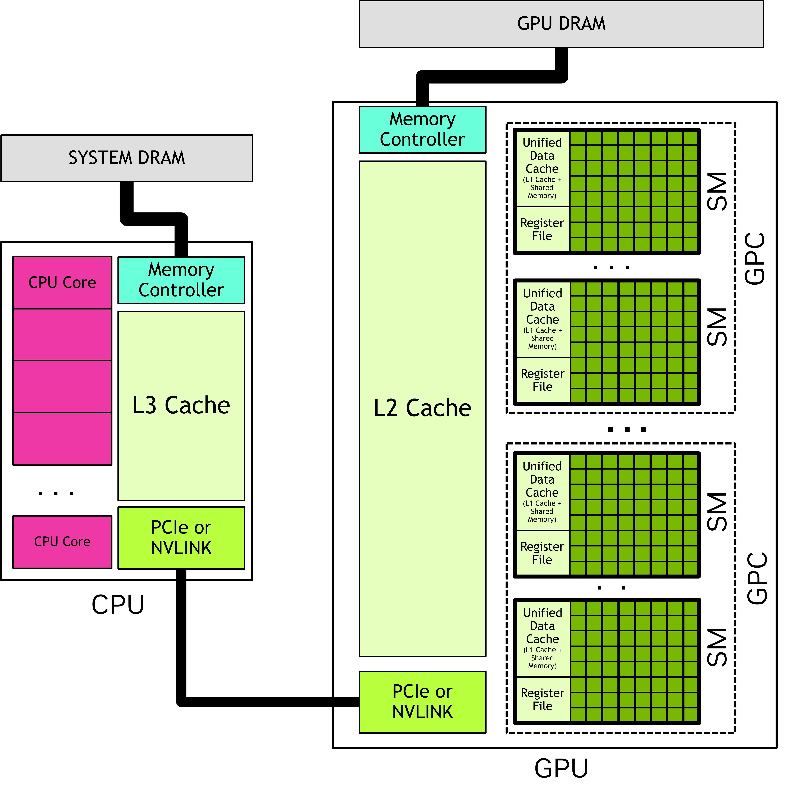
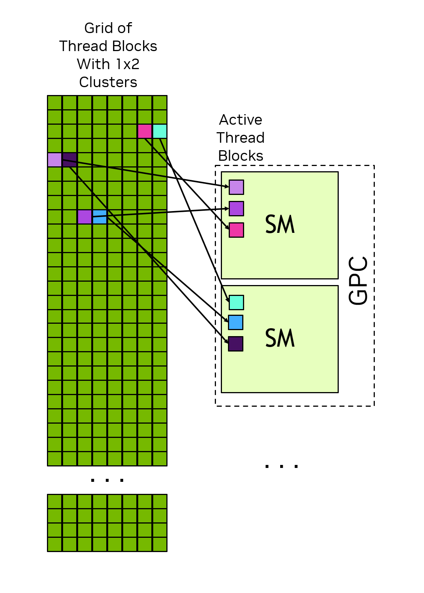

FLOPS: FLoating point Operations Per Second

GPU는 일반적으로 SIMD가 아닌 SIMT(Signle Instruction Multiple Thread)로 정의 된다.
- 한 쓰레드 그루부 내 스레드들을 하나의 제어 장치로 제어
- 각 쓰레드는 자신만의 제어 문맥을 가진다. 하나의 제어 장치가 여러개의 쓰레드를 제어하지만, 서로 독립된 제어 문맥을 가질수 있다 -> 쓰레드는 서로 독립된 의미를 가질 수 있다.
- 그룹 내 쓰레드들 사이의 분기가 허용 된다. 물론 이 과정에서 성능 저하 발생.

- 하나의 제어장치 옆에 많은 수의 연산 코어 -> 하나의 제어장치가 여러 개의 연산 코어를 제어.
- 파이프라인 연산의 흐름이 규칙적인 만큼 메모리에 대한 전근 형태도 대체로 규칙적 -> 캐시에 상대적으로 작은 공간을 할당하고 있는 모습. 
- 반면 많은 수의 코어에 데이터를 동시에 공급해야해서, 대역폭이 높은 고성능 메모리가 필요해

if문 등의 분기, 불규칙한 메모리 접근이 GPU의 성능을 크게 떨어뜨린다. 

CUDA
--

- Driver API: low level 기능 제공, cuda context, module 로드 등에 대한 더 세밀한 제어 기능 제공, 실행 구성 및 커널 매개 변수 설정을 함수 호출을 통해 명시적으로 지정해야 한다.
- Runtime API: 설정 자동으로 해주지만, 프로그램에 포함된 모든 커널이 프로그램 시작과 함께 초기화 및 로드되고 종류할때 까지 유지됨 -> 상대적으로 비효율적

Basic Terminology
--
CUDA programing model assumes a heterogeneous computing system(cpu, gpu를 하나의 연산체로 봐)

- Host: CPU
- Device: GPU

최초의 device kernel은 host 코드에서 호출 되어야 하기 때문에 호스트 코드가 함께 있어야 한다. Device code는 nvcc compiler 사용
.cpp -> .cu
.hpp -> .cuh

CPU가 CUDA api를 호출해서 host memory <--> device memory간 data를 copy하고 기다려
CPU, GPU 동시 실행 가능 (Utilizing both CPU, GPU for the best performance)

Device code: code that executed on GPU
Kernel: function invoked for execution on the GPU
kernel launch: starting many threads executing the kernel code in parallel on the GPU

CUDA 코드를 실행하면, 여러개의 Block들 생성, GPU의 scheduler는 block들을 SM에게 배정
=> 하나의 block은 하나의 SM 안으로 들어가서 실행된다. (SM 하나가 여러 Block을 동시에 돌릴 수도 있지만, 하나의 Block이 쪼개져서 두 SM에 걸칠 수는 없다)

GPU Hardware Model
--
GPU can be considered to be a collection of **Streaming Multiprocessors(SM)**
SM들의 collection은 Graphics Processing Clusters(GPCs)

각 SM has followings
- Local register file
- Unified data cache: provides physical resources for shared memory and L1 cache (L1 cache와 shared memory가 같은 메모리 뱅크를 사용)
  - shared memory, L1 cache의 공간 분할 can be configured in runtime
  - 여기서 shared memory는 같은 block안에 있는 thread끼리 공유됨 
- number of functional units that perform computations

SM은 Hardware, Thread Block은 software 적인 개념

Thread Blocks and Grids
--

When an application launches a kernel, it happens with many threads. These are organized into blocks (thread block)
Blocks are organized into a grid
특징
- All the thread blocks in a grid have the same size and dimensions.
- Thread blocks and grids may be 1,2 or 3 dimensions. dimensions simplify mapping of indiviual thread to units of work or data items.

Kernel이 launch 될때, specific execution configuration(grid, thread block dimensions, cluster size, SM setting, ...)을 사용해서 launch 됨

Built in random variable이 있어서 kernel의 location을 알수 있다. (threadIdx, blockIdx, blockDim, gridDim)

thread block이 SM에 sceduling 될때 순서 보장 그런거 없어, 코드 짤 때 유의(dependency 같은거)

#### GPC

인저반 여러 thread block을 하나의 group으로 묶어
장점
- locality of scheduling: cluster 내의 모든 스레드 block은 단일 GPC 내에서 실행되도록 scheduling -> 물리적으로 가까운 위치에서 실행되서 통신 효율 up
- Cooperative groups: thread간의 sync 가능 using software interface called **Cooperative Groups**
- Distributed Shared memory: cluster 내의 다른 블록이가진 공유 메모리에 직접 접근 가능

Warps and SIMT
--

thread block의 하위 32 thread를 warp라 불러
warp executes the kernel code in a Single-Instruction Multiple-Threads (SIMT) paradigm.
따라서 1 warp에서 if-else 쓰면 if문 한번돌고, else문 한번 돌아(Serial하게 진행된다는 뜻) the other half of the warp would be masked off
In SIMT model, all threads in a warp progress through the kernel in lock step. 
=> Thread block이 32의 배수면 좋겠지~

GPU Memory
==

Heterogeneous systems have multiple memory spaces.

DRAM Memory in Heterogeneous Systems
--

DRAM attached to the GPU is called global memory(CPU에서 access불가능, 단지 accessible to all SMs in GPU라서 global이라고 함)
System or host memory: DRAM attached to the CPU

CPU, GPU 둘다 Virtual Memory Addressing 사용. 
On all currently supported systems, CPU and GPU use a single unified virtual memory space
같은 주소 체계 안에서 서로 다른 영역을 나눠써서, Memory관리가 편해졌어. (굳이 해당 address가 host의 것인지 device 것인지 명시하지 않아도 돼)

On-Chip Memory in GPUs
--

각 SM 별로 다음과 같은 거 존재(SM간 공유는 불가, thread block)
- Register file: register file stores thread local variables which are usually allocated by the compiler
- shared memory

register은 각 thread마다 필요해 따라서 total number of thread * thread별 필요한 register file의 size 가 사용할수 있는 SM의 register 용량 보다 작으면 실행 할수 없어
number of threads in the thread block ust be decreased to make the thread block launchable.

Shared memory allocations are done at the thread block level, unlike register allocations which are per thread,

#### Caches
L1 cache는 part of Unified data cache -> sm별로 가져
L2 cache는 shared by all SMs withing a GPU
SM에는 constant cache 존재: cache values in global memory that have been declared to be constant over the life of a kernel.
-> improve performace by allowing kernel parameters to be cached in the SM seperately from the L1 data cache

Unified Memory
--

CUDA runtime이 GPU, CPU간 data를 copy해주지만 더 빠른 속도를 위해서는 processor간 이동을 최소화 시키자.
