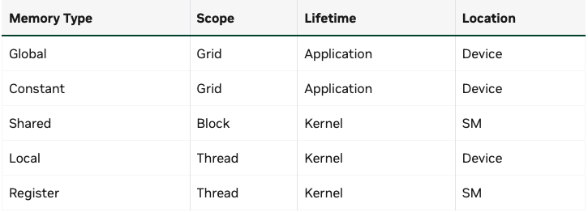
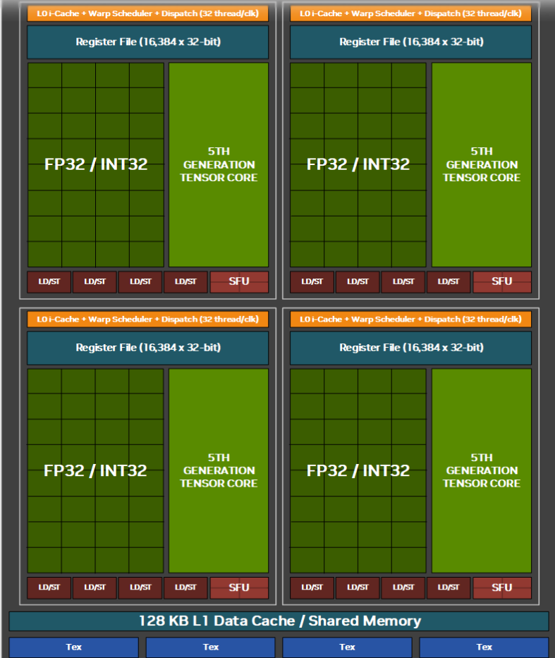
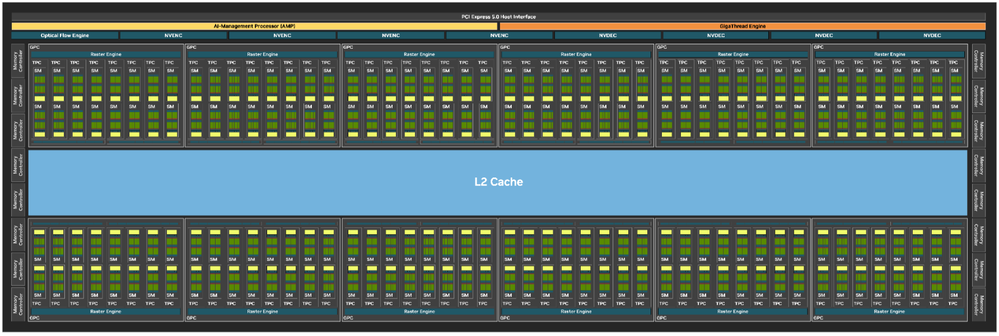

Basics of SIMT, Thread Hierarchy
--
모든 thread가 같은 kernel code를 실행하지만 고유한 thread ID가 있어서 서로 다른 데이터에 접근하여 작업을 수행

Grid > Block > Thread의 3단계 계층 구조를 갔는다. 
- Thread: 고유한 register 존재
- Block: Shared Memory를 통해 block 내의 thread들 끼리 데이터를 공유하고 동가화 할수 있어
- Grid: Kernel이 실행될 때 생성되는 전체 스레드 블록들의 집합

GPU Device Memory Spaces
--


### Global Memory
a.k.a. Device Memory
Kernel내의 모든 thread가 접근 가능

- Persistence
  - Kernel의 실행이 끝나도, 전역 메모리에 저장된 데이터를 사라지지 않아
  - 명시적으로 해제 하거나(cudaFree), 프로그램이 종료될 때까지 살아있어
  - 여러 커널이 sequential하게 실행 될때, 앞선 커널의 결과를 다음 커널이 이어 사용할수 있어.
- Memory Management
  - Global Memory는 Host에서 CUDA API를 통해 직접 관리해야 해
  - cudaMalloc, cudaMemcpy, cudaFree
- CUDA kernel의 return값은 항상 void -> GPU의 결과를 CPU에 전달할수 있는 유일한 방법은 Global Memory에 기록하기
- 모든 thread에게 공용이라서 race condition이 생길수 있어

### Shared Memory
SM 내부에 물리적으로 존재하여 Thread Block내에 있는 쓰레드가 공유
- Global Memory보다 Bandwidth 높고, Latency 훨씬 낮아
- Kernel 실행 중 Block이 활성화된 동안에만 데이터 유지

마찬가지로 data race 발생할 수 있어 -> `__syncthreads()` 사용하자
- Block 내에서 Barrier의 역할을 해

#### Static allocation of Shared Memory (정적 할당)
Compile 시점에 Shared Memory의 크기가 정해져 있을때 사용 <br>
`__shared__` 키워드 사용해서 배열의 크기를 상수로 명시해

```cpp
// 예시: 1024개의 float를 저장하는 공유 메모리 정적 할당
__global__ void staticKernel() {
    __shared__ float sharedArray[1024]; 
    
    // ... 데이터 로드 및 __syncthreads() ...
}
```

#### Dynamic Allocation of Shared Memory (동적 할당)

커널 실행 시 3번째 인자로 필요한 바이트(Byte) 크기를 전달
```cpp
// 그리드, 블록, [공유메모리 크기(Byte)]
kernelName<<<grid, block, sharedMemBytes>>>(args...);
```

커널 내부에서 extern __shared__ 키워드로 크기가 없는 배열을 선언
```cpp
extern __shared__ float sharedArray[]; // 크기 지정 안 함
```

`extern __shared__` 변수는 커널 내에서 딱 하나만 선언 가능 -> 여러개 하고 싶으면 포인터로 manually partition 해야해

```cpp
extern __shared__ float array[]; // 동적 할당된 전체 메모리 덩어리

// 1. 첫 번째 배열 (short 타입)
short* array0 = (short*)array; 

// 2. 두 번째 배열 (float 타입)
// array0가 128개(short)만큼 쓴 그 다음 주소부터 시작
float* array1 = (float*)&array0[128];

// 3. 세 번째 배열 (int 타입)
// array1이 64개(float)만큼 쓴 그 다음 주소부터 시작
int* array2 = (int*)&array1[64];
```

Memory Alignment 주의하기: short(2byte) 127개 잡은거 뒤에 4byte 잡으면 4byte 정렬이 꺠져서 문제 생겨

### Register
SM내부에 물리적으로 존재라고 Thread마다 고유하게 할당 돼
- Compiler가 자동으로 변수들을 레지스터에 배정
- Register를 많이 쓸수록 한 SM에서 동시에 실행할 수 있는 thread block occupancy가 줄어들어
- Register가 부족하면 **Register Spilling** 발생 -> 넘치는 데이터를 느린 local memory로 쫓아내.


### Local Memory
Device Memory(우리가 흔히말하는 HBM 그거)에 존재하나, 각 thread 자신만 볼 수 있는 사적인 공간이야.
- L2, L1 cache를 탈수 있어 


### Constant Memory
read only, grid scope의 모든 thread가 접근 가능
- Device Memory에 존재하지만, 전용 constance cache를 갖는다.
- 여러 thread가 동시에 같은 주소의 상수 memory를 읽을 때, cache가 data를 broadcast해서 매우 빨라: broadcast에 특화되어 있는 cache

### Caches
- L1: 각 SM 내부에 존재
- L2: GPU 전체가 공유, 모든 SM에서 접근. 전역 메모리와 SM 사이의 buffer 역할을 해



### Texture and Surface Memory
과거 데이터 접근 패턴이 불규칙하거나 2D 공간적인 특성을 가질때, 이 메모리 공간을 사용해서 서능을 높였으나, 요즘에는 3D rendering과 데이터르 교환해야 하는
grapics Interop이 아닌 경우 거의 사용되지 않음

### Distributed Shared Memory
여러 Block의 Shared Memory를 합쳐서 더 큰 고속 memory pool 처럼 사용하기 <br>
Thread Block Clusters 개념을 기반으로 한다. 
- 클러스터 내의 모든 공유 메모리는 하나의 통합된 주소 공간으로 취급된다. -> 옆 block의 memory를 손쉽게 access
- `cluster.sync()`를 사용하여 클러스터 내의 모든 블록의 실행 시점을 맞출수 있어
- 단순 read 뿐만 아니라, write, atomic add등 여러개 가능
- Block 간 데이터 동신에 전역 메모리(DRAM)을 거치지 않아도 돼
- Distributed Shared Memory라도 Shared memory size specifications, static or dynamic is still per thread block.

Memory Performance
--
Local Memory(DRAM)는 thread 별로 (row-major)로 저장되지 않아
- Local memory를 thread ID 순서대로 interleaved하게 저장된다. => thread별로 연속적인 데이터를 access하기 떄문에 accesses become fully coalesced
- Warp내의 모든 thread가 각자의 배열에서 같은 index를 접근하기만 하면 이러한 memory 저장 방식은 매우 효율적

### Coalesced Global Memory Access
CUDA의 Global Memory는, 메모리 요청을 효율적으로 처리하기 위해, Transaction 단위로 데이터 가져와
- Transaction 단위: 32byte 덩어리로 데이터를 읽거나 써
- Warp: 워프 내의 thread들이 memory 요청을 보내면, memory controller는 이를 최소한의 transaction으로 묶어서 처리하려 시도
- 따라서 warp 내의 연속된 thread들이 연속된 메모리 주소에 접근할때 완전 효율적
- warp 내 연속된 thread들이 멀리 떨어진 주소에 접근할 때 최악의 효율을 보인다. 

Shared Memory Bank Conflict
--
Shared Memory는 하드웨어적으로 32개의 bank로 나뉘어 있다.
- 32 비트의 데이터가 차례대로 bank 0, 1, ..., 31에 할당된다.
- 각 뱅크는 한 clock cycle에 하나의 32bit data를 처리할수 있다.

#### Bank Conflict
thread들이 서로 다른 주소에 접근하는데, 하필 그 주소들이 같은 bank에 있을때 발생 -> bank를 access하기 위해 Serialization이 돼
> 다음과 같은 경우는 Conflict 아님
> - Broadcast: 여러 thread가 완벽히 동일한 주소를 읽을때
> - Stride 1 접근: thread들이 연속된 데이터를 읽을때, (스레드 0→뱅크 0, 스레드 1→뱅크 1... → 충돌 없음)


### Shared Memory Access Patterns

Atomics
--
Grid 전체 레벨에서의 데이터 보호 및 동기화
- Global Memory의 특정 주소에 대해 read-modify-write 작업을 원자적으로 수행
- 한 thread가 atomic 작업을 수행하는 동안, lock을 걸어버려

Cooperative Groups
--
Block보다 작은 단위, 블록보다 큰 단위를 묶어서 제어하게 해줘
- 소프트웨어적으로 원하는 thread들을 group으로 묶어 동기화 해주는 기능
- GPU 전체, multi GPU간의 동기화도 가능하게 해줘

Kernel Launch and Occupancy
--

### Scheduling 원리
- Kernel이 실행되면 스케줄러는 thread block들을 GPU의 SM에 할당
  - Block이 어떤 SM에, 어떤 순서로 배정될지 알수 없어, SM에 resource가 가용가능 할때만 block을 받아드려. 없으면 대기
- SM당 물리적 한계 존재
  1. maxBlocksPerMultiProcessor
  2. maxThreadsPerMultiProcessor
  3. sharedMemPerMultiprocessor
  4. regsPerMultiprocessor

### Occupancy 계산 및 예시
Occupancy: SM이 처리할수 있는 이론상 최대 warp 수 대피, 실제로 활성화된 워프의 비율
- Occupancy가 높을수록 Memory Latency를 숨길수 있어 성능에 유리

------

**SM당 최대 스레드 2048개, 최대 블록 32개 가정**

상황 1: 스레드 제한에 걸린 경우

- 설정: 블록당 768 스레드 (<<<512, 768>>>)
- 계산:
  - SM 하나에 블록 1개 할당 → 768 스레드 (여유 있음)
  - SM 하나에 블록 2개 할당 → 1536 스레드 (여유 있음)
  - SM 하나에 블록 3개 할당? → 768 * 3 = 2304 스레드 (2048 초과! 불가능)
- 결과: SM당 블록 2개만 실행 가능.
- 점유율: (768 * 2) / 2048 = 75%


상황 2: 블록 수 제한에 걸린 경우

- 설정: 블록당 32 스레드 (<<<512, 32>>>)
- 계산:
  - 스레드 수로는 2048 / 32 = 64개의 블록도 들어갈 것 같음.
  - 하지만 maxBlocksPerMultiProcessor가 32개로 제한됨.
- 결과: SM당 블록 32개만 실행 가능.
- 실제 스레드 수: 32개 블록 * 32 스레드 = 1024 스레드.
- 점유율: 1024 / 2048 = 50% (블록을 너무 잘게 쪼개서 손해를 본 경우)


상황 3: 공유 메모리 제한에 걸린 경우

- 설정: 커널이 블록당 100KB 공유 메모리 사용. (SM 한도는 약 233KB)
- 계산:
  - 블록 1개: 100KB
  - 블록 2개: 200KB
  - 블록 3개: 300KB (233KB 초과! 불가능)
- 결과: 스레드 수나 레지스터가 널널해도, 공유 메모리가 커서 SM당 블록 2개밖에 못 돌림. 점유율 하락.

#### 최적화 하기
- Block 당 thread수와 memory 사용량을 조절하여 occupancy를 최적화해야 해.
- Register을 제한하는 방법을 쓸수도 있어 `--maxrregcount`
  - register가 모자라서 local memory를 쓰게 되는 spilling이 생길수도 있지만, 더 많은 block을 SM에 넣을수 있어 성능이 오를수도 있어 

https://docs.nvidia.com/cuda/cuda-programming-guide/02-basics/writing-cuda-kernels.html
