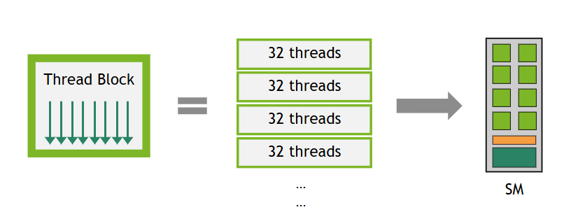

Kernel을 실행할때 block수, thread수 정하기
==

Block당 thread수 정하기
--

Warp 단위에 맞춰서 32의 배수로 설정; 아니면 32의 나머지는 놀게 된다. (보통 256으로 설정)

- Block 하나의 너무 많은 thread를 배정하는 경우
  - SM의 shared memory, register의 공간이 부족해져 -> 실행실패 및 성능저하
- Block 하나에 너무 적은 thread를 배정하는 경우
  - Block에 1개의 워프만 할당되는 경우, 해당 워프가 stall에 걸린 경우, 다른 warp로 switching 할수 없어서 손실발생
  - SM에 최대로 생성할수 있는 블록 개수가 물리적으로 정해져 있어서, 성능이 한계에 부딪히게 돼

Block 개수 정하기
--

Block 당 thread 숫가 정해졌다면, block 개수는 전체 데이터의 개수에 따라 정해진다. 
```numBlocks=(N+threadsPerBlock−1)/threadsPerBlock```

(부연) Hardware Multithreading
--



SM에 thread block이 할당되면, warp 단위로 쪼개지고 **warp scheduler**에 의해 실행 대기열에 들어간다. <br> <br>
warp의 execution context은 warp의 lifetime 동안 on-chip에 있어서 context switching 비용이 **no cost**야, 
따라서 warp scheduler은 다음 명령어를 실행할 준비가 된 warp를 선택해 즉시 실행할수 있어 -> memory loading 등으로 대기 중인 warp를 건너뛰고 준비된
warp를 바로 실행해 latency를 숨길수 있어.

[출처-CUDA Programming Guide](https://docs.nvidia.com/cuda/cuda-programming-guide/03-advanced/advanced-kernel-programming.html#hardware-multithreading)
