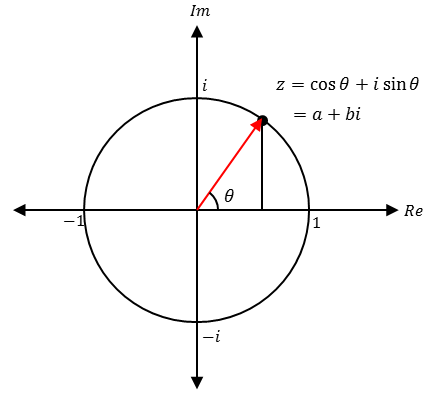
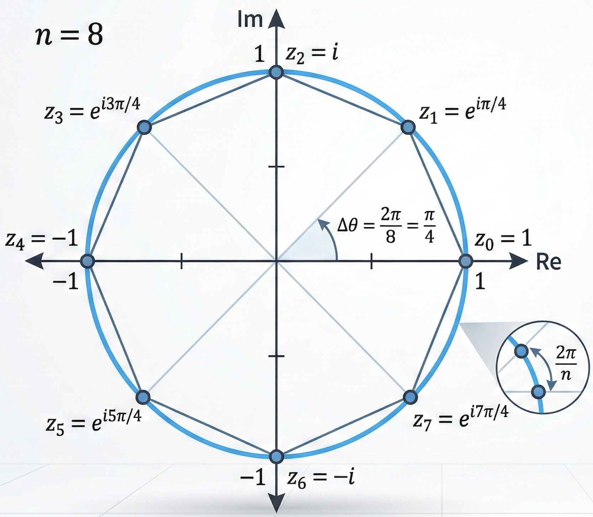

Sound를 Frequency로 분해, 신호를 다항식으로 보고 그 다항식을 단위근에서 평가 한게 신호 x[n]을 계수로 가지는 다항식

뿐만 아니라, 불확정성원리, 리만 제타 함수와 소수, 미분 방정식등 여러 분야에서 활용됨

다항식 관점에서의 DFT (Convolution)
--

Coefficient representation -> Point value representation 로 변환해줘
신호를 다항식으로 보고 그 다항식을 단위근에서 평가한것

> ### Coefficient representation
> 우리가 흔히 아는 다항식 표현법
> - 다항식 덧셈 뺄셈은 빠르지만 곱연산의 경우 느림

> ### Pointwise representation
> n개의 서로 다른 xi 갑소가 그에 대응하는 yi = A(xi) 쌍으로 표현
> 곱셈이 O(n)시간 안에 끝남

DFT의 식은 아래와 같다. 

$$
X[k] = \sum_{n=0}^{N-1} x[n] e^{-i\frac{2\pi kn}{N}}
$$

다음과 같은 가정을 해보자

$$
\omega = e^{-i\frac{2\pi}{N}}
$$ 

위 가정은 단위근으로 1의 N 제곱근 꼴이다. 
- 이 단위근의 성질을 이용해서 FFT를 가능하게 한다.

위 가정에 따라 식을 정리하면 

$$
X[k] = \sum_{n=0}^{N-1} x[n] (\omega^k)^n
$$

으로 아래와 같은 다항식 꼴임을 확인할수 있다. 

$$
\sum_{n=0}^{N-1} x[n] z^n
$$

따라서 $$z = \omega^k$$라 하고 이를 다항식 꼴로 정리하면

$$
P(z) = \sum_{n=0}^{N-1} x[n] z^n
$$

$$
X[k] = P(\omega^k)
$$

식의 의미를 한번 더 정리하면 다항식 P(z)를 단위원 위의 N개의 점 wk에서 평가한것이다. 
 
따라서 DFT는 결국 계수형 표현 → 점값 표현 임을 알수 있다. 

FT에서 FFT로
--

FT에서 FFT로 가는 핵심 점화식은 

$$P(z) = P_{even}(z^2) + z P_{odd}(z^2)$$ 

이다.

식을 다음과 같이 변형할수 있는(해야만 하는) 이유 2가지를 설명하겠다. 

### 복소평면에서의 극형식과 단위근

#### 극형식

2가지 이유에 설명하기 전에 알아야할 개념 우선 극형식 대한 설명을 해보겠다. 

우선 오일러 공식을 사용하여 복소수를 극형식으로 나타내어 보자

$$z = e^{i\theta} = r(\cos\theta + i\sin\theta)$$

위의 식에서 $$r$$은 원점으로 부터의 거리, $$\theta$$는 편각이다. 

이렇게 나타낸 복소수를 거듭제곱하면

$$z^n = \left(r e^{i\theta}\right)^n = r^n e^{in\theta}$$

로 각도는 n배, 거리는 n제곱이 되는걸 확인 할수 있다. 

#### 단위근

> 어떤 숫자를 N번 거듭제곱했을때 정확히 1이 되는 숫자 있을까?

- 복소평면에서 단위원 위에 일정한 간격으로 예쁘게 점이 찍히는 특징을 가지고 있다. 
- 이런 단위근의 **대칭성, 주기성**이 FFT를 가능하게 한다. 

### FFT를 가능하게 하는 **반각 대칭성**

N이 짝수 일때, 원점을 중심으로 모든 단위근이 점대칭을 이룬다 → 실수부, 허수부의 크는 같고, 부호만 정반대

$$
w_N^{k+N/2} = -w_N^{k}
$$

성질을 이용해서 연산량을 0.5배 할수 있다.

$$P(z) = P_{even}(z^2) + z P_{odd}(z^2)$$

에서 Idx k에 있는 단위근 $$w^k$$를 대입해 식을 풀고 결과를

$$
P_{even} + w^kP_{odd}
$$

라 하자. 이후 Idx $$k+N/2$$(원의 반대편에 있는 단위근)에 대한 결과 값은 

$$
P_{even} - w^kP_{odd}
$$

가 나온다. (괄호 안의 x2제곱하면 마이너스 부호가 제곱되어 plus가 된다.)
 
따라서 $$P_{even}$$과 $$w^kP_{odd}$$연산을 한번 해놓고 memory에 저장해 놓으면 연산량을 반으로 줄일수 있어. 

### FFT를 가능하게 하는 **제곱연산과 각도**

단위근의 성질을 보면 제곱 연산을 하면 각도가 2배가 된다. 즉 N 제곱근이 N/2 제곱근으로 바뀌게 된다. 

$$
w_N^2 = w_{N/2}
$$

이러한 성질 덕에 분할정복을 가능케 한다. 
 
이러한 성질은 단위근의 짝수 제곱근일떄만 성립함으로, 식을 짝수, 홀수로 나누고 홀수의 경우 z를 묶음으로써 짝수꼴로 변형시킨다. 

본식

$$
P(z)= P_{\text{even}}(z^2)+ z\,P_{\text{odd}}(z^2)
$$

첫 단계

$$
P_{\text{even}}(z^2)= P_{\text{even,even}}(z^4)+ z^2 P_{\text{even,odd}}(z^4)
$$

$$
P_{\text{odd}}(z^2)= P_{\text{odd,even}}(z^4)+ z^2 P_{\text{odd,odd}}(z^4)
$$

두번째 단계

$$
P_{\text{even,even}}(z^4)= P_{\text{eee}}(z^8)+ z^4 P_{\text{eeo}}(z^8)
$$

$$
P_{\text{even,even}}(z^4)= P_{\text{eee}}(z^8)+ z^4 P_{\text{eeo}}(z^8)
$$

이후 쭉쭉 계속
 
한번 재귀 tree를 돌면 모든 연산이 끝나기 때문에 N번 iterate에서 logN iterate로 바뀐다. 

Conclusion
--

$$O(N^2)$$에서 $$O(logN)$$으로 시간복잡도가 줄어든다. (N은 FFT length)
