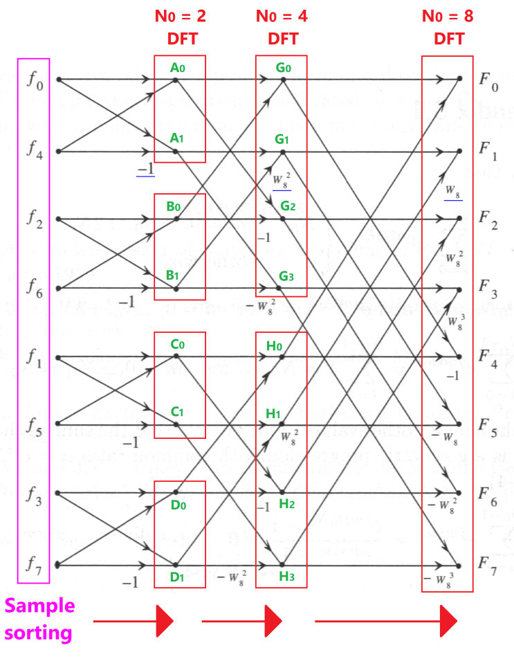

Butterfly 연산
--

다항식을 짝수항, 홀수항으로 분할 할수 있다는 것은 이해가 되는데 후에 병합될때가 잘 이해가 안된다. 

$$
P(x)=P_{even}(x^2)+xP_{odd}(x^2)
$$

N개의 복소수 거듭제곱근을 각각 대입했을 때 나오는 point value들을 가지고 butterfly 연산을 수행하면 더 촘촘한 결과를 뽑을수 있다는 것인데 이는 

$$
P_{even} + w^kP_{odd}
$$

에서 $$w^k$$에 의해 구현된다. 
여기서 $$w^k$$는 회전 인자로써, 기존값을 특정 각도만큼 회전 시켜서 원래는 없던 빈공간을 찔러보는 새로운 값으로 변형된다. 




코드
--

참고로 코드들은 최적화를 진행하지 않은 생짜 FFT 코드이다.

### 기본에 충실한 DFT 코드

$$
X[k] = \sum_{n=0}^{N-1} x[n] e^{-i\frac{2\pi kn}{N}}
$$

```cpp
vector<complex<double> > computeDFT(const vector<complex<double> >& x) {
    size_t N = x.size();
    vector<complex<double> > X(N, complex<double>(0.0, 0.0));

    for (size_t k = 0; k < N; ++k) {
        for (size_t n = 0; n < N; ++n) {
            
            double theta = -2.0 * PI * k * n / N;
            
            // 컴퓨터는 자연상수 e의 복소수 지수승을 직접 계산할 수 없어서 오리러 공식을 사용해, 실수부와 허수부로 쪼갠다. 
            complex<double> W(cos(theta), sin(theta));
            
            X[k] += x[n] * W;
        }
    }

    return X;
}
```

### FFT 코드

이 코드는 재귀를 사용하는 코드로써 Memory allocation overhead, cache locality가 매우 떨어지는 등 성능은 별로다. 추후에 최적화를 적용한 ***in-place fft***에 대해 알아보도록 하자

$$
P(z) = P_{even}(z^2) + z P_{odd}(z^2)
$$

```cpp
vector<complex<double> > computeDFT(const vector<complex<double> >& x, const complex<double> w) {
    size_t N = x.size();

    if (N == 1) return x;

    // P_even의 경우
    vector<complex<double>> x_even;
    for (size_t even = 0; even < N; even = even + 2) {
        x_even.push_back(x[even]);
    }

    // P_odd의 경우
    vector<complex<double>> x_odd;
    for (size_t odd = 1; odd < N; odd = odd + 2) {
        x_odd.push_back(x[odd]);
    }

    // 데이터 크기가 절반으로 줄어든 상태에서 자기 자신을 재귀호출 -> logN번 iteration이 됨
    vector<complex<double>> A = computeDFT(x_even, w*w);
    vector<complex<double>> B = computeDFT(x_odd, w*w);

    vector<complex<double>> ret(N, complex<double>(0.0, 0.0));
    complex<double> w_k(1.0, 0.0);

    // 연산량이 N에서 N/2가 됨을 알수 있다.
    for (int i = 0; i < N/2; i++) {
        // 특정 각도 만큼 회전시켜서 더욱 촘촘히 만들어줘
        complex<double> temp = w_k * B[i];

        ret[i] = A[i] + temp;
        ret[N/2 + i] = A[i] - temp;

        w_k *= w;
    }

    return ret;
}
```

사진출저: https://blog.naver.com/specialist0/220976353638
