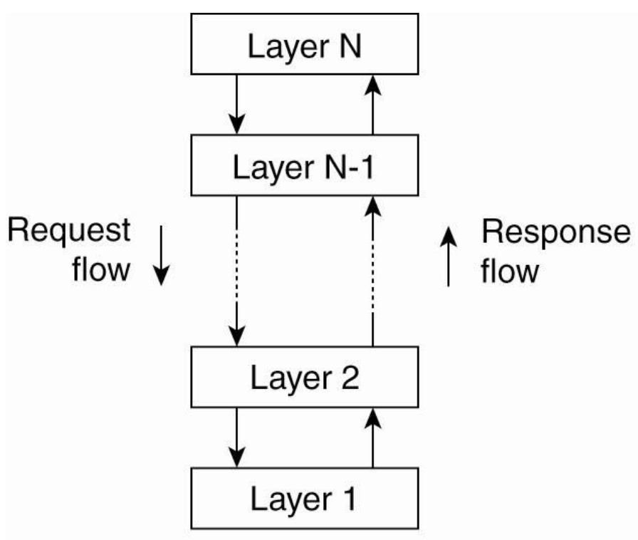
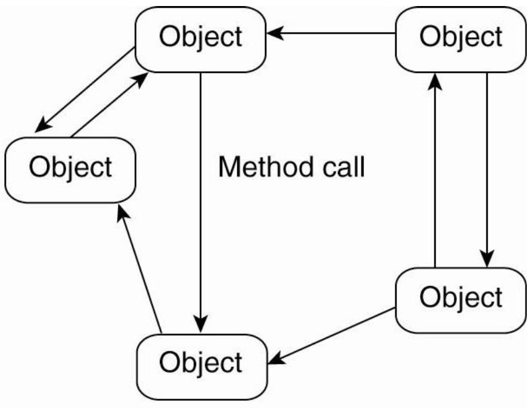
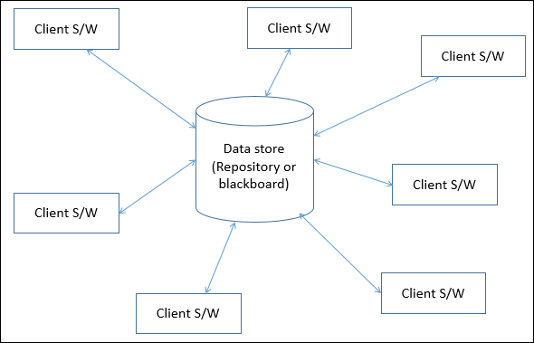
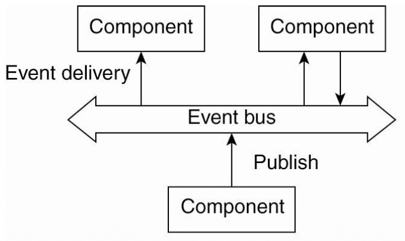
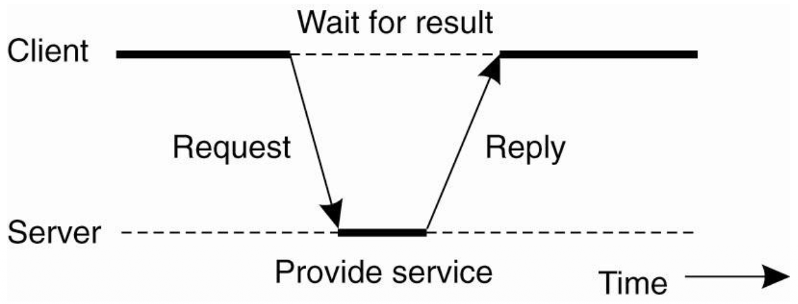
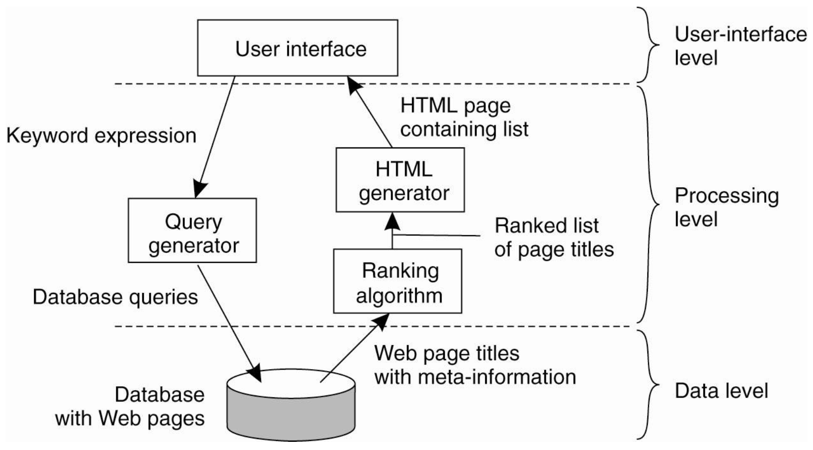
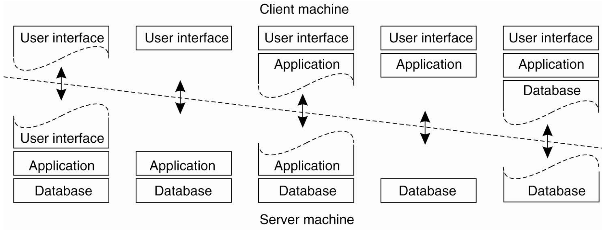

Architecture
==

분산 시스템 설계시 server, client 내부를 어떻게 구성해야 할까?  

Goal of distributed systems

- 아래의 platform은 heterogeneous 할텐데 이를 middleware가 잘 숨겨줄수 있어야해
- Distribution transparency를 제공
- Adaptability 제공(상황에 따라 변화할수 있으면 좋을 거야)

Architecture Styles
--

Software architecture은 sw component들로 구성되어있다. Architecture style의 경우 요소들에 의해 나뉘어진다. 

- component들 끼지 어떻게 연결되어 있는가?
- component간 data를 어떻게 주고 받는가
- 이런 element들이 시스템에 jointly configured 되어있는가?

> 용어 정리
> - Component: A modular unit with well defined required and provided interfaces that is replaceable within its environment(component의 장점으로 볼수 있어)
> - Connector: mechanism that mediates communication, coordination, or cooperation among components

Architecture style의 종류들
1. Layered architectures
2. Object-based architectures
3. Data-centered architectures
4. Event-based architectures

Distributed system의 Goal을 잘 이룰수 있게 해야하지만 trade off도 잘 고려하렴

### Layered Architecture

- 인접해 있는 layer들 끼리만 통신할수 있어야해
- Network쪽에서 많이 쓰인다.
- Interface를 정의해서 지킨다면 바뀌는 layer만 넣다 뻈다 할수 있어 -> maintanence가 쉬워져

### Object-based architecture

- Layered architecture에서 지켜야하는 규율이 느슨해진것
- Component들 끼리 RPC로 연결되어 있어
- Component들이 같은 machine에 있을수도 있고 다른 machine에서 돌아가고 있을수도 있다.

### Data-centered architectures

- 공통 (passice or active) repository에서 process들이 communicate한다고 볼수 있어
- 중앙 repo에 모든 data를 저장해 두기 때문에 다른 component가 죽어있어도 repo에서 data를 꺼내 쓸수 있어
- e.g. web server와 web browser의 관계

### Event-based architecture

- Processes essentially communicate through the propagation of events, which optionally also carry data
- Pub/Sub system
- Process are loosely coupled (장점)
- e.g. IOT system에서 자주 쓰임

### Event-based + Data-centered architectures

- Shared data spaces
- 원래 event based에서는 component가 죽어있으면, 해당 component는 그 데이터를 받을 방법이 아예없었는데 이제 decoupled in time 가능함

System architecture를 구분 할수 있는 다른 관점
-- 

How many distributed systems are actually organized by considering where sw components are placed

1. Centralized architectures (Server-Client)
2. Decentralized architectures  (P2P)
3. Hybrid architectures

### Centralized architecture

- Client-Server model: reply-request의 반복으로 이어나간다. Implemented by protocol

#### Protocol 종류에 따른 차이 

##### Connectionless Protocol

- 장점: Efficient해
- 단점: Not reliable하고 이를 application이 not reliable 한거를 관리해줘야해 
- 그냥 unreliable해서 lost되는 경우 그냥 다시 보내면 되는거 아닌가 할수 있는데 idempotent한 경우는 그렇게 하지 못해
- e.g. UDP 따라서 주로 LAN에서 쓰임

> Idempotent: 반복해서 Operation을 실행해도 되는 경우
> - e.g. "이 계좌에 1000불 보내줘" 요청에 대한 응답이 lost된 경우, 해당 요청을 다시 보낼수 없어 <- Not idempotent한 경우

##### Connection-Oriented Protocol

- Client가 service를 request하면 protocol이 우선 sets up a connection to server
- 장점: 안정적
- 단점: relatively costly
- e.g. TCP 따라서 주로 WAN에서 쓰임

------

#### Main issue in Centralized architectures

특정 component들을 Client에 둘까 Server에 둘까?    

component가 3가지 종류로 나뉘는데 이것들을 어디에 두느냐에 따라 전체적인 system 구성이 달라진다. 

1. **The user-interface level**: input/output을 담당, 주로 client에 구성되는 것이 알반적, 현대에 와서 UI말고도 data를 가공하는 등 많은 role이 추가되었다. 
2. **The processing level**: sw의 core 파트, application 종류에 따라 구현, workload가 아주 vary 하다. (Not many common aspect)
3. **The data level**: 실제 데이터를 관리하고 저장하고 있어, datas are often persistent, 보통 server side에 implementation

예시 

다음과 같이 구성하는 아주 많은 방법이 있어

Single server이 multiple server running on different machines로 replace되는 경우가 많아서 server side solutions도 분산되고 있어.
이에 따라 Server도 sometimes act as a client.

### Decentralized architecture

p.26부터 다시 시작
