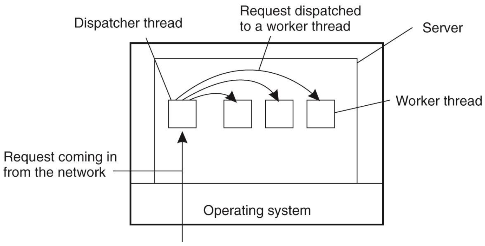
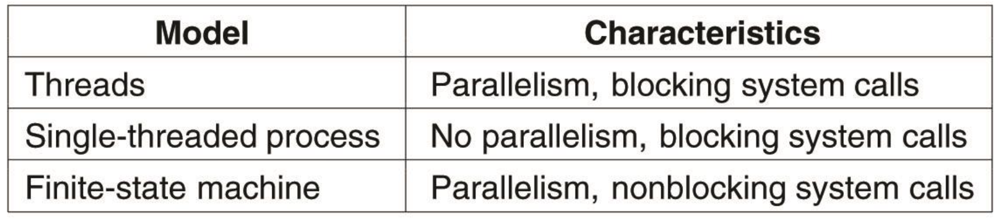
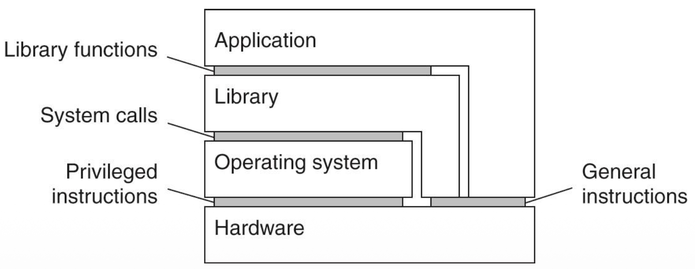
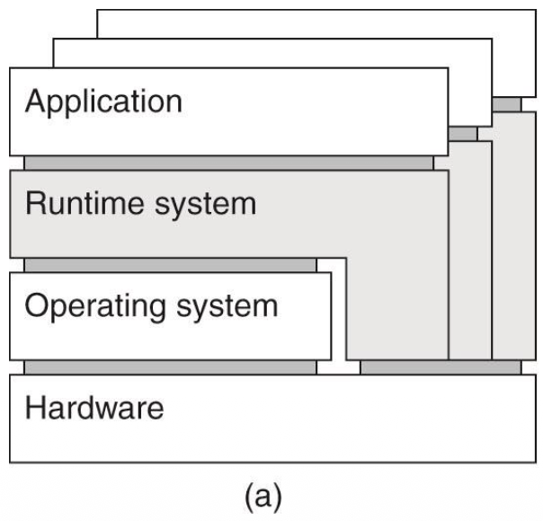
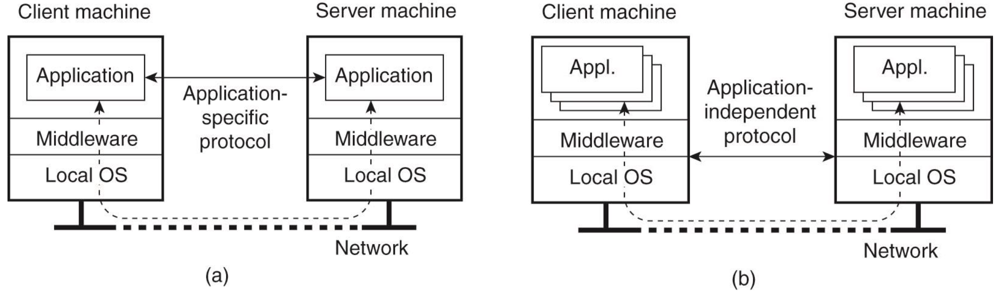
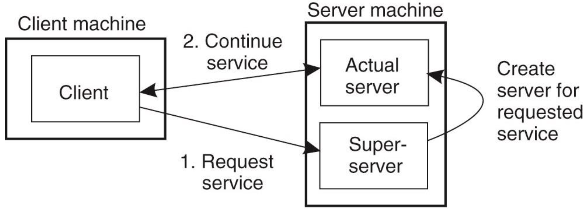
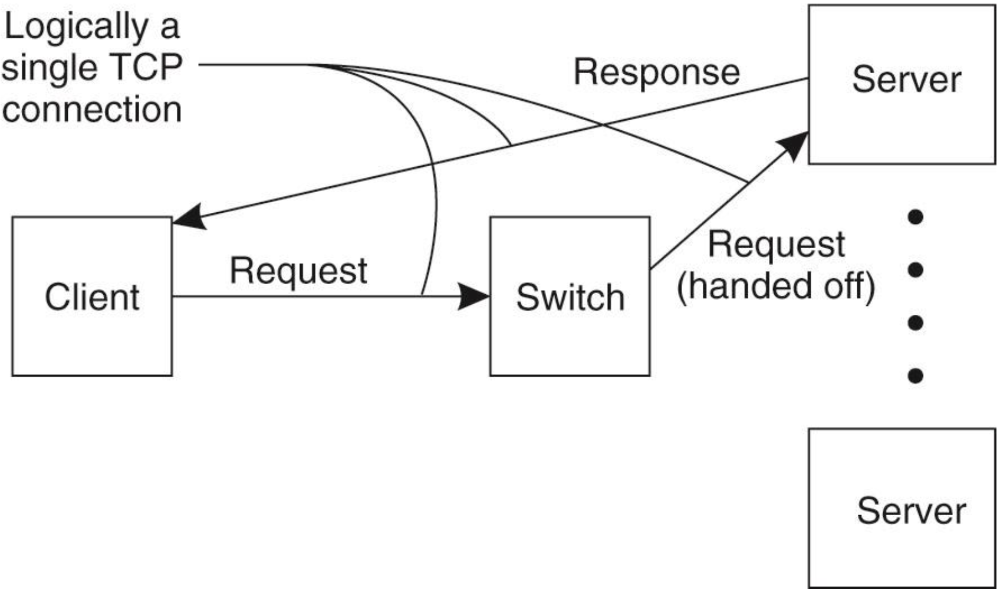
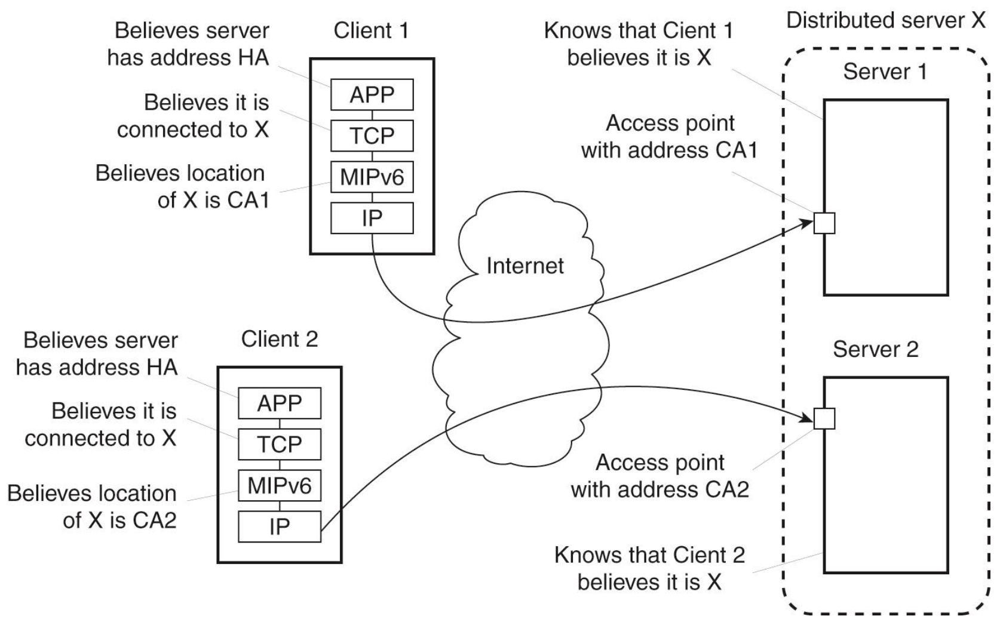
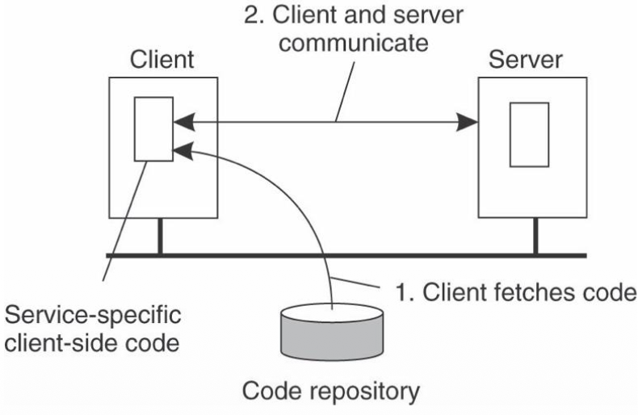
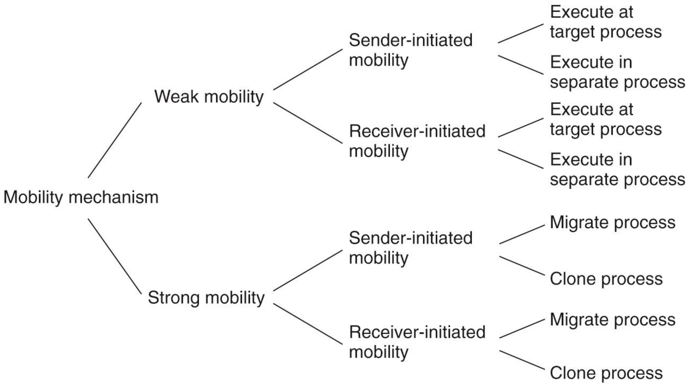

Processes
==

원격지로 떨어져 있는 컴퓨터 사이 process들은 어떤 role을 가지고 있는지 알아보자

Thread
--

Attractive property of a thread for distributed systems

- Thread를 사용하면 blocking process를 여러개 돌릴수 있어
- 더 여러개의 multiple logical connection을 한번에 hold 할수 있어
- Useful for client-server communications

### Client 입장에서 multithreaded clients가 좋은 점

Delay를 숨길수 있다.

- 데이터를 받는 와중에 사용자에게 화면을 뿌려줄수 있다. 
- 여러 server replica로 부터 데이터를 동시에 받을수 있어

### Server 입장에서 multithreaded server가 좋은 점 (서버 얘기)

Dispatcher thread와 Worker thread로 나누어서, Dispatcher은 연결 들어오는걸 계속 처리하고 worker는 client가 요청한 일을 함으로써 high performance를 도모해

### Multithread를 사용하지 않고 서버의 성능을 높이는 법

서버를 하나의 big finite state machine으로 run 하면됨
- 요청이 들어왔을때 cache에 있으면 그대로 response 해주면 됨
- cache에 없으면 block 하지말고 일단 해당 요청의 state를 따로 기록해놓고 다른일을 하러가
- Server가 nonblocking(to be precise. Asynchronous) calls to send and receive

간단히 정리하면 아래와 같다.

Virtualization
--

Extension of **illusion** of simultaneous execution on a singe cpu

- 서로 다른 interface를 사용하는 system간의 소통?일?을 가능하게 해줘
- Mimics the behavior of interface
- 추가적인 단계를 더 거쳐야 하니까 느려지긴 하겠지

### Computer system이 제공하는 Interface의 종류

1. hw-sw 사이에 존재하는 인터페이스
   - Machine instruction that can be invoked by **any program(Application)**
2. hw-sw 사이에 존재하는 인터페이스
   - Machine instruction that can be invoked by **privileged programs(OS)**
3. An interface consisting of system calls offered by OS
4. An interface consisting of library calls(API)

### 3 ways of virtualization

1. Process virtual machine
   - Application을 실행하는데 사용되는 abstract instruction을 제공해주는 runtime system
   - e.g. JVM
   - 
2. Native virtual machine monitor
   - Layer completely shielding the original software
   - hw에 직접 접근해서 더 빠르다
   - 하드웨어만 shielding하니까 보안 문제가 생겼을때 피해 범위를 줄일수 있어
   - 전부다 VMM 위에 올라가 있으니까 hw웨어만 갈아 끼우면 migration이 해결
3. Hosted virtual machine monitor
   - Host OS를 갖는 virtual machine monitor
   - 우리가 흔히 쓰는 VMware 같은 것들

Client 얘기
--

사용자가 원격 서버와 상호작용할 수 있는 수단을 제공해준다. 

1. (a) 서비스를 이용하기 위해 클라이언트 기기(내 PC나 스마트폰)에도 그에 맞는 전용 프로그램(앱)이 설치되어 구동되는 형태 (Fat client)
  - application level protocol이 필요해 (application specific protocol 필요)
2. (b) 클라이언트 기기가 그저 '화면(인터페이스)' 역할만 하는 형태 (Thin client approach)
  - application independent protocol 필요

### Client의 Distribution transparency

Overall하게 client는 remote processes와 communicating하고 있다는 것을 인지하고 있는게 좋긴해,
하지만 분산환경의 performace, correctness issue들이 이런것들을 힘들게 만들어

- Access Transparency: Client stub을 제공함으로써 해결(서버에 있는 실제 함수와 똑같은 이름, 똑같은 파라미터를 가진 함수로 클라이언트 측에 저장해놔)
- Location, migration, relocation(위치관련) Transparency: client의 middleware가 이를 숨겨줄수 있어
- Replication Transparency: client가 work를 replicate되어 있는 서버에서 parallel하게 처리하고 취합하는식으로 할수 있어. 
- Failure Transparency: client middleware단에서 해결해 (e.g. middleware에서 연속적으로 시도하게 하기)
- Concurrency Transparency: client단 보다는 서버단에서 해줘
- Persistency Transparency: client단 보다는 서버단에서 해줘

Server (Focus on Design issue)
--

### General Design Issues

#### 서버의 2가지 정책 

1. Iterative Server: Server itself handles the request
2. Concurrent Server: 요청을 다른 thread나 process에게 넘겨버리고, 난 바로 다른 요청을 처리해

#### Client는 서비스의 endpoint를 어떻게 할 것인가?

- 각 서비스마다 서버를 실행하고 포트를 다 열어놔
  - Assign well known port
  - Dynamically assign end points on demand
- 이러면 서버를 계속 켜놔야 해서 resource 낭비 심해
  - 모든 요청을 받아드리는 슈퍼 서버를 두고 client가 해당 서비스를 요청 할때만 해당 서버를 돌려

#### Server가 일하고 있을때 그만하고 싶어

Simplest Solution: 그냥 서버 꺼버리기

- Better solution: **out-of-band** data를 처리할수 있는 구조로 만들자

> **Out-of-band data**: 긴급할때 쓸수 있는 별개의 connection
> **In-band data**: 일반적인 통신에서 사용되는 normal data

#### Stateless Server

Client의 상태정보를 저장하지 않겠다. 

- Can change its own state **without having to inform any client**
- 서비스의 핵심 동작과는 상관없는 log, 통계, cache 같은 부가적인 정보는 저장하나 이는 **정보가 손실되더라도, 서비스 중단으로 이어지지는 않는**
- 매번 client의 상태 정보를 보내야 하니 요청의 크기가 커지겠지(e.g. 쿠키를 따로 보내줘)
- Stateless이지만 soft state를 가지는 중간 느낌의 서버도 있어
  - client의 state를 저장하긴 하지만 **just for limited time**

#### Stateful Server

Client의 persistent info를 저장, 관리하는 서버

- 장점: performance가 좋아질수 있어
- 단점: 저장하고 있던 state 날아가버리면 큰일남

Stateful, stateless가 기능 구현의 가능, 불가능을 구분짓는건 아니야, 다만 성능의 차이만 있을 뿐 

Server Clusters
--

Collection of server machines connected through a LAN, 주로 Logically 3 tier이지만 아닐수도 있어

### Access transparency 고려하자

Server cluster design의 중요한 목표야

- Single Access Point를 제공함으로써 access transparency를 챙길수 있을거야
- 다만 for scalability and availability, a server cluster may have multiple access points

#### 앞의 Switch를 두고 통신 할때 accessing a server cluster

- Transport layer switches acccept incoming TCP connection requests -> 그 connection을 우리 cluster의 한 서버에 넘겨줘
- 이때 switch의 역할(TCP Connection)(Single Access Point를 유지하기 위한 노력이라고도 볼수 있지)
  - Identifies the best server for handling that request
  - Forwards the requested packet to the selected server
  - The server sends an ack back to the client
    - 다만 요청을 보낸 client는 Access point에 요청을 보낸것 임으로, switch단에서 header의 IP를 갈아끼우는 작업이 필요해
    - These kind of works requires OS level modification

- Load Distribution among servers
  - Round robin
  - Take informed decision
  - content aware request distribution

### Single Access Point Failure 해결해보자

- Solution 1
  - 여러 access point를 둬
  - DNS에서 several address를 return하게 해
  - 단점: Static ip를 가지지 못해 -> 원래 철학과는 맞지 않아

- Solution 2
  - access point는 하나만 존재하지만, 실제 access point를 provide하는 physical server는 여러개 둬

### Client쪽에서 transparency를 높이는 법

1.  분산 서버와 MIPv6 원리

- 개념: Mobile IPv6의 주소 관리 메커니즘을 서버 클러스터에 적용하여 안정적인 접속 지점을 유지
- 핵심 요소:
  - Single Unique Contact Address: 클러스터를 대표하는 단 하나의 가상 IP 주소
  - Access Point (AP): 클러스터 노드 중 하나가 대표가 되어 모든 트래픽을 수신 및 분배
  - Home Agent (HA): 현재 AP 역할을 수행하는 노드의 실제 주소(CoA)를 관리. (서버임)
- 장점: 노드 장애 시 새로운 AP가 주소를 갱신하는 방식으로 Fail-over를 구현하여 서비스 연속성 보장

2.  병목 현상 (Bottleneck Problem)

- 문제점: 모든 트래픽이 HA와 AP를 반드시 거쳐야 하므로, 트래픽이 몰릴 경우 성능 저하와 지연 시간이 발생

3.  해결책: 경로 최적화 (Route Optimization)

- 작동 방식:
  - HA가 클라이언트에게 실제 서버의 주소(CA, Care-of Address)를 전달.
  - 클라이언트는 (HA, CA) 쌍을 로컬에 저장(바인딩 캐시).
- 효과:
  - 직접 통신: 클라이언트가 HA를 거치지 않고 실제 서버(CA)로 데이터를 즉시 전송.
  - 투명성: 클라이언트 애플리케이션은 기존 대표 주소(HA)를 계속 사용하지만, 네트워크 계층에서 실제 주소(CA)로 최적화하여 송신.

> Application 계층에서는 **고정된 대표 주소(HA)**로 통신하고 있다고 착각하지만 하지만 실제 네트워크 전송 직전에 MIPv6 엔진이 목적지 주소를 살짝 **실제 주소(CA)**로 갈아 끼워서 보냄  
> => Client측의 transparency가 생겨
 

### Managing server clusters

- 관리자는 Node에 remote로 login 할수 있어
- Administration machine을 만들고 interface를 제공해

하지만 이렇게 관리해도 서버가 많이 생기면 systematic approach로는 해결할수 없어 -> self managing 할수 있께 하면 어떨까?

### Code Migration (Process)

- 하는 이유
  - Performance Improvement: 사실 대부분의 delay는 IO에서 나와서 큰 효과는 없을수도
  - Dynamically configured distributed system: client가 server에 bind할때 client가 필요한 코드가 서버에 그때 올라가
    - Clients need not have all SW preinstalled
    - Interface만 정해져 있으면, client-server간 protocol implementation을 쉽게 바꿀수 있는 flexibility
  - 단점: security

#### 실제로 어떻게 할까? code migration (Process)

> **Process components**
> - **Code segment:** Instruction들이 모여있는 파트
> - **Resource segment:** Reference to external resources (e.g. files, printers, devices)
> - **Execution segment:** Stores current execution state of a process (e.g.private data, stack, pc)

##### Mobility Model

Code Migration에는 2가지 mobility model이 존재

1. Week vs Strong 
   - **Week mobility**
     - **Code segment** + some init data만 보내기
     - Predefine된 특정 시점부터만 실행 가능해
     - 구현하기 편해
   - **Strong mobility**
     - **Execution segment**까지 같이 보내
     - 새로 옴겨진 machine에서 그 전 machine에서 작업하던 것을 이어서 할수 있어
     - Much more general approach이지만 그만큼 구현하기 어려워

2. Sender-initiated vs Receiver-initiated
   - **Sender-initiated mobility**: 내가 만든 코드를 네 쪽으로 보낼게!
   - **Receiver-initiated mobility**: 코드 좀 보내줘!
   - receiver가 좀 더 간단한 경향이 있다. (client가 server에 uploading하는 거는 register되어 있어야 하고 authentication이 필요하니까)

더 디테일 하게 나누면 다음과 같이 나눌수 있다. 

- Execution by a target process: 이미 타겟 머신에서 돌고 있는 프로세스 Address space 안으로 코드가 들어와 실행
  - 새로운 process 생성 안해도 돼 (overhead 적다)
  - 새로운 process로 격리되어있지 않아서 보안적으로 위험해
- Execution by a separate process
- Moving a running process: 원래 기기에 있던 프로세스를 완전히 중단하고 모든 상태를 타겟 기기로 옮겨
- Remote cloning: 원래 기기의 프로세스는 그대로 실행되게 놔둬
