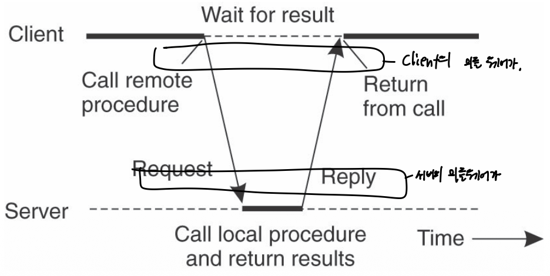
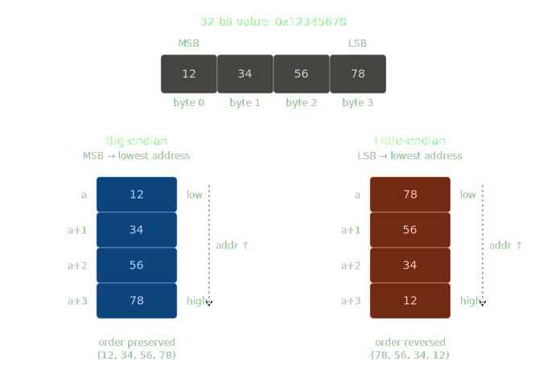
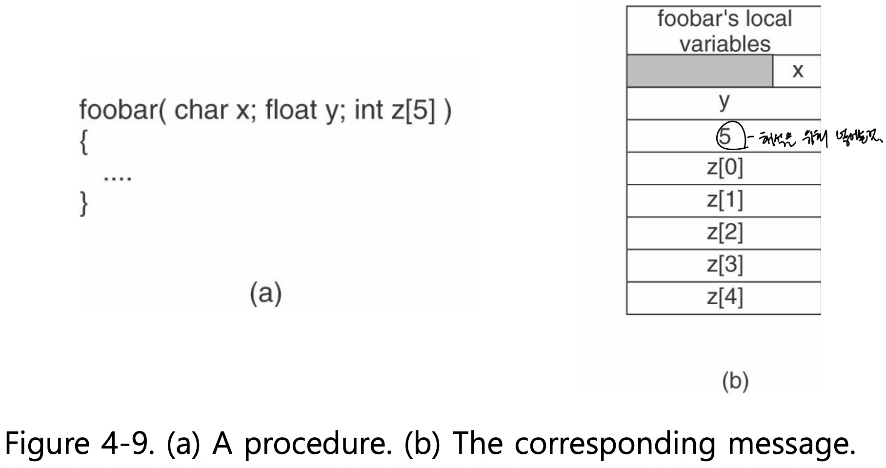
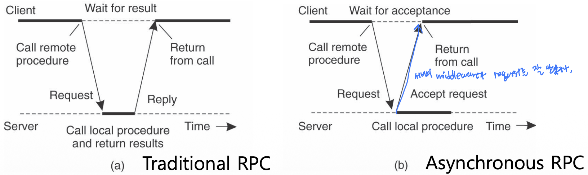
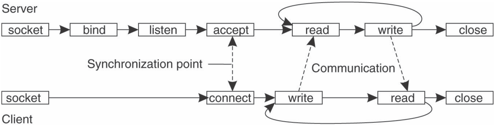
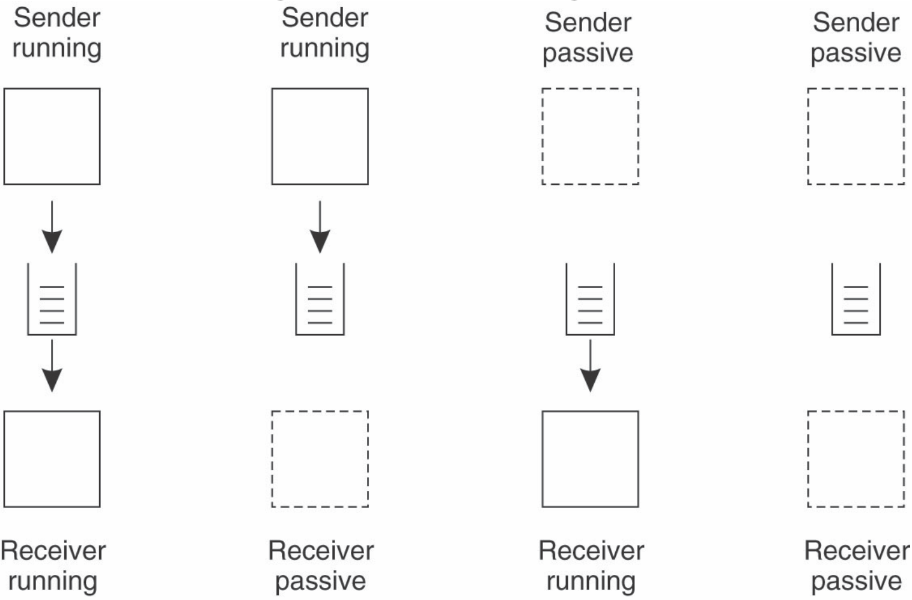
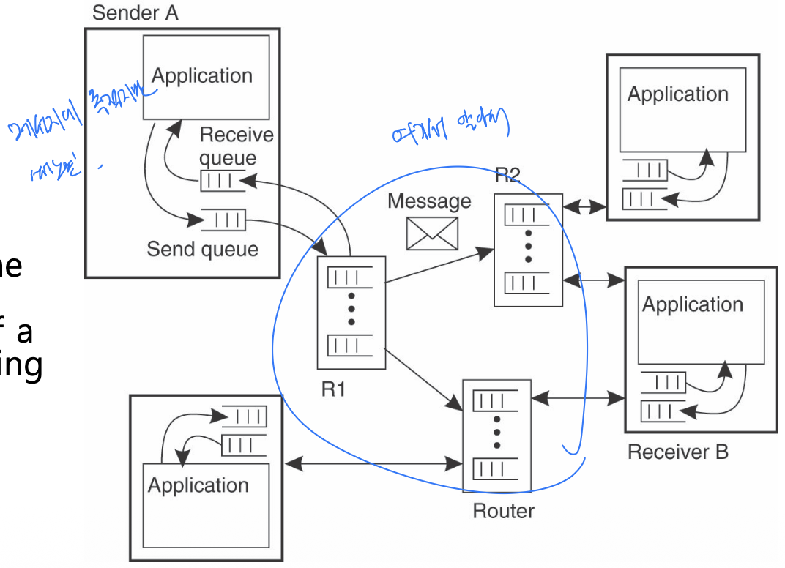
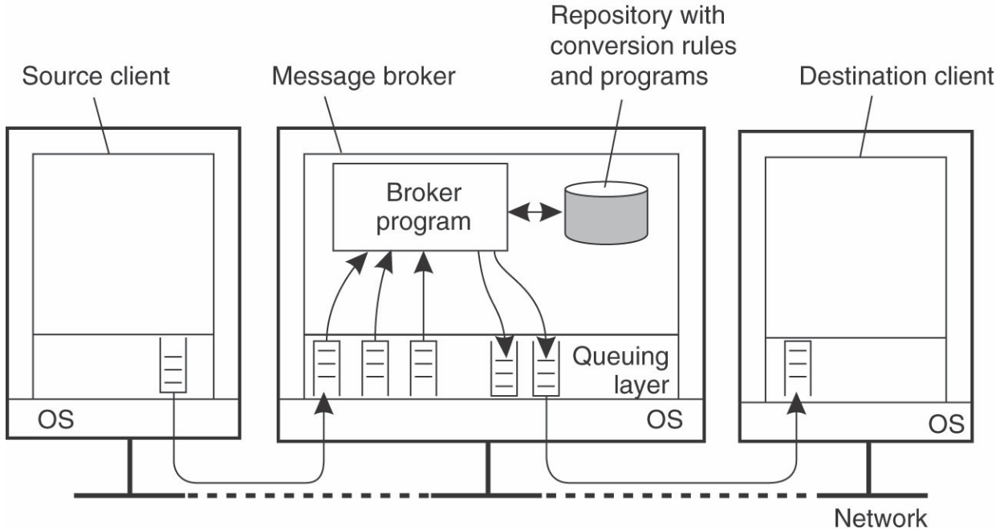

Communication
==

Persistence yes/no
async       yes/no
중요한거 같아

RPC
--

- **Motivation**: Process간 message exchange에서 communication이 conceal되지 않아 (Transparency가 없음)
- **Idea**: Middleware를 둬서 transparent하게 다른 machine에 있는 procedure(function)을 호출할 수 있게해
- **구현에 문제가 될것들**
  - function들은 ran on different address spaces
  - parameter와 결과들은 heterogeneous machine간 주고받아해
- 일반적으로 **Transient**/**synchronous**한 방식
- 사용성은 좋은데 middleware의 처리가 많아

### Parameter Passing 방법들

- **Call by value**: Simply copied to the stack - RPC에서 문제 안됨
- **Call by reference**: Pointer to a variable - RPC에서 문제 됨
  - 문제 해결을 위해, 그 address에 있는 데이터를 보내는 식으로 할수 밖에 없어
- **Call by copy/restore**: Stack에 있는 data를 overwrite하고 그 함수가 끝날때 메모리에 있는 값을 update해줘
  - 대부분의 환경에서 call by reference와 같은 효과를 가진다. 

RPC의 경우에는 call by reference를 call by copy/restore을 써서 parameter passing을 해
- 만약 middleware가 어떤게 input/output인지 알고 있으면, 서로간 전달되는 message의 크기를 줄일수 있어 
- 다만 pointer가 얽힌 것과 같은 복잡한 자료구조의 경우는 쉽게 해결할수 없어 아래와 같은 방법을 쓴다. 

**양측에 specification을 정의하고 packing(marshalling)을 하는식으로 처리하자)**
- 메세지 포맷: e.g. 어떤 변수가 어느 위치에, 몇 바이트로 들어가는지
- 데이터 표현 방식 약속: e.g. Endian결정, 부동소수점은 어떻게 할건지

> Endian 예시
> - 숫자만 영향 받고 string은 영향받지 않음으로 그냥, byte stream전체를 뒤집는 방식으로는 해결되지 않아
> 

요런것들을 middleware(stub)에서 하게 하자

### Asynchronous RPC

- 서버가 일을 처리하지 않고 받기만 하면 바로 return해줘
- 다른 variant of asynchronous RPC 존재
  - Oneway RPC: client does not wait for an acknowledgement from the server
  - Reliability가 보장되지 않은 상태에서 하면 client가 실제로 요청이 processed 됐는지 몰라
  - 주로 같은 요청을 주기적으로 보내는 경우 이런식으로 씀

Socket
--

### Berkeley Socket

- **Socket**: Transport layer의 서비스를 사용하기 위한 수단, conceptual communication end point
- **TCP Socket Primitive**
  - **socket**: caller creates a new communication end point(소켓을 만들어)
  - **bind**: OS에게 특정 port로 들어오는 message만 받겠다고, 이를 처리해 달라고 하기. 
    - Associates a local address with the newly-created socket
    - Client side에선 필수적이지 않아. OS가 dynamically allocate port when the connection is up
  - **listen(Server side)**: Non-blocking call that allows the local OS to reserve enough buffers for a 정해진 최대 connection을 수 만큼
  - **accept(server side)**: Blocks the caller until a connection request arrive
    - Request가 도착하면, 서버의 OS가 새로운 소켓을 만들고 caller한테 return 해줘
  - **connect(client side)**: caller가 보낼 connection request를 보내기 위한 transport-level address를 정해
  - **send, receive**: Connection이 완성되면 message를 주고 받는거
  - **close**: closing a connection

### Message-oriented **Persistent** Communication

Queuing system을 사용해서 asynchronous하게 해주겠다. 
  
Message queuing system or message-oriented middleware(MOM)
- Queue를 사용해서 persistent asynchronous communication을 가능하게 해줘
- Intermediate-term storage capacity for messages
- Application has its own queue, queues are private or shared (구현하기 나름)
- 성공적으로 send 됐다는거만 알고 실제로 받았는지는 몰라 (단순 queue에만 넣어논거니까)
- 양쪽이 둘다 online일 필요 없어
- e.g. E-mail, workflow, groupware, batch processing, etc...

그림과 같이 4가지 상태 다 가능하다. 

#### Basic Interface

- **Put**: Append a message to a specified queue (nonblocking call, 구현에 따라 달라질수 있어)
- **Get**: Block until the specified queue is nonempty (blocking call, 구현에 따라 달라질수 있어)
- **Poll**: Nonblocking variant of 'get' primitive
- **Notify**: queue에 message가 들어오면 알려줘

#### Restriction

- Same machine이거나 near by same LAN이여야 작동해 (범위가 좁다)
- Message에 destination queue에 대한 specification이 필요해
- Message-queuing system(middleware) is responsible for the message transfers

#### General Architecture

Queue Managers

- Queue manager interacts directly with the application
- **relay**: special queue managers that operate as router가 존재해
  - DNS Server와 같은 naming service가 없어서 topology 관리가 필요해 (topology of the queuing network is static)

##### Relay

Application은 queue manager만 알고, 주소정보는 relay들 끼리만 알고 있게 해
- Application은 바뀐 주소 정보를 몰라도 되게 해 
- Relays allow for secondary processing of messages 
  - logging for security, fault tolerance, transforming messages 

#### Message brokers

Queue를 사용하는 이점을 확장시키겠다: message의 중계자, 다양한 포멧을 다루고 conversion을 수행해주겠다. 

- Acts as an application-level gateway
- convert incoming messages so that they can be understood by the destination application
- Message queuing system 입장에서, just another application일 뿐이야
- Enterprise Application Integration (EAI) 환경에서도 쓸수 있다.

### Stream-oriented communication

기존에는 discrete data들만 다뤘는데 연속적으로 전달되어야 하는 stream은 뭐가 중요한가
- e.g. sound, multi-media, movie
- Timing plays a crucial role
- To capture timing aspects, there are different transmission modes

1. Asynchronous transmission mode: Timing constraint가 없다
2. Synchronous transmission mode: Timing constraints 존재, maximum end-to-end delay가 정의되어 있어 e.g. sensor data
3. Isochronous transmission mode: Timing constraints 존재, maximum, minimum end-to-end delay 정의 e.g. multimedia systems

