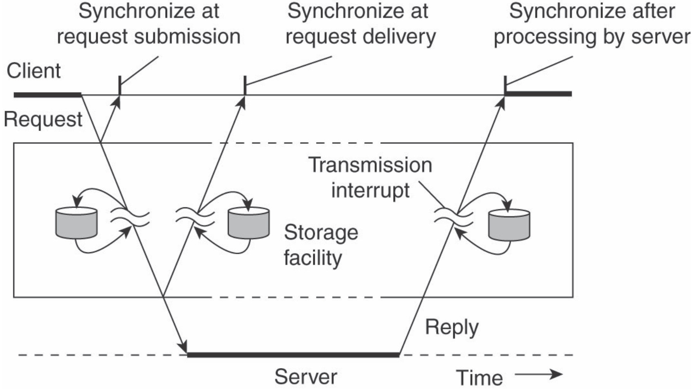

Communication
==

Layered Protocol에서의 middleware protocol
--

  
책에선 크게 2가지로 분류를 해놓긴 함
1. Protocol that provides various middleware service (e.g. authentication, commit, distributed locking protocols)
2. High-level communication service(메세지 전송 그 이상을 해줌, kinda more specific) (e.g. RPC, Multimedia realtime, multicast service)

Communication types 분류
--

크게 3가지로 분류할수 있다. 

1. Persistent vs Transient
   - Persistent Communication: Reciever가 깨어있지 않아도 middleware가 저장하고 있어서 message를 받을수 있어 (e.g. email)
   - Transient Communication: Reciever가 무조건 꺠어있어야 받을수 있어 (e.g. TCP, UDP)
2. Synchronous vs Async
   - Sync: 상대방의 응답을 기다려
     - 3 Synchronization points
     - 
     1. Middleware notifies that it will take over transmission
     2. Request has been delivered to the target recipient
     3. until its request has been fully processed
   - Async: 상대방의 응답을 기다리지 않아
3. Discrete vs Streaming Communication
  - 

