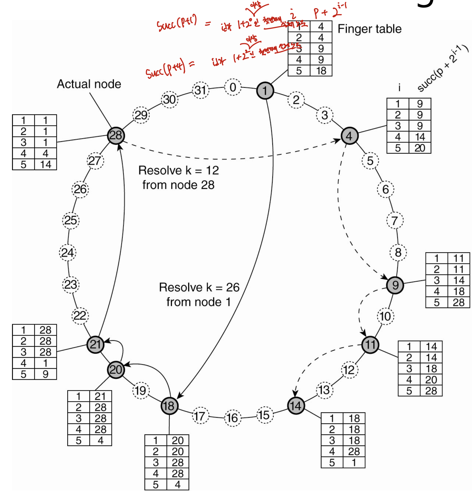

# 분산시스템 — Naming Part 1 (Names, Identifiers, Addresses & Flat Naming)

> 이 문서는 Tanenbaum의 *Distributed Systems*를 기반으로 한 강의(슬라이드 5번부터 15번까지)를 정리한 것이다.
> 다루는 범위는 Names, Identifiers, Addresses의 개념에서 시작하여, Naming system의 의미를 거쳐, Flat naming의 여러 해법(Broadcast, Multicast, Forwarding pointer, Home-based)과 Chord(DHT), 그리고 Chord의 finger table 유지·갱신까지이다.
> 이 문서는 5장 Naming의 첫 번째 강의를 정리한 것이며, 두 번째 강의 정리본인 `dsc_ch5_pt2.md`로 이어진다.

분산 시스템에서는 우리가 사용하려는 리소스가 한 컴퓨터가 아니라 원격지의 여러 컴퓨터에 흩어져 있다. 그 리소스를 이름(name)으로 지칭하고, 주어진 이름으로부터 그 리소스를 찾아가야 한다. 이번 강의는 그 이름의 종류를 먼저 정리한 뒤, 이름 안에 아무런 위치 정보가 없는 Flat name을 어떻게 찾아갈 것인가에 대한 해법들을 차례로 살펴본다.

---

## 1. Names, Identifiers and Addresses

### 이름(name)의 세 갈래

이름이라는 큰 개념 안에는 특별한 성질을 가지는 이름들이 있다. 강의에서는 그중에서도 분산 시스템에서 핵심적으로 쓰이는 두 가지, 즉 주소(address)와 식별자(identifier)를 특별히 강조하였다.

- **Address**: 액세스 포인트(access point)의 이름이다. 우리가 찾으려는 리소스 자체의 이름이 아니라, 그 리소스에 접근하기 위해 먼저 필요한 액세스 포인트의 이름이다. 여기서 액세스 포인트는 리소스에 접근하는 통로가 되는 별도의 특수한 엔티티이며, 컴퓨터가 액세스 포인트라면 그 주소는 IP 주소와 포트 번호의 조합으로 표현된다. 주로 컴퓨터가 그 대상이 되며, 컴퓨터의 이름은 IP 주소로 대표된다.
- **Identifier**: 아래의 세 가지 유일성 조건을 모두 만족하는 이름이며, 이름의 특수한 부분집합이다.
- **Human-friendly name**: 사람이 읽기 편한 이름이다.

> 강의에서는 "이름 중에 특별한 성질을 갖는 이름이 두 가지 있다"라고 하며 address와 identifier를 묶어서 제시하였다. address는 리소스 자체가 아니라 접근 경로(액세스 포인트)의 이름이라는 점이 핵심이다.

### True identifier의 세 가지 성질 (★ 핵심 암기)

어떤 이름이 아래의 세 조건을 모두 만족하면 진짜 식별자(identifier)이다.

1. 하나의 식별자는 최대 하나의 엔티티만 가리킨다.
2. 각 엔티티는 최대 하나의 식별자로만 가리켜진다.
3. 식별자는 항상 같은 엔티티를 가리키며, 따라서 식별자는 절대로 재사용되지 않는다(never reused).

결론적으로 어떤 주소가 다른 엔티티로 재할당(reassign)될 수 있다면, 그 주소는 식별자로 사용할 수 없다. 이것은 세 번째 조건을 위반하기 때문이다.

### 강의 예시 — 사람을 가리키는 식별자 후보

강의에서는 한 사람을 가리키는 식별자로 무엇이 적합한지를 여러 후보로 따져 보았다.

| 후보 | 조건1 (한 ID→한 엔티티) | 조건2 (한 엔티티→한 ID) | 조건3 (재사용 안 됨) | 식별자 가능? |
|---|---|---|---|---|
| 전화번호 | (애매) | ✗ 한 사람이 여러 번호 보유 | ✗ 명의 변경으로 새 주인에게 넘어감 | **불가** |
| 사람 이름 | ✗ 동명이인 존재 | ✗ 별명·개명 | — | **불가** |
| 주민등록번호 | ✓ | ✓ | ✓ 재사용 안 됨 | **가능** |
| 생체정보(지문·홍채) | ✓ 사람마다 고유 | ✓ | ✓ | **가능** |

전화번호가 식별자가 되지 못하는 결정적인 이유는 세 번째 조건인 재할당 때문이다. 전화기는 사람에게 접근하는 액세스 포인트이므로 그 이름인 전화번호는 주소는 될 수 있지만, 명의가 바뀌면 같은 번호가 다른 사람에게 넘어가므로 식별자는 될 수 없다. 반면 주민등록번호는 지금까지 재사용되지 않으므로 식별자의 역할을 할 수 있고, 지문이나 홍채 같은 생체정보도 사람마다 고유하여 식별자가 될 수 있다.

> 전화번호를 바꾼 뒤 한동안 전 주인에게 오던 연락을 받는 경험이 바로 조건 3(재할당)의 위반을 보여 준다. 슬라이드의 "전화번호 ↔ 사람" 예시가 가리키는 것이 이것이다.

### 표현 방식: 기계 친화 vs 사람 친화

주소와 식별자는 유일성과 관리의 편의가 중요하기 때문에, 사람이 읽기 편한 형태보다는 주로 기계가 읽기 쉬운(machine-readable) 숫자로 표현한다. 이더넷 주소(Ethernet address)와 메모리 주소(memory address)가 그 예이다. 반면 human-friendly name은 사람이 읽기 편하도록 문자열(character string)로 표현하며, 유닉스(UNIX) 파일 이름과 DNS 이름이 그 예이다.

대표적인 사례는 숫자로 된 IP 주소와 사람 친화적인 도메인 네임의 관계이다. 원래 숫자로 된 IP 주소를 사람이 기억하고 읽기 편하도록 문자열로 매핑한 것이 도메인 네임이고, 그 매핑을 담당하는 것이 DNS이다.

---

## 2. Naming System의 개념

### 정의 (★ 오해 주의)

Naming system은 이름을 짓는 시스템이 아니다. 이름은 이미 어떤 방식으로든 지어져 있고, Naming system은 특정 이름을 가지는 리소스를 찾아주는 시스템이다. 정확히 말하면, 이름(name)이나 식별자(identifier)가 주어졌을 때 그것을 주소(address)로 연결(resolve)해 주는 시스템이다.

### 왜 주소부터 찾는가

이름이나 식별자를 가진 리소스에 접근하고 싶다면 먼저 주소를 찾아야 한다. 주소는 액세스 포인트의 이름이므로, 결국 액세스 포인트를 먼저 찾는 것이 핵심이다. 액세스 포인트만 찾으면 그 안의 리소스에 접근하는 것은 쉽다. 따라서 분산 시스템에서 naming, 즉 name resolution은 어떤 이름의 주소인 액세스 포인트를 찾아가는 과정이다.

### Name-to-address binding

Naming system은 "이 이름은 이 주소에 해당한다"라는 name-to-address binding 정보를 유지한다. 대표적인 사례는 DNS이다. DNS는 도메인 네임을 컴퓨터라는 액세스 포인트의 주소인 IP 주소로 변환하며, DNS 서버가 이 binding을 유지하고 제공한다.

### 세 가지 naming system 분류 (★ 핵심)

이름의 종류에 따라 resolution 과정이 달라진다.

| 분류 | 이름 짓기 | 찾아가기(resolution) | 비고 |
|---|---|---|---|
| **Flat naming** | 쉬움 (규칙 없이 마구) | **어려움** | 구조 없음 |
| **Structured naming** | 규칙(룰) 따라야 함 | 비교적 쉬움 | 계층적 (예: DNS, 파일 경로) |
| **Attribute-based naming** | 규칙 따라야 함 | 비교적 쉬움 | 속성으로 검색 |

핵심적인 trade-off는 다음과 같다. flat name은 짓기 쉬운 대신 찾기 어렵고, structured naming과 attribute-based naming은 정해진 규칙을 따라야 하는 제약이 있는 대신 찾기 수월하다. 이번 강의에서는 그중 가장 다루기 까다로운 Flat naming을 살펴본다.

---

## 3. Flat Naming — 단순 해법들

### 정의

Flat name은 구조가 없는 이름(unstructured name)이며, 이름 안에 의미나 구조가 전혀 없다. 식별자가 그저 무작위 비트 스트링(random bit string)이어서, 이름만 보아서는 그 리소스에 대해 아무것도 알 수 없다. 특히 flat name은 그 엔티티의 액세스 포인트를 어디서 찾을지에 대한 정보를 전혀 담고 있지 않다. 따라서 찾기(resolution)가 까다롭고, 이 단원 전체는 "그렇다면 어떻게 찾을 것인가"에 대한 해법의 모음이다.

### 3-1. Broadcasting

중앙 서버가 없는 환경, 예를 들어 P2P 환경에서는 이름에 아무 단서가 없으므로 broadcast를 할 수밖에 없다. 동작 방식은 "이 이름이나 식별자를 가진 노드가 누구인가?"라는 request를 모든 노드에 뿌리고, 해당 엔티티를 가진 노드가 응답할 때까지 기다리는 것이다. 이 방식은 LAN에서 제공된다.

실제 예로는 ARP(Address Resolution Protocol)가 있다. ARP는 IP 주소만 알고 있을 때 그 머신의 데이터 링크(이더넷) 주소를 찾으며, 네트워크 프로토콜 계층 중 아래쪽 계층에서 동작한다. broadcast의 범위는 LAN 내부로 한정되며, 라우터가 그 범위 밖으로의 전파를 막는다. 단점은 적용 범위가 커질수록 비효율적이라는 것이며, 전 세계의 모든 프로세스가 broadcast를 한다면 네트워크가 버티지 못할 만큼 심한 혼잡(congestion)이 발생한다.

> 모든 flat name의 주소를 가진 중앙 서버가 있다면 그 서버에 물어보면 되므로 broadcast는 필요하지 않다. broadcast는 그러한 서버가 없을 때의 이야기이다.

### 3-2. Multicasting

Multicast는 broadcast의 범위를 줄이는 방법이며, 제한된 호스트 그룹(restricted group of hosts)만 request를 수신한다. 동작 방식은 다음과 같다. 이름 찾기 전용 multicast 주소를 하나 할당하고, 찾기 메시지를 그 주소로 전송하면, 그 주소에 join한 노드들만 메시지를 수신하고, 그중 해당 리소스를 보유한 노드가 응답한다. 전제 조건은 이름을 관리하는 노드들이 모두 같은 multicast 주소에 join해 있어야 한다는 것이며, 하나의 multicast 주소가 general location service의 역할을 한다.

예를 들어 직원마다 모바일 컴퓨터를 가진 조직을 생각해 보자. 어떤 프로세스가 컴퓨터 A를 찾고 싶으면 그 조직에 할당된 multicast 그룹으로 request를 보내고, A가 연결되어 있으면 자신의 현재 IP 주소로 응답한다.

> multicast에서 모든 노드가 메시지를 받는 극단적인 경우가 바로 broadcast이다. 두 방식 모두 결국 "누가 가지고 있는가?"라는 질문을 뿌리는 방식이며, multicast는 그 범위를 좁혀 준다는 점만 다르다.

### 3-3. Forwarding Pointers (★ 이동 엔티티 대응)

Forwarding pointer는 엔티티의 액세스 포인트가 바뀌는 경우, 즉 컴퓨터가 옮겨지는 경우에도 클라이언트가 같은 이름이나 주소로 계속 접근할 수 있게 하는 방법이다.

**원리(Principle)**

- 엔티티가 A에서 B로 이동하면, A에 "B로 가라"는 참조(forwarding pointer)를 남긴다.
- 이 참조는 A에 띄워 두는 전달 전용 프로세스로 구현하며, 이 프로세스는 같은 리소스를 찾는 요청이 들어오면 그 요청을 B로 전달하는 역할을 한다.
- 클라이언트는 여전히 A로 접근하고, A가 그 요청을 B로 전달하거나 B의 위치를 알려준다.
- B에서 C로 또 옮기면 또 포인터를 남기고, 그 결과 액세스 포인트의 이력이 체인(chain)으로 남는다(A에서 B, B에서 C로 이어진다).

**단점(Drawbacks) ★**

1. 이동이 매우 잦은(highly mobile) 엔티티는 체인이 너무 길어져 탐색 비용을 감당할 수 없게 된다(prohibitively expensive).
2. 중간 경유지인 예전 액세스 포인트들을 계속 유지해야 하므로, 관리 비용이 증가한다.
3. 끊어진 링크(broken link)에 취약하다. 체인의 중간이 끊기면 엔티티를 아예 찾지 못하게 되며, 체인이 길수록 실패할 확률이 높아진다.

따라서 이 방법은 견고하지(robust) 않은 방법이다.

### 3-4. Home-based Approaches (★ Mobile IP)

Home-based approach는 이동 엔티티에 대응하는 또 다른 방법이며, 대규모 네트워크에서 모바일 엔티티를 지원하는 인기 있는 방식이다.

**핵심 개념**

- **Home location**: 엔티티의 현재 위치를 추적하는 장소이다.
- 대표적인 예는 Mobile IP이다. 이것은 IPv6에서 다루는 기술이며, 이전 챕터에서 이미 다룬 내용이다.
- **Home agent**: 홈 네트워크에 있으며, 엔티티의 현재 위치 정보를 보유한다.
- **Care-of address**: 모바일 호스트가 다른 네트워크로 이동할 때마다 받는 임시 주소이다. 모바일 호스트는 이 주소를 home agent에 등록(register)한다.
- 하나의 IP 주소로 오는 통신은 일단 home agent로 향한다.

**Resolution 절차 (Figure 5-3, 4단계) ★**

1. 클라이언트가 호스트의 이동 사실을 모른 채 패킷을 호스트의 home으로 보낸다.
2. Home agent가 현재 위치를 조회하고, 호스트가 이동했으면 클라이언트에게 현재 주소(care-of address)를 알려준다.
3. 처음 보낸 패킷은 home agent가 현재 위치로 터널링(tunnel)하여 전달한다.
4. 그 다음 패킷, 즉 두 번째 패킷부터 클라이언트는 현재 위치로 직접 전송한다.

**장점과 단점**

호스트가 이동하여 주소가 바뀌어도 클라이언트는 같은 홈 주소나 이름으로 계속 접근할 수 있다는 것이 장점이다. 주소 변경은 미들웨어가 처리하므로, 애플리케이션은 그 변경을 모르는 상태로 투명하게(transparent) 유지된다. 반면 단점은 지연(delay)이다. 모든 클라이언트는 매번 처음에는 반드시 home agent를 거쳐야 한다.

> 강의의 지도 예시가 이 지연을 잘 보여 준다. 어떤 호스트의 home이 미국에 있고 클라이언트는 동남아에 있는데, 호스트가 남아프리카로 이동했다고 하자. 호스트가 설령 클라이언트의 바로 옆으로 이동했더라도, 클라이언트의 첫 접근은 멀리 있는 home agent까지 갔다 와야 하므로 불필요한 지연이 발생한다.

> forwarding pointer와 home-based 방식은 둘 다 위치가 바뀐 엔티티를 같은 이름으로 접근하게 해 주는 기술이다. 이름이 flat인지 structured인지는 본질이 아니며, 이 기술은 structured name에도 적용할 수 있다. 단지 교과서의 분류상 flat naming 단원에 있을 뿐이다.

### Flat naming 단순 해법 비교 요약

| 방법 | 동작 핵심 | 적용 상황 | 주요 단점 |
|---|---|---|---|
| Broadcast | "누가 가졌어?"를 전체에 뿌림 | LAN, 중앙서버 없음 (ARP) | 네트워크 커지면 비효율 |
| Multicast | join한 그룹에만 뿌림 | broadcast 범위 축소 | 노드들이 미리 join 필요 |
| Forwarding pointer | 이동 시 A에 B 참조 남김 (체인) | 이동 엔티티 | 체인 길어짐·중간노드 유지·broken link 취약 |
| Home-based (Mobile IP) | home agent가 현재 위치 추적 | 대규모, 이동 엔티티 | 항상 home agent 경유 → delay |

---

## 4. Flat Naming — Distributed Hash Tables (Chord)

### 위치 맥락: Chord는 flat naming의 "룰 있는" 해법

Chord는 서버가 없는 P2P 시스템이므로, 리소스를 관리하는 중앙 주체가 없고 모든 peer가 나누어서 관리한다. broadcast와 multicast가 규칙이 없는 답이라면, Chord는 누가 무엇을 관리하는가에 대한 규칙을 정해서 broadcast 없이 찾을 수 있게 한다.

### 기본 정의 (★ 암기)

- **m-bit identifier space**: 노드와 엔티티의 key 모두에 무작위 m비트 식별자를 부여한다.
- **succ(k)**: key `k`를 가진 엔티티는 `id >= k`인 노드 중 가장 작은 id를 가진 노드의 관할에 속한다. 이 노드를 succ(k)라고 하며, 이 노드가 곧 그 리소스의 액세스 포인트이다. 노드들은 링을 이루므로, `k`가 가장 큰 id를 가진 노드를 넘어서면 succ(k)는 다시 가장 작은 id를 가진 노드로 되돌아온다.
- 각 노드 `p`는 자신의 successor인 succ(p+1)과 predecessor인 pred(p)를 알고 있다.

이름을 key로 변환할 때, 모든 노드가 동일한 해시 함수를 사용하여 이름을 key `k`로 변환한다. 이 변환은 로컬에서 계산하므로 별도의 질의가 필요하지 않다. 이렇게 얻은 `k`로 `lookup(k)`를 호출하면 succ(k)의 주소가 반환되고, 그 주소로 리소스에 접근하면 된다.

### 기본 lookup: 링을 따라 도는 방식 (핑거 테이블 이전)

- Chord에 참여하는 peer들은 논리적으로(logically) 링(ring) 형태로 연결되어 있다.
- 이 링 구조에서 하나의 peer가 알고 있는 다른 peer의 정보는 자신의 predecessor와 successor 두 개뿐이며, 그 외의 노드에 대한 정보는 가지고 있지 않다.
- 따라서 핑거 테이블이 없으면, 어떤 peer가 key `k`를 찾고 싶을 때 lookup 메시지를 자신의 successor에게 보낼 수밖에 없다.
- lookup 메시지를 받은 successor는 자신이 그 key를 담당하는지 확인하고, 담당하지 않으면 다시 자신의 successor에게 그 메시지를 전달한다.
- 이렇게 lookup 메시지가 링을 따라 한 칸씩 돌다가 해당 key를 담당하는 노드에 도달하면, 그 노드가 응답한다. 이것이 Chord의 가장 기본적인 name resolution 과정이다.
- 이 방식은 최악의 경우 링을 거의 한 바퀴 돌아야 하므로 O(N)의 비용이 든다. 핑거 테이블은 바로 이 과정을 단축하기 위한 장치이다.

### Finger Table (★ 핵심 식)

핑거 테이블은 successor 방향으로 한 칸씩 도는 대신 중간을 건너뛰기(skip) 위한 라우팅 테이블이다.

- 노드 `p`의 핑거 테이블은 FT_p라고 하며, 최대 m개의 엔트리를 가진다. 인덱스 i는 1부터 m까지이며, 0부터 시작하지 않는다.
- 정의식은 다음과 같다. **FT_p[i] = succ((p + 2^(i-1)) mod 2^m)**
- i번째 엔트리는 p보다 최소 2^(i-1)만큼 뒤에 있는 첫 번째 노드를 가리킨다. `p + 2^(i-1)`이 주소 공간의 최댓값을 넘어서면 링을 따라 처음으로 되돌아오므로(mod 2^m), 엔트리가 자기보다 작은 id를 가리킬 수도 있다.

| i | p + 2^(i-1) | 대상 |
|---|---|---|
| 1 | p+1 | 바로 다음 successor |
| 2 | p+2 | succ(p+2) |
| 3 | p+4 | succ(p+4) |
| 4 | p+8 | succ(p+8) |
| 5 | p+16 | succ(p+16) |

엔트리 사이의 거리가 2의 지수승으로 늘어나므로, 한 노드는 가까운 노드뿐 아니라 멀리 있는 노드까지 지수적으로(exponential) 알게 된다.

> 핑거 테이블은 라우터의 라우팅 테이블과 같은 역할을 한다. 라우터가 들어온 메시지를 어느 출력 채널로 보낼지 라우팅 테이블을 보고 고르듯이, Chord의 peer는 lookup 메시지를 다음에 누구에게 보낼지 핑거 테이블을 보고 고른다. 핑거 테이블을 가진 순간부터 peer는 predecessor와 successor뿐 아니라 더 멀리 있는 노드까지 알게 된다.

### m은 어떻게 정해지나

- m은 전체 주소 공간(address space)의 비트 수이다.
- 예를 들어 노드가 0번부터 31번까지 32개라면, `log2(32)=5`이므로 m은 5비트이고 엔트리는 5개이다.
- 실제 Chord에서는 160비트를 사용하므로, 엔트리는 160개이고 주소는 2^160개여서 충분히 많은 peer가 참여할 수 있다.

### Lookup 규칙 (★ 시험 식)

key `k`를 찾을 때, 노드 `p`는 핑거 테이블을 보고 다음 노드 `q`로 요청을 전달한다.

- **일반적인 경우**: `FT_p[j] <= k < FT_p[j+1]`을 만족하는 j를 선택하여 `q = FT_p[j]`로 전달한다. 즉 k가 끼는 구간의 작은 쪽으로 전달한다.
- **종료(경계) 조건**: `p < k < FT_p[1]`이면 `q = FT_p[1]`로 전달하며, 이는 바로 다음 successor이다.
- **k가 모든 엔트리보다 큰 경우**: k가 핑거 테이블의 모든 엔트리보다 크거나 같아 어떤 j도 위의 구간 조건을 만족하지 못하면, 가장 큰 마지막 엔트리 `FT_p[m]`으로 전달한다. 이는 링을 한 바퀴 도는 방향으로 가장 멀리 점프하는 경우이며, 아래 예제 ①의 첫 단계가 여기에 해당한다.

직관적으로 설명하면, k보다 큰 노드 중 최소(minimum)인 노드가 정답인데, 한 번에 큰 노드로 던지면 그 사이의 더 작은 후보를 건너뛸 위험이 있다. 따라서 끼는 구간의 작은 쪽으로 전달하는 것이 안전하다.

### 예제 ① — node 1에서 k=26 (Fig 5-4 실선)



node 1이 key 26을 담당하는 노드를 찾는 과정이다. 26보다 작은 노드는 26을 담당할 수 없으므로, node 1은 자신이 아는 노드 중 적절한 노드로 건너뛴다.

| 단계 | 현재 | 핑거 테이블 (i=1..5) | 판단 | 다음 |
|---|---|---|---|---|
| 1 | 1 | 4, 4, 9, 9, **18** | 26 > FT_1[5]=18 → 모든 엔트리보다 큼 → 마지막 엔트리 | → 18 |
| 2 | 18 | 20, 20, 28, 28, 4 | FT_18[2]=20 <= 26 < FT_18[3]=28 → 작은 쪽 | → 20 |
| 3 | 20 | 21, 28, 28, 28, 4 | FT_20[1]=21 <= 26 < FT_20[2]=28 → 작은 쪽 | → 21 |
| 4 | 21 | 28, 28, 28, 1, 9 | 21 < 26 < FT_21[1]=28 → 종료조건 | → 28 |

node 28이 succ(26)이며, 단 4번 만에 도달한다. 만약 핑거 테이블이 없었다면 4, 9, 11, 14를 거쳐 28까지 링을 한 칸씩 돌아야 했을 것이다.

### 예제 ② — node 28에서 k=12 (Fig 5-4 점선)

| 단계 | 현재 | 핑거 테이블 (i=1..5) | 판단 | 다음 |
|---|---|---|---|---|
| 1 | 28 | 1, 1, 1, 4, 14 | FT_28[4]=4 <= 12 < FT_28[5]=14 → 작은 쪽 | → 4 |
| 2 | 4 | 9, 9, 9, 14, 20 | FT_4[3]=9 <= 12 < FT_4[4]=14 → 작은 쪽 | → 9 |
| 3 | 9 | 11, 11, 14, 18, 28 | FT_9[2]=11 <= 12 < FT_9[3]=14 → 작은 쪽 | → 11 |
| 4 | 11 | 14, 14, 18, 20, 28 | 11 < 12 < FT_11[1]=14 → 종료조건 | → 14 |

node 14가 succ(12)이다. 노드 28의 핑거 테이블에서 `FT_28[4] = succ((28 + 8) mod 32) = succ(4) = 4`이므로, 28이 자기보다 작은 4를 알고 그곳으로 점프한다. 이것이 앞에서 말한 링의 wrap-around이다.

> 모든 peer는 Chord의 규칙을 알고 있어 자신이 무엇을 관리하는지 스스로 안다. 따라서 종료 노드는 요청을 받자마자 "내가 담당이다"라고 응답할 수 있다.

### 복잡도 (★)

- 핑거 테이블 없이 링을 돌면 O(N)의 비용이 든다.
- 핑거 테이블로 점프하면 O(log N)의 비용이 들며, 여기서 N은 참여하는 노드의 수이다.

---

## 5. Chord — Finger Table 유지·갱신

### 문제: 핑거 테이블은 공짜가 아니다

lookup은 O(N)에서 O(log N)으로 빨라지지만, 핑거 테이블은 한 번 만들면 끝이 아니다. P2P 환경이라서 peer가 수시로 참여하고(join), 떠나고(leave), 실패한다(fail). 따라서 멤버십이 변할 때마다 영향을 받는 핑거 테이블을 전부 갱신해야 하며, Chord의 복잡도(complexity)는 바로 이 유지 작업에서 나온다.

### 새 노드 진입 감지 (★ 핵심 트릭)

각 노드 `q`는 주기적으로 다음 작업을 수행한다.

- 자신의 successor인 succ(q+1)에 접촉하여 그 노드의 predecessor인 pred(succ(q+1))을 요청한다.
- 정상이라면 "내 successor의 predecessor는 나, 즉 q이다"가 성립한다.
- 만약 `q ≠ pred(succ(q+1))`이면, q와 기존 successor 사이에 새 노드 p가 끼어든 것이다.
- 이때 q는 FT_q[1]을 끼어든 새 노드 p로 조정한다.

> 직관적으로 보면, "내 successor에게 너의 predecessor가 누구냐고 묻는 것은 그 답이 나일 텐데 왜 묻는가"라는 의문이 들 수 있다. 바로 그 질문으로 사이에 새 노드가 끼었는지를 검사하는 것이다. 답이 내가 아니면 새 노드가 진입한 것이다.

### 핑거 테이블 전체 갱신

첫 번째 엔트리뿐만 아니라 전체를 갱신하려면, 각 엔트리 i마다 `k = q + 2^(i-1)`에 대한 successor를 lookup하여 다시 채운다. 이 과정은 엔트리의 수만큼 lookup을 재수행한다.

### predecessor 생존 확인 (노드 이탈 대응)

각 노드 q는 주기적으로 predecessor의 생존을 확인하며, 이를 heartbeat라고 한다. predecessor가 응답이 없어 실패한(failed) 상태이면, q는 pred(q)를 "unknown"으로 설정한다. unknown 상태는 오래가지 않을 것으로 기대한다. 새로 predecessor 역할을 하는 노드가 들어오면 그 노드가 q에게 접촉하고, q는 그 노드를 새 predecessor로 갱신한다.

### Trade-off 정리

| 항목 | 내용 |
|---|---|
| 이득 | lookup O(N) → **O(log N)** |
| 비용 | join/leave/fail마다 **핑거 테이블 갱신** |
| 갱신 트리거 | ① successor에게 pred 질의 → 새 노드 감지 ② predecessor heartbeat → 이탈 감지 |
| 갱신 작업 | 각 엔트리 k=q+2^(i-1)에 대해 lookup 재수행 |

> 두 방향의 차이는 다음과 같다. 새 successor의 감지는 q가 능동적으로 질의하는 방식이고, predecessor의 이탈은 unknown으로 두고 새 노드 쪽의 접촉을 기다리는 방식이다.

---

## 한눈에 보는 전체 구조

```
Naming
├─ Address (액세스 포인트의 이름)
├─ Identifier (3조건 만족: 1엔티티/1ID/재사용X)
└─ Human-friendly name (문자열)

Naming system = name/ID → address 로 resolve
└─ name-to-address binding 유지 (예: DNS)

3가지 분류
├─ Flat naming      (짓기 쉬움 / 찾기 어려움)
│   ├─ Broadcast       (LAN, ARP, 라우터가 범위 차단)
│   ├─ Multicast       (join한 그룹만, 극단=broadcast)
│   ├─ Forwarding ptr  (이동 엔티티, 체인·broken link 취약)
│   ├─ Home-based      (Mobile IP, home agent, care-of address, delay)
│   └─ DHT/Chord       (m-bit, 링→O(N), finger table→O(log N), 유지비용)
├─ Structured naming (계층적, → pt2에서 다룸)
└─ Attribute-based naming (속성 기반)
```
