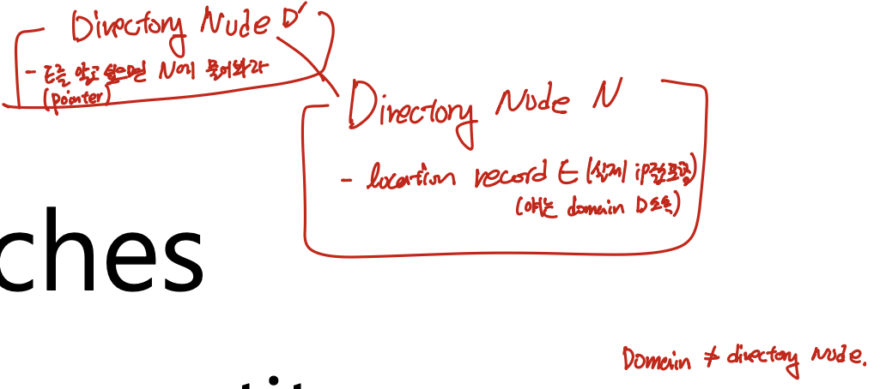
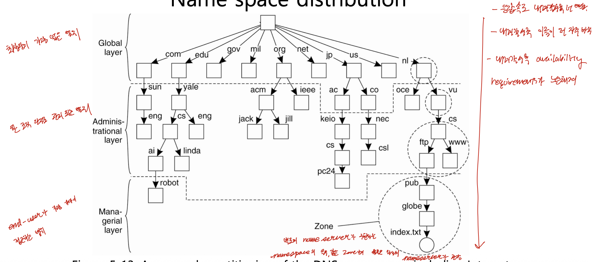

# 분산시스템 — Naming Part 2 (Hierarchical Approaches & Structured Naming)

> 이 문서는 Tanenbaum의 *Distributed Systems*를 기반으로 한 강의(슬라이드 16번부터 40번 부근까지)를 정리한 것이다.
> 다루는 범위는 Flat naming의 마지막 기법인 Hierarchical approaches에서 시작하여, Structured naming의 네임스페이스, 경로명, 링크, 마운트, DNS 네임서버 계층, 그리고 name resolution(iterative와 recursive)까지이다.
> 이 문서는 첫 번째 강의 정리본인 `dsc_ch5_pt1_v2.md`의 내용을 잇지만, 그 자체로 완결되도록 작성하였다.

---

## 0. 지난 시간 복습

지난 시간에는 분산 시스템에서 사용하는 이름(name)의 의미와 그 특수한 형태인 주소(address)와 식별자(identifier)를 살펴보았고, 이름을 주소로 연결하는 과정인 name resolution을 세 가지 분류(Flat naming, Structured naming, Attribute-based naming)로 나누어 그중 Flat naming을 다루었다. Flat name은 이름 안에 그 엔티티의 위치에 대한 정보를 전혀 담고 있지 않기 때문에, 아무 단서가 없으면 최악의 경우 broadcast로 모든 노드에 물어볼 수밖에 없다. 이 한계를 줄이기 위한 기법으로 broadcast와 multicast, 이동 엔티티를 같은 이름으로 접근하게 해 주는 forwarding pointer와 Mobile IP, 그리고 규칙을 정해 broadcast 없이 찾는 Chord(DHT)를 다루었다. 이번 시간에는 Flat naming의 마지막 기법인 Hierarchical approaches를 마무리한 뒤, 두 번째 분류인 Structured naming으로 넘어간다.

---

## 1. Flat Naming — Hierarchical Approaches (계층적 접근법)



### 위치 맥락: flat naming의 마지막 기법

- Hierarchical approaches는 Flat naming에서 다루는 마지막 기법이다. 이름은 여전히 구조가 없는 플랫한 이름이고, 이름들 사이에도 아무런 관계가 없다.
- 바로 다음에 나오는 Structured naming과 개념적으로 유사하지만, 계층(hierarchy)을 이루는 주체가 다르다. 여기서는 이름이 계층을 이루는 것이 아니라, 이름을 관리하는 노드들이 계층을 이룬다.

### 네트워크를 도메인으로 분할하기

- 리소스가 분포한 전체 네트워크를 작은 단위의 도메인(domain)으로 쪼갠 다음, 이 도메인들을 트리 구조로 구성한다.
- 가장 작은 단위의 도메인 여러 개가 모여 더 큰 도메인이 되고, 그 도메인들이 다시 모여 더 큰 도메인이 되는 식으로, 도메인 안에 도메인이 중첩되는 구조이다.
- 트리의 root에 해당하는 도메인은 네트워크 전체를 포괄하고, 아래로 내려가 leaf에 가까워질수록 도메인의 범위가 좁아진다.
- 가장 낮은 leaf 레벨의 도메인은 주로 컴퓨터 네트워크의 LAN(local-area network)이나 이동 통신망의 셀(cell)에 해당한다.

> 예를 들어 어떤 컴퓨터실의 LAN들이 모여 대학교라는 도메인을 이루고, 여러 대학교의 네트워크가 모여 한 나라의 네트워크를 이루는 식으로 계층이 자연스럽게 구성된다.

### Directory node — 도메인을 관리하는 특수 노드

- 각 도메인마다 그 도메인 안의 리소스 정보를 가지고 있는 특수 노드를 하나 둔다. 이것을 디렉토리 노드(directory node)라고 하며, 도메인 D의 디렉토리 노드를 `dir(D)`로 표기한다.
- 디렉토리 노드는 자신이 관리하는 도메인 안의 모든 리소스의 이름 정보를 가지고 있다.
- Root directory node는 모든 엔티티에 대한 정보를 알고 있다. 다만 모든 엔티티의 실제 주소를 직접 보유하는 것은 아니며, 그 유지 방식은 아래의 location record에서 설명한다.

### Location record — 정보를 어떻게 유지하는가 (★ 핵심)

- 도메인 D에 속한 엔티티의 현재 위치 정보는 location record라는 형태로 관리하며, 이 record는 그 도메인의 디렉토리 노드 안에 보관된다.
- 엔티티 E가 leaf 도메인 D에 있을 때, 그 leaf 도메인의 디렉토리 노드 N이 가진 E의 location record는 E의 실제 주소(접근할 컴퓨터의 IP 주소 등)를 담는다.
- 반면 D를 포함하는 한 단계 상위 도메인 D'의 디렉토리 노드 N'이 가진 E의 location record는 실제 주소가 아니라 "E를 알고 싶으면 N에게 물어보라"는 포인터만 담는다.
- 이렇게 상위로 갈수록 포인터만 유지하는 이유는, 유지해야 하는 정보의 양을 줄이기 위해서이다. 말단의 디렉토리 노드만 실제 주소를 가지고, 상위 디렉토리 노드들은 포인터만 가진다.

> 따라서 상위 노드에게 "E가 어디 있느냐"고 물으면, 그 노드는 "더 아래의 N'에게 물어보라"고 답하고, N'은 다시 "N에게 물어보라"고 답하며, 최종적으로 N이 실제 IP 주소를 알려준다. 정보를 분산해서 적게 유지하는 대신, 찾을 때 포인터를 따라 순차적으로 내려가는 구조이다.

### Multiple addresses — 복제된 엔티티

- 한 엔티티가 여러 컴퓨터에서 접근 가능한 경우, 즉 리소스가 복제(replication)된 경우에는 하나의 엔티티가 여러 주소를 가진다.
- 어떤 엔티티가 leaf 도메인 D1과 D2 두 곳에 주소를 가진다면, D1과 D2를 모두 포함하는 가장 작은 상위 도메인의 디렉토리 노드가 그 엔티티에 대해 두 개의 포인터를 가진다. 포인터는 주소를 포함하는 각 서브 도메인마다 하나씩이다.
- 각 서브 도메인의 디렉토리 노드는 자신이 관장하는 주소 정보만 가지면 되고, 다른 서브 도메인의 주소까지 알 필요는 없다.

> 두 포인터 중 어느 주소를 클라이언트에게 줄지, 아니면 둘 다 주고 클라이언트가 고르게 할지는 정책(policy)에 따라 달라지며, 구체적인 구현의 문제이다.

### Lookup 절차 — locality를 활용한 검색

- 클라이언트는 찾고자 하는 엔티티 E에 대한 lookup request를 먼저 자신이 속한 도메인의 디렉토리 노드로 보낸다.
- 찾는 엔티티가 운 좋게 같은 도메인 안에 있다면 그 디렉토리 노드가 바로 주소를 알려주고, name resolution이 그 자리에서 끝난다. 이것이 가장 좋은 경우이다.
- 디렉토리 노드가 모르면, 그 lookup request를 자신의 parent 디렉토리 노드로 forward한다. parent도 모르면 다시 그 parent로 forward한다.
- parent로 올라갈수록 알고 있는 정보가 많아지므로 찾을 확률이 높아진다. 결국 못 찾으면 root까지 올라가며, root는 모든 정보를 알고 있으므로 어떻게든 찾아낼 수 있다.

> 이 방식의 핵심은 locality를 활용한다는 점이다. 먼저 자신이 속한 작은 도메인을 뒤지고, 없으면 검색 범위(search area)를 점점 넓혀 간다. lookup request가 상위 디렉토리 노드로 전달될 때마다 검색 범위가 확장되는 것이다. root까지 올라간다는 것은 결국 broadcast에 가까운 전파가 일어난다는 뜻이므로, 가능한 한 빨리 끝나는 것이 좋다.

### Insert와 Delete — 엔티티 추가·삭제 절차

- 새 엔티티가 어떤 leaf 도메인에 추가되면, 그 도메인의 디렉토리 노드에 location record를 추가한 뒤, 그 정보를 parent 디렉토리 노드로 계속 forward한다.
- 이미 그 엔티티에 대한 location record를 가지고 있는 디렉토리 노드 M에 도달하면 거기서 전파를 멈춘다. M은 기존 record에 새 포인터 하나만 추가하면 된다. 복제된 엔티티가 이 경우에 해당한다.
- 만약 완전히 새로운 엔티티여서 도중에 아는 노드가 없다면, leaf부터 root까지 정보가 전파된다. 그래야 어느 쪽에서 물어보더라도 root까지만 올라가면 찾을 수 있게 된다.
- Delete 연산은 insert 연산과 유사한 방식으로 수행한다.

### Trade-off 정리

| 항목 | 내용 |
|---|---|
| 이득 | 항상 broadcast하지 않아도 됨. locality를 활용해 적은 비용으로 검색 |
| 비용 | 도메인 hierarchy를 유지해야 함. 디렉토리 노드가 robust하게 계속 동작해야 함 |
| 검색 특성 | 자기 도메인부터 시작해 search area를 점차 확장 |
| 갱신 특성 | insert/delete를 leaf부터 위로 전파(이미 아는 노드까지, 새 엔티티면 root까지) |

> 계층적 구성의 장점 중 하나는 fault isolation이다. 어떤 디렉토리 노드가 망가지면 그 노드가 관장하는 아래쪽 도메인만 영향을 받고, 다른 쪽 도메인은 여전히 서비스가 된다. 특정 부분의 문제가 전체로 번지지 않는다.

---

## 2. Structured Naming — Name Spaces (네임스페이스)

### 구조적 이름이란 무엇인가

- Structured naming에서 "구조적"이라는 말은 이름 자체가 구조를 가진다는 뜻이다. 플랫 네임처럼 마구잡이로 짓는 것이 아니라, 정해진 규칙에 따라 지어야 한다.
- 이름을 짓는 데 필요한 범위와 규칙을 네임스페이스(name space)라고 한다. 새 이름은 주어진 네임스페이스의 규칙 안에서 지어야 한다.

### 네임스페이스의 그래프 구조 (★ 핵심)

- 네임스페이스는 라벨이 붙은 방향 그래프(labeled, directed graph)로 표현하며, 두 종류의 노드로 구성된다.
- **Leaf node**: 이름이 붙은 엔티티를 나타내며, 일반적으로 그 엔티티에 대한 정보(즉 주소)를 저장한다.
- **Directory node**: 라벨이 붙은 여러 개의 나가는 엣지(outgoing edge)를 가지며, 각 엣지를 `(엣지 라벨, 노드 식별자)` 쌍으로 표현한 표를 저장한다. 이 표를 directory table이라고 한다.
- **Root node**: 나가는 엣지만 있고 들어오는 엣지(incoming edge)는 없는 최상위 노드이다.
- 이 그래프는 사이클(cycle)이 허용되지 않는 방향성 비순환 그래프(DAG)이지만, 한 노드가 둘 이상의 들어오는 엣지를 가질 수는 있다.

> 여기서의 계층은 플랫 네이밍의 hierarchical approaches와 주체가 다르다. 플랫 네이밍에서는 이름을 관리하는 디렉토리 노드들이 계층을 이루었지만, structured naming에서는 엔티티의 이름 자체가 계층을 이룬다. 리눅스나 일반 파일 시스템의 파일 경로를 떠올리면 된다. 루트 디렉토리부터 원하는 파일까지 내려가는 경로가 곧 하나의 구조적 이름이다.

---

## 3. 경로명 — 절대/상대, 글로벌/로컬 (Path Names)

### Path name의 표현

- 네이밍 그래프의 각 경로는 그 경로의 엣지에 해당하는 라벨들의 나열로 가리킬 수 있다. 이 나열을 경로명(path name)이라고 한다.
- 표기는 `N:<label-1, label-2, ..., label-n>`이며, 여기서 N은 경로의 첫 번째 노드를 가리킨다.
- 예를 들어 파일 시스템에서 `home`, `steen`, `keys`라는 엣지를 차례로 따라가면 특정 엔티티 노드에 도달하며, 이 라벨의 나열이 그 엔티티의 이름이 된다.

### 절대 경로와 상대 경로

- **Absolute path name**: 경로명의 첫 번째 노드가 root인 경우이다.
- **Relative path name**: 첫 번째 노드가 root가 아니라 현재 작업 노드(현재 작업 디렉토리)인 경우이다.

### 글로벌 네임과 로컬 네임

- **Global name**: 시스템 안의 어디에서 사용하더라도 항상 같은 엔티티를 가리키는 이름이다. 이 이름만 알면 엔티티가 어느 액세스 포인트에 있든 찾아갈 수 있다.
- **Local name**: 그 이름을 사용하는 위치에 따라 해석이 달라지는 이름이다. 현재 로컬 컴퓨터 안에서만 의미가 있고, 다른 컴퓨터에서는 name resolution을 할 수 없다.

### Name resolution의 기본 동작

- Name resolution, naming, lookup은 모두 같은 말이며, 어떤 이름이 입력으로 주어졌을 때 그 이름의 주소를 찾는 과정이다. 주소만 찾으면 리소스에 접근할 수 있다.
- 경로 `N:<label-1, ..., label-n>`에서 resolution은 첫 노드 N에서 시작하여 엣지를 차례로 따라가고, 마지막 라벨 label-n이 가리키는 노드에서 멈추며, 그 노드의 내용을 반환한다.

> name resolution을 하려면 당연히 이름은 이미 알고 있어야 한다. 이름조차 모르는 엔티티는 찾을 수 없으며, resolution은 알고 있는 이름으로부터 그 엔티티의 주소를 알아내는 과정이다.

---

## 4. Alias — Hard Link와 Symbolic Link

- **Alias**: 같은 엔티티를 가리키는 또 다른 이름이다. 구조적 이름에서 alias를 만드는 방법으로 hard link와 symbolic link가 있다.

### Hard link

- Hard link는 하나의 엔티티에 여러 개의 absolute path name을 허용하는 것이다.
- 예를 들어 `/keys`와 `/home/steen/keys`가 모두 같은 노드 n5를 직접 가리키면, 둘은 n5에 대한 hard link이다. 이름은 다르지만 결국 같은 엔티티를 가리키며, 그래프 상에서 엣지가 원본 노드로 직접 연결된다.
- 이렇게 한 엔티티에 둘 이상의 절대 경로가 생기면 그 노드가 둘 이상의 들어오는 엣지(incoming edge)를 가지게 되며, 바로 이것이 앞의 §2에서 말한 "트리가 아닌 DAG" 구조를 만드는 원인이다.

### Symbolic link

- Symbolic link는 엔티티를 leaf node N으로 표현하되, 그 노드에 엔티티의 주소나 상태를 저장하는 대신 다른 엔티티의 absolute path name을 저장하는 것이다.
- 따라서 symbolic link 노드를 만나면 name resolution이 거기서 끝나지 않고, 그 노드 안에 저장된 경로를 다시 처음부터 따라가야 한다. 예를 들어 어떤 노드가 `/keys`라는 경로를 담고 있다면, 시스템은 다시 root부터 `keys`로 내려가 원본 엔티티 n5에 도달한다.
- Hard link와의 차이는, hard link가 원본과 동일한 개체인 반면 symbolic link는 원본과 별개의 개체라는 점이다. symbolic link 개체 안에는 원본 엔티티를 찾아가기 위한 경로 정보가 들어 있다.

> Symbolic link의 대표적인 예가 윈도우의 바탕화면 아이콘이다. 아이콘 파일 자체는 원본이 아니며, 그 안에 원본 파일을 가리키는 경로가 들어 있어 아이콘을 열면 원본으로 연결된다.

---

## 5. Mounting — 서로 다른 네임스페이스 연결

### 네임스페이스를 투명하게 병합하기

- Name resolution은 서로 다른 네임스페이스를 투명하게(transparent) 병합하는 데에도 사용할 수 있다. 이때 적용되는 개념이 마운트(mount)이다.
- 분산 파일 시스템에서는 파일들이 여러 컴퓨터에 걸쳐 있지만, 클라이언트는 마치 로컬 파일을 다루듯 하나의 경로로 접근한다. 경로를 따라가다 보면 다른 컴퓨터로 넘어가 그곳에서 name resolution이 이어진다.
- 마운트된 파일 시스템은, 어떤 디렉토리 노드가 다른 네임스페이스에 있는 디렉토리 노드의 식별자를 저장하도록 하는 것에 해당한다.

### Mount point와 Mounting point

두 용어는 `-ing` 한 글자 차이라 헷갈리기 쉬우므로, 어느 쪽이 로컬이고 어느 쪽이 원격인지 다음과 같이 구분한다.

| 용어 | 위치 | 역할 |
|---|---|---|
| **Mount point** | 로컬 쪽 | 외부 네임스페이스에 있는 노드의 식별자를 저장하는 디렉토리 노드 |
| **Mounting point** | 원격(foreign) 쪽 | 연결 대상인 외부 네임스페이스에서 resolution을 이어가는 디렉토리 노드 |

- 경로를 따라가다 로컬의 mount point에 도달하면 로컬에서는 거기서 끝나지만, mount point에는 원격 컴퓨터의 어디로 가서 resolution을 이어가야 하는지에 대한 정보가 들어 있어, 원격의 mounting point에서 resolution이 계속된다.

### 마운트에 필요한 세 가지 정보 (★ 핵심)

외부 네임스페이스를 마운트하려면 적어도 다음 세 가지 정보가 필요하다.

1. **Access protocol의 이름**: 원격 네임스페이스에 접근하기 위한 프로토콜이며, 양쪽이 같은 프로토콜을 이해해야 한다.
2. **Server의 이름**: 연결하려는 원격 네임스페이스를 관리하는 서버(액세스 포인트)이다.
3. **Mounting point의 이름**: 원격 네임스페이스에서 찾아 들어갈 시작 지점이다.

- 이 세 가지 정보는 흔히 URL 형태로 표현한다.

### NFS와 URL 예시

- NFS(Network File System)는 Sun이 만든 프로토콜로, NFS를 사용하는 컴퓨터들은 서로 다른 컴퓨터의 파일을 로컬 파일처럼 접근할 수 있다.
- 클라이언트는 찾고자 하는 파일의 경로를 URL 형태로 준다. 예를 들어 `nfs://flits.cs.vu.nl/home/steen`은 세 가지 정보로 분해된다.
  - `nfs` → access protocol(NFS 프로토콜을 사용하겠다는 지정).
  - `flits.cs.vu.nl` → server(원격 네임스페이스를 관리하는 서버의 도메인 이름).
  - `/home/steen` → mounting point(그 서버에서 resolution을 시작할 지점).
- 웹의 URL이 `http`로 시작하여 프로토콜을 지정하는 것과 같은 구조이며, NFS URL은 그 자리에 `nfs`가 온 것이다.

### 원격 파일 시스템 액세스 과정 (Fig. 5-12)

- 클라이언트는 로컬 경로처럼 `/remote/vu/mbox`를 준다. 실제 mbox 엔티티는 원격 컴퓨터에 있다.
- root에서 시작하여 `remote`, `vu`까지는 로컬 네임스페이스에서 resolution이 진행된다. `vu` 위치의 노드는 leaf처럼 보이지만, 그 안에는 원격 네임스페이스의 URL `nfs://flits.cs.vu.nl/home/steen`이 들어 있다.
- 따라서 여기서 끝나지 않고, 시스템은 NFS 프로토콜로 `flits.cs.vu.nl` 서버에 접속하여 `/home/steen`을 따라간다. 즉 `vu`까지는 로컬에서, 그 다음 `mbox`는 원격으로 넘어가 이어서 resolution한다.
- 마지막으로 `/home/steen` 아래에서 `mbox`를 읽으면 원래 찾고자 한 엔티티에 도달하고, resolution이 끝난다. 이 모든 과정에서 사용자는 원격 서버에 접근하는 세부 사항을 신경 쓸 필요가 없다.

> 클라우드 드라이브에서 원격에 있는 파일을 마치 내 컴퓨터의 파일처럼 탐색기에서 바로 여는 경험이, 바로 이 마운트 원리로 구현된다. 엔드 유저에게는 잘 체감되지 않지만, 시스템을 다루는 일을 하게 되면 이런 연결 방식을 접할 일이 많다.

---

## 6. Name Space Distribution — DNS와 네임서버 레이어



### 이름이 계층적이면 네임서버도 계층적이다

- 구조적 이름의 네이밍 서비스를 구현하는 대표적인 예가 DNS(Domain Name System)이다. DNS는 이미 전 세계적으로 구조적 이름을 관리하고 사용하고 있다.
- 이름 자체가 계층적으로 구성되어 있으므로, 그 이름들의 주소 정보를 관리하는 네임서버도 자연스럽게 계층적으로 분산할 수 있다. 전체 네임스페이스를 영역별로 쪼개어 각 영역을 네임서버가 맡는다.
- 상위 레이어 네임서버일수록 추상적이고, 하위 레이어로 내려갈수록 구체적인 엔티티의 IP 주소를 관장한다. 상위 네임서버는 모든 엔티티의 정보를 가지는 대신, 자신의 자식 네임서버에 대한 정보만 가진다.

> 이 점이 플랫 네이밍의 hierarchical 구조와 대비된다. 플랫 네이밍에서는 root가 모든 엔티티마다 "누구에게 물어보라"는 포인터를 가지고 있어야 했다. 그러나 structured naming에서는 이름 자체에 "어떤 네임서버에게 물어보면 되는지"가 들어 있으므로, root 네임서버는 바로 아래 레벨의 네임서버 정보만 가지면 된다. 이름의 구조가 정보 유지의 부담을 덜어 주는 것이다.

### 세 가지 레이어

네임서버는 흔히 세 레이어로 나누어 설명한다.

| 레이어 | 관장하는 네임스페이스 | 예 |
|---|---|---|
| **Global layer** | 최상위의 가장 넓은 범위 | `.com`, `.edu`, `.gov`, `.kr`, `.jp` 등 |
| **Administrational layer** | 한 조직 단위로 관리되는 범위 | `.com` 아래의 회사들, `ac.kr`, `co.kr` 등 |
| **Managerial layer** | 엔드 유저가 가장 가까이 접근하는 범위 | 특정 대학교나 연구실의 네임서버 등 |

- 각 레이어의 세부 특징(변경 빈도, 가용성 요구, 캐싱 효과 등)은 다음 시간에 다룬다.

### Zone

- Zone은 별도의 네임서버가 구현하는 네임스페이스의 일부이다. 같은 zone 안의 이름들은 하나의 네임서버가 관장한다.
- 따라서 전체 네임스페이스를 여러 zone으로 분산할 수 있다. 예를 들어 `.com`을 관장하는 네임서버와 `.kr`을 관장하는 네임서버가 따로 있고, `.kr` 안에서도 `ac.kr`(학교)과 `co.kr`(회사)처럼 기관 특성별로 도메인이 나뉘어 분산 관리된다.

---

## 7. Name Resolution — Iterative vs Recursive

이러한 계층적 네임서버 환경에서 name resolution을 수행하는 방법에는 크게 두 가지가 있다. (실제로는 속도를 위해 중간에 캐시를 많이 사용하지만, 캐시를 제외하면 다음 두 방식으로 나뉜다.) 아래에서는 `www.건국.ac.kr`을 찾는 상황을 예로 든다.

### Iterative resolution (반복적 방법)

- 클라이언트가 전체 이름을 root 네임서버에 던지면, root는 자신이 아는 다음 단계 서버의 주소를 클라이언트에게 돌려준다. 클라이언트는 그 주소로 직접 다시 질의한다.
- 진행 예: 클라이언트가 root에 물으면 root는 "`kr` 서버에게 물어보라"며 `kr` 서버 주소를 준다. 클라이언트가 `kr` 서버에 물으면 "`ac` 서버에게 물어보라"고 답한다. 다시 `ac` 서버에 물으면 "건국 서버에게 물어보라"고 답한다. 마지막으로 건국 네임서버에 `www`의 주소를 물으면 실제 IP 주소를 받는다.
- 즉 클라이언트가 각 단계마다 직접 다음 서버에 질의하며, 한 단계씩 아래로 내려간다.

### Recursive resolution (재귀적 방법)

- 클라이언트가 전체 이름을 root에 한 번 넘기면, 이후의 단계는 네임서버들이 내부적으로 이어서 처리한다.
- 진행 예: root가 `kr` 서버에 묻고, `kr` 서버가 `ac` 서버에 묻고, `ac` 서버가 건국 서버에 묻는다. 건국 네임서버가 찾아낸 실제 IP 주소를 역방향으로 되돌려 올려, 최종적으로 root가 클라이언트에게 결과를 한 번에 돌려준다.
- 즉 클라이언트는 한 번만 질의하고 최종 결과만 받는다.

> 두 방식의 캐싱 효과, 통신 비용, 그리고 global·administrational·managerial 레이어별 가용성 요구의 차이는 다음 시간에 이어서 다룬다.

---

## 한눈에 보는 전체 구조

```
Flat naming (이어서)
└─ Hierarchical approaches  (네트워크를 도메인 트리로 분할)
    ├─ Directory node dir(D) (도메인 관리, root는 모든 엔티티)
    ├─ Location record       (leaf=실제 주소 / 상위=포인터만)
    ├─ Multiple addresses    (복제 → 상위 도메인이 포인터 두 개)
    ├─ Lookup                (자기 도메인부터 → 위로 확장, locality)
    └─ Insert/Delete         (leaf→위로 전파, 아는 노드까지 / 새 엔티티는 root까지)

Structured naming (이름 자체가 계층)
├─ Name space        (labeled directed graph: leaf / directory / root, DAG)
├─ Path name         (절대/상대, 글로벌/로컬, N:<label-1,...,label-n>)
├─ Alias             (hard link=동일 개체 / symbolic link=경로 저장한 별개 개체)
├─ Mounting          (네임스페이스 병합: protocol + server + mounting point → URL, NFS)
├─ Name space 분산   (DNS, global/administrational/managerial 레이어, zone)
└─ Name resolution   (iterative=클라이언트가 매 단계 질의 / recursive=서버가 연쇄 처리)
```
