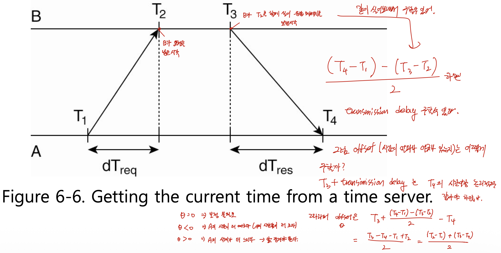

# 분산시스템 — Synchronization Part 1 (동기화 개요와 시간 동기화: 물리 시계·NTP)

> 이 문서는 Tanenbaum의 *Distributed Systems* 6장 Synchronization을 기반으로 한 강의(슬라이드 1번부터 14번 부근까지)를 정리한 것이다.
> 다루는 범위는 분산 시스템에서 동기화가 왜 더 어려운가에서 시작하여, make 컴파일러 예제로 본 시간 동기화의 필요성, 컴퓨터 내부의 물리 시계와 클락 스큐(clock skew), 표준 시간 측정(Solar time, TAI, UTC, 윤초), 이상적 시계와 실제 시계의 모델(skew·offset·최대 드리프트율), 그리고 시간 서버에 물어 시간을 맞추는 NTP의 오프셋 계산과 점진적 보정까지이다.
> 이 문서는 6장 Synchronization의 첫 번째 강의를 정리한 것이며, 두 번째 강의 정리본인 `dsc_ch6_pt2.md`로 이어진다.

분산 시스템에서는 협력하는 프로세스들이 한 컴퓨터가 아니라 여러 컴퓨터에 흩어져 있다. 한 컴퓨터 안에서만 돌던 프로세스라면 고민할 필요가 없었던 문제들이, 프로세스가 여러 컴퓨터로 흩어지는 순간 새로 생겨난다. 6장은 그렇게 새로 생기는 동기화 문제들 중에서 비교적 다루기 쉬운 것들을 모은 단원이며, 그 첫 주제가 바로 "여러 컴퓨터의 시간을 어떻게 맞출 것인가"이다.

---

## 1. 분산 시스템에서의 동기화 — 왜 더 어려운가

### 동기화의 본질은 같다

동기화 문제가 생기는 근본 원인은 단일 시스템이든 분산 시스템이든 똑같다. 여러 개의 프로세스(또는 스레드)가 하나의 공유 자원(shared resource)을 동시에 접근하려고 하면, 그대로 내버려 둘 경우 자원이 손상되거나 일관성이 깨지는 충돌(conflict)이 발생한다. 이 문제를 푸는 기본 해법도 똑같다. 동시에 들어온 요청을 동시에 처리하지 말고 줄을 세워서 한 번에 하나씩 처리하는 것이며, 이것을 직렬화(serialization)라고 부른다.

분산 시스템이 더 어려운 이유는 단 하나, 접근하려는 프로세스들이 같은 컴퓨터가 아니라 서로 다른 컴퓨터에서 돌고 있기 때문이다. 고려해야 할 사항이 그만큼 늘어난다.

### 예시 1 — 공유 프린터와 상호 배제

여러 컴퓨터가 네트워크 프린터 한 대를 공유하는 상황을 생각해 보자. 여러 컴퓨터가 동시에 출력 요청을 보내더라도, 출력물 한 장 안에 여러 요청이 뒤섞이지 않고 요청별로 차례대로 출력된다. 이것은 프린터가 요청을 받은 순서대로 줄을 세워 처리하기 때문이며, 이미 동기화가 이루어진 결과이다. 이렇게 한 번에 하나의 프로세스만 자원을 접근하도록 만드는 것을 상호 배제(mutual exclusion)라고 한다. 분산 시스템에서는 이를 경쟁이 아니라 서로 협력하여 일시적으로 배타적인(exclusive) 접근 권한을 주고받는 방식으로 해결한다.

> 이 첫 번째 예시는 한 컴퓨터 안의 프로세스들 사이에서도 생길 수 있는 동기화 문제이다. 즉 분산 시스템에 고유한 문제가 아니라 단일 시스템에서도 이미 존재하던 문제이다.

### 예시 2 — 이벤트 순서에 대한 합의 (★ 분산 시스템 고유의 문제)

두 번째 예시는 분산 시스템에서만 추가로 고려해야 하는 문제이다. 서로 다른 머신의 프로세스 P와 Q가 각각 메시지 m1과 m2를 보냈다고 하자. 다른 프로세스 입장에서는 어떤 메시지가 먼저 보내진 것인지가 애매할 수 있다. 어떤 프로세스는 m1을 먼저 받고, 다른 프로세스는 m2를 먼저 받을 수 있어서, 받은 순서대로만 처리하면 프로세스마다 처리 순서가 달라지는 문제가 생긴다. 따라서 "어떤 이벤트가 먼저 발생한 것인가"라는 순서에 대해 모든 프로세스가 합의(agreement)할 수 있어야 한다.

가장 단순한 해법은 메시지를 보낼 때 그 안에 보낸 시간 정보를 함께 담는 것이다. 받는 쪽이 시간을 비교하면 어느 메시지가 먼저인지 금방 알 수 있다. 그러나 여기에 함정이 있다. P가 담는 시간은 P의 컴퓨터 시간이고 Q가 담는 시간은 Q의 컴퓨터 시간이므로, 이 두 시간을 비교하려면 두 컴퓨터의 시간이 정확히 일치해서 돌고 있다는 전제가 필요하다. 그런데 그 전제를 만족시키는 것이 쉽지 않다. 그래서 6장의 첫 주제가 "컴퓨터들의 시간을 어떻게 동기화할 것인가"가 된다.

---

## 2. 시간 동기화의 필요성 — make 컴파일러 예제

### 단일 시스템에서의 make

make는 대규모 프로젝트에서 수많은 소스 파일을 한 번에 편하게 컴파일해 주는 도구이며, 원래는 단일 시스템에서 도는 컴파일러이다. make가 "다시 컴파일해야 할 파일"을 찾아내는 방법은 시간 정보 비교이다. 모든 소스 파일과 그에 대응하는 오브젝트 파일에는 마지막 수정·생성 시간이 기록되어 있고, make는 이를 비교한다.

- 소스 파일 `input.c`의 시간이 2151이고, 그것을 컴파일한 오브젝트 파일 `input.o`의 시간이 2150이라고 하자.
- 시간 값이 클수록 더 나중이므로, `input.c`(2151)가 `input.o`(2150)가 만들어진 뒤에 수정되었다는 뜻이다.
- 따라서 make는 `input.c`를 다시 컴파일해야 한다고 판단한다.

make는 파일 내용을 직접 뜯어보지 않고 오직 시간 정보만으로 판단한다. 그래서 실제로는 내용이 바뀌지 않았더라도(예: 빈칸만 입력하고 저장) 시간이 갱신되면 다시 컴파일한다.

### 분산 환경에서의 make (Figure 6-1) — 시간이 안 맞으면 생기는 오류

이제 make가 분산 시스템에서 하나의 서비스로 돌아간다고 하자. 소스 파일을 편집하는 에디터 컴퓨터와 컴파일을 수행하는 컴파일러 컴퓨터가 서로 다른 두 대로 나뉘어 있고, 두 컴퓨터의 시간이 맞지 않는다고 가정한다.

- 컴파일러 컴퓨터에서 `output.o`가 생성된 시간이 (그 컴퓨터 기준으로) 2144이다.
- 그 뒤 에디터 컴퓨터에서 `output.c`를 수정하여 저장했는데, 그 컴퓨터의 시간으로는 2143이 찍혔다.
- 실제 물리적 시간으로는 수정이 나중에 일어났지만, 시간 값만 보면 2143 < 2144이므로 make는 "컴파일 이후에 수정된 적이 없다"라고 잘못 판단하고 다시 컴파일하지 않는다.

이것이 Figure 6-1이 보여 주는 상황이다. 실제 시간 축에서는 수정이 나중에 일어났음에도, 두 컴퓨터의 시계가 어긋나 있기 때문에 시간 값의 앞뒤 관계가 뒤집혀 버린다. make가 제대로 동작하려면 두 컴퓨터의 시간을 먼저 맞춘 뒤에 돌려야 한다.

> 앞뒤 순서 관계가 중요한 작업을 분산 시스템에서 수행한다면, 일단 컴퓨터들의 시간을 맞춰 놓고 돌려야 한다. 다만 이것은 하나의 해법일 뿐이며, 시간을 직접 맞추지 않고 이벤트의 순서만 합의하는 또 다른 해법(논리 시계, logical clock)이 뒤 차시에 등장한다.

---

## 3. 물리 시계(Physical Clock)와 클락 스큐

### 컴퓨터 시계는 어떻게 시간을 세는가

컴퓨터 내부의 시간 정보는 타이머에서 나온다. 타이머의 핵심 부품은 정밀하게 가공된 쿼츠 크리스털(quartz crystal, 석영 수정 소자)이다. 석영에 전기 신호를 주면 매우 규칙적인 진동(oscillation)이 발생하며, 이 진동을 이용해 시간을 센다.

1. 진동이 일정 횟수 발생할 때마다 인터럽트(interrupt)를 발생시키고, 카운터 값을 하나씩 줄인다.
2. 카운터가 0이 되면 인터럽트가 발생하고, 카운터는 홀딩 레지스터(holding register)의 값으로 다시 채워진다.
3. 이 한 번의 인터럽트를 클락 틱(clock tick)이라고 한다. 정해진 횟수의 틱이 쌓이면 그것을 1초로 친다.

### 클락 스큐의 발생 원인

문제는 컴퓨터마다 이 쿼츠 크리스털의 진동 주기가 똑같지 않다는 것이다. 아무리 정밀하게, 그리고 똑같이 가공하더라도 광물 자체의 속성 차이 때문에 진동수가 조금씩 달라진다. 그래서 모든 컴퓨터가 정확히 같은 주파수(frequency)로 시간을 센다는 보장이 없으며, 컴퓨터마다 시간이 조금씩 다르게 흘러간다. 이렇게 생기는 시간 차이를 클락 스큐(clock skew)라고 한다.

---

## 4. 표준 시간 측정 — Solar Time, TAI, UTC

전 세계가 참조(reference)할 수 있는 표준 시간이 있다. 이 표준 시간이 어떻게 정의되어 왔는지를 차례로 살펴본다.

### 4-1. Solar time (태양시)

옛날에는 태양을 기준으로 하루의 길이를 쟀다. 태양이 하늘에서 가장 높은 지점에 도달하는 것을 태양의 통과(transit)라고 하며, 연속된 두 번의 통과 사이 간격이 태양일(solar day)이다. 이 태양일을 86,400으로 나눈 것을 1태양초(solar second)로 정했다(24시간 × 3600초 = 86,400초). 그러나 지구의 자전과 공전 때문에 하루의 길이가 일정하지 않아, 여러 날을 측정해 평균을 내야 했고 그래도 아주 정확하지는 않았다.

### 4-2. International Atomic Time (TAI, 국제 원자시)

1948년에 원자 시계(atomic clock)가 발명되었다. 현재 세계 여러 연구소가 세슘 133(cesium 133) 원자 시계를 운용하며, 각 연구소가 자기 시계의 틱 횟수를 파리의 국제도량형국(BIH, Bureau International de l'Heure)에 알리면 BIH가 이를 평균하여 TAI를 산출한다. 원자 시계의 진동 주파수는 매우 정밀하기 때문에, 이 원자초를 표준으로 삼게 되었다.

### 4-3. 윤초(leap second)와 UTC (Figure 6-3)

원자 시계로 잰 시간과 태양시를 함께 돌려 보니 차이가 생긴다. 86,400 TAI초는 평균 태양일보다 약 3밀리초 짧다(평균 태양일이 점점 길어지고 있기 때문이다). 이 3밀리초가 매일 쌓이면 차이가 점점 커진다. 그래서 TAI와 태양시의 차이가 800밀리초까지 벌어지면, 윤초(leap second)를 한 번 삽입하여 태양시에 맞춰 조정한다(Figure 6-3은 일정한 길이의 TAI초와 윤초 삽입을 보여 준다).

이렇게 일정한 TAI초를 기반으로 하되 윤초로 태양의 겉보기 운동과 위상을 맞춘 시간 체계가 협정 세계시(UTC, Universal Coordinated Time)이다. UTC는 천문학적 시간인 그리니치 평균시(GMT, Greenwich Mean Time)를 사실상 대체하였으며, 지금까지 삽입된 윤초는 약 30초이다.

> UTC라는 약자가 풀어 쓴 "Universal Coordinated Time"의 순서(UCT가 자연스러움)와 어긋나는 것은 역사적·정치적 절충의 산물이다. 영어식 표기와 프랑스어식 어순이 충돌하여 양쪽을 섞은 절충안으로 UTC가 되었다.

### 4-4. UTC를 받는 방법과 전송 지연

UTC를 사람들에게 제공하기 위해 미국 표준기술연구소(NIST, National Institute of Standards and Technology)는 콜로라도주 포트 콜린스에서 호출 부호 WWV의 단파(shortwave) 라디오 방송국을 운영하며, 매 UTC 초가 시작될 때 짧은 펄스를 송출한다. 여러 지구 위성도 UTC 서비스를 제공한다.

그러나 표준 시간을 네트워크나 전파로 받아서 그대로 출력해도 정확한 시간이 되지는 않는다. 받은 시간 정보는 어딘가에서 날아온 것이므로 전송 지연(transmission delay)을 고려해야 한다. 게다가 이 지연은 매번 달라지고 정확히 측정하기도 어렵다. 그래서 초 단위로는 시간을 맞출 수 있을지 몰라도 밀리초·나노초 단위까지 맞추는 것은 쉽지 않다. 한 번 맞춰 놓아도 로컬 시계가 제각각 흘러가므로 주기적으로 다시 맞춰야 한다.

---

## 5. 이상적 시계와 실제 시계의 모델 (★ 핵심)

UTC 시간을 t라 하고, 머신 p의 시계가 가리키는 값을 Cp(t)라 하자.

### 5-1. 완전한 세계(perfect world)

이상적인 세계에서는 모든 컴퓨터의 시계가 UTC와 정확히 같다.

- **Cp(t) = t** : 시계 값이 UTC와 일치한다.
- **C'p(t) = dC/dt = 1** : 시계의 변화율(frequency)이 UTC의 변화율과 같다. 즉 시간이 똑같은 속도로 흘러간다.

### 5-2. 실제 세계(real world) — skew와 offset

실제로는 시계 값도, 변화율도 UTC와 다르다.

- **skew(스큐) = C'p(t) − 1** : 변화율의 차이이다. 이 값이 0이면 정확한 시계, 0보다 크면 내 시계가 더 빠르고(변화량이 큼), 0보다 작으면 내 시계가 더 느리다.
- **offset(오프셋) = Cp(t) − t** : 특정 시점 t에서의 시간 값 자체의 차이이다.

> skew는 "시간이 가는 속도"의 차이이고, offset은 "지금 가리키는 시각"의 차이이다. 동기화를 하려면 내 시계가 표준 대비 얼마나 빠른지·느린지(skew)와 얼마나 차이 나는지(offset)를 알아야 그만큼 보정할 수 있다.

### 5-3. 최대 드리프트율(maximum drift rate) (Figure 6-5)

어떤 상수 ρ가 존재하여 시계의 변화율이 다음 범위를 항상 만족하면, 그 시계는 규격 내에서 동작한다고 본다.

```
1 − ρ  ≤  dC/dt  ≤  1 + ρ
```

이 상수 ρ는 제조사가 명시하며 최대 드리프트율(maximum drift rate)이라고 한다. Figure 6-5는 가로축을 UTC, 세로축을 내 시계로 놓은 그래프이다. 변화율이 정확히 1인 시계는 정사각형의 대각선(perfect clock)을 따라가고, 빠른 시계는 그 위쪽으로, 느린 시계는 그 아래쪽으로 벌어진다. ρ가 정하는 두 점선 사이의 범위 안에서만 어긋나는 시계라면, 그래도 동기화할 만한 쓸 만한 시계로 본다. 그 범위를 벗어나 너무 빨라지거나 느려지는 시계는 동기화하기 어렵다.

---

## 6. NTP — 시간 서버에 물어 보정하기 (Figure 6-6)



### 기본 아이디어

NTP(Network Time Protocol)는 시간을 동기화하는 표준 애플리케이션 계층 프로토콜이다. 기본 개념은 나보다 정확한 시계를 가진 시간 서버에게 "지금 몇 시인가"를 물어보고, 응답에 담긴 시간과 메시지 왕복 지연(delay)을 함께 고려하여 내 시간을 보정하는 것이다.

### 절차 (Figure 6-6) — 네 개의 타임스탬프

A가 클라이언트, B가 정확한 시계를 가진 서버이다. A가 B에게 시간을 물어보는 과정을 단계별로 쪼개면 네 개의 시간 값이 생긴다.

| 시각 | 누구의 시계 | 의미 |
|---|---|---|
| T1 | A | A가 요청 메시지를 보낸 시각 |
| T2 | B | B가 그 요청을 받은 시각 |
| T3 | B | B가 (T2를 함께 실어) 응답 메시지를 보낸 시각 |
| T4 | A | A가 응답 메시지를 받은 시각 |

### 지연(delay) 추정 — 핵심 트릭

서로 동기화되어 있지 않은 두 컴퓨터의 시간 값을 직접 빼는 것은 의미가 없다. 따라서 같은 컴퓨터의 시간끼리만 빼야 한다.

- A는 같은 A의 시계로 잰 전체 왕복 시간 `T4 − T1`을 구할 수 있다.
- B는 같은 B의 시계로 잰 처리 시간 `T3 − T2`를 구할 수 있다(B가 T2를 함께 보내 주므로 A도 안다).
- 전체에서 B의 처리 시간을 빼면 두 방향 전송 지연의 합이 나온다: `(T4 − T1) − (T3 − T2)`.
- 두 방향 지연이 비슷하다고 가정하면(T2−T1 ≒ T4−T3), 한쪽 지연은 이 합을 2로 나눈 값이다.

### 오프셋(θ) 계산 (★ 시험 식)

B가 응답을 보낸 시각이 T3이므로, 거기에 편도 지연을 더하면 *A가 그 응답을 받는 순간의 (B 기준) 실제 시각*이 된다. 그런데 바로 그 순간 A의 시계는 T4를 가리키고 있으므로, 두 값의 차이가 곧 A 시계가 B 대비 얼마나 어긋났는지를 나타내는 오프셋 θ이다. 식으로 정리하면 다음과 같다.

```
θ = T3 + ((T2−T1) + (T4−T3)) / 2  −  T4
  = ((T2−T1) + (T3−T4)) / 2
```

(검산: T3 − T4 + (T2−T1+T4−T3)/2 = (2T3−2T4 + T2−T1+T4−T3)/2 = (T3−T4+T2−T1)/2 = ((T2−T1)+(T3−T4))/2. ✓)

θ의 부호 해석은 다음과 같다.

- **θ = 0** : 두 시계가 같다. 보정 불필요.
- **θ < 0** : A의 시계가 더 빠르다(A의 시간 값이 더 큼). → 늦춰야 한다.
- **θ > 0** : A의 시계가 더 느리다. → 앞당겨야 한다.

> 슬라이드 본문은 "θ < 0이면 A의 시계가 빠르고, θ > 0이면 느리다"라고 표현한다. θ는 B의 시각에서 A의 시각을 뺀 값이므로, A가 더 빠르면(A 값이 큼) θ가 음수가 된다.

---

## 7. 점진적 시간 보정 (slew)

오프셋 θ를 구했다고 해서 현재 시간 값에 θ를 그냥 더하거나 빼면 안 된다. 특히 내 시계가 더 빠를 때 θ만큼 빼 버리면 시간이 과거로 거꾸로 돌아가게 되는데(예: 11시 45분 → 11시 44분), 시간은 항상 증가해야 하므로 이것은 심각한 문제를 일으킬 수 있다. 시계를 거꾸로 돌리는 것은 허용되지 않는다.

그래서 시간 값을 한 번에 바꾸는 대신 시간이 흘러가는 속도(변화량)를 조절하여 점차적으로 맞춘다. 100번의 인터럽트가 1초가 되는 시스템을 예로 들면, 평소에는 매 인터럽트마다 10밀리초를 더한다.

- **느리게 가게 하려면(내 시계가 빠를 때)**: 매 인터럽트마다 10밀리초가 아니라 9밀리초만 더한다. 1초에 도달하기까지 더 많은 인터럽트가 필요해지므로 시계가 느려진다.
- **빠르게 가게 하려면(내 시계가 느릴 때)**: 매 인터럽트마다 11밀리초를 더한다. 100번이 되기 전에 1초에 도달하므로 시계가 빨라진다.

이렇게 하면 시간 값이 갑자기 튀거나 과거로 돌아가는 일 없이, 변화량 조절만으로 표준 시간과 부드럽게 맞춰진다.

---

## 다음 시간 예고

다음 차시에서는 NTP가 부정확한 서버에게 시간을 물어보는 문제를 막기 위해 서버에 계층(stratum)을 두는 방식을 마저 살펴보고, NTP와 반대로 서버가 클라이언트에게 시간을 물어 평균으로 맞추는 버클리(Berkeley) 알고리즘을 다룬다. 이어서 실제 시간(wall-clock time)을 맞추는 대신 이벤트의 순서만 합의하는 논리 시계(logical clock)와 램포트(Lamport)의 happens-before 관계로 넘어간다.

---

## 한눈에 보는 전체 구조

```
분산 시스템에서의 동기화 (6장)
├─ 왜 어려운가: 프로세스가 여러 컴퓨터에 흩어져 있음
│   ├─ 예시1 공유 프린터 → 상호 배제 (단일 시스템에도 있던 문제)
│   └─ 예시2 이벤트 순서 합의 (분산 시스템 고유) → 시간 비교 필요
│
├─ 시간 동기화의 필요성: make 컴파일러 (Fig 6-1)
│   └─ 시계 어긋나면 시간 앞뒤 관계 뒤집힘 → 재컴파일 누락
│
├─ 물리 시계: 쿼츠 크리스털 → 진동 → 클락 틱 → 컴퓨터마다 다름 = 클락 스큐
│
├─ 표준 시간
│   ├─ Solar time (태양일/86400, 부정확)
│   ├─ TAI (원자시, 세슘133, BIH 평균)
│   └─ UTC = TAI + 윤초(800ms마다 삽입, Fig 6-3) / WWV·위성으로 전파
│
├─ 시계 모델
│   ├─ perfect: Cp(t)=t, dC/dt=1
│   ├─ skew = dC/dt − 1,  offset = Cp(t) − t
│   └─ 최대 드리프트율 ρ: 1−ρ ≤ dC/dt ≤ 1+ρ (Fig 6-5)
│
├─ NTP (Fig 6-6): 시간 서버에 물어봄
│   ├─ T1,T2,T3,T4 / 지연 = ((T4−T1)−(T3−T2))/2
│   └─ θ = ((T2−T1)+(T3−T4))/2   (θ<0 빠름, θ>0 느림)
│
└─ 점진적 보정(slew): 시간 값을 빼지 말고 변화 속도(9ms/11ms)로 조절
```
