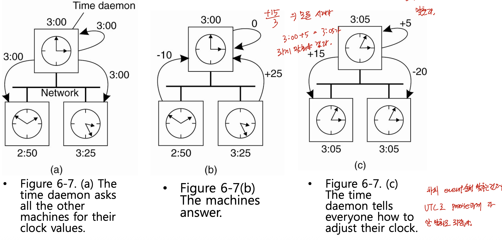

# 분산시스템 — Synchronization Part 2 (NTP Stratum·Berkeley 알고리즘·Lamport 논리 시계)

> 이 문서는 Tanenbaum의 *Distributed Systems* 6장 Synchronization을 기반으로 한 강의(슬라이드 14번 부근부터 27번까지)를 정리한 것이다.
> 다루는 범위는 NTP의 점진적 보정 복습과 서버 계층(stratum), NTP와 반대 방향으로 동작하는 버클리(Berkeley) 알고리즘에서 시작하여, 실제 시간을 맞추는 대신 이벤트 순서만 합의하는 논리 시계(logical clock)의 도입 배경, happens-before 관계와 concurrent·transitivity, 논리 시계의 설계 조건과 보정(Figure 6-9), 그리고 램포트(Lamport) 논리 시계의 세 가지 갱신 규칙과 종합 예제까지이다.
> 이 문서는 6장 Synchronization의 두 번째 강의를 정리한 것이며, 첫 번째 강의 정리본인 `dsc_ch6_pt1.md`를 잇고, 세 번째 강의 정리본인 `dsc_ch6_pt3.md`로 이어진다.

---

## 0. 지난 시간 복습

지난 시간에는 분산 시스템에서 동기화가 더 어려운 이유(프로세스가 여러 컴퓨터에 흩어져 있음)와 make 컴파일러 예제(Figure 6-1)로 시간 동기화의 필요성을 보았고, 컴퓨터 물리 시계의 클락 스큐, 표준 시간(Solar time·TAI·UTC), 시계 모델(skew·offset·최대 드리프트율)을 거쳐 NTP의 오프셋 계산까지 다루었다. NTP는 네 개의 타임스탬프(T1~T4)로 왕복 지연을 추정하여 오프셋 θ = ((T2−T1)+(T3−T4))/2를 구하고, 그 차이만큼 시간을 보정하는 프로토콜이었다. 이번 시간에는 그 보정을 어떻게 부드럽게 적용하는지(slew)를 복습하고, NTP의 서버 계층과 버클리 알고리즘을 거쳐 논리 시계로 넘어간다.

---

## 1. NTP 보정 복습 — 점진적 보정(slew)

오프셋 θ를 구한 뒤 그 값을 현재 시간에 그냥 더하거나 빼면 안 된다. θ < 0이면(내 시계가 더 빠름) θ를 빼야 하는데, 그러면 시간이 과거로 거꾸로 돌아가 버린다. 시간은 항상 증가해야 하므로 이는 허용되지 않는다.

그래서 시간 값을 한 번에 바꾸지 않고 시간이 흐르는 속도(변화량)를 조절하여 점진적으로 맞춘다. 1초에 100번의 인터럽트가 발생하는 시스템이라면 평소 매 인터럽트마다 10밀리초를 더하는데,

- 내 시계가 빠르면 매 인터럽트에 **9밀리초**만 더해 천천히 가게 한다(1초 도달에 인터럽트가 더 필요).
- 내 시계가 느리면 매 인터럽트에 **11밀리초**를 더해 빨리 가게 한다(100번이 되기 전에 1초 도달).

단순히 θ를 더하는 경우도 갑작스러운 변화라는 문제가 있지만, 빼는 경우에는 과거로 돌아가는 더 큰 문제가 생기므로 반드시 변화량 조절 방식을 써야 한다.

---

## 2. NTP의 서버 계층(stratum)

### 문제 — 아무 서버에나 물으면 안 된다

NTP의 기본 개념은 "나보다 정확한 시계를 가진 서버에게 물어본다"이다. 그런데 분산 시스템에는 컴퓨터가 여럿 있으므로, 룰 없이 임의의 컴퓨터에게 물으면 나보다 더 부정확한 시계에 맞추는 일이 생긴다. 그러면 오히려 시간이 더 어긋난다. B의 시계가 A보다 정확할 때만 A가 B에 맞추는 것이 의미가 있다.

### 해법 — 정확도를 계층으로 나눈다

NTP는 서버들을 정확도에 따라 계층(strata)으로 나눈다.

- **Stratum-1 서버**: WWV 수신기나 원자 시계 같은 기준 시계(reference clock)를 가진, 가장 정확한 서버이다. 숫자가 작을수록 정확도가 높다.
- 모든 노드는 자신의 stratum 값을 알고 있다.
- A가 B에 접촉했을 때, **A의 stratum 레벨이 B보다 높을(숫자가 클) 때만** A가 B의 시간에 맞춘다. 즉 더 정확한(숫자가 작은) 서버에게만 물어 보정한다.

NTP는 서버 쌍(pairwise) 사이에서 동작하므로 B도 A에게 시간을 물어볼 수 있는데, 이 stratum 규칙이 "더 부정확한 쪽이 더 정확한 쪽에 맞추는" 방향을 보장한다.

---

## 3. 버클리(Berkeley) 알고리즘 (Figure 6-7)



### NTP와 반대 방향의 접근

버클리 알고리즘도 컴퓨터들의 시간을 똑같이 맞추려는 목적은 같지만, 방향이 NTP와 정반대(opposite approach)이다.

- **NTP**: 클라이언트가 서버에게 "지금 몇 시인가"를 물어보고, 받은 시간에 자신을 맞춘다.
- **Berkeley**: 시간 서버(time daemon)가 능동적으로 클라이언트들에게 "너희 시간이 내 시간과 얼마나 차이 나는가"를 물어보고, 답을 모아 평균을 계산한 뒤, 각 클라이언트에게 "너는 이만큼 보정하라"고 거꾸로 알려준다.

### 동작 예제 (Figure 6-7)

세 대의 컴퓨터가 있고, 시간 데몬(서버)의 시계는 3:00이다.

1. **(a)** 3:00에 시간 데몬이 다른 머신들에게 자기 시간을 알려 주며 그들의 시간을 묻는다.
2. **(b)** 각 머신은 데몬 대비 얼마나 앞서거나 뒤처지는지로 답한다. 데몬 자신은 0, 2:50인 머신은 −10분(10분 느림), 3:25인 머신은 +25분(25분 빠름)이다.
3. **(c)** 데몬은 평균을 계산한다. (0 + (−10) + 25) / 3 = +5분이다. 따라서 모든 시계를 데몬 시각 + 5분 = **3:05**로 맞춘다. 데몬은 각 머신에게 보정량을 거꾸로 알려 준다(2:50인 머신은 +15분, 3:25인 머신은 −20분).

### 특징 — UTC를 무시한다

버클리 알고리즘은 WWV 수신기 등 UTC를 받을 수 있는 머신이 하나도 없는 시스템에 적합하다. NTP가 UTC라는 외부 표준에 맞추는 것과 달리, 버클리는 UTC를 무시하고 참여한 컴퓨터들끼리만 시간을 맞춘다.

> 시간 동기화의 요구사항이 단계적으로 완화되는 흐름에 주목하자. 처음에는 "모든 컴퓨터를 UTC에 맞추자"(NTP)였다가, "굳이 UTC까지 갈 것 없이 우리끼리만 맞추자"(Berkeley)로 완화된다. 그다음 차시의 논리 시계는 여기서 한 걸음 더 나아가 "실제 시계조차 맞추지 말고 이벤트의 순서만 합의하자"로 완화된다.

---

## 4. 논리 시계(Logical Clock)의 도입 배경

### 왜 실제 시간을 맞출 필요가 있는가

물리 시계 동기화는 귀찮다. 한 번 맞춰도 시계가 제각각 흘러가므로 주기적으로 다시 맞춰야 하고, 자주 할수록 오버헤드가 커진다. 그런데 분산 시스템의 작동을 들여다보면, 노드들이 "지금 몇 시인가"라는 절대 시각 자체가 필요한 것이 아니라 **이벤트들의 발생 순서를 따지기 위해** 시간을 알고 싶었던 경우가 많다.

- make 예제에서도 중요한 것은 "소스 파일 수정 이벤트가 컴파일 이벤트보다 나중에 발생했는가"라는 순서뿐이었다.
- 두 이벤트 중 어느 것이 먼저인지를 모든 컴퓨터가 동일하게 합의할 수만 있으면 충분하다.

### 논리 시계의 성격

램포트(Lamport, 1978)는 "모든 프로세스가 정확히 같은 시각에 합의할 필요는 없고, 이벤트가 일어난 순서에만 합의하면 된다"라고 지적하였다. 그래서 실제 시계(wall-clock time)와 다른 가상의 시계인 논리 시계를 따로 정의한다.

- 논리 시계 값은 그냥 하나의 **숫자**이며, 각 프로세스가 자기만의 논리 시계를 가진다.
- 실제 시계와 가장 다른 점은, **이벤트가 발생할 때만 증가**한다는 것이다. 아무 일도 일어나지 않으면 시간이 멈춰 있다.
- 숫자의 절댓값 자체에는 의미가 없다. 오직 다른 논리 시계 값과 비교하여 누가 더 큰가(누가 더 나중인가)만 따지는 수단이다.

---

## 5. Happens-Before 관계 (★ 핵심)

### 정의

두 이벤트 a, b에 대해 a → b를 "a가 b보다 먼저 발생했다(a happens before b)"로 읽는다. 이 관계가 성립한다는 것은 모든 프로세스가 "a가 먼저, 그다음 b"라고 **동일하게 합의**할 수 있다는 뜻이다. 순서를 확실히 알 수 있는 이벤트에 대해서만 이 관계를 정의하고, 모호한 이벤트는 과감히 제외한다. 순서가 확실한 경우는 다음 두 가지이다.

1. **같은 프로세스 안의 두 이벤트**: a와 b가 같은 프로세스에서 발생했고 a가 b보다 먼저 일어났으면, a → b이다. 같은 논리 시계 위의 값이므로 누구나 비교할 수 있다.
2. **메시지의 송신과 수신**: a가 어떤 프로세스의 메시지 송신 이벤트이고 b가 다른 프로세스의 그 메시지 수신 이벤트이면, a → b이다. 통신 지연 때문에 보내기 전에 받을 수는 없으므로 누구도 이의를 제기할 수 없다.

### Concurrent(동시적) 이벤트

서로 다른 프로세스에서 발생했고 직접·간접으로도 메시지를 주고받지 않은 두 이벤트 x, y에 대해서는 x → y도, y → x도 성립하지 않는다. 이런 두 이벤트를 동시적(concurrent)이라고 한다. 진짜 동시는 아니지만 순서를 알 수 없으므로 "동시에 발생한 것으로 친다".

### Transitivity(추이성)

happens-before는 추이적이다. a → b이고 b → c이면 a → c이다. 직접 관계가 없어 보이는 두 이벤트의 순서도 이 추이성으로 알아낼 수 있다.

---

## 6. 논리 시계의 설계 조건 (★)

이벤트 a의 논리 시계 값을 C(a)로 표기한다(대문자 C). happens-before 관계가 있는 이벤트에 대해서는 C 값을 비교하여 순서를 알 수 있도록 시계를 설계해야 한다.

1. 같은 프로세스의 두 이벤트 a, b에 대해 a가 b보다 먼저면 **C(a) < C(b)**.
2. a가 메시지 송신, b가 그 메시지 수신이면 **C(a) < C(b)**.

핵심은 happens-before 관계가 있는 이벤트에 대해 먼저 발생한 이벤트의 시계 값이 더 작도록 유지하는 것뿐이며, 그 숫자가 100인지 10인지는 중요하지 않다.

---

## 7. 논리 시계 보정 — Figure 6-9

### 보정하지 않으면 생기는 역전 문제 (Figure 6-9(a))

세 프로세스가 각자 증가폭이 다른 논리 시계를 가진 극단적인 예이다(P1은 6씩, P2는 8씩, P3은 10씩 증가). 메시지를 보낼 때 그 송신 시각을 메시지에 함께 실어 보낸다.

| 메시지 | 송신 (시각) | 수신 (시각) | 상태 |
|---|---|---|---|
| m1 | P1, 6 | P2, 16 | 정상 (6 < 16) |
| m2 | P2, 24 | P3, 40 | 정상 (24 < 40) |
| m3 | P3, 60 | P2, 56 | **역전!** (60 > 56) |
| m4 | P2, 64 | P1, 54 | **역전!** (64 > 54) |

m3은 60에 보냈는데 56에 도착한 것으로 기록되어, 송신보다 수신이 먼저라는 모순이 생긴다. 이런 상황은 막아야 한다.

### 보정 규칙 (Figure 6-9(b))

메시지를 받았을 때, 수신 이벤트의 시계 값을 무조건 자기 증가폭대로 올리지 말고, 메시지에 담긴 송신 시각보다 적어도 1 큰 값으로 빨리 감기(fast forward)한다.

- m3: P2는 송신 시각 60을 보고 56이 아니라 **61**(= 60 + 1)로 보정한다.
- 그 뒤 P2는 자기 증가폭대로 61 → 69로 가서 m4를 69에 보낸다.
- m4: P1은 54가 아니라 **70**(= 69 + 1)으로 보정한다.

이제 위에서 아래로 시계 값이 모두 증가하는 형태가 된다. 중간에 간격(6, 8, 10의 규칙적 증가)이 깨지더라도 상관없다. 논리 시계는 벽시계처럼 일정 간격으로 똑딱이는 것이 중요한 게 아니라, happens-before 관계가 있는 이벤트끼리 값이 증가하기만 하면 된다.

> 주의: 보정된 시계로도 concurrent 이벤트의 순서는 알 수 없다. 예컨대 m1을 받는 이벤트와 m2를 보내는 이벤트는 서로 다른 메시지에 관한 것이어서 직접 비교할 수 없다. 운 좋게 값의 대소가 맞아떨어져 보여도 그것으로 순서를 판단해서는 안 된다.

---

## 8. 램포트 논리 시계의 갱신 규칙 (★ 시험 핵심)

램포트는 위 조건을 만족하도록 논리 시계(카운터 Ci)를 갱신하는 세 단계 규칙을 정했다. 간단하게 시계 값은 정수이며 0에서 시작해 1씩 증가한다고 본다. (이 "1씩 증가"는 규칙 자체를 단순하게 설명하기 위한 가정이다. 바로 아래에서 다시 인용하는 §7의 Figure 6-9는 시계마다 6·8·10씩 증가하는 극단적 예이므로, 두 설명은 증가폭이 다른 별개의 상황임에 유의한다.)

1. **로컬 이벤트 전**: 프로세스 Pi가 이벤트(메시지 송신, 애플리케이션으로의 메시지 전달, 기타 내부 이벤트)를 실행하기 전에 `Ci ← Ci + 1`을 수행한다.
2. **메시지 송신**: Pi가 Pj에게 메시지 m을 보낼 때, 위 단계를 거친 뒤의 Ci 값을 m의 타임스탬프 `ts(m)`으로 실어 보낸다.
3. **메시지 수신**: Pj가 메시지 m을 받으면 `Cj ← max{Cj, ts(m)}`로 자신의 값을 조정한 다음, 1단계(`Cj ← Cj + 1`)를 수행하고 메시지를 애플리케이션에 전달한다.

3단계가 핵심이다. 받았을 때 그냥 1을 더하는 것이 아니라, 내 현재 값과 메시지에 담긴 송신 시각 중 더 큰 값을 취한 뒤 1을 더한다. 이렇게 하면 송신 이벤트의 값보다 수신 이벤트의 값이 반드시 커진다. Figure 6-9(b)에 적용해 보면, m3을 받기 직전 P2의 시계 값은 48이었고(§7의 P2 시계는 8씩 증가: 8, 16, 24, 32, 40, **48**, …) 송신 시각이 60이므로 `max(48, 60) + 1 = 61`이 된다. 마찬가지로 m4를 받기 직전 P1의 시계 값도 48이었고(§7의 P1 시계는 6씩 증가: 6, …, 42, **48**) 송신 시각이 69이므로 `max(48, 69) + 1 = 70`이 된다. 여기서 60·69 같은 송신 시각은 §7의 6·8·10씩 증가하는 예에서 나온 값이며, 평소 로컬 진행 간격(6·8·10)과 수신 보정 결과가 달라 보여도 문제가 아니다. 논리 시계는 간격이 아니라 순서(송신 < 수신)만 지키면 된다.

---

## 9. 램포트 논리 시계 종합 예제 (Figure, 슬라이드 25~27)

세 프로세스 P1, P2, P3의 논리 시계가 모두 0으로 초기화되어 있고, 작은 원이 각 이벤트를 나타낸다. 각 이벤트마다 시계를 1씩 증가시키되 메시지 수신 이벤트에서는 위 3단계 규칙을 적용한다.

| 프로세스 | 이벤트와 논리 시계 값 |
|---|---|
| P1 | a=1, b=2, c=3, d=4 |
| P2 | e=1, f=3, g=4, h=5, i=6 |
| P3 | j=1, k=2, l=3 |

메시지 관계는 다음과 같다.

- **b → f**: P1의 b(값 2)가 P2로 메시지를 보낸다. f는 수신 이벤트이므로 `max(1, 2) + 1 = 3`이 되어 2를 건너뛴다.
- **k → g**: P3의 k(값 2)가 P2로 메시지를 보낸다. g는 수신 이벤트이므로 `max(3, 2) + 1 = 4`가 된다.

이제 슬라이드 27의 질문에 답해 보면 다음과 같다.

| 두 이벤트 | 관계 | 근거 |
|---|---|---|
| a, b | a → b | 같은 프로세스 P1, 1 < 2 |
| b, f | b → f | 메시지 송신·수신, 2 < 3 |
| e, k | concurrent | 서로 다른 프로세스, 연관 없음 |
| c, h | concurrent | 서로 다른 프로세스, 연관 없음 |
| k, h | k → h | k → g(메시지) → h(같은 프로세스) 의 추이성, 2 < 5 |

마지막 k와 h의 경우, k에서 g로 메시지가 가고 g에서 h로 같은 프로세스 안에서 이어지므로, 추이성에 의해 k → h가 성립한다. 따라서 논리 시계 값 2 < 5로 비교가 가능하다. 반면 e와 k, c와 h처럼 concurrent한 이벤트는 시계 값(예: e=1, k=2)의 대소만 보고 순서를 판단해서는 안 된다.

> 논리 시계는 happens-before 관계가 존재하는 이벤트에 대해서만 비교의 의미가 있다. 모든 이벤트의 순서를 다 정하고 싶다면 추가 정보가 필요한데, 그것이 뒤 차시의 totally ordered multicast(프로세스 ID 추가)와 vector clock으로 이어진다.

---

## 다음 시간 예고

다음 차시에서는 램포트 논리 시계를 확장하여, 복제된(replicated) 데이터베이스 갱신 같은 상황에서 모든 노드가 이벤트를 동일한 순서로 처리하도록 만드는 totally ordered multicasting을 다룬다. 여기서는 논리 시계 값에 프로세스 ID라는 추가 정보를 붙여 concurrent 이벤트들 사이에도 일관된 순서를 부여한다.

---

## 한눈에 보는 전체 구조

```
시간 동기화 (이어서) → 논리 시계
├─ NTP slew 보정: 9ms/11ms로 변화 속도 조절 (값 빼기 금지)
├─ NTP stratum: 정확도 계층, stratum-1=기준시계, 더 정확한 서버에만 맞춤
├─ Berkeley (Fig 6-7): 서버가 클라이언트에 물어 평균으로 맞춤, UTC 무시
│      예) 3:00 기준 0/−10/+25 → 평균 +5 → 모두 3:05
│
└─ 논리 시계 (Lamport): 실시간 대신 이벤트 순서만 합의
    ├─ 성격: 이벤트 발생 시에만 증가, 숫자 자체는 무의미
    ├─ happens-before (a→b)
    │    ① 같은 프로세스 내 순서  ② 메시지 송신→수신
    │    concurrent: 둘 다 성립 안 함  /  transitivity: a→b, b→c ⇒ a→c
    ├─ 설계 조건: happens-before면 C(a) < C(b)
    ├─ 보정 (Fig 6-9): 수신 시 송신시각보다 1 크게 (m3:60→61, m4:69→70)
    └─ 갱신 규칙(★)
         1) 이벤트 전 Ci←Ci+1
         2) 송신 시 ts(m)=Ci
         3) 수신 시 Cj←max(Cj, ts(m))+1
```
