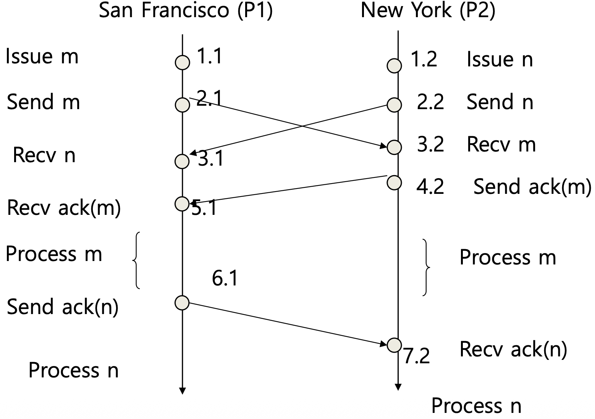

# 분산시스템 — Synchronization Part 3 (Totally Ordered Multicasting)

> 이 문서는 Tanenbaum의 *Distributed Systems* 6장 Synchronization을 기반으로 한 강의(슬라이드 28번부터 44번까지)를 정리한 것이다.
> 다루는 범위는 복제된 은행 계좌 갱신에서 생기는 일관성 문제, 그 해법인 totally ordered multicasting의 개념, 큐(queue)·타임스탬프 정렬·확인 메시지(acknowledgement)로 구성된 알고리즘, 확인 메시지를 보내는 세 가지 조건과 프로세스 ID를 이용한 우선순위 결정, 그리고 두 프로세스(샌프란시스코·뉴욕)와 세 프로세스 예제까지이다.
> 이 문서는 6장 Synchronization의 세 번째 강의를 정리한 것이며, 두 번째 강의 정리본인 `dsc_ch6_pt2.md`를 잇고, 네 번째 강의 정리본인 `dsc_ch6_pt4.md`로 이어진다.

---

## 0. 지난 시간 복습

지난 시간에는 NTP의 서버 계층(stratum)과 버클리 알고리즘으로 시간 동기화를 마무리하고, 실제 시간을 맞추는 대신 이벤트 순서만 합의하는 램포트(Lamport) 논리 시계를 다루었다. 논리 시계는 이벤트가 발생할 때만 증가하는 숫자이며, happens-before 관계가 있는 이벤트(같은 프로세스 내 순서, 메시지 송신→수신)에 대해 먼저 발생한 이벤트의 값이 더 작도록 갱신된다. 그 갱신 규칙의 핵심은 메시지 수신 시 `Cj ← max{Cj, ts(m)} + 1`이었다. 그러나 논리 시계만으로는 서로 메시지를 주고받지 않은 concurrent 이벤트의 순서를 알 수 없었다. 이번 시간에는 여기에 프로세스 ID라는 정보를 더해, 모든 이벤트에 일관된 순서를 부여하는 totally ordered multicasting을 다룬다.

---

## 1. 문제 — 복제된 은행 계좌의 일관성 (Figure 6-11)

### 상황

같은 사용자 계좌 데이터베이스가 뉴욕(New York)과 샌프란시스코(San Francisco) 두 사이트에 복제(replication)되어 있다. 현재 잔액은 두 곳 모두 $1,000이다. 거의 동시에 두 거래가 일어난다.

- 샌프란시스코에서 **$100를 입금**한다. (연산 m)
- 뉴욕에서 **잔액의 1% 이자를 추가**한다. (연산 n)

복제된 데이터베이스이므로, 한쪽에서 갱신이 일어나면 다른 쪽에도 그 사실을 알려 일관성을 유지해야 한다. 이를 위해 각 사이트는 자신의 갱신을 멀티캐스트(multicast)로 모든 사이트에 뿌린다.

### 순서가 다르면 결과가 달라진다

이 두 연산은 처리 순서에 따라 결과가 달라진다.

| 처리 순서 | 계산 | 최종 잔액 |
|---|---|---|
| m 먼저 ($100) → n (1%) | 1000 + 100 = 1100, 그 1% 가산 1100 × 1.01 = 1111 | **$1,111** |
| n 먼저 (1%) → m ($100) | 1000 × 1.01 = 1010, 그 뒤 +100 = 1110 | **$1,110** |

두 사이트가 서로 다른 순서로 처리하면 한쪽은 $1,111, 다른 쪽은 $1,110이 되어 복제본이 어긋난다(Figure 6-11의 inconsistent state). 여기서 중요한 것은 m이 먼저인지 n이 먼저인지가 아니라, **모든 사이트가 동일한 순서로 처리하는가**이다.

### 왜 그냥 두면 안 되는가

멀티캐스트는 보통 UDP 기반(IP 멀티캐스트)이라 순서를 보장하지 않는다. 보낸 순서대로 도착한다는 보장이 없으므로, 사이트마다 m과 n이 도착하는 순서가 달라질 수 있다. 받은 순서대로 그냥 처리하면 처리 순서가 사이트마다 달라지는 문제가 생긴다. (이 단원에서는 메시지 분실은 없다고 가정하여 문제를 단순화한다.)

---

## 2. Totally Ordered Multicasting의 개념

핵심은 멀티캐스트되는 모든 메시지가 모든 수신자에게 **동일한 순서로 전달(deliver)**되도록 만드는 것이다(여기서 멀티캐스트란 송신자가 여러 수신자 집합에게 메시지를 보내는 것을 말한다). "totally"는 모든 메시지에 대해 순서를 짓겠다는 뜻이다.

그러기 위해 메시지를 받았다고 바로 처리하면 안 된다. 받았을 때 "나보다 먼저 처리되어야 할 메시지가 있는 것은 아닌가"를 확인한 뒤에 처리해야 한다. 그리고 이 순서 결정을 서로 추가 대화 없이, 각자 받은 메시지만으로 논리 시계를 이용해 해결한다.

---

## 3. 알고리즘 — 큐·타임스탬프·확인 메시지

### 송신 측 — 간단하다

갱신 메시지를 멀티캐스트할 때, 그 갱신 이벤트가 발생한 시점의 논리 시계 값을 타임스탬프로 메시지에 담는다. 송신 측이 하는 일은 이게 전부이며, 자기 자신도 멀티캐스트를 받는다(자신에게 보낸 메시지는 거의 즉시 받는다고 가정한다).

### 수신 측 — 큐에 넣고 정렬

수신 측은 멀티캐스트된 메시지를 받으면 바로 처리하지 않고 로컬 대기 큐(queue)에 넣되, **타임스탬프 기준으로 정렬(sorting)**하여 넣는다. 가장 작은 타임스탬프(가장 먼저 발생한 이벤트)가 큐의 헤드(head)에 온다.

### 전달(처리) 조건

큐의 메시지는 다음 두 조건을 모두 만족할 때만 애플리케이션으로 전달(=실행)된다.

1. 그 메시지가 큐의 **헤드**에 있어야 한다.
2. 그 메시지에 대해 **참여한 모든 프로세스의 확인 메시지(acknowledgement)**를 받았어야 한다.

확인 메시지는 "이 메시지를 실행해도 좋다"는 동의를 의미한다. 모든 사이트가 똑같은 큐와 똑같은 정렬을 가지므로, 모두가 같은 순서로 메시지를 처리하게 된다. 여기서 멀티캐스트와 확인 메시지를 주고받는 일은 미들웨어(middleware) 계층에서 일어나고, "전달"은 그 메시지를 애플리케이션에 넘겨 실행하는 것을 말한다.

> 이 스키마의 핵심은 확인 메시지이며, 더 깊이 들어가면 "갱신 메시지를 받았을 때 나는 언제 확인 메시지를 보낼 것인가"가 알고리즘의 본질이다. 바로 보낼 수도, 기다렸다 나중에 보낼 수도 있다.

---

## 4. 확인 메시지를 보내는 세 가지 조건 (★ 핵심)

### 프로세스 ID로 우선순위를 정한다

논리 시계 값만으로는 서로 다른 프로세스의 concurrent 이벤트를 비교할 수 없다(값이 같을 수도 있다). 그래서 타임스탬프를 `(논리 시계).(프로세스 ID)` 두 숫자로 구성하고, 논리 시계 값이 같으면 **프로세스 ID가 작은 쪽이 우선순위가 높다**고 모두가 합의한다. 프로세스 ID는 유일하고 변하지 않으므로, 모든 사이트가 동일한 정렬 결과를 얻는다.

### 세 조건 (★)

프로세스 Pi가 Pj가 보낸 갱신 메시지를 받았을 때, 다음 **세 조건 중 하나라도** 만족하면 확인 메시지를 멀티캐스트한다(즉 실행에 동의한다). 셋 다 만족하지 않으면 지금은 보내지 않고 나중에 보낸다.

1. **Pi가 갱신 요청을 한 적이 없다.** 즉 나는 그 자원에 관심이 없다. 누군가 쓰겠다는데 거부할 이유가 없으므로 바로 확인을 보낸다.
2. **Pi의 식별자가 Pj(송신자)의 식별자보다 크다.** 나도 갱신할 것이 있지만, 들어온 메시지의 우선순위가 더 높다(ID가 작다). 졌으므로 동의해 준다.
3. **Pi의 갱신이 이미 처리되었다.** 내 일을 끝냈으므로 이제 상대의 메시지에 동의할 수 있다.

세 조건 중 1·2번이 메시지를 받는 즉시 보낼지 말지를 결정하고, 둘 다 아닐 때(내가 갱신할 것이 있고 내 우선순위가 더 높을 때)는 보류했다가 내 갱신이 끝나면 3번 조건으로 나중에 보낸다.

### 자기 메시지에 대한 판단은 자기 것과만 비교한다

내가 어떤 메시지에 확인을 보낼지는 오직 내 메시지와 그 메시지만 비교하면 된다. 다른 메시지들끼리의 우선순위는 그쪽 사이트가 알아서 판단한다. 또한 내가 확인을 보낸 뒤 더 높은 우선순위의 메시지가 뒤늦게 오더라도 문제없다. 그 메시지에 대해서는 다른 누군가가 확인을 막아 줄 것이므로, 모든 확인이 다 모이지는 않는다.

> 확인을 보내지 않고 마냥 버티면 큐에서 빠져나가지 못하는 메시지가 생겨 기아(starvation) 문제가 발생한다. 그래서 지금은 보내지 않더라도(2번이 아니어서) 내 갱신이 끝나면 3번 조건으로 반드시 나중에 확인을 보내야 한다.

---

## 5. 두 프로세스 예제 — 단계별 추적 (Figure 6-39 ~ 6-43)



샌프란시스코를 P1(ID 1), 뉴욕을 P2(ID 2)로 둔다. m은 "$100 입금"(P1), n은 "1% 이자"(P2)이다. 타임스탬프는 m이 1.1, n이 1.2이다(둘 다 논리 시계 1이지만 ID로 m이 우선). 위에서 아래로 시간이 흐른다.

| P1 (샌프란시스코) | P2 (뉴욕) |
|---|---|
| Issue m  (1.1) | Issue n  (1.2) |
| Send m  (2.1) | Send n  (2.2) |
| Recv n  (3.1) | Recv m  (3.2) |
|  | Send ack(m)  (4.2) |
| Recv ack(m)  (5.1) |  |
| Process m | Process m |
| Send ack(n)  (6.1) |  |
|  | Recv ack(n)  (7.2) |
| Process n | Process n |

표에서 P1의 시계가 `Recv n (3.1)` 다음에 4.1이 아니라 `Recv ack(m) (5.1)`로 건너뛰는 것은 논리 시계 갱신 규칙 때문이다. P1이 받은 ack(m)에는 P2가 그것을 보낸 시각 4.2가 실려 있으므로, P1은 `max(3, 4) + 1 = 5`로 보정하여 5.1이 된다(슬라이드 37). 즉 메시지 수신 시 송신 측 타임스탬프와 비교해 더 큰 값에 1을 더하는, pt2에서 본 규칙이 그대로 적용된 것이다.

단계별로 보면 다음과 같다.

1. **큐 정렬**: 두 사이트 모두 m을 받든 n을 먼저 받든, 타임스탬프 정렬로 큐는 `(m,1.1), (n,1.2)` 순서가 된다(1.1 < 1.2).
2. **m에 대한 확인**:
  - P1은 m이 자기 메시지이므로 확인을 보낸다.
  - P2는 m을 받고, 세 조건을 본다. P2도 갱신 요청(n)이 있으므로 1번은 거짓이지만, P2의 ID(2) > m의 송신자 ID(1)이므로 **2번 조건**이 참 → 확인을 보낸다("네가 먼저 해").
  - 따라서 m은 두 확인을 모두 받아 양쪽에서 **Process m** 실행 → 잔액 $1,100.
3. **n에 대한 확인**:
  - P2는 n이 자기 메시지이므로 확인을 보낸다.
  - P1은 n을 받지만, 갱신 요청(m)이 있고(1번 거짓), P1의 ID(1) < n의 송신자 ID(2)여서(2번 거짓), 아직 m도 처리되지 않았으므로(3번 거짓) **확인을 보내지 않는다**. n은 확인이 하나만 와서 실행되지 못하고 대기한다.
  - P1이 m을 처리하고 나면 **3번 조건**이 참이 되어, 그제야 P1이 n에 확인을 보낸다.
  - n도 두 확인을 모두 받아 양쪽에서 **Process n** 실행.

결과적으로 두 사이트 모두 m → n 순서로 처리하여 최종 잔액이 일관되게 유지된다. 추가 대화 없이 받은 메시지만으로 동일한 순서를 달성한 것이다.

---

## 6. 세 프로세스로의 확장 (Figure 6-44)

서울(P3, ID 3)이 메시지 o를 추가로 발생시킨다고 하자. 우선순위는 ID로 P1 > P2 > P3 순이며(ID가 작을수록 높음), 세 사이트 모두 큐를 `m, n, o` 순서로 정렬한다.

- **큐 정렬 정책**: §3에서 말한 "타임스탬프 기준 정렬"을 더 구체화한 것이다. 정확히 동작하려면 프로세스 ID를 먼저 기준으로 정렬하고(우선순위 높은 ID끼리 모음), 같은 ID 안에서 논리 시계 값으로 정렬한다. 앞의 예제들은 논리 시계가 모두 1로 같아 사실상 ID가 정렬 기준이 되었고, 일반적으로는 (논리 시계, 프로세스 ID) 타임스탬프 순으로 정렬한다. 여기서 ID-우선 정렬은 큐 헤드가 막히는(head blocking) 상황을 피하기 위한 구현 정책의 하나이며, 정책을 달리할 수도 있다.
- **m**: 송신자 P1의 ID가 가장 높으므로 P2·P3 모두 2번 조건으로 확인을 보낸다. 자기 자신 포함 세 확인을 모두 받아 가장 먼저 실행된다.
- **n**: P1은 자기 우선순위가 높아 확인을 보류하고, P3는 졌으므로 확인을 보낸다. n은 확인이 2개뿐이라 대기한다. m이 처리된 뒤 P1이 확인을 보태면 n이 실행된다.
- **o**: P1·P2 모두 송신자 P3보다 우선순위가 높아 보류한다. o는 확인이 1개뿐이라 대기하다가, m·n이 차례로 처리되며 확인이 채워지면 마지막에 실행된다.

따라서 세 사이트 모두 m → n → o 순서로 동일하게 처리한다. 프로세스가 4개, 5개로 늘어나도 같은 원리로 동작한다.

> 한 가지 짚을 점은 타이밍이다. 우선순위가 높은 메시지가 뒤늦게 도착하는 경우에 대한 고민이 필요하지만, 알고리즘 자체는 "모든 확인을 받기 전에는 실행하지 않는다"는 규칙으로 이를 막는다. 늦게 올 더 높은 우선순위 메시지가 있다면, 그 메시지에 대한 확인을 누군가가 보류하므로 잘못된 순서로 실행되지 않는다.

---

## 다음 시간 예고

다음 차시에서는 램포트 논리 시계를 한 단계 더 확장한 벡터 시계(vector clock)를 다룬다. 벡터 시계는 메시지에 자신의 논리 시계뿐 아니라 자신이 알고 있는 다른 프로세스들의 논리 시계까지 함께 실어 보낸다. 더 많은 정보를 갖게 되어, 단일 숫자 논리 시계로는 잡아내지 못하던 인과성(causality)을 포착할 수 있게 된다.

---

## 한눈에 보는 전체 구조

```
Totally Ordered Multicasting
├─ 문제 (Fig 6-11): 복제 계좌, $100 입금 vs 1% 이자
│    순서 다르면 1111 ≠ 1110 → 복제본 불일치
│    멀티캐스트(UDP)는 순서 보장 X → 그냥 받은 순서대로 처리하면 안 됨
│
├─ 개념: 모든 사이트가 동일 순서로 전달, 받자마자 처리 금지
│
├─ 알고리즘
│    송신: 타임스탬프(논리시계) 실어 멀티캐스트 (자신도 수신)
│    수신: 큐에 타임스탬프 정렬해 삽입
│    전달 조건: ① 큐 헤드  ② 모든 프로세스의 ACK 수신
│
├─ 타임스탬프 = (논리시계).(프로세스 ID), ID 작을수록 우선
├─ ACK 전송 3조건(★, 하나라도 만족 시 ACK)
│    ① 갱신 요청 없음  ② 내 ID > 송신자 ID  ③ 내 갱신 이미 처리됨
│    (둘 다 아니면 보류 → 내 갱신 끝나면 ③으로 나중에 전송, 기아 방지)
│
├─ 2-프로세스 예제 (Fig 6-39~43)
│    m(1.1) P1, n(1.2) P2 → 큐 [m, n]
│    m: P1 자기ACK + P2 조건②ACK → 양쪽 Process m ($1100)
│    n: P1 보류 → m 처리 후 조건③으로 ACK → 양쪽 Process n
│    ⇒ 두 사이트 모두 m→n, 잔액 일관
│
└─ 3-프로세스 (Fig 6-44): m→n→o 동일 순서 (ID로 정렬, ACK 누적)
```
