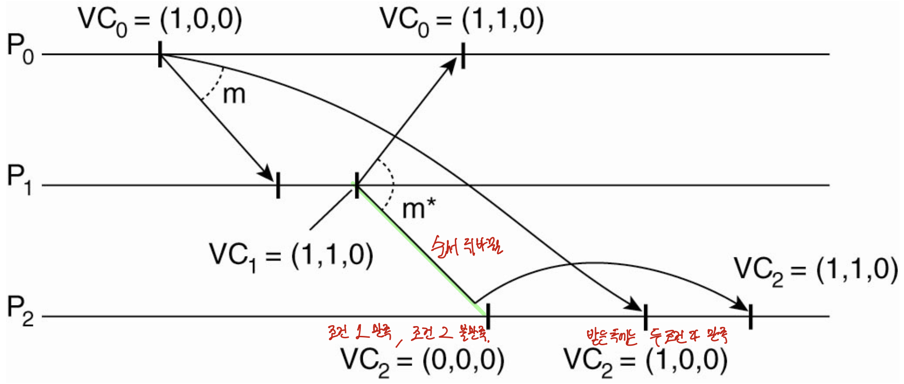
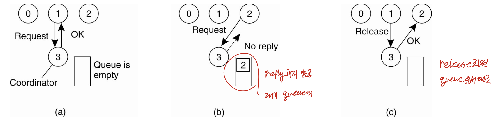

# 분산시스템 — Synchronization Part 4 (Vector Clock·인과적 통신·상호 배제 입문)

> 이 문서는 Tanenbaum의 *Distributed Systems* 6장 Synchronization을 기반으로 한 강의(슬라이드 45번부터 57번까지)를 정리한 것이다.
> 다루는 범위는 램포트 논리 시계가 인과성(causality)을 포착하지 못하는 한계, 그 보완책인 벡터 시계(vector clock)의 정의·구조·갱신 알고리즘, 벡터 시계로 인과적 통신(causal communication)을 강제하는 두 조건과 예제(Figure 6-13), 순서 보장을 미들웨어가 할지 애플리케이션이 할지에 대한 end-to-end 논의, 그리고 상호 배제(mutual exclusion)의 개요와 중앙식(centralized) 알고리즘까지이다.
> 이 문서는 6장 Synchronization의 네 번째 강의를 정리한 것이며, 세 번째 강의 정리본인 `dsc_ch6_pt3.md`를 잇고, 다섯 번째 강의 정리본인 `dsc_ch6_pt5.md`로 이어진다.

---

## 0. 지난 시간 복습

지난 시간에는 램포트 논리 시계를 확장하여, 복제된 은행 계좌 갱신 같은 상황에서 모든 사이트가 이벤트를 동일한 순서로 처리하도록 만드는 totally ordered multicasting을 다루었다. 타임스탬프를 `(논리 시계).(프로세스 ID)`로 구성해 큐에 정렬하고, 세 조건에 따라 확인 메시지(acknowledgement)를 주고받아, 모든 프로세스의 확인을 받은 큐의 헤드 메시지만 실행하는 방식이었다. 이번 시간에는 논리 시계가 잡아내지 못하던 인과성을 포착하는 벡터 시계로 넘어가고, 이어서 6장의 둘째 큰 주제인 상호 배제로 들어간다.

---

## 1. 램포트 논리 시계의 한계 — 인과성(causality)

램포트 논리 시계는 한 프로세스 안에서 증가하는 단일 숫자이며, 다른 프로세스로부터 메시지를 받았을 때만 그 타임스탬프와 비교하여 보정되었다. 그래서 happens-before 관계가 분명한 이벤트(같은 프로세스 내 순서, 메시지 송신→수신)는 시계 값으로 순서를 알 수 있었지만, 그 외의 이벤트는 비교할 수 없었다.

핵심 한계는 다음과 같다. C(a) < C(b)라고 해서 a가 실제로 b보다 먼저 발생했다는 보장은 없다. 즉 **램포트 논리 시계는 인과성(causality)을 포착하지 못한다.** 인과성이란 원인과 결과의 관계로, 겉보기에는 무관한 두 이벤트라도 a가 일어남으로 인해 결과적으로 b가 발생하는 경우를 말한다.

예를 들어 Figure 6-12에서 P3이 m2를 보내는 이벤트와 P2가 m1을 받는 이벤트는 서로 다른 메시지에 관한 것이라 직접적인 happens-before 관계가 없다. 그림에서 P2가 m1을 받을 때 시계가 16이고 P3이 m2를 보낼 때 시계가 20이라고 해서, 16 < 20이니 m1 수신이 먼저라고 판단해서는 안 된다. 이 둘은 concurrent하며, 논리 시계만으로는 순서를 알 수 없다.

---

## 2. 벡터 시계(Vector Clock)의 정의와 구조 (★ 핵심)

### 정의

벡터 시계는 인과성을 포착할 수 있다. 이벤트 a에 부여된 벡터 시계 VC(a)가 어떤 이벤트 b에 대해 VC(a) < VC(b)이면, **a가 b에 인과적으로 선행(causally precede)한다는 것을 보장**한다. 단일 숫자 대신 여러 숫자의 배열(vector)을 쓴다.

여기서 벡터끼리의 부등호 `VC(a) < VC(b)`는 스칼라 대소가 아니라 **성분별 비교**로 정의한다. 즉 모든 칸 k에서 `VC(a)[k] ≤ VC(b)[k]`이고, 적어도 한 칸에서 `VC(a)[k] < VC(b)[k]`인 경우를 말한다. 반대로 두 벡터가 서로 어느 칸도 일방적으로 앞서지 못하면(한쪽이 큰 칸과 다른 쪽이 큰 칸이 동시에 존재하면), 두 이벤트는 concurrent하다.

### 구조

전체 프로세스가 n개라면 각 프로세스가 유지하는 벡터 시계는 n개의 값을 가지는 배열이다. 프로세스 Pi는 벡터 VCi를 유지하며, 다음 두 성질을 가진다.

- **VCi[i]**: Pi에서 지금까지 발생한 이벤트의 수. 즉 Pi의 로컬 논리 시계이다.
- **VCi[j] = k (i ≠ j)**: Pi가 알기로 Pj에서 k개의 이벤트가 발생했다는 뜻. 즉 Pi가 알고 있는 Pj의 로컬 시각이다.

값이 "이벤트의 발생 횟수"라는 점이 단일 논리 시계와 같다(1씩 증가하므로). 차이는, 내 칸뿐 아니라 다른 프로세스 칸까지 가지고 있어 "내가 알기로 다른 프로세스가 몇 개의 이벤트를 했는가"라는 정보를 함께 안다는 것이다. 아는 정보가 많아지므로 할 수 있는 일도 많아진다. (실제 횟수보다 작을 수 있는데, 그 정보를 담은 메시지를 아직 못 받았다면 갱신되지 않은 채 남아 있기 때문이다.)

---

## 3. 벡터 시계 갱신 알고리즘 (★)

램포트 논리 시계의 갱신 규칙과 거의 같으며, 단일 값 대신 벡터의 각 칸에 적용한다는 점만 다르다.

1. **로컬 이벤트 전**: Pi가 이벤트를 실행하기 전에 `VCi[i] ← VCi[i] + 1` (내 칸만 증가).
2. **메시지 송신**: Pi가 Pj에게 m을 보낼 때, 위 단계를 거친 뒤의 VCi 전체를 타임스탬프 `ts(m)`으로 실어 보낸다(벡터 전체가 간다).
3. **메시지 수신**: Pj가 m을 받으면 모든 k에 대해 `VCj[k] ← max{VCj[k], ts(m)[k]}`로 각 칸을 갱신한 뒤, 1단계를 수행하고 애플리케이션에 전달한다.

값이 줄어드는 일은 없다(이미 발생한 이벤트는 취소할 수 없으므로). 받은 메시지의 타임스탬프가 더 크면 그 값으로 점프하고, 아니면 1씩 늘어난다.

타임스탬프의 의미는 다음과 같다. 이벤트 a의 타임스탬프 ts(a)에서 `ts(a)[i] − 1`은 Pi에서 a보다 앞서(causally precede) 발생한 이벤트의 수를 나타낸다. 즉 ts(m)은 수신자에게 "이 m을 보내기 전에 다른 프로세스들에서 몇 개의 이벤트가 선행했는지, m이 무엇에 인과적으로 의존하는지"를 알려 준다. 예컨대 아래 §5 예제에서 P1이 보내는 m\*의 타임스탬프는 (1,1,0)인데, P0 칸이 1이라는 것은 "m\* 이전에 P0에서 1개의 이벤트(메시지 m 송신)가 선행했다"는 뜻이다. 따라서 m\*를 받는 쪽은 m을 먼저 받아 처리한 뒤에야 m\*를 전달해야 함을 이 타임스탬프만 보고도 알 수 있다.

---

## 4. 인과적 통신(Causal Communication) 강제 (★)

### 무엇을 하려는가

벡터 시계로 인과적 통신을 강제할 수 있다. 어떤 메시지를 받았을 때, 그 메시지보다 인과적으로 앞선 메시지들을 아직 받지 못했다면 바로 애플리케이션에 전달하지 않고 **기다린다**. 멀티캐스트에서는 순서가 뒤바뀌어 나중 메시지가 먼저 도착할 수 있는데, 그럴 때 선행 메시지가 도착해 전달될 때까지 지연시킨다.

### 가정 (이 예제에 한정한 수정)

- 시계는 메시지를 **보내고 받을 때만** 조정한다(로컬 이벤트는 관여하지 않는다).
- 메시지를 보낼 때 Pi는 `VCi[i]`만 1 증가시킨다.
- 메시지 m을 전달할 때 모든 k에 대해 `VCi[k] ← max{VCi[k], ts(m)[k]}`로만 조정하고, **그 뒤의 +1은 하지 않는다**(일반 규칙과 다른 점).

### 전달 조건 (★ 두 조건)

Pj가 Pi로부터 타임스탬프 ts(m)을 가진 m을 받았을 때, 다음 두 조건이 모두 만족되어야 애플리케이션으로 전달한다(i는 송신자의 인덱스).

1. **ts(m)[i] = VCj[i] + 1** : m은 Pj가 Pi로부터 기대하던 바로 다음 메시지이다. (만약 차이가 1보다 크면, 그 사이에 Pi가 보낸 메시지를 못 받은 것이다.)
2. **ts(m)[k] ≤ VCj[k] for all k ≠ i** : Pi가 m을 보낼 때 보았던 다른 프로세스들의 메시지를 Pj도 이미 다 보았다. (어떤 칸에서 ts가 더 크면, 다른 프로세스가 보낸 선행 메시지를 Pj가 아직 못 받은 것이다.)

1번은 "송신자 Pi가 m 이전에 보낸 메시지를 다 받았는가", 2번은 "송신자 외의 다른 프로세스가 보낸 선행 메시지를 다 받았는가"를 확인한다. 둘 다 만족하면 m보다 앞선 모든 메시지를 받았다는 뜻이므로 전달해도 무방하다.

---

## 5. 인과적 통신 예제 (Figure 6-13)



세 프로세스 P0, P1, P2가 있고 모두 벡터 시계를 (0,0,0)에서 시작한다. 메시지는 모두 멀티캐스트된다.

1. **P0가 m을 보냄**: VC0 = (1,0,0). ts(m) = (1,0,0).
2. **P1이 m을 받음**: P0(i=0)로부터. 조건1 ts[0]=1 = VC1[0]+1 = 1 ✓, 조건2 ts[1]=0≤0, ts[2]=0≤0 ✓. 전달. VC1 = (1,0,0). 그 결과로 P1이 m\*를 보냄: VC1 = (1,1,0), ts(m\*) = (1,1,0). 여기서 m → m\*는 인과적으로 연결(causally related)되어 있다.
3. **P2가 m\*를 먼저 받음**(순서 뒤바뀜): VC2 = (0,0,0). P1(i=1)로부터. 조건1 ts[1]=1 = VC2[1]+1 = 1 ✓. 그러나 조건2에서 k=0: ts[0]=1 ≤ VC2[0]=0이 아니다(1 > 0). → **전달 지연(대기)**. (P0가 보낸 m을 아직 못 받았음을 안 것이다.)
4. **P2가 m을 받음**: P0(i=0)로부터. 조건1 ts[0]=1 = VC2[0]+1 = 1 ✓, 조건2 ts[1]=0≤0, ts[2]=0≤0 ✓. 전달. VC2 = (1,0,0).
5. **P2가 대기하던 m\*를 재검사**: 조건1 ts[1]=1 = VC2[1]+1 = 1 ✓, 조건2 ts[0]=1 ≤ VC2[0]=1 ✓, ts[2]=0≤0 ✓. 전달. VC2 = (1,1,0).
6. **P0가 m\*를 받음**: 이미 m을 처리했으므로 두 조건이 만족되어 전달.

세 프로세스 모두 m → m\* 순서로 처리하며, 끝에는 모두 벡터 시계가 (1,1,0)이 된다. P2에서 순서가 뒤바뀐 m\*를 m이 도착할 때까지 미룬 것이 핵심이다.

---

## 6. 순서 보장의 주체 — 미들웨어 vs 애플리케이션 (end-to-end 논의)

### 미들웨어가 맡는 경우

ISIS, Horus 같은 전통적 미들웨어 시스템은 totally-ordered·causally-ordered multicasting을 서비스로 제공했다. 그러나 미들웨어는 메시지의 실제 내용을 들여다보지 못하므로 두 가지 문제가 있다.

- **과도하게 제한적(over-restrictive)**: 메시지 의미를 모르므로 잠재적 인과성(potential causality)만 포착한다. 같은 송신자가 보낸 완전히 독립적인 두 메시지조차 인과적으로 연관된 것으로 표시해 버린다.
- **놓치는 인과성**: 외부 통신으로 생긴 인과성은 잡지 못한다. 예컨대 Alice가 글을 올리고 Bob에게 전화로 그 사실을 알려 Bob이 다른 글을 올리면, 두 글 사이에 인과성이 생기지만 미들웨어는 이 외부 경로를 모른다. (애매하면 미들웨어는 인과성이 있다고 치고 강하게 검사한다.)

### 애플리케이션이 맡는 경우 — end-to-end argument

순서 처리는 그 통신을 실제로 사용하는 애플리케이션이 직접 담당하는 것이 낫다는 주장이 end-to-end argument이다. 네트워크 계층에서 가장 끝단(end), 즉 최상위 애플리케이션 계층에서 처리하는 것이 맞다는 관점이다. 그러면 미들웨어가 놓치던 인과성도 효율적으로 처리할 수 있다.

- **단점**: 애플리케이션이 vector clock·logical clock으로 totally ordered multicast나 causal communication을 직접 구현해야 한다. 이는 미들웨어가 통신 서비스를 제공해 개발 비용을 줄여 주려던 취지와 반대된다.
- **trade-off**: 순서가 애플리케이션에서 그리 중요한 기능이 아니라면(예: 전자 게시판), 구현이 까다로운 이 기능은 미들웨어가 API로 제공해 주는 편이 낫다.

---

## 7. 상호 배제(Mutual Exclusion) 개요

### 동기와 두 가지 접근

여러 프로세스(스레드)가 하나의 공유 자원을 동시에 접근하면 일관성이 깨지는 충돌(conflict)이 발생한다. 단일 시스템에서는 OS가 락(lock) 메커니즘으로 이를 해결한다. 자원을 쓰기 전에 락을 요청하면, OS가 하나의 락만 한 프로세스에게 주고 나머지는 대기 큐(waiting queue)에 넣는다. 본질은 직렬화(serialization), 즉 동시 요청을 줄 세워 한 번에 하나만 접근하게 하는 것이다. 분산 시스템에서도 같은 문제가 생기며, 해법은 크게 두 가지이다.

- **토큰 기반(token-based) 해법**: 토큰(token)이라는 특별한 메시지를 프로세스들 사이로 계속 전달(passing)한다. 보통 논리적 링(ring) 형태로 구성되어 토큰이 순환하며, 토큰을 가진 프로세스만 자원을 접근할 수 있다. 다 쓰면 토큰을 넘긴다.
  - **(+)** 프로세스 구성에 따라 모든 프로세스가 자원을 쓸 기회를 얻기 쉬워 기아(starvation)를 피한다. 교착(deadlock)도 쉽게 피한다.
  - **(−)** 토큰이 분실되면(예: 토큰 보유 프로세스 충돌) 새 토큰을 만드는 복잡한 분산 절차가 필요하다.
- **허가 기반(permission-based) 해법**: 자원을 쓰려면 먼저 다른 프로세스(들)의 허가를 받는다. 세부 방식으로 중앙식(centralized)·탈중앙식(decentralized)·분산식(distributed)이 있다.

두 방식 모두 공통 규칙은 "**허가를 먼저 얻고, 접근하고, 다 쓰면 반드시 놓아 준다(release/pass)**"이다. 계속 쥐고 있으면 다른 프로세스가 못 쓴다.

---

## 8. 중앙식 알고리즘 (Centralized Algorithm, Figure 6-14)



### 동작

조정자(coordinator) 프로세스 한 명을 둔다. 단일 시스템에서 OS가 하던 락 관리를 그대로 분산 환경으로 옮긴 것이다.

- **(a)** P1이 조정자에게 공유 자원 접근 허가를 요청하고, 허가(grant)를 받는다.
- **(b)** P1이 쓰는 중에 P2가 같은 자원을 요청하면, 조정자는 **응답하지 않고**(no reply) 요청을 대기 큐에 기록한다.
- **(c)** P1이 다 쓰고 release를 보내면, 조정자는 대기 큐를 보고 P2에게 OK를 보낸다. 이렇게 P1 → P2 순서가 지어진다.

동시에 요청이 와도 조정자에 먼저 도착한 요청에 OK를 보내고 나중 요청에는 답하지 않는다.

### 특징

- **(+)** 구현이 쉽다.
- **(+)** 자원 사용당 메시지가 **3개**(request, grant, release)면 된다. 분산 시스템에서 메시지 양은 적을수록 좋으므로 이 점이 유리하다.
- **(−)** 조정자가 단일 실패 지점(single point of failure)이다.
- **(−)** 요청 후 응답이 없을 때, 프로세스는 "허가 거부"인지 "조정자가 죽은 것"인지 구분할 수 없다. 둘 다 응답이 안 오기 때문이다. 그래서 거부를 의미하는 응답을 명시적으로 보내 주는 편이 더 확실하다.

단점이 작지는 않지만, 단순함에서 오는 이득이 단점을 능가하는 경우가 많다. 분산 해법이 반드시 더 나은 것은 아니다.

> 뒤이어 다룰 탈중앙식·분산식·토큰 링 알고리즘은 모두 이 중앙식의 단일 실패 지점을 보완하려고 나온 것이다. "한 명이 죽으면 안 되니 여러 명에게 물어보자"가 그 출발점이다.

---

## 다음 시간 예고

다음 차시에서는 중앙식의 단일 실패 지점을 보완한 탈중앙식(Lin의 투표 기반) 알고리즘과 분산식(Ricart-Agrawala) 알고리즘, 토큰 링 알고리즘을 차례로 보고 네 알고리즘을 메시지 수·지연 측면에서 비교한다. 이어서 6장의 마지막 주제인 선출(election) 알고리즘(Bully·Ring)으로 마무리한다.

---

## 한눈에 보는 전체 구조

```
Vector Clock & 상호 배제 입문
├─ Lamport 한계: C(a)<C(b)라도 a→b 보장 못 함 (인과성 미포착, Fig 6-12)
│
├─ Vector Clock (★)
│   ├─ 구조: VCi[i]=내 이벤트 수, VCi[j]=내가 아는 Pj 이벤트 수
│   ├─ 성질: VC(a)<VC(b) ⇒ a가 b에 인과적 선행
│   └─ 갱신: ①내 칸+1  ②송신 ts(m)=VCi 전체  ③수신 각 칸 max 후 +1
│
├─ 인과적 통신 강제 (★, Fig 6-13)
│   ├─ 가정: 송수신 시에만 조정, 수신 시 max만(+1 없음)
│   ├─ 전달조건① ts(m)[i]=VCj[i]+1 (송신자의 다음 메시지)
│   ├─ 전달조건② ts(m)[k]≤VCj[k] (k≠i, 다른 선행메시지 다 받음)
│   └─ 예제: P2가 m* 먼저 받으면 m 올 때까지 대기 → 모두 (1,1,0)
│
├─ 순서 주체 논의: 미들웨어(ISIS/Horus) vs 애플리케이션(end-to-end)
│   └─ 미들웨어는 잠재 인과성만/외부 인과성 놓침 ↔ 앱은 직접 구현 부담
│
└─ 상호 배제
    ├─ 토큰 기반: 토큰 순환, (+)기아·교착 회피 (−)분실 시 복구 복잡
    ├─ 허가 기반: 중앙/탈중앙/분산
    └─ 중앙식 (Fig 6-14): coordinator, request/grant/release(3개)
        (+)단순 (−)단일 실패 지점, 무응답=거부/사망 구분 불가
```
