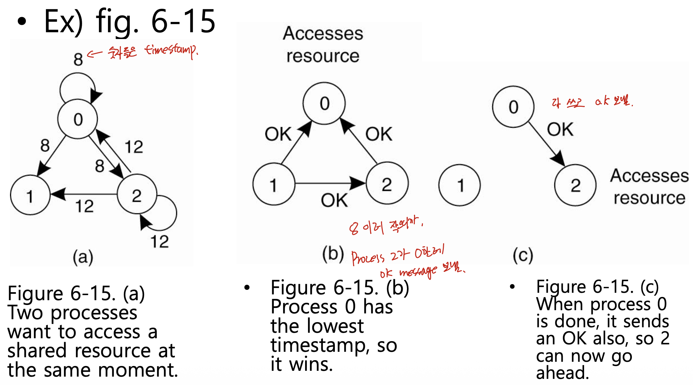
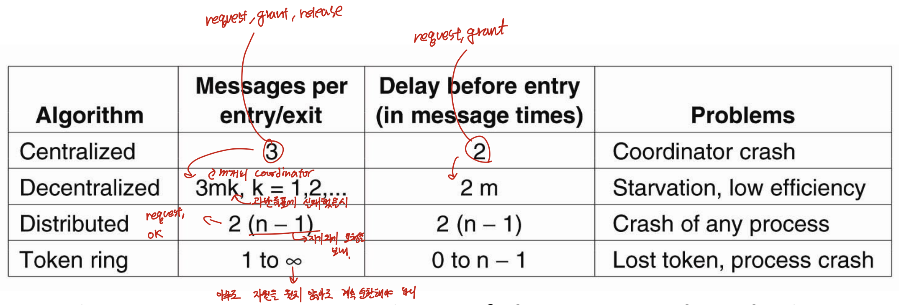
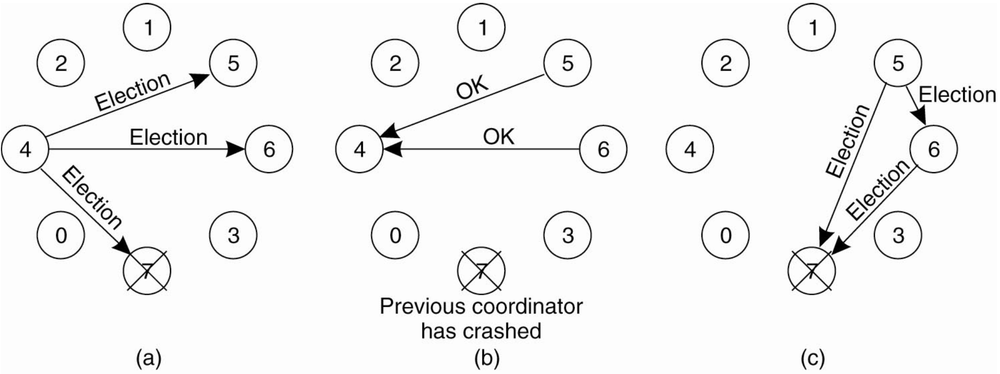
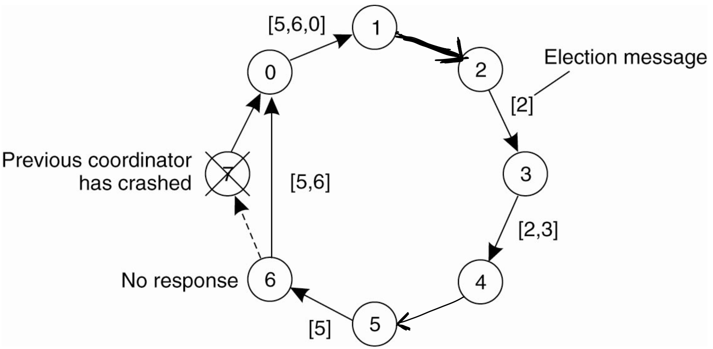

# 분산시스템 — Synchronization Part 5 (분산 상호 배제 알고리즘과 선출 알고리즘)

> 이 문서는 Tanenbaum의 *Distributed Systems* 6장 Synchronization을 기반으로 한 강의(슬라이드 58번부터 76번까지)를 정리한 것이다.
> 다루는 범위는 중앙식의 단일 실패 지점을 보완한 탈중앙식(Lin의 투표 기반) 알고리즘, 분산식(Ricart-Agrawala) 알고리즘, 토큰 링(token ring) 알고리즘, 네 알고리즘의 메시지 수·지연 비교, 그리고 6장의 마지막 주제인 선출(election) 알고리즘 두 가지(Bully·Ring)까지이다.
> 이 문서는 6장 Synchronization의 다섯 번째이자 마지막 강의를 정리한 것이며, 네 번째 강의 정리본인 `dsc_ch6_pt4.md`를 잇는다.

---

## 0. 지난 시간 복습

지난 시간에는 인과성을 포착하는 벡터 시계(vector clock)와 그것으로 인과적 통신을 강제하는 방법을 다루고, 6장의 둘째 주제인 상호 배제(mutual exclusion)에 들어가 토큰 기반·허가 기반의 두 접근과 중앙식(centralized) 알고리즘을 보았다. 중앙식은 조정자 한 명이 request/grant/release 3개의 메시지로 자원 접근을 관리하는 단순하고 효율적인 방식이지만, 조정자가 단일 실패 지점(single point of failure)이라는 약점이 있었다. 이번 시간에는 이 약점을 보완하려고 나온 탈중앙식·분산식·토큰 링 알고리즘을 보고 넷을 비교한 뒤, 선출 알고리즘으로 6장을 마무리한다.

---

## 1. 탈중앙식 알고리즘 (Decentralized — Lin의 투표 기반)

### 개념 (Lin et al., 2004)

중앙식의 단일 실패 지점을 없애기 위해, 서버(조정자)의 역할을 한 명이 아니라 여러 명이 나눠 맡는다. 자원이 n번 복제(replication)되고, 각 복제본마다 그것을 관리하는 조정자가 있어 총 n개의 조정자가 존재한다. 이는 DHT 기반 시스템 위에서 실행할 수 있는 투표(voting) 알고리즘이다.

- 자원을 쓰려는 프로세스는 n개의 조정자 모두에게 요청을 보낸다.
- 각 조정자는 허가 또는 거부로 응답한다(다른 프로세스에게 이미 허가했다면 거부).
- 과반(majority), 즉 `m > n/2`개의 조정자로부터 허가를 받으면 자원을 접근할 수 있다.

조정자가 여럿이므로 일부가 고장 나도 남은 조정자들끼리 같은 방식으로 동작한다. 따라서 **단일 실패 지점 문제는 해결**된다.

### 한계

- **복구 후 오류 가능성**: 조정자가 충돌(crash)했다가 빠르게 복구하면, 충돌 전에 자신이 어떤 투표를 했는지 기록이 사라진다. 그래서 같은 자원에 대한 허가를 회복 후 다른 프로세스에게 또 잘못 내줄 수 있다(가정: 조정자는 빠르게 복구하되 이전 투표를 잊는다).
- **이용률 급락(가장 큰 고유 문제)**: 같은 자원을 두고 경쟁하는 노드가 많아지면, 허가 표가 잘게 나뉘어 **아무도 과반을 얻지 못하는** 상황이 생긴다. 그 결과 자원을 원하는 프로세스가 많은데도 누구도 자원을 쓰지 못하고 자원이 놀게 된다. 투표가 과반 미달로 무산되는 것과 같은 이치이다.

따라서 단일 실패 지점만 해결했을 뿐, 확률적으로 옳은(probabilistically correct) 이 알고리즘은 그리 좋다고 보기 어렵다.

---

## 2. 분산식 알고리즘 (Distributed — Ricart and Agrawala) (★)

### 개념

탈중앙식이 확률적이라는 한계를 넘어, 결정적(deterministic) 상호 배제를 보장하는 알고리즘이다. 서버 없이, 자원을 접근하려는(또는 접근할 가능성이 있는) 프로세스들이 합의하여 한 프로세스만 접근하게 한다. 전제는 시스템의 모든 이벤트에 전체 순서(total ordering)가 있어야 한다는 것, 즉 모든 프로세스의 타임스탬프가 동기화되어 서로 비교 가능해야 한다는 것이다. 여기서 전체 순서란 pt3의 totally ordered multicast에서 본 것처럼, 논리 시계 값이 같아 순서가 모호할 때 (논리 시계, 프로세스 ID)로 동점(tie)을 깨어 모든 이벤트를 하나의 일렬로 세운 것을 말한다. 따라서 아래에서 타임스탬프가 같은 경우에도 ID로 승부가 갈려 두 요청의 우선순위가 항상 유일하게 결정된다.

### 절차

자원을 쓰려는 프로세스는,

1. 자원 이름, 자신의 프로세스 번호, 현재 (논리) 시간(타임스탬프)을 담은 요청 메시지를 만든다.
2. 자기 자신을 포함한 **다른 모든 프로세스에게** 요청을 보낸다.
3. 모두가 허가(OK)할 때까지 기다린다. 모든 허가가 들어오면 자원에 접근한다.
4. 다 쓰면 큐에 들어 있는 모든 프로세스에게 OK를 보내고 큐를 비운다.

요청 메시지를 받은 프로세스는 자신의 상태에 따라 다르게 행동한다.

| 상태 | 동작 |
|---|---|
| ① 자원을 쓰고 있지도, 원하지도 않음 | 즉시 OK를 보낸다 (거부할 이유 없음) |
| ② 이미 자원을 접근 중 | 응답하지 않고 요청을 큐에 저장 (다 쓴 뒤 OK 보내려고) |
| ③ 나도 그 자원을 원함(아직 못 씀) | 들어온 타임스탬프와 내 타임스탬프를 비교. 작은 쪽이 이김 |

③에서 들어온 메시지의 타임스탬프가 더 작으면(상대가 이김) OK를 보내고, 내 타임스탬프가 더 작으면(내가 이김) 요청을 큐에 저장하고 아무것도 보내지 않는다. 타임스탬프 대신 프로세스 ID 같은 다른 유일한 기준으로 우선순위를 정할 수도 있다.

### 예제 (Figure 6-15)



프로세스 0, 1, 2가 있고, 0번과 2번이 같은 자원을 동시에 원한다. 1번은 무관심하다.

- 0번은 타임스탬프 **8**을, 2번은 타임스탬프 **12**를 실어 요청을 모두에게(자신 포함) 보낸다.
- **1번**(무관심): 두 요청 모두에 무조건 OK를 보낸다. → 0번과 2번은 각각 OK를 하나씩 받음.
- **0번**: 2번의 요청을 받고 경쟁. 내 8 vs 들어온 12 → 내가 이김. 2번에게 OK를 보내지 않고 큐에 저장.
- **2번**: 0번의 요청을 받고 경쟁. 내 12 vs 들어온 8 → 내가 짐. 0번에게 OK를 보냄.
- 결과: 0번은 OK 2개를 모두 받아 자원을 차지한다. 2번은 OK가 1개뿐이라 대기한다.
- 0번이 다 쓰면 큐에 저장해 둔 2번에게 OK를 보낸다. 그제야 2번이 OK 2개를 채워 자원을 쓴다.

n개 프로세스가 있으면 자기 외 `n − 1`개의 OK를 받아야 한다.

### 한계

- **프로세스 충돌에 취약**: 요청에 응답이 없을 때, 그것이 "거부"인지 "그 프로세스의 충돌"인지 구분할 수 없다. 그래서 OK가 아니면 거부 메시지라도 보내도록 개선해야 한다(그러면 어떤 프로세스의 충돌이 모든 프로세스의 임계 구역 진입을 막는 일을 피할 수 있다).
- **멤버십 관리 필요**: 누구에게 요청을 보내고 몇 개의 OK를 받아야 하는지 알아야 하므로, 각 프로세스가 그룹 멤버십을 유지하거나 멀티캐스트 통신 수단을 써야 한다.
- 요청·허가 메시지를 여러 개 주고받으므로 중앙식보다 **느리고 복잡하고 비용이 크며 덜 견고하다**. 종합하면 단점이 커서, 결과적으로 중앙식이 더 낫다.

---

## 3. 토큰 링 알고리즘 (Token Ring, Figure 6-16)

### 개념과 동작

앞의 세 가지(중앙식·탈중앙식·분산식)는 모두 허가 기반이었다. 토큰 링은 허가 대신 **토큰(token)**이라는 객체로 접근 권한을 표현한다. 프로세스들을 논리적 링(logical ring)으로 구성하며, 각 프로세스는 자신의 후계자(successor), 즉 토큰을 넘길 다음 대상을 알고 있다. 물리적으로는 순서 없이 연결되어 있어도 논리적으로는 (Chord 시스템처럼) 링을 이룬다.

- 링이 초기화되면 가장 작은 ID(0번) 프로세스가 토큰을 만들어 가진다.
- 토큰은 프로세스 k에서 k+1로(링 크기에 대해 modulo) 점대점 메시지로 전달된다. 가장 큰 ID 다음은 다시 0번으로 돌아온다.
- 토큰을 받은 프로세스는 자원이 필요한지 확인한다. 필요하면 토큰을 쥔 채 자원을 쓰고, 다 쓰면 토큰을 후계자에게 넘긴다. 필요 없으면 그냥 넘긴다.
- 아무도 자원을 원하지 않으면 토큰이 링을 빠르게 순환한다.

토큰이 없는 프로세스는 자원을 쓸 수 없고, 토큰을 받을 때까지 기다린다.

### 문제점

- **토큰 분실**: 토큰이 어떤 이유로든 사라질 수 있는데, 우선 "정말 분실되었는가"를 판단하기가 어렵다. 한 시간 동안 토큰이 안 와도, 다른 프로세스가 한 시간 동안 자원을 쓰고 있는 것인지 토큰이 사라진 것인지 구분되지 않는다. 잘못 판단해 새 토큰을 만들면 토큰이 두 개가 되어 상호 배제가 깨진다. 그래서 보완책이 필요하다.
- **프로세스 충돌**: 토큰을 받아야 할 후계자가 죽으면 토큰이 전달되지 못한다. 이를 위해 토큰을 받으면 ACK 메시지를 보내도록 하고, ACK가 오지 않으면 죽은 프로세스를 건너뛰어 그다음 프로세스에게 토큰을 넘긴다(복구는 비교적 쉽다). 다만 그러려면 다음다음 프로세스, 결국 링의 모든 프로세스 정보를 알고 있어야 충돌에 대비할 수 있다.

---

## 4. 네 알고리즘 비교 (★ Figure 6-17)



| 알고리즘 | 진입·해제당 메시지 수 | 진입까지 지연(메시지 횟수) | 주요 문제 |
|---|---|---|---|
| **Centralized** | 3 (request, grant, release) | 2 | 조정자 충돌(단일 실패 지점) |
| **Decentralized** | 3mk (시도 k회) | 2mk | 기아, 과반 미달로 이용률 급락 |
| **Distributed** | 2(n−1) | 2(n−1) | 어느 프로세스든 충돌에 취약 |
| **Token ring** | 1 ~ ∞ | 0 ~ n−1 | 토큰 분실, 프로세스 충돌 |

각 항목의 근거는 다음과 같다.

- **Centralized**: request 1 + grant 1 + release 1 = 3개. 진입까지는 request·grant 2개면 된다.
- **Decentralized**: m개의 조정자 각각에 request·grant·release가 오가고(3m), 과반 득표에 실패하면 k회 반복해야 하므로 3mk이다. 진입 지연도 2mk이다.
- **Distributed**: 자기 외 n−1개에게 요청을 보내고 n−1개의 OK를 받으므로 2(n−1)개이다.
- **Token ring**: 토큰을 막 받았다면 메시지 1개(또는 최초 생성자라면 0개)로 진입할 수 있지만, 아무도 자원을 원하지 않아도 토큰은 계속 순환해야 하므로 메시지 수의 상한이 없다(∞). 진입 지연은 최선의 경우(토큰 생성자) 0, 최악의 경우(생성자 바로 앞) n−1번의 토큰 전달을 기다린다.

종합하면, 탈중앙식을 제외한 모든 알고리즘은 충돌에 크게 취약하다. 분산 알고리즘이 오히려 중앙식보다 충돌에 더 민감하다는 점이 역설적이다. 탈중앙식은 충돌에 덜 민감하지만 기아 문제와 비효율이 있다. 그래서 가장 단순하면서 견고하고 활용도가 높은 것은 결국 **중앙식**이다.

---

## 5. 선출 알고리즘 (Election Algorithms) 개요

많은 분산 알고리즘은 한 프로세스가 조정자(coordinator) 역할을 맡아야 한다. 서버가 없는 P2P 환경에서도 슈퍼 피어처럼 조정자 역할을 할 특별한 프로세스를 정해야 할 때가 있고, 이를 피어들 사이의 합의로 결정하는 것이 선출 알고리즘이다.

- 모든 프로세스는 다른 모든 프로세스의 번호(process number)를 알고 있다고 가정한다.
- 일반적으로 **가장 큰 프로세스 번호**를 가진 프로세스를 조정자로 정한다. 규칙 자체는 간단하다.
- 다만 지금 어떤 프로세스가 살아 있는지(currently up)는 모른다. 그래서 현재 동작 중인 프로세스들 사이에 메시지를 한 번 돌려, 그중 가장 번호가 큰 프로세스를 확인하는 과정이 필요하다.
- 보통 기존 조정자가 응답하지 않는다는 것을 어떤 프로세스가 알아챘을 때 선출이 시작된다.

---

## 6. Bully 알고리즘 (Garcia-Molina, 1982, Figure 6-20)



### 동작

조정자가 응답하지 않음을 알아챈 프로세스 P가 선출을 시작한다.

1. P는 자신보다 **번호가 큰 모든 프로세스**에게 ELECTION 메시지를 보낸다(작은 번호에게는 보낼 필요가 없다 — 내가 가장 크면 어차피 내가 조정자가 되므로).
2. 아무도 응답하지 않으면, P가 선출에서 이겨 조정자가 된다.
3. 더 높은 번호의 프로세스 중 하나라도 응답(OK)하면, 그 프로세스가 이어받고 P의 일은 끝난다.

ELECTION 메시지를 받은 (더 낮은 번호로부터) 프로세스는 보낸 쪽에 OK를 보내 자신이 살아 있고 이어받겠다고 알린 뒤, 자신도(아직 선출 중이 아니라면) 선출을 시작한다. 이 과정이 반복되면 결국 가장 큰 번호의 프로세스 하나만 남아 조정자가 되고, 자신이 새 조정자임을 COORDINATOR 메시지로 모두에게 알린다.

### 예제 (Figure 6-20)

이전 조정자였던 7번이 충돌했고, 이를 4번이 알아챈다.

- **(a)** 4번이 자기보다 큰 5, 6, 7에게 ELECTION을 보낸다.
- **(b)** 7번은 죽어 응답이 없고, 5번과 6번이 OK를 보내 4번에게 "그만하라"고 한다. 4번의 일은 끝난다.
- **(c)** 5번과 6번이 각각 선출을 시작한다.
- **(d)** 5번은 6번에게 ELECTION을 보내 OK를 받으므로 기다린다. 6번은 7번에게만 보냈는데 응답이 없으니, 자신이 가장 크다고 판단하여 조정자가 된다.
- **(e)** 6번이 모두에게 자신이 새 조정자라는 COORDINATOR 메시지를 보낸다.

> 만약 7번이 나중에 재시작되면, 7번은 모두에게 COORDINATOR 메시지를 보내 자신이 조정자임을 강제한다(가장 큰 번호이므로). 이 "힘으로 누른다"는 성격이 알고리즘 이름(bully)의 유래이다.

---

## 7. Ring 알고리즘 (Figure 6-21)



### 동작

프로세스들이 논리적 링으로 정렬되어 각자 자신의 후계자(successor)를 안다.

- 조정자가 동작하지 않음을 알아챈 프로세스는 자신의 번호를 담은 ELECTION 메시지를 만들어 후계자에게 보낸다.
- 후계자가 죽어 있으면 건너뛰어 그다음 프로세스에게 보낸다(토큰 링과 같은 방식).
- ELECTION 메시지를 받은 프로세스는 자신의 번호를 메시지에 **추가**하여 다음 노드로 넘긴다.
- 메시지가 링을 한 바퀴 돌아 시작한 프로세스에게 돌아오면, 그 안에는 살아 있는 모든 프로세스의 번호가 들어 있다. 그중 가장 큰 번호를 조정자로 정한다.
- 메시지 종류를 COORDINATOR로 바꿔 다시 한 바퀴 돌려 모두에게 새 조정자를 알린다.

### 예제 (Figure 6-21)

7번 조정자가 충돌한 것을 2번과 5번이 동시에 알아채고 각자 독립적으로 선출을 시작한다.

- 5번: 5 → 6 → (7 건너뜀) → 0 → 1 → 2 → 3 → 4 → 5로 돌며 번호가 쌓인다. 돌아온 메시지에서 6이 가장 크므로 6번을 조정자로 정해 COORDINATOR 메시지를 다시 돌린다.
- 2번: 2 → 3 → 4 → 5 → 6 → (7 건너뜀) → 0 → 1 → 2로 돌며, 역시 6이 가장 큼을 알게 된다.

두 선출이 독립적으로 진행되어도 같은 결과(6번)에 도달한다. 중복을 줄이려면, 다른 쪽이 먼저 결정한 COORDINATOR 메시지를 받았을 때 자신의 선출을 중단해도 된다.

### 개선 — 메시지가 커지는 문제

원래 알고리즘은 노드를 거칠 때마다 번호를 추가하므로 ELECTION 메시지가 점점 커진다. 어차피 최댓값만 알면 되므로, 각 노드가 메시지에 실린 번호와 자신의 번호를 비교해 **더 큰 번호만 남기면** 메시지 크기가 커지지 않는다. 한 바퀴 돌고 나면 최댓값 하나만 남고, 그 번호를 조정자로 정한다.

---

## 마무리

이로써 6장 Synchronization을 마친다. 시간 동기화(물리 시계·NTP·버클리)에서 시작해, 실제 시간 대신 이벤트 순서를 다루는 논리 시계와 벡터 시계, 그것을 응용한 totally ordered·causal multicast를 거쳐, 상호 배제(중앙식·탈중앙식·분산식·토큰 링)와 선출(Bully·Ring)까지 분산 시스템에서 필요한 여러 동기화 문제와 해법을 살펴보았다.

> 챕터가 모두 끝났으므로, `contexts/`의 슬라이드·전사본과 루트의 `dsc_ch6_pt1.md`~`dsc_ch6_pt5.md` 및 검증 결과를 `archive/ch6/` 아래로 옮겨 보관할 수 있다(자동 이동하지 않으며 사용자 확인 후 진행).

---

## 한눈에 보는 전체 구조

```
분산 상호 배제 (이어서) & 선출
├─ Decentralized (Lin 투표): 자원 n복제, 조정자 n개, 과반 m>n/2 허가
│      (+)단일 실패 지점 해결  (−)복구 후 오류, 경쟁 심하면 아무도 과반 못 얻음
│
├─ Distributed (Ricart-Agrawala, ★): 전체 순서 가정, 모두에게 요청→모두 OK면 진입
│      받은 측 상태: ①무관심→OK ②사용중→큐저장 ③경쟁→타임스탬프 작은 쪽 승
│      예) ts 8(P0) vs 12(P2) → P0 차지, P2는 P0 종료 후
│      (−)충돌 시 거부/사망 구분 불가, 멤버십 필요, 느림 → 결국 중앙식이 나음
│
├─ Token ring (Fig 6-16): 논리 링, 토큰 가진 자만 접근, 다 쓰면 후계자에 전달
│      (−)토큰 분실 판단·재생성 어려움(중복 위험), 후계자 충돌(ACK로 건너뜀)
│
├─ 비교 (Fig 6-17)
│      Centralized 3 / 2,  Decentralized 3mk / 2mk
│      Distributed 2(n−1) / 2(n−1),  Token ring 1~∞ / 0~n−1
│      ⇒ 단순·견고·활용도 종합 1위 = Centralized
│
└─ Election: 가장 큰 번호를 조정자로
    ├─ Bully (Fig 6-20): 큰 번호들에 ELECTION → 무응답이면 내가 / 응답 OK면 양보
    │      예) 7 죽음, 4 시작 → 5·6 OK → 6이 최종 → COORDINATOR
    └─ Ring (Fig 6-21): 후계자로 ELECTION, 번호 누적, 한 바퀴 후 최댓값 선택
           개선: 추가 대신 최댓값만 유지 → 메시지 안 커짐
```
