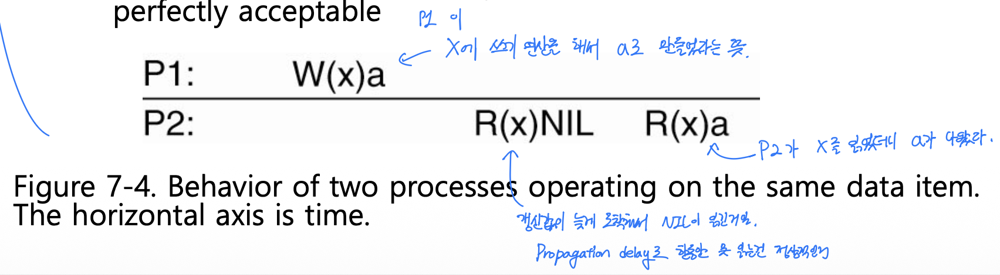
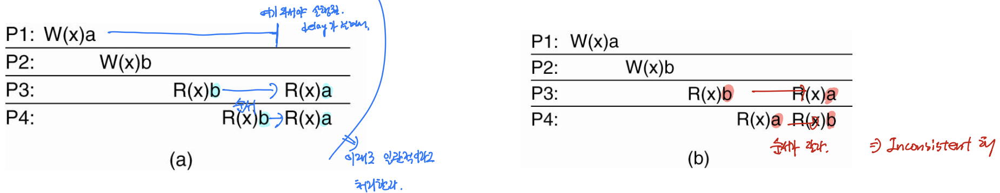
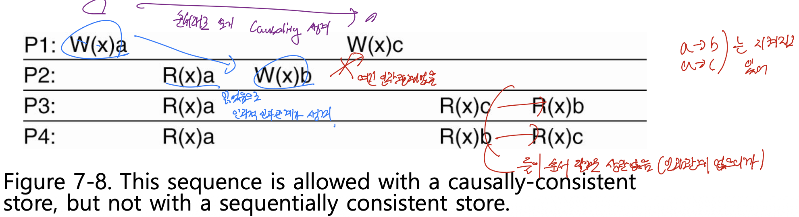

# 분산시스템 — Consistency and Replication Part 1 (복제의 목적과 데이터 중심 일관성 모델)

> 이 문서는 Tanenbaum의 *Distributed Systems* 7장(Consistency and Replication)을 기반으로 한 강의(슬라이드 1번부터 21번 부근까지)를 정리한 것이다.
> 다루는 범위는 복제(replication)를 하는 이유에서 시작하여, 복제가 치러야 하는 일관성 비용과 캐싱과의 관계, 일관성과 성능 사이의 트레이드오프, 그리고 데이터 중심 일관성 모델(data-centric consistency model) — 지속적 일관성(continuous consistency), 순차적 일관성(sequential consistency), 인과적 일관성(causal consistency) — 을 거쳐, 사용자 중심 일관성의 도입부인 최종 일관성(eventual consistency)까지이다.
> 7장은 새로운 주제의 시작이므로 앞 챕터와의 직접적인 연속성은 없으나, 복제의 목적은 1장에서 정의한 분산 시스템의 목표와 맞닿아 있다.

---

## 1. 복제(Replication)는 왜 하는가

7장의 제목은 "Consistency and Replication"이며, 크게 두 부분으로 나뉜다. 앞부분은 데이터 스토어(data store)가 여러 레플리카(replica)로 복제된 상태에서 이 레플리카들 사이의 일관성(consistency)을 어떻게 맞출 것인가를 다루고, 뒷부분은 복제 자체를 어떻게 수행할 것인가를 다룬다. 이번 정리에서 다루는 범위는 앞부분, 곧 일관성 모델에 해당한다.

복제(replication)란 어떤 서버가 관리하던 데이터의 내용을 다른 서버에도 똑같이 복사해 두는 것을 말한다. 주로 서버 측에서 필요에 의해 자신이 관리하는 데이터를 다른 머신으로 복제하는 것을 복제라고 부른다. 분산 시스템은 1장에서 정의했듯이 사용자에게 여러 종류의 투명성(transparency)을 제공하는 것을 목표로 하며, 시스템적인 측면에서는 가능한 많은 사용자에게 성능 저하 없이 상호작용적인 서비스를 제공하는 것을 추구한다. 이를 위해 확장 가능한(scalable) 시스템을 구축하는데, 그 대표적인 기법 중 하나가 바로 복제이다.

### 복제의 첫 번째 이유 — 신뢰성(reliability)과 가용성(availability)

- 데이터를 복제하는 가장 대표적인 이유는 시스템의 신뢰성(reliability)을 높이기 위해서이다.
- 신뢰성 있는 시스템이란 어떤 상황에서든 클라이언트의 요청을 제대로 받아 처리할 수 있는 시스템을 말한다. 잘 죽는 시스템, 요청한 서비스를 제대로 해주지 못하는 시스템은 신뢰성이 낮다.
- 데이터가 복제되어 있으면 한쪽 서버가 고장 나더라도 다른 서버가 같은 데이터를 가지고 있으므로 서비스를 지속할 수 있다. 따라서 신뢰성이 올라간다.
- 신뢰성이 올라간다는 것은 서비스의 가용성(availability), 즉 서비스가 필요할 때 실제로 이용 가능한 정도를 높이는 것과도 연결된다.

### 복제의 두 번째 이유 — 성능(performance)과 확장성(scalability)

- 신뢰성뿐 아니라 성능(performance) 측면에서도 복제가 사용될 수 있다. 분산 시스템에서 성능이란 주로 클라이언트의 요청에 대해 얼마나 빠르게 응답하여 원하는 서비스를 제공하는가의 문제이다.
- 시스템이 확장 가능(scalable)해지려면 두 가지 기술적 측면을 따져야 한다. (확장성에는 administrative 측면도 있으나 이는 기술보다는 정책적 문제이므로 제외한다.)
  - **수적(numerical) 확장성**: 시스템이 얼마나 많은 클라이언트와 데이터를 수용할 수 있는가.
  - **지리적(geographical) 확장성**: 구성 요소가 지리적으로 멀리 떨어져 있어도 얼마나 빠르게 요청을 처리하는가.

지리적으로 거리가 멀어지면 물리적인 거리만큼 지연(delay)이 커진다. 데이터가 네트워크를 통해 오갈 때 발생하는 이 지연은 빛보다 빠른 기술이 나오지 않는 한 줄일 방법이 없다. 복제는 이 지연을 줄이는 데 쓰인다. 서버가 여러 개 있으면 전 세계에 흩어진 클라이언트들이 각자 자신과 가까운 서버에 연결할 수 있고, 그 서버는 같은 레플리카를 가지고 있으므로 같은 서비스를 더 빠르게 받을 수 있다.

수적인 측면에서도 마찬가지이다. 수많은 클라이언트가 하나의 서버에 몰리면 그 서버는 부하가 커져 느려지고, 응답 시간이 길어진다. 서버를 두 개 이상으로 복제해 운용하면 클라이언트를 담당하는 서버가 분산되어 각 서버의 부담을 줄일 수 있다. 두 서버는 데이터를 복제해 놓았으므로 어느 서버든 같은 서비스를 제공한다.

> 정리하면 복제는 신뢰성과 가용성을 높이고 성능을 향상시키는, 분산 시스템 개발자가 적용하면 좋은 기술이다. 실제로 복제(replication)와 분산(distribution) 두 기법을 서비스 요구사항에 맞게 혼합해 사용하는 것이 상업 시스템의 일반적인 방식이다.

---

## 2. 복제의 비용과 캐싱과의 관계

모든 기술은 일장일단이 있다. 복제 역시 좋은 점만 있는 것이 아니라 치러야 하는 비용(cost)이 있으며, 그 대표적인 문제가 레플리카들 사이의 일관성(consistency) 문제이다.

### 왜 일관성 문제가 생기는가

- 서버가 하나뿐일 때는 일관성을 따질 필요가 없었다. 데이터를 가진 주체가 하나이므로, 그 데이터가 갱신되든 말든 그 서버에서만 처리하고 끝나면 되기 때문이다.
- 데이터를 다른 서버에 복제해 두면 동일한 데이터가 여러 군데에 존재한다. 이때 한쪽에서 쓰기(write)가 수행되어 데이터가 갱신되면, 그 데이터의 다른 레플리카는 여전히 옛 값을 가지고 있게 된다. 레플리카들 사이의 값이 일치하지 않는 이 상태가 비일관(inconsistent) 상태이다.
- 같은 데이터를 접근하려는 두 클라이언트가 서로 다른 서버에 접근했을 때, 어느 서버에 연결했느냐에 따라 다른 값을 받게 되면 문제가 된다. 읽기(read)만 할 때는 큰 문제가 없으나, 주로 쓰기가 수행될 때 일관성이 깨진다.
- 일관성을 지키려면 어떤 데이터가 갱신될 때마다 그 데이터의 모든 레플리카에게도 갱신 메시지를 보내 함께 갱신해야 한다. 이 작업 자체가 또 다른 비용이 된다.

### 캐싱(caching)과 복제(replication)의 공통점과 차이

성능 향상을 위해서는 복제뿐 아니라 캐싱(caching)도 많이 쓰인다. 둘 다 데이터를 복사한다는 점과 일관성을 지켜야 한다는 문제를 공통으로 가진다.

| 구분 | 캐싱(caching) | 복제(replication) |
|------|---------------|-------------------|
| 주체 | 주로 **클라이언트** 단 | 주로 **서버** 단 |
| 시점 | 클라이언트가 한 번 접근한 데이터를 로컬에 저장해 두었다가 재사용 | 클라이언트 요청 이전에, 서버 정책에 따라 미리 복제 |
| 목적 | 반복 접근 시 더 빠른 접근 | 성능·신뢰성 향상을 위한 사전 복제 |
| 원본 위치 | 서버에 원본, 클라이언트 로컬 사본이 레플리카 역할 | 원본과 레플리카 모두 서버 측 |

- 두 기법 모두 원본 데이터가 있고 그 원본의 레플리카가 존재한다는 공통점을 가진다. 캐시의 경우 클라이언트 로컬 스토리지의 데이터가 일종의 레플리카이며, 원본은 서버에 따로 있다.
- 레플리카들의 상태를 항상 최신으로 유지하려면 데이터가 갱신될 때마다 그 사실을 모든 레플리카에 전달해야 하므로 네트워크 대역폭(bandwidth)이 더 많이 필요하다.

> 여기서 모순이 드러난다. 확장성 문제를 해결하려고 복제를 도입했는데, 복제 때문에 일관성을 지켜야 하고, 일관성을 정확히 지키려다 보면 다시 동기화 비용이 늘어 또 다른 확장성 문제가 발생한다. 일관성을 무조건 잘 지키는 것이 능사가 아니라는 점이 7장 전체를 관통하는 문제의식이다.

---

## 3. 일관성–성능 트레이드오프와 일관성의 완화

그렇다면 레플리카들 사이의 일관성을 항상 100% 유지해야 하는지를 따져 볼 필요가 있다. 결론부터 말하면, 일관성은 애플리케이션의 종류와 요구사항, 레플리카의 특성에 따라 반드시 100% 엄격하게 유지할 필요가 없을 수도 있다.

### 엄격한 일관성(tight consistency)과 원자적 갱신

- 엄격한 일관성(tight consistency)은 레플리카 사이에 일말의 비일관도 허용하지 않는 경우이다. 우리가 처음 떠올리는 일관성이 바로 이것이다.
- 이때 갱신은 하나의 단일한 원자적 연산(single atomic operation), 곧 트랜잭션처럼 수행된다. 어떤 데이터에 갱신이 가해지면 중간에 다른 갱신이 끼어들지 않고, 그 갱신이 모든 레플리카에 전파되어 모든 값이 갱신된 다음에야 갱신이 완료된다.
- 이렇게 하면 모든 레플리카가 함께 갱신되며 일관성이 계속 유지되지만, 매번 모든 레플리카를 동기화해야 하므로 비용이 크다. 레플리카가 많을수록, 갱신이 잦을수록 비용은 더 커진다.

### 트레이드오프와 완화(loosening)

- 일관성과 성능 사이에는 트레이드오프(trade-off) 관계가 존재한다. 일관성을 잘 지키려 할수록 일관성은 좋아지지만, 모든 레플리카를 전역적으로 동기화(global synchronization)해야 하므로 시스템 성능은 나빠지고 점점 느려진다.
- 그래서 나온 현실적인 방안이 일관성의 제약(consistency constraint)을 완화(loosen)하는 것이다. 그 대가로 사본들이 항상 모든 곳에서 같지는 않게 된다.
- 어느 정도의 비일관을 허용할 것인가에 따라 일관성 모델이 여러 가지로 나뉜다. 그 첫 번째 묶음이 데이터 중심 일관성 모델(data-centric consistency model)이다.

---

## 4. 데이터 중심 일관성 모델 — 지속적 일관성(Continuous Consistency)

데이터 중심 일관성 모델의 기본 그림(그림 7-1)은 다음과 같다. 데이터 스토어가 여러 머신에 물리적으로 분산되어 네트워크로 연결되어 있고, 각 데이터 스토어를 서버 프로세스들이 접근한다. 어떤 프로세스 입장에서 자신이 접근하는 데이터 스토어는 로컬 스토리지일 수도 있고 네트워크상 가까운 곳의 스토리지일 수도 있다. 물리적으로 분산된 스토리지들에는 데이터가 복제되어 있다고 가정하므로, 갱신이 일어나지 않는 한 어느 데이터 스토어를 접근하든 같은 값을 얻는다.

일관성을 100% 지키지 않고 어느 정도의 비일치를 허용하려면, 먼저 비일치(inconsistency)에 어떤 종류가 있는지 알아야 한다. 교재는 이를 세 축(axis)으로 나누고, 이 세 종류의 편차(deviation)를 묶어 **지속적 일관성 범위(continuous consistency range)**라고 부른다. "지속적(continuous)"이라는 이름이 붙는 까닭은, 각 편차를 "0(완전 일치)부터 허용 한계까지"의 **연속적인 범위(range)**로 설정해 둘 수 있기 때문이다. 예컨대 수치 편차를 "$0.00부터 $0.02까지 허용"처럼 하나의 구간으로 지정하는 식이다.

### 불일치의 세 가지 축 (★ 핵심)

| 편차(deviation) | 의미 | 완화 예시 |
|------------------|------|-----------|
| **수치 편차(numerical)** | 레플리카 사이의 데이터 **값** 차이. 혹은 한 레플리카에 적용됐지만 **아직 다른 레플리카에 반영되지 않은** 갱신의 **횟수**. | 주식 시세를 관리하는 시스템에서 두 사본의 가격 차이가 $0.02를 넘지 않도록 허용. 또는 갱신 횟수 차이가 1~2회를 넘지 않도록 허용. |
| **신선도 편차(staleness)** | 레플리카가 **마지막으로 갱신된 시점** 차이. 즉 데이터가 얼마나 오래되었는가. | 날씨 정보는 매 순간 갱신되지 않으므로, 어느 정도 오래된 데이터를 제공해도 문제가 되지 않음. |
| **순서 편차(ordering)** | 갱신(쓰기) 연산이 레플리카마다 **적용된 순서** 차이. | 갱신 순서가 레플리카 사이에 약간 달라도 허용되는 애플리케이션이 있음. |

- 수치 편차는 가장 직관적인 경우이다. 한쪽 서버의 주식 값이 $10.00일 때 다른 레플리카가 $10.02를 가지는 정도의 차이는 허용하되, 그 이상 벌어지면 비일관 상태로 본다. 원래 100% 일관성이라면 값과 갱신 횟수가 모두 정확히 일치해야 하지만, 그 기준을 완화하는 것이다.
- 신선도 편차에서 신선도(freshness)의 반대 개념이 신선도 편차(staleness)이다. staleness가 클수록 오래전에 갱신된 데이터이고, 가장 최근에 갱신된 데이터일수록 staleness가 낮다.
- 순서 편차는 세 축 중 가장 다루기 어렵다. 순서를 맞추거나 어느 정도의 순서 차이를 허용하려면 데이터가 갱신된 순서를 모두 추적(tracking)해야 하기 때문이다. 이 순서 편차를 완화한 일관성 모델이 바로 다음에 나오는 순차적 일관성이다.

---

## 5. 순차적 일관성 (Sequential Consistency) (★ 핵심)

### 표기법(notation) 먼저

교재는 이후 계속 쓰이는 표기법을 정의한다.

- `Wᵢ(x)a` — 프로세스 `Pᵢ`(i번째 프로세스)가 데이터 아이템 `x`에 쓰기(write)를 수행하여 값을 `a`로 만들었다는 뜻이다. 대문자 `W`는 쓰기 연산, 아래 첨자 `i`는 수행한 프로세스, 괄호 안 `x`는 대상 데이터 아이템, 뒤의 `a`는 그 결과 값이다.
- `Rᵢ(x)a` — 프로세스 `Pᵢ`가 데이터 아이템 `x`에 읽기(read)를 수행하여 값 `a`를 읽었다는 뜻이다.

이런 그림에서 가로축(horizontal axis)은 시간(time)이며, 왼쪽에서 오른쪽으로 연산이 진행된다.

### 그림 7-4 — 전파 지연은 정상이다



그림 7-4는 두 프로세스가 같은 데이터 아이템을 다루는 모습이다.

1. 먼저 P1이 자신의 로컬 사본에 `W₁(x)a`를 수행한다. 이 갱신은 내부적으로 다른 모든 레플리카에 전파(propagation)되어야 하며, 그 전파에는 지연이 따른다.
2. 잠시 후 P2가 자신의 로컬 스토리지에서 `x`를 읽으면 아직 갱신이 도착하기 전이라 빈(null) 값을 읽는다.
3. 더 시간이 지난 뒤 P2가 다시 `x`를 읽으면 그제야 전파가 완료되어 `a`를 읽는다.

이처럼 전파 지연 때문에 한동안 다른 값을 읽는 상황은 받아들일 수 있는 정상적인 경우이다.

### Lamport의 정의

- 순차적 일관성은 Lamport가 1979년에 멀티프로세서 시스템의 공유 메모리 맥락에서 처음 정의했다. (Lamport는 논리 시계(logical clock)에서도 등장한 인물이다.) 같은 개념이 분산 시스템에도 적용된다.
- 정의: **어떤 실행의 결과가, 모든 프로세스의 (읽기·쓰기) 연산이 어떤 하나의 순차적 순서(sequential order)로 실행되고, 각 프로세스의 연산이 그 순서 안에서 프로그램이 지정한 순서대로 나타나는 것과 같을 때**, 그 데이터 스토어는 순차적으로 일관(sequentially consistent)되었다고 한다. 즉 모든 프로세스가 연산의 동일한 인터리빙(interleaving)을 본다.
- 핵심은 "가장 최근(most recent)의 쓰기"에 대한 언급이 전혀 없다는 점이다. 가장 최신 데이터가 아니더라도, 모든 프로세스가 데이터를 접근한 **순서만 동일하면** 순차적으로 일관된 것이다. 엄격한 일관성에서 "최신값"이라는 조건이 완화된 지점이 바로 여기이다.

### 그림 7-5 — 일관한 경우와 비일관한 경우



네 프로세스가 등장하며, P1은 `W(x)a`를, P2는 `W(x)b`를 수행한다. 전역적으로 보면 `x`는 `a`로 갱신되었다가 `b`로 갱신되었으므로, 엄격한 기준의 "정답"이라면 최신값은 `b`이다.

- **(a) 순차적으로 일관한 데이터 스토어**: `b` 갱신이 먼저 전파되어 P3, P4가 모두 처음에 `b`를 읽고, 나중에 `a`(P1이 처음에 만든 값이 뒤늦게 전파됨)를 읽는다. 시간상으로는 `a`가 먼저 쓰였지만, 두 갱신의 전파 지연이 서로 달라 P1의 `a` 갱신이 P2의 `b` 갱신보다 더 늦게 도착한 경우이다. 두 프로세스가 본 순서(b → a)가 동일하므로 순차적으로 일관하다. 최신값이 아니더라도 순서만 같으면 된다.
- **(b) 순차적으로 일관하지 않은 데이터 스토어**: P3은 `b → a` 순서로 읽었는데, P4는 `a → b` 순서로 읽었다. 같은 두 번의 읽기 결과 순서가 프로세스마다 다르므로 순차적으로 일관하지 않다.

> 한마디로 순차적 일관성은 "순서만 맞으면 된다"는 모델이다. 모든 프로세스가 본 연산 순서가 서로 같기만 하면, 실제 갱신 순서나 최신 여부와 무관하게 일관한 것으로 본다.

---

## 6. 인과적 일관성 (Causal Consistency) (★ 핵심)

인과적 일관성(causal consistency)은 순차적 일관성을 한 단계 더 완화한 모델이다. 모든 연산의 순서를 맞출 필요는 없고, **원인과 결과 관계가 분명한(causally related) 연산에 대해서만** 프로세스들 사이의 순서가 맞으면 된다. 서로 상관없는 연산들은 동시적(concurrent) 연산이라 부르며, 이들의 순서는 맞지 않아도 허용한다.

### 인과성(causality)의 정의

- 어떤 이벤트 `b`가 그 이전의 이벤트 `a`의 결과로 발생했다면(`a`가 원인, `b`가 결과), 두 이벤트 사이에 인과성(causality)이 존재한다. 이때 모든 프로세스는 항상 `a`를 먼저 보고 `b`를 보아야 한다.
- 예: P1이 데이터 아이템 `x`에 쓰기를 한다. 이어 P2가 `x`를 읽고 그 값을 바탕으로 `y`에 쓴다. P2가 쓴 `y`의 값은 읽은 `x` 값에 의존할 수 있으므로, "`x` 읽기"와 "`y` 쓰기"는 잠재적으로(potentially) 인과 관계에 있다.
- 인과적 일관성의 조건: **잠재적으로 인과 관계에 있는 쓰기들은 모든 프로세스가 같은 순서로 보아야 한다. 동시적(concurrent) 쓰기는 머신마다 다른 순서로 보여도 된다.** (이 인과/동시 관계는 6장의 논리 시계에서 다룬 happened-before 개념과 이어진다.)

### 그림 7-8 — 동시적 쓰기는 순서가 달라도 됨



- P2가 `W₂(x)b`를, P1이 `W₁(x)c`를 수행하는데, 이 두 쓰기는 서로 원인-결과 관계가 없는 **동시적(concurrent)** 이벤트이다.
- 따라서 P3이 `c → b` 순서로 읽고 P4가 `b → c` 순서로 읽어, 같은 `x`에 대한 두 읽기 결과 순서가 달라도 괜찮다.
- 이 시퀀스는 인과적으로 일관하지만 순차적으로는 일관하지 않다. 순차적 일관성이라면 두 읽기 순서가 모든 프로세스에서 동일해야 하기 때문이다.

### 그림 7-9 — 위반과 정합


- **(a) 위반**: P2가 먼저 `R₂(x)a`로 `a`를 읽은 뒤 `W₂(x)b`를 수행한다. 그러면 `W₂(x)b`는 `W₁(x)a`에 잠재적으로 의존하므로(읽은 `a` 값을 바탕으로 `b`를 계산했을 수 있음) 두 쓰기는 인과 관계에 있다. 따라서 모든 프로세스가 `a → b` 순서로 읽어야 하는데, P3이 `b → a` 순서로, P4가 `a → b` 순서로 읽어 순서가 어긋난다. 인과적으로 일관하지 않다(위반).
- **(b) 정합**: (a)에서 P2의 중간 읽기 `R₂(x)a`가 빠진 경우이다. 그러면 P1의 `W₁(x)a`와 P2의 `W₂(x)b`는 서로 의존 관계가 없는 **동시적 쓰기**가 된다. 따라서 P3과 P4가 `x`를 서로 다른 순서로 읽어도 인과적으로 일관하다. (다만 순차적으로는 여전히 일관하지 않다.)

> 핵심 대비: 그림 7-9 (a)와 (b)는 P2의 중간 읽기 하나의 유무로 갈린다. 그 읽기가 있으면 두 쓰기가 인과 관계가 되어 순서를 지켜야 하고, 없으면 동시적 쓰기가 되어 순서가 자유로워진다.

---

## 7. 사용자 중심 일관성 개요와 최종 일관성 (Eventual Consistency)

### 특별한 특성을 가진 데이터 스토어

지금까지의 데이터 중심 모델(순차적, 인과적)에 이어, 분산되고 복제된 데이터 스토어 중에서도 **특별한 특성**을 가진 데이터 스토어에 적용하는 완화된 일관성 모델이 있다. 그 특성은 다음과 같다.

- 여러 프로세스가 동시에 같은 데이터 아이템을 갱신하는 일이 드물거나, 그런 갱신이 생기더라도 쉽게 해소(resolve)된다. 즉 쓰기-쓰기 충돌(write-write conflict)이 거의 없다.
- 대부분의 연산이 데이터를 읽는(read) 연산이다.

이런 특성을 가진 실제 사례는 많다.

| 사례 | 특성 |
|------|------|
| 많은 데이터베이스 시스템 | 대부분의 프로세스가 갱신을 거의 하지 않고 주로 읽는다. |
| DNS(도메인 네임 시스템) | 네이밍 권한(naming authority)을 가진 프로세스만 자기 영역을 갱신할 수 있어 쓰기-쓰기 충돌이 없다. 다만 갱신 중에 일반 프로세스가 읽으려는 읽기-쓰기 충돌은 생길 수 있다. |
| 월드 와이드 웹(WWW) | 웹 서버를 갱신할 수 있는 프로세스가 제한적이라 쓰기-쓰기 충돌이 거의 없다. |

### 최종 일관성(eventual consistency)의 정의

- 이런 데이터 스토어에서는 갱신을 게으른 방식(lazy fashion)으로 전파해도 받아들일 수 있다. 즉 읽는 프로세스가 갱신 후 시간이 어느 정도 지나서야 그 갱신을 보게 되어도 무방하다.
- 예를 들어 웹 캐시가 반환하는 페이지는 실제 서버의 버전보다 오래된 사본일 수 있으나, 많은 사용자는 이 정도의 비일관을 받아들인다.
- **최종 일관성(eventual consistency)**: 오랫동안 갱신이 일어나지 않으면 모든 레플리카가 점차 일관해진다. 중간에 잠깐 비일관한 순간이 있더라도, 기존 갱신이 모든 레플리카에 전파되고 나면 결국(eventually) 일관해진다.

| 장단점 | 내용 |
|--------|------|
| (+) | 구현이 대체로 저렴하다(cheap). 갱신이 모든 레플리카에 전파되도록 보장하기만 하면 되므로, 전파가 끝날 때까지 접근을 막는 식의 까다로운 구현이 필요 없다. |
| (−) | 짧은 시간 안에 서로 다른 레플리카를 접근할 때 문제가 생긴다(그림 7-11). |

### 그림 7-11 — 이동 사용자의 한계, 그리고 사용자 중심 일관성으로

- 그림 7-11은 휴대용 컴퓨터를 든 사용자가 현재 위치에서 가까운 데이터 스토어에 접근하다가, 짧은 시간 안에 다른 위치로 이동해 그곳의 가까운 데이터 스토어에서 같은 데이터를 접근하는 상황이다.
- 이때 두 사본의 값이 다르면, 같은 사용자(프로세스)가 접근하는 데이터인데도 일관성이 깨질 수 있다. 서로 다른 프로세스가 각자의 로컬 데이터 스토어에서 다른 값을 읽는 것은 허용하더라도, **같은 프로세스가 이동하며 접근할 때는 적어도 그 프로세스에 대해서는 일관성을 지켜 주어야** 한다.
- 이 문제를 완화하기 위해 도입하는 것이 사용자 중심 일관성(client-centric consistency) 모델이다. 이 모델은 클라이언트가 수행하는 읽기·쓰기 연산의 종류에 따라 몇 가지로 나뉜다.

> 여기까지가 데이터 중심 일관성 모델과 최종 일관성이다. 핵심 메시지는 일관성과 성능의 트레이드오프 위에서, 엄격한 일관성보다 요구사항을 완화한 모델을 적절한 애플리케이션에 적용하면 성능을 유지하면서도 필요한 만큼의 일관성을 제공할 수 있다는 것이다.

---

## 다음 시간 예고

다음 차시(정리본 `dsc_ch7_pt2.md`)에서는 사용자 중심 일관성(client-centric consistency) 모델 네 가지 — 단조 읽기(monotonic reads), 단조 쓰기(monotonic writes), 자기 쓰기 읽기(read your writes), 읽은 뒤 쓰기(writes follow reads) — 를 표기법과 그림 예제(그림 7-12 ~ 7-15)를 통해 구체적으로 다룬다.

---

## 한눈에 보는 전체 구조

```
7장 Consistency and Replication (Part 1: 슬라이드 1~21)
│
├─ 1. 복제(replication)를 왜 하는가
│   ├─ 신뢰성(reliability) ↑  → 가용성(availability) ↑
│   └─ 성능(performance) ↑
│       ├─ 수적(numerical) 확장성 — 부하 분산
│       └─ 지리적(geographical) 확장성 — 지연 감소
│
├─ 2. 복제의 비용
│   ├─ 일관성(consistency) 문제 — write 시 레플리카 불일치
│   ├─ 동기화 = 대역폭 비용
│   └─ 캐싱(클라이언트 단) vs 복제(서버 단)
│
├─ 3. 일관성–성능 트레이드오프
│   ├─ tight consistency = 원자적(atomic) 갱신, 비용 큼
│   └─ 제약 완화(loosen) → 일관성 모델 분화
│
├─ 4. 데이터 중심 모델: 지속적 일관성(continuous)
│   └─ 불일치 3축
│       ├─ 수치(numerical)   — 값·횟수 차이 (주식 $0.02)
│       ├─ 신선도(staleness) — 갱신 시점 차이 (날씨)
│       └─ 순서(ordering)    — 갱신 순서 차이  ── 가장 어려움
│
├─ 5. 순차적 일관성(sequential)         ★
│   ├─ 표기 Wᵢ(x)a / Rᵢ(x)a, 가로축=시간
│   ├─ Lamport 정의 — 최신값 무관, "순서만 동일"
│   └─ 그림 7-5  (a) 일관(b→a 동일) / (b) 비일관(순서 다름)
│
├─ 6. 인과적 일관성(causal)             ★
│   ├─ causally related 쓰기만 순서 일치, concurrent는 자유
│   ├─ 그림 7-8 — 동시적 쓰기, 순서 달라도 OK (≠ sequential)
│   └─ 그림 7-9 (a) 위반(중간 read 有) / (b) 정합(중간 read 無)
│
└─ 7. 사용자 중심 일관성 개요 → 최종 일관성(eventual)
    ├─ write-write 충돌 적은 스토어 (DB, DNS, WWW)
    ├─ lazy propagation → 결국(eventually) 일관
    └─ 그림 7-11 이동 사용자 한계 → client-centric 도입
                                   (→ Part 2로 이어짐)
```
