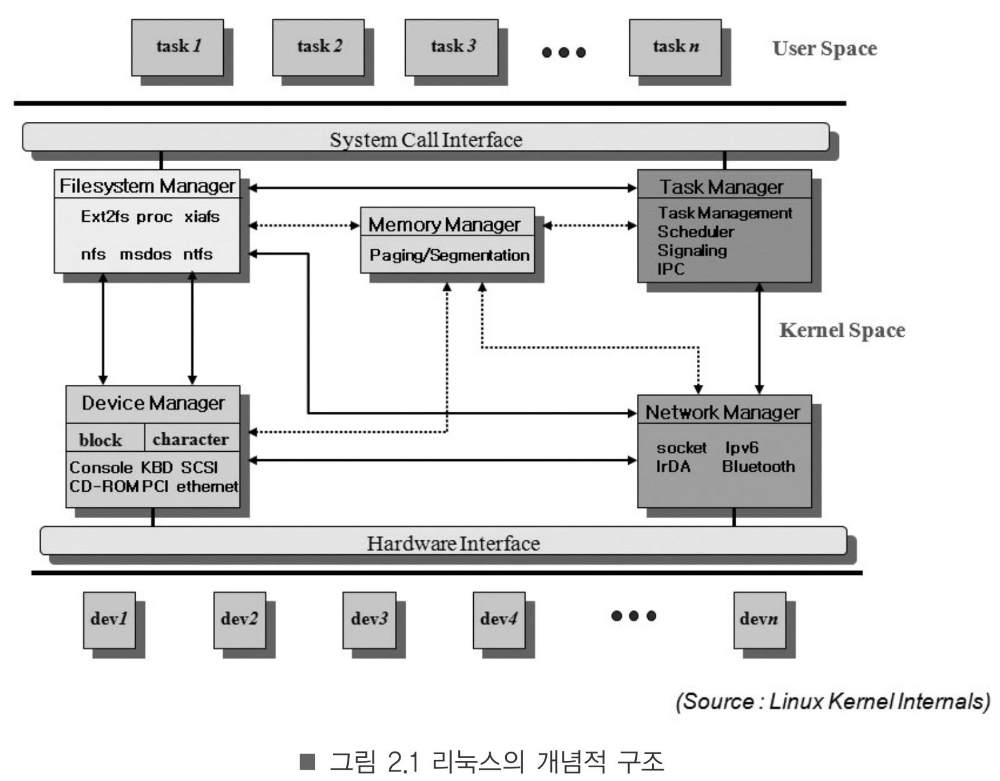
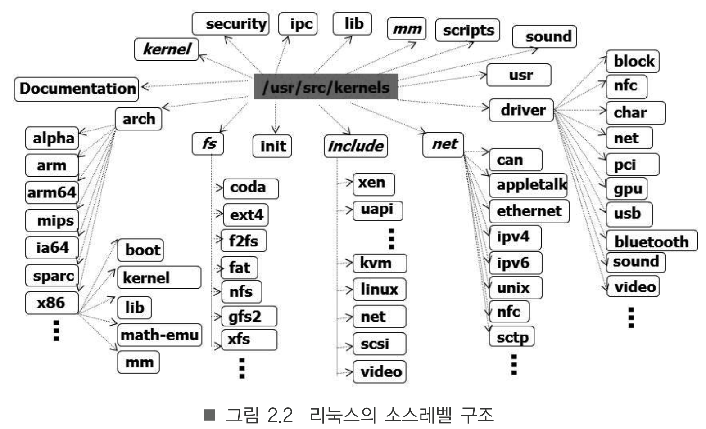

운영체제란?
-> resource manager

> resource
> 1. Physical resource: Disk, terminal, network 등등 시스템을 구성하고 있는 요소들과 주변 장치
> 2. Abstract resource: Cpu를 추상시킨 task, 메모리를 추상화시킨 세그먼트와 페이지, ...파일, 패킷 등등   물리적인 자원에 대응 되지않으면서 추상적인 객체로만 존재하는 보안, 사용자 id에 따는 접근 제어(access control) 등도 존재

사진과 같이 크게 5가지 부분으로 나뉘다.  

왜? 자원관리?
-> userspace에서 동작하는 task가 system call을 호출해 task가 자원을 사용할수 있게해

리눅스 커널의 소스 트리 구조

kernel: task manager가 구현된 directory
arch: 커널 기능 중 하드웨어 종속적인 부분들이 구현된 디렉터리
fs: file system 과련 directory, virtual file system도 구현되어 있음
mm: memory management
driver: linux에서 지원하는 device driver가 구현된 디렉토리
net: 통신 프로토콜 구현
ipc: message passing, shared memory, semaphore 구현
init: 커널 초기화 부분, 즉 메인 시작 함수가 구현된 디렉토리
include: 리눅스 커널이 사용하는 헤더 파일들이 구현된 디렉토리
others: documentaion, scripts, library function등 다양한 것들 구현

kernel compile
--

